# Bài 13: giới thiệu công thức

#### Bài 13: Giới thiệu về Công thức

/en/excel/page-layout-and-printing/content/

### Giới thiệu

Một trong những tính năng mạnh mẽ nhất trong Excel là khả năng ** tính toán ** thông tin số bằng cách sử dụng ** công thức **. Giống như một chiếc máy tính, Excel có thể cộng, trừ, nhân và chia. Trong bài học này, chúng tôi sẽ hướng dẫn bạn cách sử dụng ** tham chiếu ô ** để tạo các công thức đơn giản.

Hãy xem video bên dưới để tìm hiểu thêm về cách tạo công thức trong Excel.

#### Toán tử toán học

Excel sử dụng các toán tử tiêu chuẩn cho các công thức:** dấu cộng ** cho phép cộng (**+**),** dấu trừ ** cho phép trừ (**-**),** dấu hoa thị ** cho phép nhân (**\

* **),** dấu gạch chéo lên ** cho phép chia (**/**) 
và ** dấu mũ **(**^**) 
cho số mũ.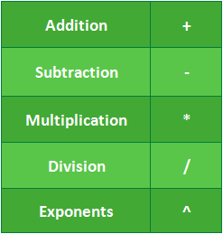

Tất cả các công thức trong Excel phải bắt đầu bằng ** dấu bằng **(**=**). Điều này là do ô chứa hoặc bằng công thức và giá trị mà nó tính toán.

#### Hiểu tham chiếu ô

Mặc dù bạn có thể tạo các công thức đơn giản trong Excel bằng cách sử dụng các số (ví dụ:**=2+2 ** hoặc **=5\*5 **), nhưng hầu hết bạn sẽ sử dụng ** địa chỉ ô ** để tạo công thức. Điều này được gọi là tạo ** tham chiếu ô **. Việc sử dụng tham chiếu ô sẽ đảm bảo rằng công thức của bạn luôn chính xác vì bạn có thể thay đổi giá trị của các ô được tham chiếu mà không cần phải viết lại công thức.

Trong công thức bên dưới, ô A3 cộng giá trị của ô A1 và A2 bằng cách tạo tham chiếu ô: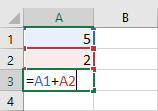

Khi bạn nhấn Enter, công thức sẽ tính toán và hiển thị câu trả lời trong ô A3: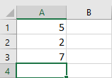

Nếu giá trị trong các ô được tham chiếu thay đổi, công thức sẽ tự động tính toán lại: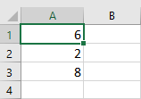

Bằng cách kết hợp toán tử với tham chiếu ô, bạn có thể tạo nhiều công thức đơn giản trong Excel. Công thức cũng có thể bao gồm sự kết hợp của tham chiếu ô và số, như trong các ví dụ bên dưới: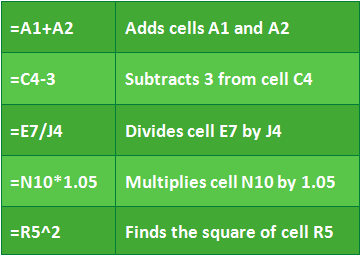

#### Để tạo một công thức:

Trong ví dụ bên dưới, chúng tôi sẽ sử dụng một công thức đơn giản và tham chiếu ô để tính toán ngân sách.

1. Chọn ** ô ** sẽ chứa công thức. Trong ví dụ của chúng tôi, chúng tôi sẽ chọn ô ** D12 **.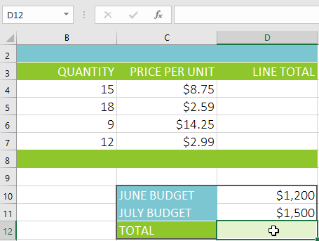

2. Nhập ** dấu bằng (=)**. Hãy chú ý cách nó xuất hiện trong cả ** ô ** và ** công thức ** ** thanh **.

3. Nhập ** ô ** ** địa chỉ ** của ô bạn muốn tham chiếu đầu tiên trong công thức: ô ** D10 ** trong ví dụ của chúng tôi.** đường viền màu xanh ** sẽ xuất hiện xung quanh ô được tham chiếu.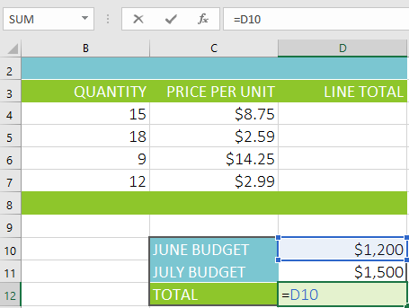

4. Nhập ** toán tử toán học ** bạn muốn sử dụng. Trong ví dụ của chúng tôi, chúng tôi sẽ nhập ** dấu cộng **(**++**).
5. Nhập ** địa chỉ ô ** của ô bạn muốn tham chiếu thứ hai trong công thức: ô ** D11 ** trong ví dụ của chúng tôi.** viền màu đỏ ** sẽ xuất hiện xung quanh ô được tham chiếu.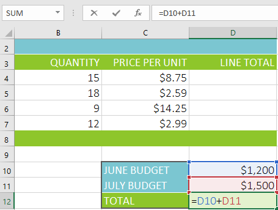

6. Nhấn ** Enter ** trên bàn phím của bạn. Công thức sẽ được ** tính ** và ** giá trị ** sẽ được hiển thị trong ô. Nếu bạn chọn lại ô, hãy lưu ý rằng ô hiển thị kết quả, trong khi thanh công thức hiển thị công thức.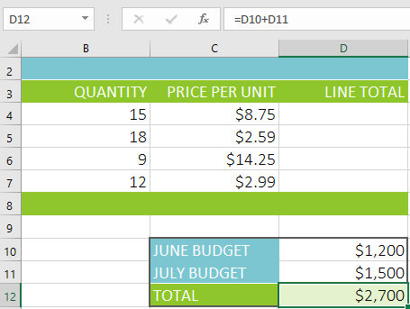

Nếu kết quả của một công thức quá lớn để hiển thị trong một ô, nó có thể xuất hiện dưới dạng ** dấu thăng **(#######) 
thay vì một giá trị. Điều này có nghĩa là cột không đủ rộng để hiển thị nội dung ô. Chỉ cần ** tăng chiều rộng cột ** để hiển thị nội dung ô.

#### Sửa đổi giá trị bằng tham chiếu ô

Ưu điểm thực sự của tham chiếu ô là chúng cho phép bạn ** cập nhật ** ** dữ liệu ** trong bảng tính mà không cần phải viết lại công thức. Trong ví dụ bên dưới, chúng tôi đã sửa đổi giá trị của ô D10 từ $1.200 thành $1.800. Công thức ở ô D12 sẽ tự động tính toán lại và hiển thị giá trị mới ở ô D12.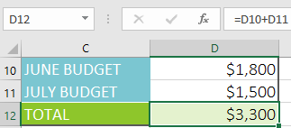

Excel ** không phải lúc nào cũng cho bạn biết ** nếu công thức của bạn có lỗi, vì vậy, bạn có trách nhiệm kiểm tra tất cả các công thức của mình. Để tìm hiểu cách thực hiện việc này, bạn có thể đọc bài học [Kiểm tra kỹ công thức của bạn](../../../excelformulas/doublecheck-your-formulas/1/index.html) 
từ hướng dẫn về [Công thức Excel](../../../excelformulas/index.html) 
của chúng tôi.

#### Để tạo một công thức bằng phương pháp trỏ và nhấp:

Thay vì nhập địa chỉ ô theo cách thủ công, bạn có thể ** trỏ và nhấp ** các ô bạn muốn đưa vào công thức của mình. Phương pháp này có thể tiết kiệm rất nhiều thời gian và công sức khi tạo công thức. Trong ví dụ dưới đây, chúng tôi sẽ tạo một công thức để tính chi phí đặt hàng một số hộp đựng đồ bạc bằng nhựa.

1. Chọn ** ô ** sẽ chứa công thức. Trong ví dụ của chúng tôi, chúng tôi sẽ chọn ô ** D4 **.

2. Nhập ** dấu bằng (=)**.
3. Chọn ** ô ** bạn muốn tham chiếu đầu tiên trong công thức: ô ** B4 ** trong ví dụ của chúng tôi.** địa chỉ ô ** sẽ xuất hiện trong công thức.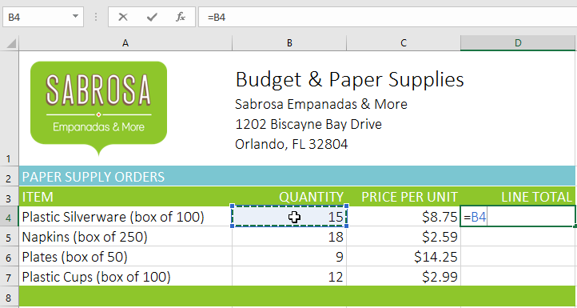

4. Nhập ** toán tử toán học ** bạn muốn sử dụng. Trong ví dụ của chúng tôi, chúng tôi sẽ nhập ** dấu nhân (\*)**.
5. Chọn ** ô ** bạn muốn tham chiếu thứ hai trong công thức: ô ** C4 ** trong ví dụ của chúng tôi.** địa chỉ ô ** sẽ xuất hiện trong công thức.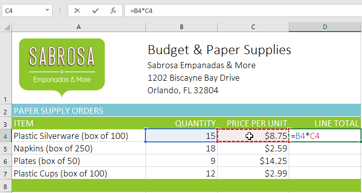

6. Nhấn ** Enter ** trên bàn phím của bạn. Công thức sẽ được ** tính ** và ** giá trị ** sẽ được hiển thị trong ô.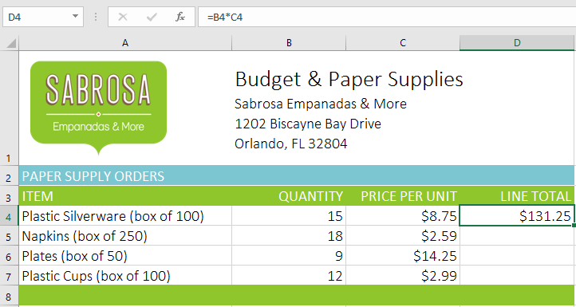

#### Sao chép công thức bằng núm điều khiển điền

Công thức cũng có thể được ** sao chép ** sang các ô liền kề bằng ** điền ** ** tay cầm **, điều này có thể tiết kiệm rất nhiều thời gian và công sức nếu bạn cần thực hiện ** cùng một phép tính ** nhiều lần trong một trang tính.** Tay điều khiển điền ** là hình vuông nhỏ ở góc dưới bên phải của (các) 
ô đã chọn.

1. Chọn ô chứa công thức bạn muốn sao chép. Nhấp và kéo ** bộ điều khiển điền ** qua các ô bạn muốn điền.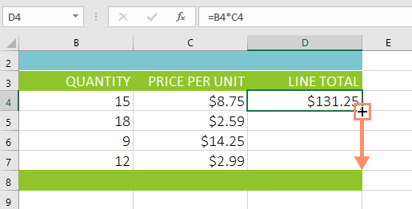

2. Sau khi bạn thả chuột, công thức sẽ được sao chép vào các ô đã chọn.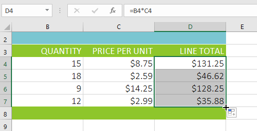

#### Để chỉnh sửa một công thức:

Đôi khi bạn có thể muốn sửa đổi một công thức hiện có. Trong ví dụ bên dưới, chúng tôi đã nhập địa chỉ ô không chính xác vào công thức của mình, vì vậy chúng tôi cần phải sửa địa chỉ đó.

1. Chọn ** ô ** chứa công thức bạn muốn chỉnh sửa. Trong ví dụ của chúng tôi, chúng tôi sẽ chọn ô ** D12 **.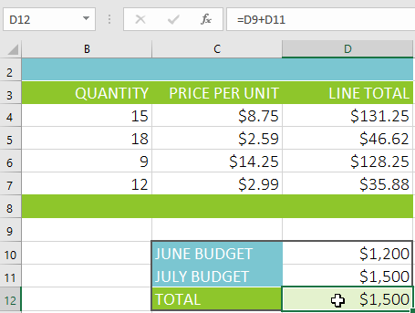

2. Nhấp vào ** thanh công thức ** để chỉnh sửa công thức. Bạn cũng có thể ** bấm đúp ** vào ô để xem và chỉnh sửa công thức trực tiếp trong ô.

3.** đường viền ** sẽ xuất hiện xung quanh bất kỳ ô được tham chiếu nào. Trong ví dụ của chúng tôi, chúng tôi sẽ thay đổi phần đầu tiên của công thức thành ô tham chiếu ** D10 ** thay vì ô ** D9 **.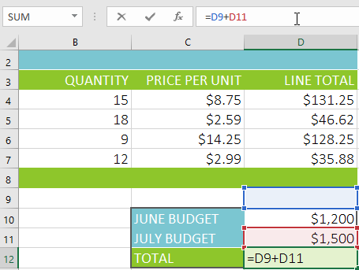

4. Khi bạn hoàn tất, hãy nhấn ** Enter ** trên bàn phím hoặc chọn lệnh ** Enter ** trong thanh công thức.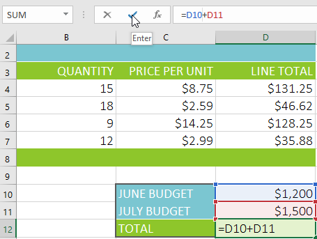

5. Công thức sẽ được ** cập nhật ** và ** giá trị mới ** sẽ được hiển thị trong ô.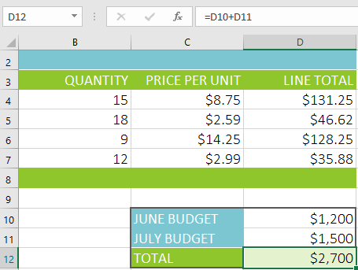

Nếu thay đổi ý định, bạn có thể nhấn phím ** Esc ** trên bàn phím hoặc nhấp vào lệnh ** Hủy ** trong thanh công thức để tránh vô tình thực hiện các thay đổi đối với công thức của mình.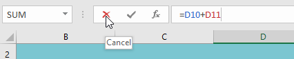

Để hiển thị tất cả các công thức trong bảng tính, bạn có thể giữ phím ** Ctrl ** và nhấn **`**(dấu huyền). Phím dấu huyền thường nằm ở góc trên bên trái của bàn phím. Bạn có thể nhấn ** Ctrl+`** lần nữa để chuyển về chế độ xem bình thường.

### Thử thách!

1. Mở [sổ làm việc thực hành](practice_files/excel_introformulas_practice.xlsx) 
của chúng tôi.
2. Nhấp vào tab ** Thử thách ** ở phía dưới bên trái của sổ làm việc.
3. Tạo công thức trong ô ** D4 ** nhân số lượng trong ** B4 ** với giá mỗi đơn vị trong ô ** C4 **.
4. Sử dụng ** bộ điều khiển điền ** để sao chép công thức trong ô ** D4 ** sang các ô ** D5:D7 **.
5. Thay đổi giá mỗi đơn vị của chuối chiên trong ô ** C6 ** thành $2,25. Lưu ý rằng tổng dòng cũng tự động thay đổi.
6. Chỉnh sửa công thức tính tổng trong ô ** D8 ** để nó cũng thêm ô ** D7 **.
7. Khi bạn hoàn tất, sổ làm việc của bạn sẽ trông như thế này: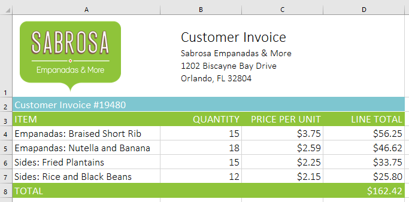

/en/excel/creating-more-complex-formulas/content/