# Bài 14: Tạo công thức phức tạp hơn

#### Bài 14: Tạo các công thức phức tạp hơn

/en/excel/giới thiệu công thức/nội dung/

### Giới thiệu

Bạn có thể có kinh nghiệm làm việc với các công thức chỉ chứa một toán tử, như ** 7+9 **. Các công thức phức tạp hơn có thể chứa ** một số toán tử **, như ** 5+2\*8 **. Khi có nhiều thao tác trong một công thức,** thứ tự các phép tính ** sẽ cho Excel biết thao tác nào cần tính trước. Để viết công thức cho bạn câu trả lời chính xác, bạn cần hiểu thứ tự thực hiện các phép tính.

Xem video dưới đây để tìm hiểu thêm về các công thức phức tạp.

#### Trình tự các thao tác

Excel tính toán các công thức dựa trên ** thứ tự thực hiện ** sau:

1. Các phép toán được đặt trong ** dấu ngoặc đơn ** 2.** Tính toán hàm mũ **(ví dụ: 3^2)

3.** Nhân ** và ** chia **, tùy theo điều kiện nào đến trước
4.** Cộng ** và ** trừ **, tùy điều kiện nào đến trước

Một từ ghi nhớ có thể giúp bạn ghi nhớ đơn hàng là ** PEMDAS ** hoặc ** P ** lease ** E ** xcuse ** M ** y ** D ** ear ** A ** unt ** S ** ally.

Bấm vào các mũi tên trong trình chiếu bên dưới để tìm hiểu cách sử dụng thứ tự các phép tính để tính toán các công thức trong Excel.

* 

 
Mặc dù công thức này có vẻ phức tạp nhưng chúng ta có thể sử dụng thứ tự thực hiện từng bước để tìm ra câu trả lời đúng.

* 

 
Đầu tiên, chúng ta sẽ bắt đầu bằng cách tính toán mọi thứ bên trong dấu ngoặc đơn. Trong trường hợp này, chúng ta chỉ cần tính một điều: 6-3=3.

* 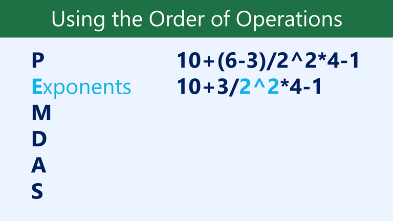

 
Như bạn có thể thấy, công thức trông đơn giản hơn. Tiếp theo, chúng ta sẽ xem liệu có số mũ nào không. Có một: 2^2=4.

* 

 
Tiếp theo, chúng ta sẽ giải bất kỳ phép nhân và chia nào, thực hiện từ trái sang phải. Vì phép chia đứng trước phép nhân nên nó được tính trước: 3/4=0,75.

* 

 
Bây giờ, chúng ta sẽ giải phép nhân còn lại: 0,75\*4=3.

* 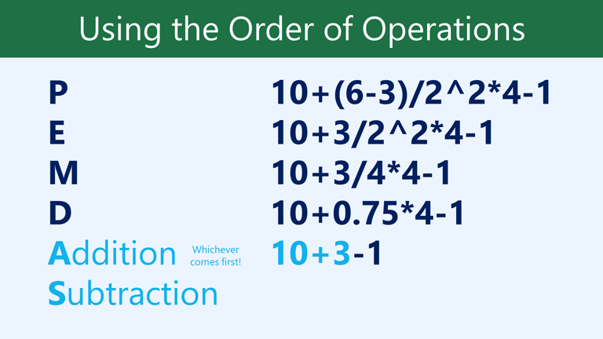

 
Tiếp theo, chúng ta sẽ tính bất kỳ phép cộng hoặc phép trừ nào, lại thực hiện từ trái sang phải. Phép cộng có trước: 10+3=13.

* 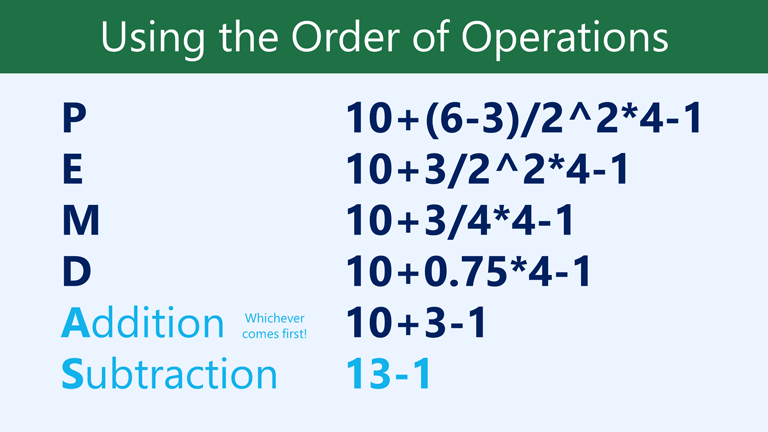

 
Cuối cùng, chúng ta có một phép trừ còn lại: 13-1=12.

* 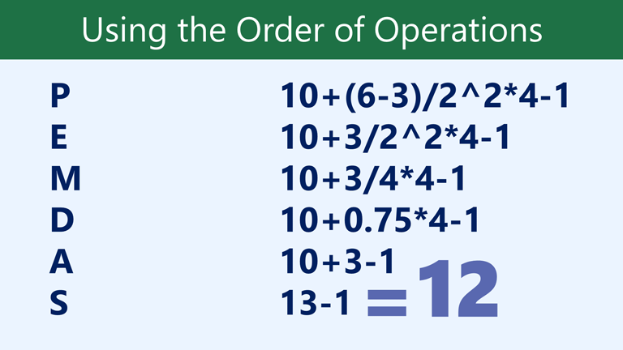

 
Bây giờ chúng ta đã có câu trả lời: 12. Và đây chính xác là kết quả bạn sẽ nhận được nếu nhập công thức vào Excel.

* 

#### Tạo công thức phức tạp

Trong ví dụ bên dưới, chúng tôi sẽ trình bày cách Excel sử dụng thứ tự các phép tính để giải một công thức phức tạp hơn. Ở đây, chúng tôi muốn tính chi phí ** thuế bán hàng ** cho hóa đơn cung cấp dịch vụ ăn uống. Để thực hiện việc này, chúng ta sẽ viết công thức dưới dạng **=(D3+D4+D5)
\*0.075 ** trong ô ** D6 **. Công thức này sẽ cộng giá các mặt hàng của chúng ta, sau đó nhân giá trị đó với thuế suất 7,5% (được viết là 0,075) 
để tính ra câu trả lời.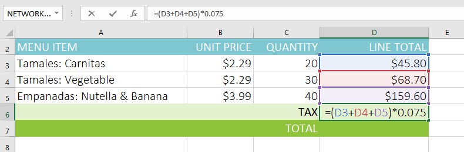

Excel tuân theo thứ tự thực hiện và trước tiên cộng các giá trị bên trong dấu ngoặc đơn:**(45,80+68,70+159,60) 
= 274,10 **. Sau đó, hệ thống sẽ nhân giá trị đó với thuế suất:** 274,10\*0,075 **. Kết quả sẽ cho thấy thuế bán hàng là **$20,56 **.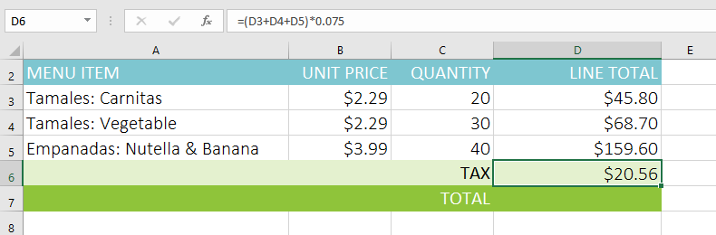

Điều đặc biệt quan trọng là phải tuân theo thứ tự thực hiện các thao tác khi tạo công thức. Nếu không, Excel sẽ không tính toán kết quả chính xác. Trong ví dụ của chúng tôi, nếu không bao gồm ** dấu ngoặc đơn ** thì phép nhân được tính trước và kết quả không chính xác. Dấu ngoặc đơn thường là cách tốt nhất để xác định phép tính nào sẽ được thực hiện đầu tiên trong Excel.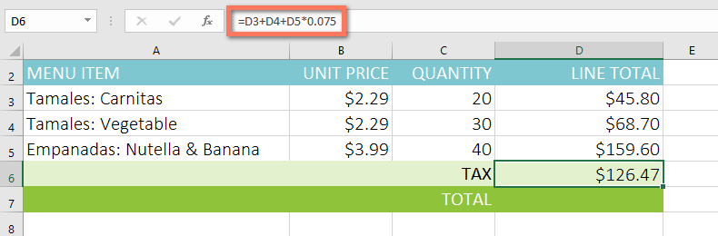

#### Để tạo một công thức phức tạp bằng cách sử dụng thứ tự thực hiện các thao tác:

Trong ví dụ bên dưới, chúng tôi sẽ sử dụng ** tham chiếu ô ** cùng với ** giá trị số ** để tạo một công thức phức tạp giúp tính ** tổng phụ ** cho hóa đơn cung cấp dịch vụ ăn uống. Công thức sẽ tính toán chi phí của từng mục menu trước, sau đó cộng các giá trị này.

1. Chọn ** ô ** sẽ chứa công thức. Trong ví dụ của chúng tôi, chúng tôi sẽ chọn ô ** C5 **.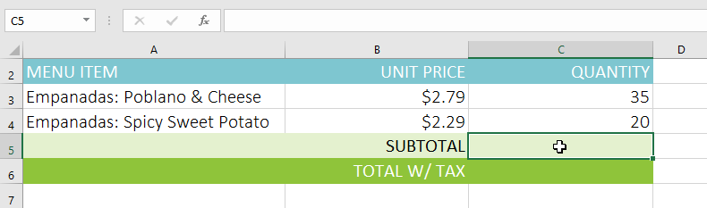

2. Nhập ** công thức ** của bạn. Trong ví dụ của chúng tôi, chúng tôi sẽ nhập **=B3\*C3+B4\*C4 **. Công thức này sẽ tuân theo thứ tự thực hiện, đầu tiên thực hiện phép nhân:** 2,79\*35 ** **= 97,65 ** và ** 2,29\*20 = 45,80 **. Sau đó, nó sẽ cộng các giá trị này để tính tổng:** 97,65+45,80 **.

3. Kiểm tra kỹ độ chính xác của công thức, sau đó nhấn ** Enter ** trên bàn phím. Công thức sẽ tính toán và hiển thị ** kết quả **. Trong ví dụ của chúng tôi, kết quả cho thấy tổng phụ của đơn hàng là **$143,45 **.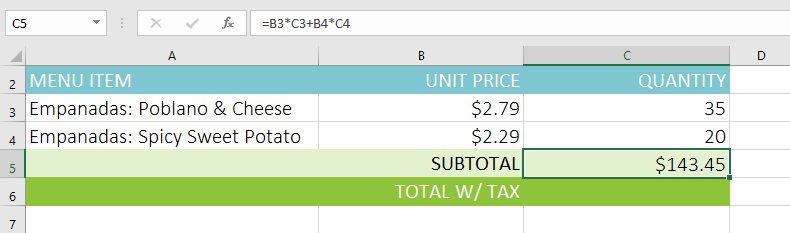

Bạn có thể thêm ** dấu ngoặc đơn ** vào bất kỳ phương trình nào để dễ đọc hơn. Mặc dù nó không làm thay đổi kết quả của công thức trong ví dụ này nhưng chúng ta có thể đặt các phép tính nhân trong dấu ngoặc đơn để làm rõ rằng chúng sẽ được tính trước khi phép cộng.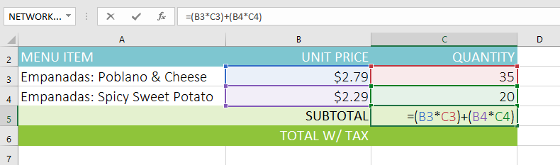

Excel ** không phải lúc nào cũng cho bạn biết ** nếu công thức của bạn có lỗi, vì vậy, bạn có trách nhiệm kiểm tra tất cả các công thức của mình. Để tìm hiểu cách thực hiện việc này, bạn có thể đọc bài học [Kiểm tra kỹ công thức của bạn](../../../excelformulas/doublecheck-your-formulas/1/index.html) 
từ hướng dẫn về [Công thức Excel](../../../excelformulas/index.html) 
của chúng tôi.

### Thử thách!

Đối với thử thách này, bạn sẽ làm việc với một hóa đơn khác giống như hóa đơn trong ví dụ của chúng tôi. Trong hóa đơn, bạn sẽ thấy số tiền thuế của đơn hàng, tổng số tiền của đơn hàng và tổng số tiền của đơn hàng nếu bạn được giảm giá 10%.

1. Mở [sổ làm việc thực hành](practice_files/excel_complexformulas_practice.xlsx) 
của chúng tôi.
2. Nhấp vào tab bảng tính ** Thử thách ** ở phía dưới bên trái của bảng tính.
3. Trong ô ** D7 **, tạo công thức tính thuế cho hóa đơn. Áp dụng mức thuế bán hàng ** 7,5%**.
4. Trong ô ** D8 **, tạo công thức tìm tổng cho đơn hàng. Nói cách khác, công thức này sẽ thêm các ô ** D3:D7 **.
5. Trong ô ** D9 **, hãy tạo công thức tính tổng sau khi giảm giá ** 10%**. Nếu bạn cần trợ giúp để hiểu cách giảm phần trăm trên tổng số, hãy xem lại bài học của chúng tôi về [Giảm giá, Giảm giá và Bán hàng](../../../not-offline.html?url=https:/edu.gcfglobal.org/en/percents/percentages-in-real-life/2).
6. Khi bạn hoàn tất, bảng tính của bạn sẽ trông như thế này: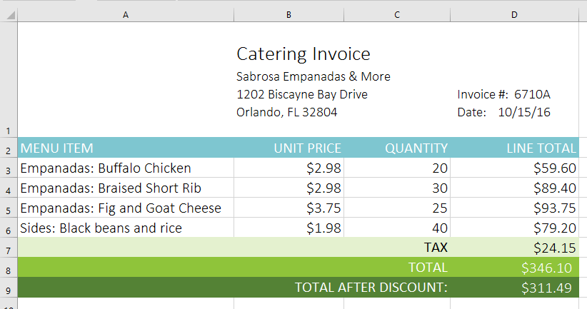

/en/excel/tham chiếu ô tương đối và tuyệt đối/nội dung/