# Bài 15: Tham chiếu ô tương đối và tuyệt đối

#### Bài 15: Tham chiếu ô tương đối và tuyệt đối

/en/excel/creating-more-complex-formulas/content/

### Giới thiệu

Có hai loại tham chiếu ô:** tương đối ** và ** tuyệt đối **. Tham chiếu tương đối và tuyệt đối hoạt động khác nhau khi được sao chép và điền vào các ô khác. Tham chiếu tương đối ** thay đổi ** khi công thức được sao chép sang ô khác. Mặt khác, các tham chiếu tuyệt đối vẫn ** không đổi ** bất kể chúng được sao chép ở đâu.

Xem video bên dưới để tìm hiểu thêm về tham chiếu ô.

#### Tài liệu tham khảo tương đối

Theo mặc định, tất cả tham chiếu ô đều là ** tham chiếu tương đối **. Khi sao chép qua nhiều ô, chúng sẽ thay đổi dựa trên vị trí tương đối của hàng và cột. Ví dụ: nếu bạn sao chép công thức **=A1+B1 ** từ hàng 1 sang hàng 2, công thức sẽ trở thành **=A2+B2 **. Tham chiếu tương đối đặc biệt thuận tiện bất cứ khi nào bạn cần lặp lại cùng một phép tính trên nhiều hàng hoặc cột.

#### Để tạo và sao chép một công thức sử dụng tham chiếu tương đối:

Trong ví dụ sau, chúng tôi muốn tạo một công thức nhân ** giá ** của mỗi mặt hàng với ** số lượng **. Thay vì tạo công thức mới cho mỗi hàng, chúng ta có thể tạo một công thức duy nhất trong ô ** D4 ** rồi sao chép công thức đó sang các hàng khác. Chúng tôi sẽ sử dụng tham chiếu tương đối để công thức tính tổng chính xác cho từng mục.

1. Chọn ** ô ** sẽ chứa công thức. Trong ví dụ của chúng tôi, chúng tôi sẽ chọn ô ** D4 **.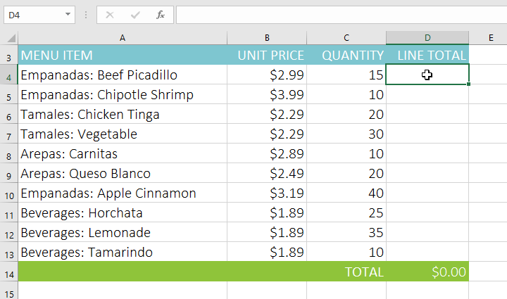

2. Nhập ** công thức ** để tính giá trị mong muốn. Trong ví dụ của chúng tôi, chúng tôi sẽ nhập **=B4\*C4 **.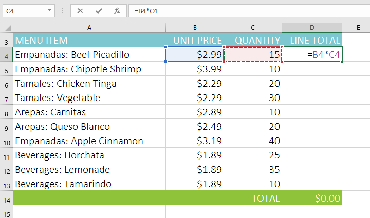

3. Nhấn ** Enter ** trên bàn phím của bạn. Công thức sẽ được tính toán và kết quả sẽ được hiển thị trong ô.
4. Xác định vị trí ** bộ điều khiển điền ** ở góc dưới bên phải của ô mong muốn. Trong ví dụ của chúng tôi, chúng tôi sẽ xác định vị trí ô điều khiển điền cho ô ** D4 **.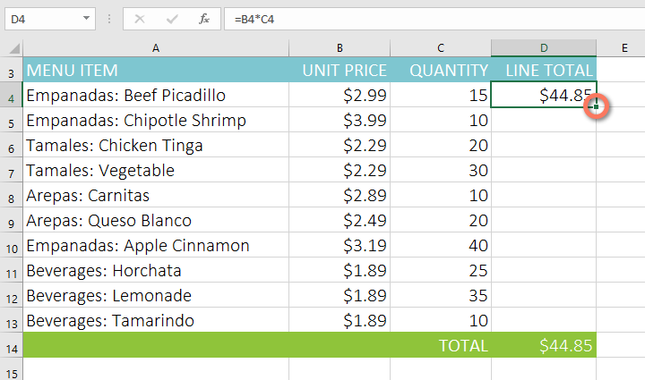

5. Nhấp và kéo ** bộ điều khiển điền ** qua các ô bạn muốn điền. Trong ví dụ của chúng tôi, chúng tôi sẽ chọn các ô ** D5:D13 **.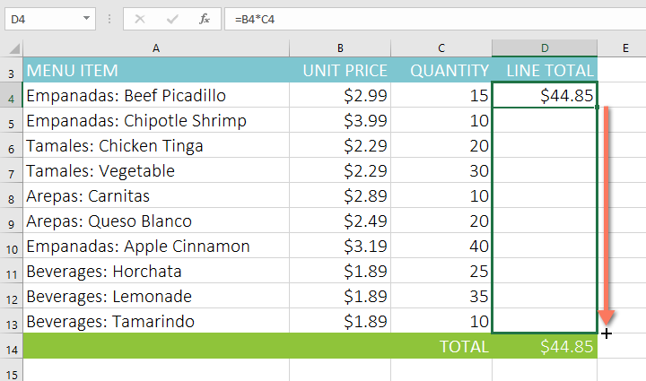

6. Thả chuột. Công thức sẽ được ** sao chép ** vào các ô đã chọn với ** tham chiếu tương đối **, hiển thị kết quả trong mỗi ô.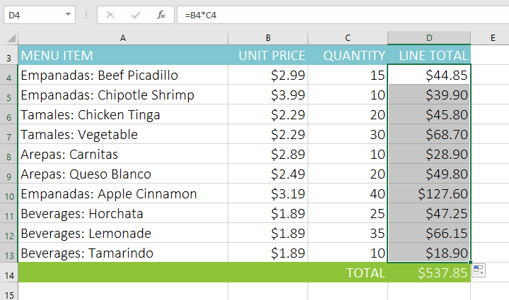

Bạn có thể nhấp đúp vào ** ô đã điền ** để kiểm tra độ chính xác của công thức. Các tham chiếu ô tương đối phải khác nhau đối với mỗi ô, tùy thuộc vào hàng của chúng.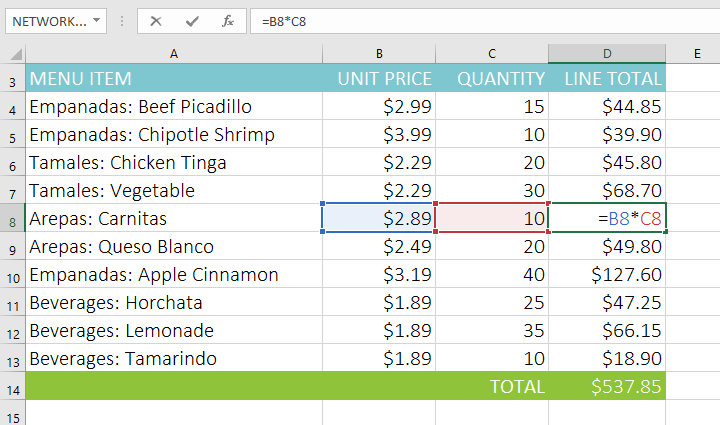

### Tài liệu tham khảo tuyệt đối

Có thể đôi khi bạn không muốn tham chiếu ô thay đổi khi sao chép sang các ô khác. Không giống như tham chiếu tương đối,** tham chiếu tuyệt đối ** không thay đổi khi được sao chép hoặc điền. Bạn có thể sử dụng tham chiếu tuyệt đối để giữ một hàng và/hoặc cột ** không đổi **.

Tham chiếu tuyệt đối được chỉ định trong công thức bằng cách thêm ** ký hiệu đô la ($)**. Nó có thể đứng trước tham chiếu cột, tham chiếu hàng hoặc cả hai.

Thông thường, bạn sẽ sử dụng định dạng **$A$2 ** khi tạo công thức chứa tham chiếu tuyệt đối. Hai định dạng còn lại được sử dụng ít thường xuyên hơn.

Khi viết công thức, bạn có thể nhấn phím ** F4 ** trên bàn phím để chuyển đổi giữa tham chiếu ô tương đối và tuyệt đối, như minh họa trong video bên dưới. Đây là một cách dễ dàng để nhanh chóng chèn một tham chiếu tuyệt đối.

#### Để tạo và sao chép một công thức sử dụng tham chiếu tuyệt đối:

Trong ví dụ bên dưới, chúng tôi sẽ sử dụng ô ** E2 **(chứa thuế suất 7,5%) 
để tính thuế bán hàng cho từng mặt hàng trong ** cột D **. Để đảm bảo tham chiếu đến thuế suất không đổi—ngay cả khi công thức được sao chép và điền vào các ô khác—chúng ta cần đặt ô **$E$2 ** làm tham chiếu tuyệt đối.

1. Chọn ** ô ** sẽ chứa công thức. Trong ví dụ của chúng tôi, chúng tôi sẽ chọn ô ** D4 **.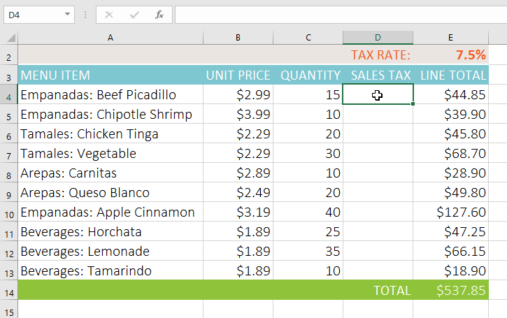

2. Nhập ** công thức ** để tính giá trị mong muốn. Trong ví dụ của chúng tôi, chúng tôi sẽ nhập =**(B4\*C4)
\*$E$2 **, tạo **$E$2 ** thành tham chiếu tuyệt đối.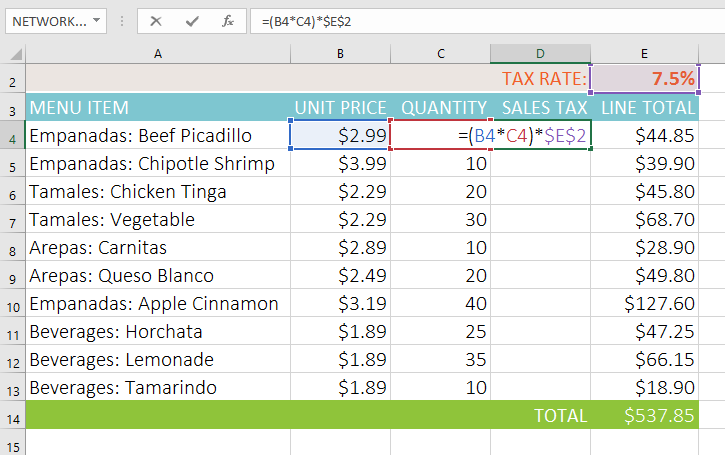

3. Nhấn ** Enter ** trên bàn phím của bạn. Công thức sẽ tính toán và kết quả sẽ hiển thị trong ô.
4. Xác định vị trí ** bộ điều khiển điền ** ở góc dưới bên phải của ô mong muốn. Trong ví dụ của chúng tôi, chúng tôi sẽ xác định vị trí ô điều khiển điền cho ô ** D4 **.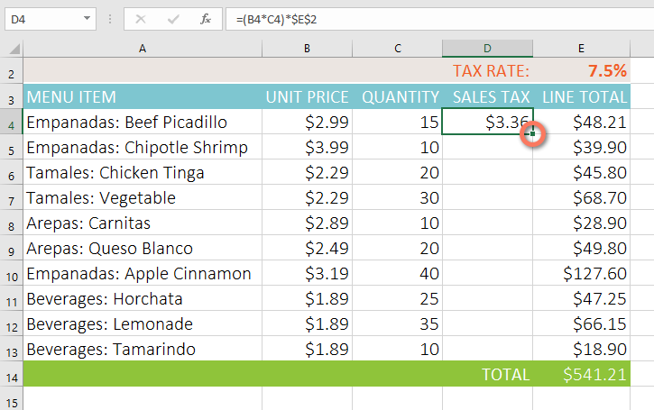

5. Nhấp và kéo ** bộ điều khiển điền ** qua các ô bạn muốn điền (các ô ** D5:D13 ** trong ví dụ của chúng tôi).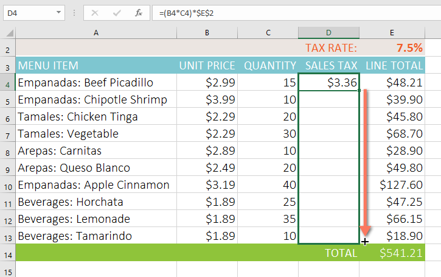

6. Thả chuột. Công thức sẽ được ** sao chép ** vào các ô đã chọn với ** tuyệt đối ** ** tham chiếu ** và các giá trị sẽ được tính trong mỗi ô.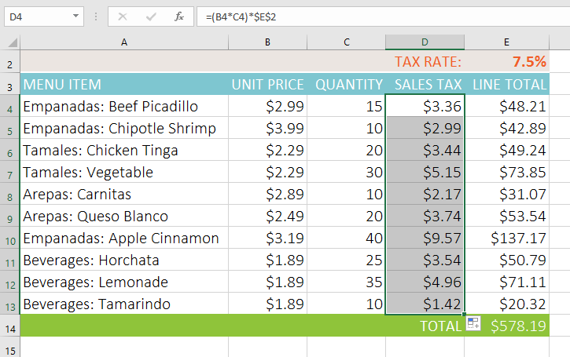

Bạn có thể nhấp đúp vào ** ô đã điền ** để kiểm tra độ chính xác của công thức. Tham chiếu tuyệt đối phải giống nhau cho mỗi ô, trong khi các tham chiếu khác liên quan đến hàng của ô.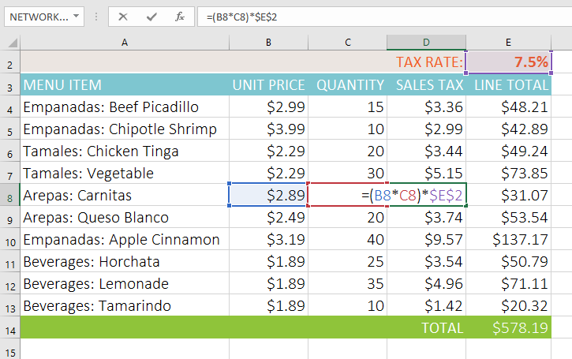

Đảm bảo bao gồm ** ký hiệu đô la ($)** bất cứ khi nào bạn tạo tham chiếu tuyệt đối trên nhiều ô. Ký hiệu đô la đã bị bỏ qua trong ví dụ dưới đây. Điều này khiến Excel hiểu nó là ** tham chiếu tương đối **, tạo ra kết quả không chính xác khi sao chép sang các ô khác.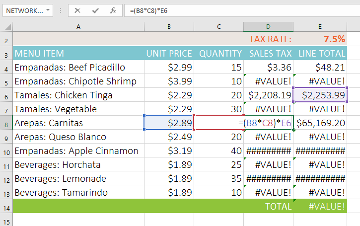

### Sử dụng tham chiếu ô với nhiều trang tính

Excel cho phép bạn tham chiếu đến bất kỳ ô nào trên bất kỳ ** trang tính ** nào, điều này có thể đặc biệt hữu ích nếu bạn muốn tham chiếu một giá trị cụ thể từ trang tính này sang trang tính khác. Để thực hiện việc này, bạn chỉ cần bắt đầu tham chiếu ô bằng ** bảng tính ** ** tên **, theo sau là ** dấu chấm than ** ** điểm ** **(!)**. Ví dụ: nếu bạn muốn tham chiếu ô ** A1 ** trên ** Sheet1 **, thì tham chiếu ô của nó sẽ là ** Sheet1!A1 **.

Lưu ý rằng nếu tên trang tính chứa ** dấu cách **, bạn sẽ cần bao gồm ** dấu ngoặc đơn (' ')** xung quanh tên. Ví dụ: nếu bạn muốn tham chiếu ô ** A1 ** trên trang tính có tên ** Ngân sách tháng 7 **, thì tham chiếu ô của ô đó sẽ là **'Ngân sách tháng 7'!A1 **.

#### Để tham chiếu các ô trên bảng tính:

Trong ví dụ bên dưới, chúng tôi sẽ đề cập đến một ô có giá trị được tính toán giữa hai trang tính. Điều này sẽ cho phép chúng ta sử dụng ** giá trị chính xác ** trên hai trang tính khác nhau mà không cần viết lại công thức hoặc sao chép dữ liệu.

1. Xác định vị trí ô bạn muốn tham chiếu và ghi lại bảng tính của ô đó. Trong ví dụ của chúng tôi, chúng tôi muốn tham chiếu ô ** E14 ** trên bảng tính ** Thứ tự menu **.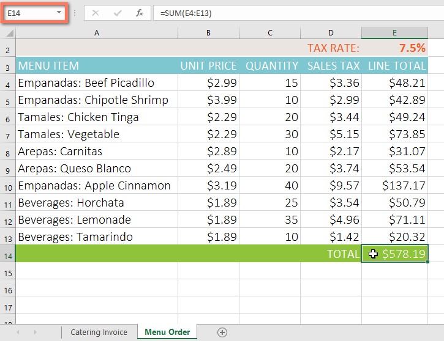

2. Điều hướng tới ** bảng tính ** mong muốn. Trong ví dụ của chúng tôi, chúng tôi sẽ chọn bảng tính ** Hóa đơn ăn uống **.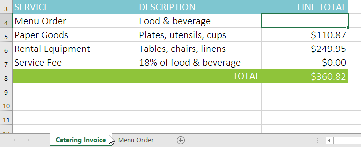

3. Xác định vị trí và chọn ** ô ** nơi bạn muốn giá trị xuất hiện. Trong ví dụ của chúng tôi, chúng tôi sẽ chọn ô ** C4 **.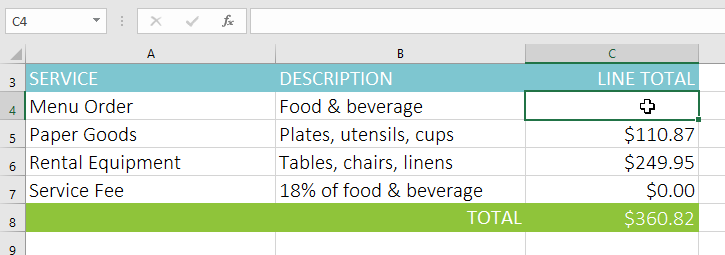

4. Nhập ** dấu bằng (=)**,** trang tính ** ** tên ** theo sau là ** dấu chấm than ** **(!)** và ** địa chỉ ô **. Trong ví dụ của chúng tôi, chúng tôi sẽ nhập **='Menu Order'!E14 **.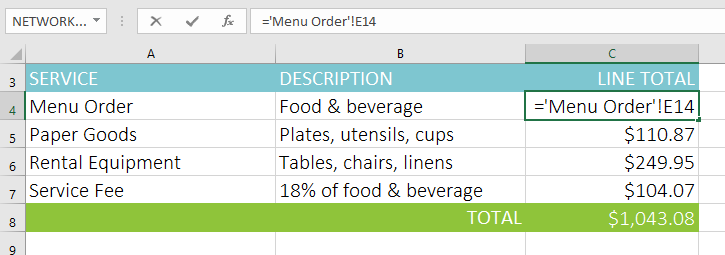

5. Nhấn ** Enter ** trên bàn phím của bạn.** giá trị ** của ô được tham chiếu sẽ xuất hiện. Bây giờ, nếu giá trị của ô E14 thay đổi trên bảng tính Thứ tự Thực đơn, nó sẽ được cập nhật tự động trên bảng tính Hóa đơn Dịch vụ ăn uống.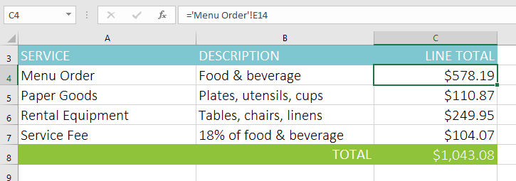

Nếu sau này bạn ** đổi tên ** bảng tính của mình, tham chiếu ô sẽ được cập nhật tự động để phản ánh tên bảng tính mới.

Nếu bạn nhập tên bảng tính không chính xác, lỗi **#REF!** sẽ xuất hiện trong ô. Trong ví dụ bên dưới, chúng tôi đã gõ sai tên của trang tính. Để chỉnh sửa, bỏ qua hoặc điều tra lỗi, hãy nhấp vào nút ** Lỗi ** bên cạnh ô và chọn một tùy chọn từ ** menu **.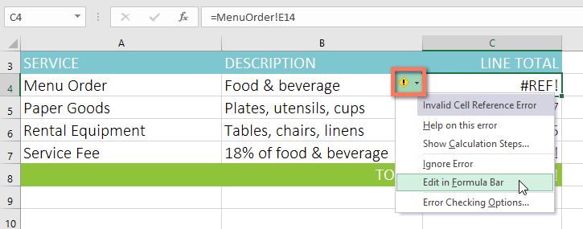

### Thử thách!

1. Mở [sổ làm việc thực hành](practice_files/excel_cellreferences_practice.xlsx) 
của chúng tôi.
2. Nhấp vào tab ** Hàng giấy ** ở phía dưới bên trái của sổ làm việc.
3. Trong ô ** D4 **, nhập công thức nhân đơn giá trong ** B4 **, số lượng trong ** C4 ** và thuế suất trong ** E2 **. Đảm bảo sử dụng ** tham chiếu ô tuyệt đối ** cho thuế suất vì thuế suất sẽ giống nhau ở mọi ô.
4. Sử dụng ** điền vào ** để sao chép công thức bạn vừa tạo vào các ô ** D5:D12 **.
5. Thay đổi thuế suất trong ô ** E2 ** thành 6,5%. Lưu ý rằng tất cả các ô của bạn đã được cập nhật. Khi bạn hoàn tất, sổ làm việc của bạn sẽ trông như thế này: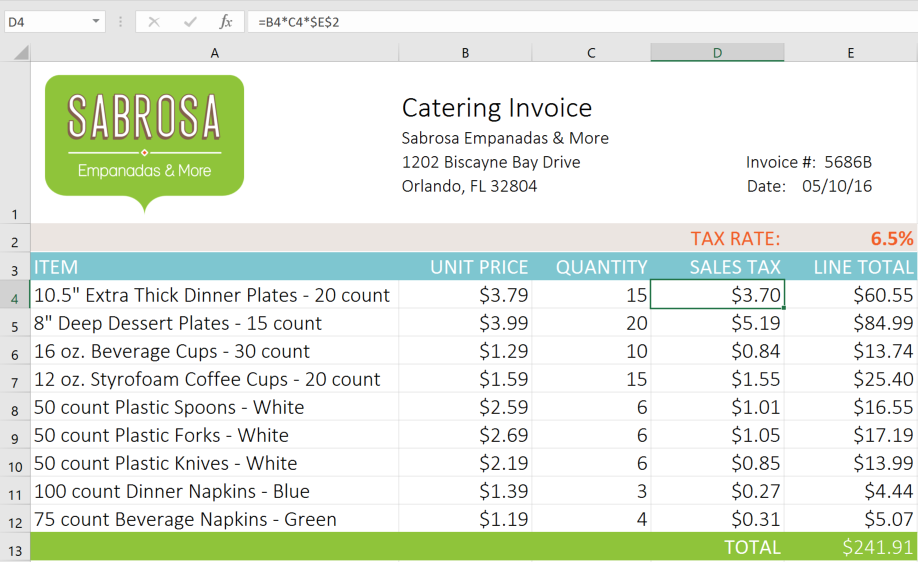

6. Nhấp vào tab ** Hóa đơn ăn uống **.
7. Xóa giá trị trong ô ** C5 ** và thay thế bằng ** tham chiếu ** cho tổng chi phí của hàng hóa giấy.** Gợi ý **: Giá của hàng giấy nằm ở ô ** E13 ** trên bảng tính ** Hàng giấy **.
8. Sử dụng các bước tương tự ở trên để tính thuế bán hàng cho từng mặt hàng trên bảng tính ** Thứ tự thực đơn **. Tổng chi phí trong ô ** E14 ** sẽ cập nhật. Sau đó, trong ô ** C4 ** của bảng tính ** Hóa đơn ăn uống **, hãy tạo một ** tham chiếu ô ** cho tổng số bạn vừa tính.** Lưu ý **: Nếu bạn sử dụng sổ làm việc thực hành của chúng tôi để theo dõi trong bài học thì có thể bạn đã hoàn thành bước này.
9. Khi bạn hoàn tất, bảng tính ** Hóa đơn ăn uống ** sẽ trông giống như thế này: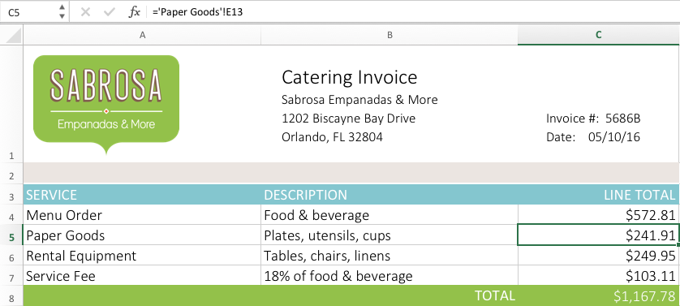

/en/excel/functions/content/