# Bài học 16: chức năng

#### Bài học 16: Hàm

/en/excel/tham chiếu ô tương đối và tuyệt đối/nội dung/

### Giới thiệu

 ** hàm ** là ** công thức được xác định trước ** thực hiện các phép tính bằng cách sử dụng các giá trị cụ thể theo một thứ tự cụ thể. Excel bao gồm nhiều hàm phổ biến có thể dùng để nhanh chóng tìm ** tổng **,** trung bình **,** đếm **,** giá trị tối đa ** và ** giá trị tối thiểu ** cho một phạm vi ô. Để sử dụng hàm một cách chính xác, bạn cần hiểu ** các phần khác nhau của hàm ** và cách tạo ** đối số ** để tính toán các giá trị và tham chiếu ô.

Xem video bên dưới để tìm hiểu thêm về cách làm việc với các hàm.

#### Các bộ phận của một chức năng

Để hoạt động chính xác, hàm phải được viết theo một cách cụ thể, được gọi là ** cú pháp **. Cú pháp cơ bản của hàm là ** dấu bằng (=)**,** tên hàm **(ví dụ: SUM) 
và một hoặc nhiều ** đối số **. Đối số chứa thông tin bạn muốn tính toán. Hàm trong ví dụ bên dưới sẽ cộng các giá trị của phạm vi ô A1:A20.![=SUM(A1:A20)
]
(images/functions_syntax_graphic.png)

#### Làm việc với các đối số

Các đối số có thể tham chiếu đến cả ** ô riêng lẻ ** và ** phạm vi ô ** và phải được đặt trong ** dấu ngoặc đơn **. Bạn có thể bao gồm một đối số hoặc nhiều đối số, tùy thuộc vào cú pháp yêu cầu của hàm.

Ví dụ: hàm **=AVERAGE(B1:B9)** sẽ tính ** trung bình ** của các giá trị trong phạm vi ô B1:B9. Hàm này chỉ chứa một đối số.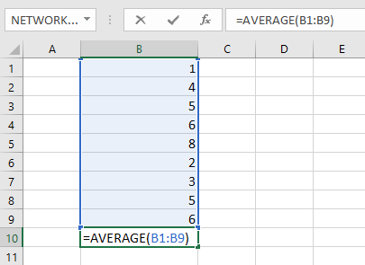

Nhiều đối số phải được phân tách bằng ** dấu phẩy **. Ví dụ: hàm **=SUM(A1:A3, C1:C2, E1)** sẽ ** cộng ** giá trị của tất cả các ô trong ba đối số.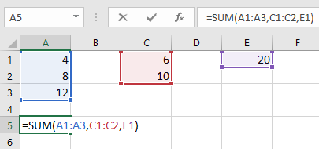

### Tạo một chức năng

Có rất nhiều hàm có sẵn trong Excel. Dưới đây là một số chức năng phổ biến nhất mà bạn sẽ sử dụng:

* ** SUM **: Hàm này ** cộng ** tất cả giá trị của các ô trong đối số.

* ** AVERAGE **: Hàm này xác định ** trung bình ** của các giá trị có trong đối số. Nó tính tổng của các ô và sau đó chia giá trị đó cho số ô trong đối số.

* ** COUNT **: Hàm này ** đếm ** số ô có dữ liệu số trong đối số. Hàm này rất hữu ích để đếm nhanh các mục trong một phạm vi ô.

* ** MAX **: Hàm này xác định ** giá trị ô ** cao nhất ** ** có trong đối số.

* ** MIN **: Hàm này xác định ** giá trị ô thấp nhất ** có trong đối số.

#### Để tạo một hàm bằng lệnh AutoSum:

Lệnh ** AutoSum ** cho phép bạn tự động chèn các hàm phổ biến nhất vào công thức của mình, bao gồm SUM, AVERAGE, COUNT, MAX và MIN. Trong ví dụ bên dưới, chúng ta sẽ sử dụng hàm ** SUM ** để tính ** tổng chi phí ** cho danh sách các mặt hàng được đặt hàng gần đây.

1. Chọn ** ô ** sẽ chứa hàm. Trong ví dụ của chúng tôi, chúng tôi sẽ chọn ô ** D13 **.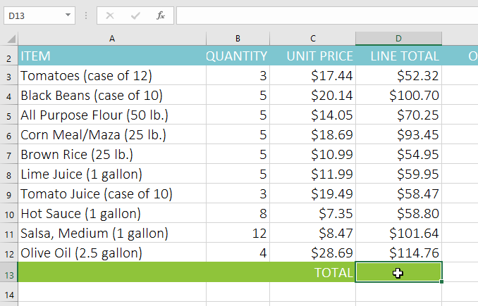

2. Trong nhóm ** Chỉnh sửa ** trên tab ** Trang chủ **, hãy nhấp vào ** mũi tên ** bên cạnh lệnh ** Tự động tính tổng **. Tiếp theo, chọn ** chức năng mong muốn ** từ menu thả xuống. Trong ví dụ của chúng tôi, chúng tôi sẽ chọn ** Sum **.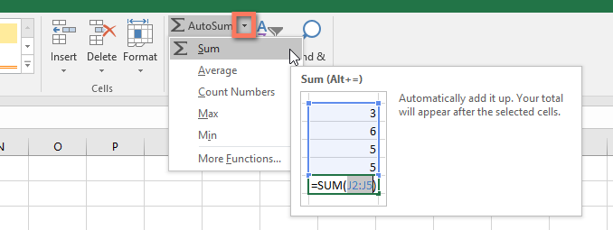

3. Excel sẽ đặt ** hàm ** vào ô và tự động chọn ** phạm vi ô ** cho đối số. Trong ví dụ của chúng tôi, các ô ** D3:D12 ** được chọn tự động; giá trị của chúng sẽ được ** thêm ** để tính tổng chi phí. Nếu Excel chọn sai phạm vi ô, bạn có thể nhập thủ công các ô mong muốn vào đối số.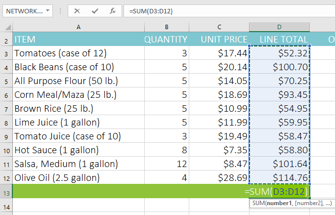

4. Nhấn ** Enter ** trên bàn phím của bạn. Hàm sẽ được ** tính ** và ** kết quả ** sẽ xuất hiện trong ô. Trong ví dụ của chúng tôi, tổng của D3:D12 là **$765,29 **.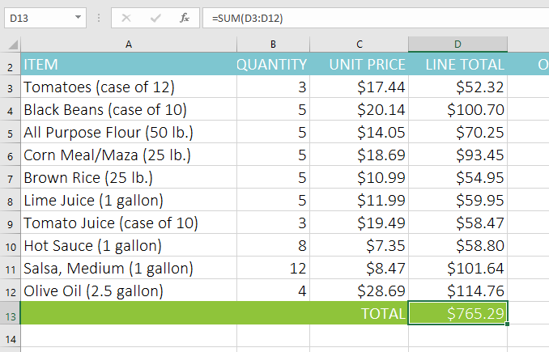

Bạn cũng có thể truy cập lệnh ** AutoSum ** từ tab ** Công thức ** trên ** Ribbon **.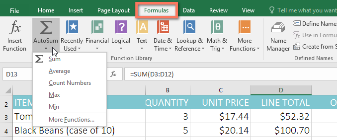

Bạn cũng có thể sử dụng phím tắt ** Alt+=** thay vì lệnh Tự tính tổng. Để sử dụng phím tắt này, hãy giữ phím ** Alt ** rồi nhấn ** dấu bằng **.

Xem video bên dưới để thấy lối tắt này hoạt động.

#### Để nhập một chức năng theo cách thủ công:

Nếu bạn đã biết tên hàm thì bạn có thể tự gõ dễ dàng. Trong ví dụ bên dưới (kiểm đếm doanh số bán bánh quy), chúng tôi sẽ sử dụng hàm ** AVERAGE ** để tính ** số đơn vị trung bình đã bán ** của mỗi đội.

1. Chọn ** ô ** sẽ chứa hàm. Trong ví dụ của chúng tôi, chúng tôi sẽ chọn ô ** C10 **.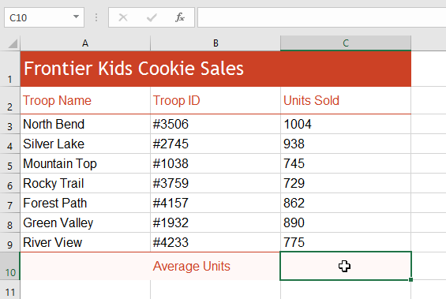

2. Nhập ** dấu bằng (=)**, sau đó nhập ** tên hàm ** mong muốn. Bạn cũng có thể chọn hàm mong muốn từ danh sách ** gợi ý ** ** hàm ** xuất hiện bên dưới ô khi bạn nhập. Trong ví dụ của chúng tôi, chúng tôi sẽ nhập **=AVERAGE **.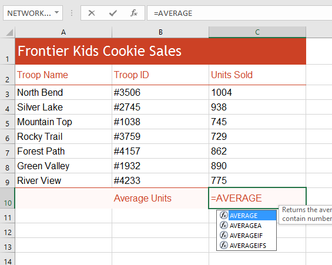

3. Nhập ** phạm vi ô ** cho đối số bên trong ** dấu ngoặc đơn **. Trong ví dụ của chúng tôi, chúng tôi sẽ nhập **(C3:C9)**. Công thức này sẽ cộng các giá trị của ô C3:C9, sau đó chia giá trị đó cho tổng số giá trị trong phạm vi.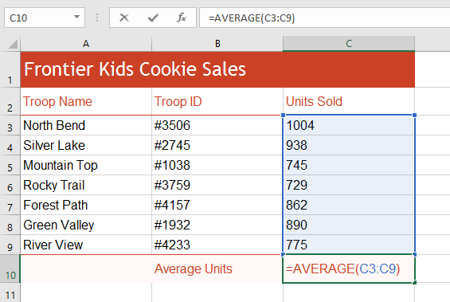

4. Nhấn ** Enter ** trên bàn phím của bạn. Hàm sẽ được tính toán và ** kết quả ** sẽ xuất hiện trong ô. Trong ví dụ của chúng tôi, số lượng đơn vị trung bình được bán bởi mỗi đội quân là ** 849 **.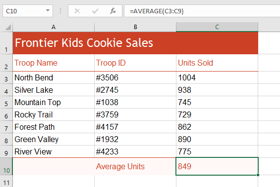

Excel ** không phải lúc nào cũng cho bạn biết ** nếu công thức của bạn có lỗi, vì vậy, bạn có trách nhiệm kiểm tra tất cả các công thức của mình. Để tìm hiểu cách thực hiện việc này, hãy đọc bài học [Kiểm tra kỹ công thức của bạn](../../../excelformulas/doublecheck-your-formulas/1/index.html) 
từ hướng dẫn về [Công thức Excel](../../../excelformulas/index.html) 
của chúng tôi.

### Thư viện hàm

Mặc dù có hàng trăm hàm trong Excel nhưng những hàm bạn sẽ sử dụng nhiều nhất sẽ phụ thuộc vào ** loại dữ liệu ** trong sổ làm việc của bạn. Không cần phải tìm hiểu từng hàm riêng lẻ nhưng việc khám phá một số ** loại ** hàm khác nhau sẽ giúp ích khi bạn tạo dự án mới. Bạn thậm chí có thể sử dụng ** Thư viện hàm ** trên tab ** Công thức ** để duyệt các hàm theo danh mục, bao gồm ** Tài chính **,** Logic **,** Văn bản ** và ** Ngày & giờ **.

Để truy cập ** Thư viện hàm **, hãy chọn tab ** Công thức ** trên ** Ribbon **. Tìm nhóm ** Thư viện hàm **.

Nhấp vào các nút trong phần tương tác bên dưới để tìm hiểu thêm về các loại hàm khác nhau trong Excel.

chỉnh sửa điểm phát sóng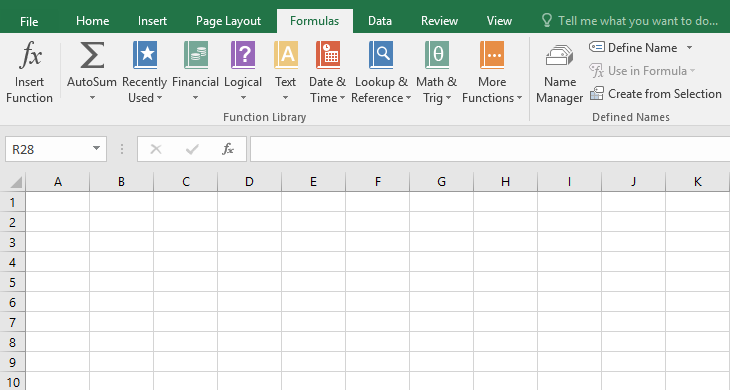

## Lệnh Tự Tính Tổng

Lệnh ** AutoSum ** cho phép bạn tự động trả về kết quả cho các hàm phổ biến như ** SUM **,** AVERAGE ** và ** COUNT **.

## Được sử dụng gần đây

Lệnh **Được sử dụng gần đây ** cho phép bạn truy cập vào các chức năng mà bạn đã làm việc gần đây.

## Tài chính

Danh mục ** Tài chính ** chứa các hàm tính toán tài chính như xác định khoản thanh toán (** PMT **) 
hoặc lãi suất cho khoản vay (** RATE **).

## Hợp lý

Các hàm trong danh mục ** Logic ** kiểm tra các đối số để tìm một giá trị hoặc điều kiện. Ví dụ: nếu đơn hàng lớn hơn $50, hãy thêm $4,99 phí vận chuyển; nếu nó lớn hơn $100, không tính phí vận chuyển (** IF **).

## Chữ

Danh mục ** Văn bản ** chứa các hàm hoạt động với văn bản trong các đối số để thực hiện các tác vụ, chẳng hạn như chuyển đổi văn bản thành chữ thường (** LOWER **) 
hoặc thay thế văn bản (** REPLACE **).

## Ngày & Giờ

Danh mục ** Ngày & Giờ ** chứa các hàm để làm việc với ngày và giờ và sẽ trả về các kết quả như ngày và giờ hiện tại (** NOW **) 
hoặc giây (** SECOND **).

## Tra cứu & tham khảo

Danh mục ** Tra cứu & Tham khảo ** chứa các hàm sẽ trả về kết quả tìm kiếm và tham chiếu thông tin. Ví dụ: bạn có thể thêm siêu liên kết vào một ô (** HYPERLINK **) 
hoặc trả về giá trị của giao điểm hàng và cột cụ thể (** INDEX **).

## Toán & Lượng giác

Danh mục ** Toán học & Lượng giác ** bao gồm các hàm dành cho đối số bằng số. Ví dụ: bạn có thể làm tròn các giá trị (** ROUND **), tìm giá trị của Pi (** PI **), nhân (** SẢN PHẨM **) 
và tổng phụ (** SUBTOTAL **).

## Nhiều chức năng hơn

 ** Chức năng khác ** chứa các hàm bổ sung trong các danh mục dành cho ** Thống kê **,** Kỹ thuật **,** Khối lập phương **,** Thông tin ** và ** Khả năng tương thích **.

## Chèn chức năng

Nếu bạn gặp khó khăn khi tìm hàm phù hợp, lệnh ** Chèn hàm ** cho phép bạn tìm kiếm hàm bằng từ khóa.

#### Để chèn một hàm từ Thư viện hàm:

Trong ví dụ bên dưới, chúng ta sẽ sử dụng hàm COUNTA để đếm tổng số mục trong cột ** Mục **. Không giống như COUNT,** COUNTA ** có thể được sử dụng để kiểm đếm các ô có chứa bất kỳ loại dữ liệu nào, không chỉ dữ liệu số.

1. Chọn ** ô ** sẽ chứa hàm. Trong ví dụ của chúng tôi, chúng tôi sẽ chọn ô ** B17 **.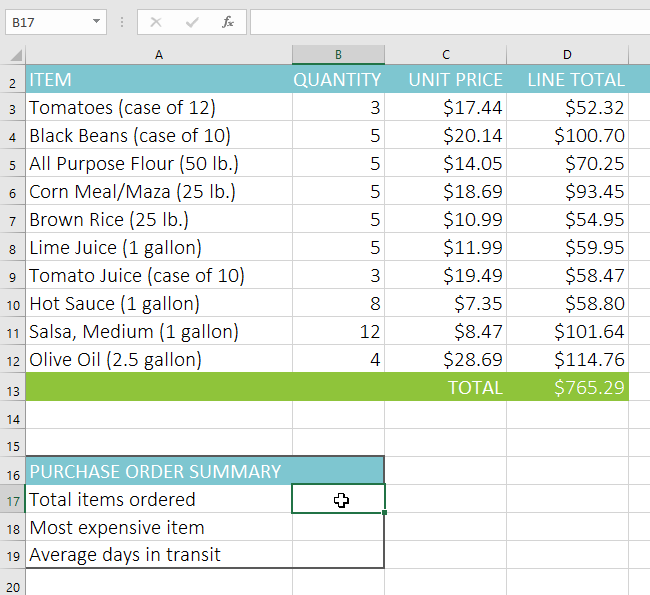

2. Nhấp vào tab ** Công thức ** trên ** Ribbon ** để truy cập ** Thư viện hàm **.
3. Từ nhóm ** Thư viện hàm **, chọn ** danh mục hàm ** mong muốn. Trong ví dụ của chúng tôi, chúng tôi sẽ chọn ** Chức năng khác **, sau đó di chuột qua ** Thống kê **.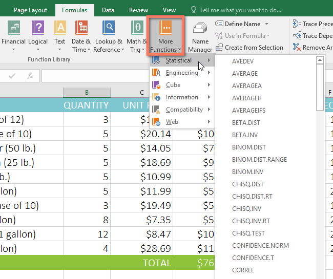

4. Chọn ** chức năng mong muốn ** từ menu thả xuống. Trong ví dụ của chúng tôi, chúng tôi sẽ chọn hàm ** COUNTA ** để đếm số ô trong cột ** Items ** không trống.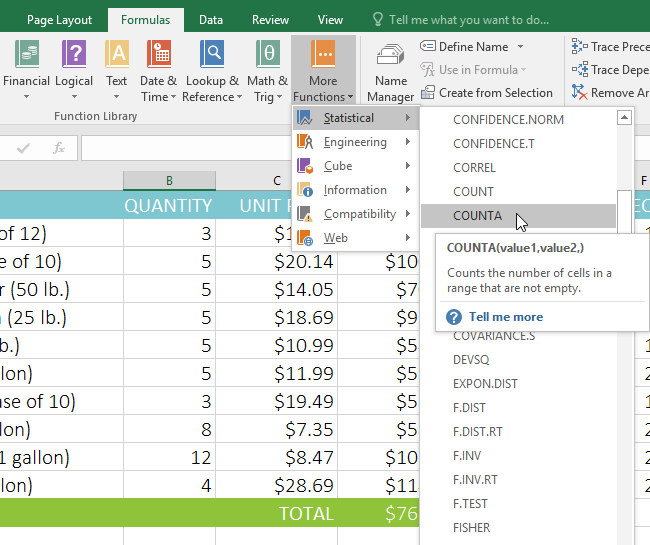

5. Hộp thoại **Đối số hàm ** sẽ xuất hiện. Chọn trường ** Value1 **, sau đó nhập hoặc chọn các ô mong muốn. Trong ví dụ của chúng tôi, chúng tôi sẽ nhập phạm vi ô ** A3:A12 **. Bạn có thể tiếp tục thêm đối số trong trường ** Value2 **, nhưng trong trường hợp này, chúng tôi chỉ muốn đếm số ô trong phạm vi ô ** A3:A12 **.
6. Khi bạn hài lòng, hãy nhấp vào ** OK **.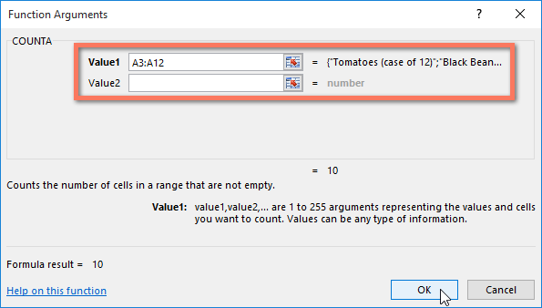

7. Hàm sẽ được ** tính ** và ** kết quả ** sẽ xuất hiện trong ô. Trong ví dụ của chúng tôi, kết quả cho thấy ** 10 mặt hàng ** đã được đặt hàng.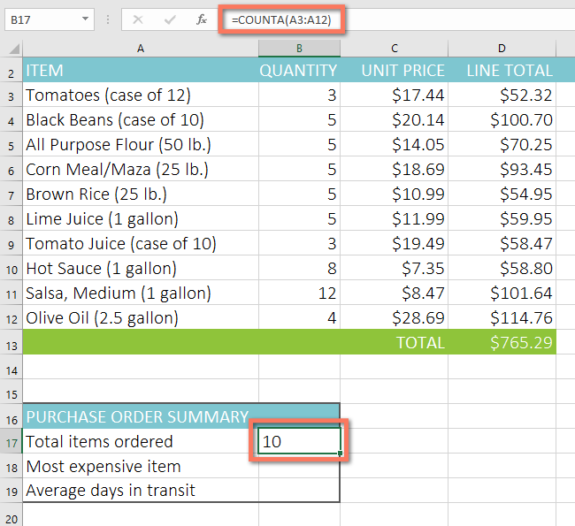

### Lệnh Chèn hàm

Mặc dù Thư viện hàm là nơi tuyệt vời để duyệt tìm các hàm nhưng đôi khi bạn có thể thích ** tìm kiếm ** một hàm hơn. Bạn có thể làm như vậy bằng cách sử dụng lệnh ** Insert Function **. Có thể mất một số lần thử và sai sót tùy thuộc vào loại hàm bạn đang tìm kiếm, nhưng nếu thực hành, lệnh Chèn Hàm có thể là một cách hiệu quả để tìm hàm một cách nhanh chóng.

#### Để sử dụng lệnh Chèn hàm:

Trong ví dụ bên dưới, chúng ta muốn tìm một hàm sẽ tính ** số ngày làm việc ** để nhận được các mặt hàng sau khi chúng được đặt hàng. Chúng tôi sẽ sử dụng ngày trong cột ** E ** và ** F ** để tính thời gian giao hàng trong cột ** G **.

1. Chọn ** ô ** sẽ chứa hàm. Trong ví dụ của chúng tôi, chúng tôi sẽ chọn ô ** G3 **.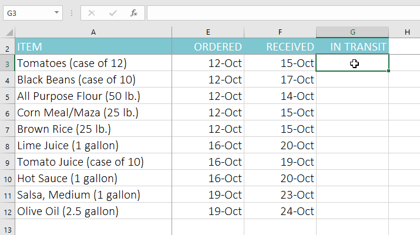

2. Nhấp vào tab ** Công thức ** trên ** Ribbon **, sau đó nhấp vào lệnh ** Chèn hàm **.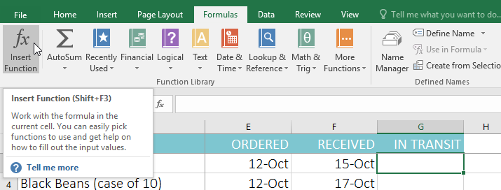

3. Hộp thoại ** Chèn chức năng ** sẽ xuất hiện.
4. Nhập một vài ** từ khóa ** mô tả phép tính mà bạn muốn hàm thực hiện, sau đó nhấp vào **Đi **. Trong ví dụ của chúng tôi, chúng tôi sẽ nhập ** đếm ngày ** nhưng bạn cũng có thể tìm kiếm bằng cách chọn ** danh mục ** từ danh sách thả xuống.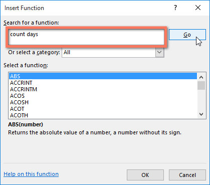

5. Xem lại ** kết quả ** để tìm hàm mong muốn, sau đó nhấp vào ** OK **. Trong ví dụ của chúng tôi, chúng tôi sẽ chọn ** NETWORKDAYS **, sẽ tính số ngày làm việc giữa ngày đặt hàng và ngày nhận được.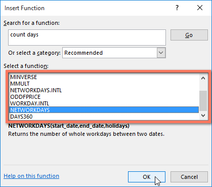

6. Hộp thoại **Đối số hàm ** sẽ xuất hiện. Từ đây, bạn sẽ có thể nhập hoặc chọn các ô sẽ tạo nên các đối số trong hàm. Trong ví dụ của chúng tôi, chúng tôi sẽ nhập ** E3 ** vào trường ** Bắt đầu\_ngày ** và ** F3 ** vào trường ** Kết thúc\_ngày **.
7. Khi bạn hài lòng, hãy nhấp vào ** OK **.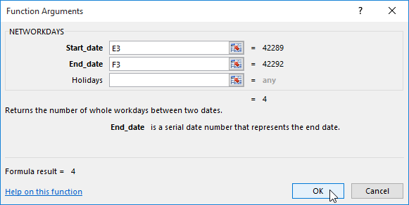

8. Hàm sẽ được ** tính ** và ** kết quả ** sẽ xuất hiện trong ô. Trong ví dụ của chúng tôi, kết quả cho thấy phải mất ** bốn ngày làm việc ** để nhận được đơn đặt hàng.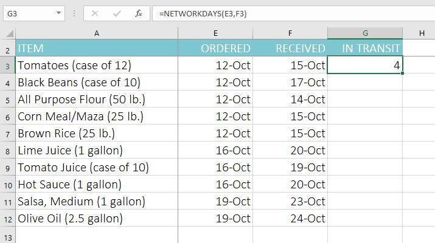

Giống như công thức, các hàm có thể được sao chép sang các ô liền kề. Chỉ cần chọn ** ô ** chứa hàm, sau đó nhấp và kéo ** bộ điều khiển điền ** qua các ô bạn muốn điền. Hàm sẽ được sao chép và giá trị của các ô đó sẽ được tính tương ứng với các hàng hoặc cột của chúng.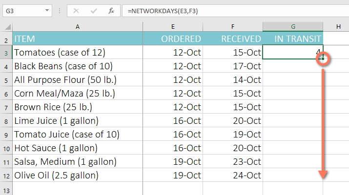

#### Để tìm hiểu thêm:

Nếu bạn cảm thấy thoải mái với các chức năng cơ bản, bạn có thể muốn thử một chức năng nâng cao hơn như ** VLOOKUP **. Hãy xem lại bài học của chúng tôi về [Cách sử dụng hàm VLOOKUP của Excel](../../../excel-tips/how-to-use-excels-vlookup-function/1/index.html "Cách sử dụng hàm VLOOKUP của Excel") 
để biết thêm thông tin.

Để tìm hiểu thêm về cách làm việc với các hàm, hãy truy cập hướng dẫn [Công thức Excel](../../../excelformulas/index.html) 
của chúng tôi.

### Thử thách!

1. Mở [sổ làm việc thực hành](practice_files/excel_functions_practice.xlsx) 
của chúng tôi.
2. Nhấp vào tab ** Thử thách ** ở phía dưới bên trái của sổ làm việc.
3. Trong ô ** F3 **, hãy chèn một hàm để tính ** trung bình ** của bốn điểm trong các ô ** B3:E3 **.
4. Sử dụng ** bộ điều khiển điền ** để sao chép hàm của bạn trong ô ** F3 ** sang các ô ** F4:F17 **.
5. Trong ô ** B18 **, hãy sử dụng lệnh ** Tự tính tổng ** để chèn ** hàm ** tính toán điểm ** thấp nhất ** trong các ô ** B3:B17 **.
6. Trong ô ** B19 **, hãy sử dụng ** Thư viện hàm ** để chèn hàm tính ** trung vị ** của điểm số trong các ô ** B3:B17 **.** Gợi ý **: Bạn có thể tìm hàm trung vị bằng cách đi tới ** Hàm khác > Thống kê **.
7. Trong ô ** B20 **, hãy tạo một ** hàm ** để tính điểm ** cao nhất ** trong các ô ** B3:B17 **.
8. Chọn các ô ** B18:B20 **, sau đó sử dụng ** bộ điều khiển điền ** để sao chép tất cả ba hàm bạn vừa tạo vào các ô ** C18:F20 **.
9. Khi bạn hoàn tất, sổ làm việc của bạn sẽ trông như thế này:

/en/excel/basic-tips-for-working-with-data/content/