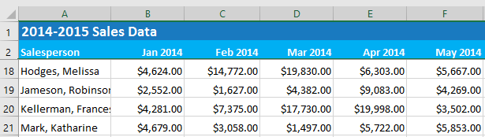
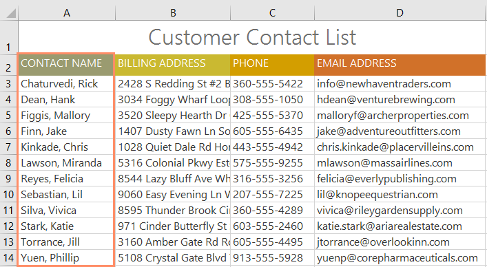
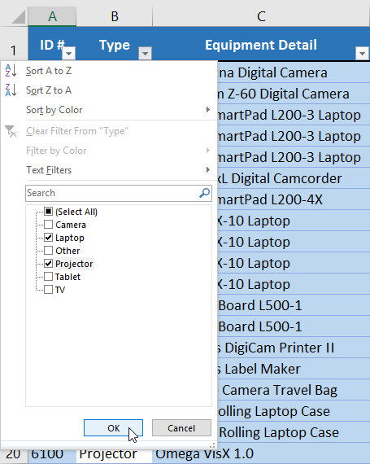
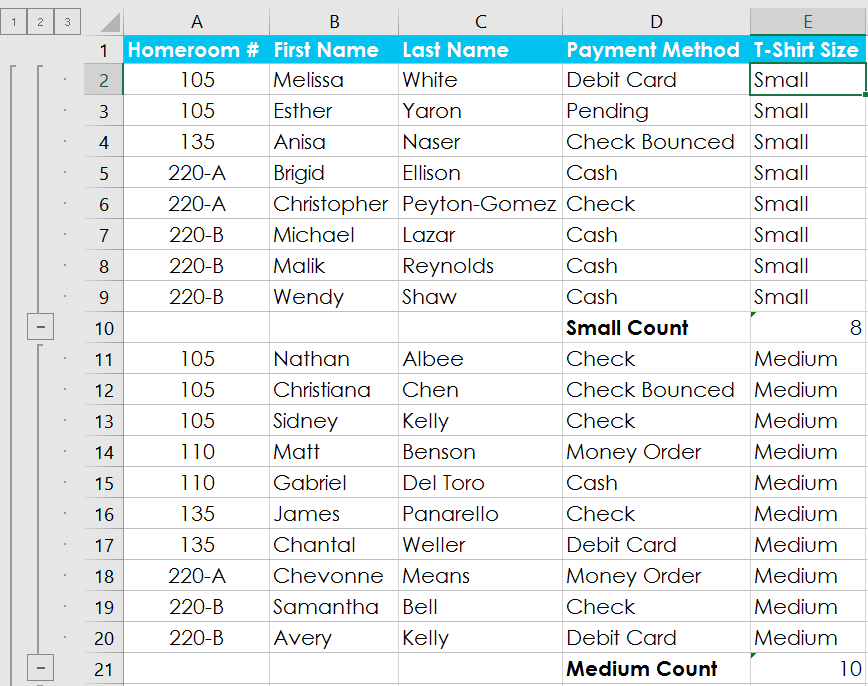
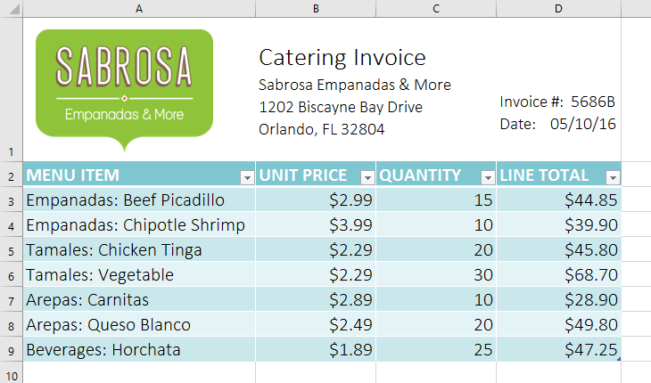
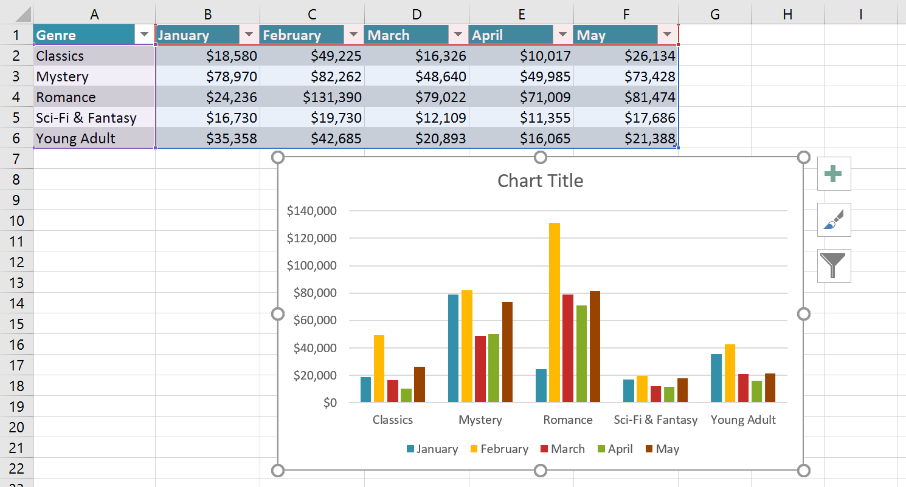
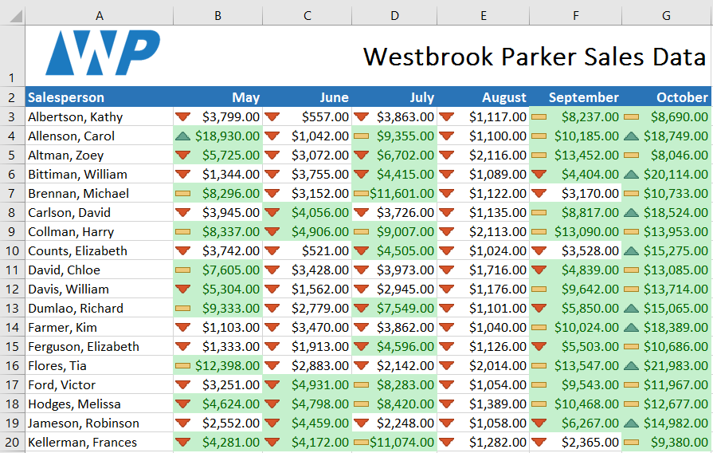
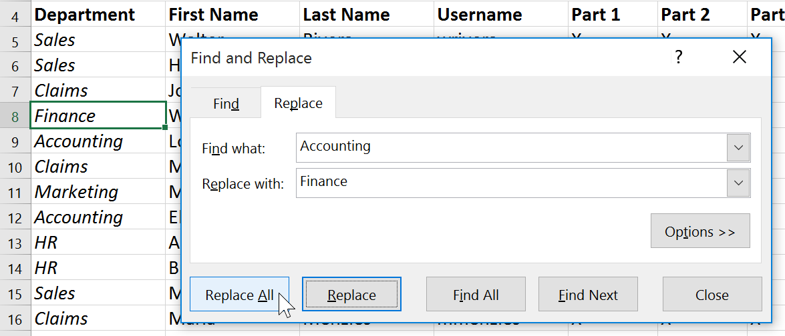

# Bài 17: mẹo cơ bản khi làm việc với dữ liệu

#### Bài học 17: Mẹo cơ bản khi làm việc với dữ liệu

/en/excel/functions/content/

### Giới thiệu

Sổ làm việc Excel được thiết kế để lưu trữ rất nhiều thông tin. Cho dù bạn đang làm việc với 20 ô hay 20.000 ô, Excel đều có một số tính năng giúp bạn ** sắp xếp dữ liệu ** và ** tìm thấy những gì bạn cần **. Bạn có thể thấy một số tính năng hữu ích nhất bên dưới. Và hãy nhớ xem lại các bài học khác trong hướng dẫn này để biết hướng dẫn từng bước cho từng tính năng này.

#### Cố định hàng và cột

Bạn có thể luôn muốn xem một số hàng hoặc cột nhất định trong trang tính của mình, đặc biệt là ** ô tiêu đề **. Bằng cách đặt [đóng băng hàng hoặc cột](../../freezing-panes-and-view-options/1/index.html), bạn sẽ có thể cuộn qua nội dung của mình trong khi tiếp tục xem các ô được cố định. Trong ví dụ này, chúng tôi đã cố định hai hàng trên cùng, điều này cho phép chúng tôi xem ngày bất kể chúng tôi cuộn ở đâu trong bảng tính.

#### Sắp xếp dữ liệu

Bạn có thể nhanh chóng ** sắp xếp lại ** trang tính bằng cách [sắp xếp dữ liệu của bạn](../../sorting-data/1/index.html). Nội dung có thể được sắp xếp theo thứ tự bảng chữ cái, số và theo nhiều cách khác. Ví dụ: bạn có thể sắp xếp danh sách thông tin liên hệ theo họ.

#### Lọc dữ liệu

[Filters](../../filtering-data/1/index.html) 
có thể được sử dụng để ** thu hẹp ** dữ liệu trong trang tính của bạn, cho phép bạn chỉ xem thông tin bạn cần. Trong ví dụ này, chúng tôi đang lọc trang tính để chỉ hiển thị các hàng có chứa các từ ** Laptop ** hoặc ** Projector ** trong cột B.

#### Tóm tắt dữ liệu

[Lệnh tổng phụ](../../groups-and-subtotals/1/index.html) 
cho phép bạn tóm tắt nhanh chóng dữ liệu. Trong ví dụ của chúng tôi, chúng tôi đã tạo tổng phụ cho ** mỗi kích cỡ áo phông **, giúp dễ dàng biết chúng tôi sẽ cần bao nhiêu ở mỗi kích cỡ.

#### Định dạng dữ liệu dưới dạng bảng

Cũng giống như định dạng thông thường, [tables](../../tables/1/index.html) 
có thể cải thiện ** giao diện ** sổ làm việc của bạn, nhưng chúng cũng sẽ giúp ** sắp xếp ** nội dung của bạn và giúp dữ liệu của bạn dễ sử dụng hơn. Ví dụ: các bảng có các tùy chọn sắp xếp và lọc tích hợp. Excel cũng bao gồm một số ** kiểu bảng được xác định trước **, cho phép bạn tạo bảng nhanh chóng.

#### Trực quan hóa dữ liệu bằng biểu đồ

Có thể khó diễn giải các sổ làm việc Excel chứa nhiều dữ liệu.**[Biểu đồ](../../charts/1/index.html)** cho phép bạn minh họa dữ liệu sổ làm việc của mình ** bằng đồ họa **, giúp bạn dễ dàng hình dung ** so sánh ** và ** xu hướng **.

#### Thêm định dạng có điều kiện

Giả sử bạn có một bảng tính có hàng nghìn hàng dữ liệu. Sẽ cực kỳ khó để nhìn thấy các mô hình và xu hướng chỉ từ việc kiểm tra thông tin thô. [Định dạng có điều kiện](../../conditional-formatting/1/index.html) 
cho phép bạn tự động áp dụng định dạng ô—bao gồm ** màu sắc **,** biểu tượng ** và ** thanh dữ liệu **—cho một hoặc nhiều ô dựa trên ** ô ** ** giá trị **.

#### Sử dụng Tìm và Thay thế

Khi làm việc với nhiều dữ liệu, việc xác định thông tin cụ thể có thể khó khăn và tốn thời gian. Bạn có thể dễ dàng tìm kiếm sổ làm việc của mình bằng [Tính năng tìm](../../using-find-replace/1/index.html), tính năng này cũng cho phép bạn sửa đổi nội dung bằng tính năng ** Thay thế **.

/en/excel/freezing-panes-and-view-options/content/