# Bài 18: Tùy chọn đóng băng và xem

#### Bài 18: Freezing Panes và View Options

/en/excel/basic-tips-for-working-with-data/content/

### Giới thiệu

Bất cứ khi nào bạn làm việc với nhiều dữ liệu, có thể khó ** so sánh ** thông tin trong sổ làm việc của bạn. May mắn thay, Excel bao gồm một số công cụ giúp bạn xem nội dung từ các phần khác nhau trong sổ làm việc của bạn cùng một lúc dễ dàng hơn, bao gồm khả năng ** đóng băng ** ** các ngăn ** và ** tách ** trang tính của bạn.

Xem video bên dưới để tìm hiểu thêm về cách cố định khung trong Excel.

#### Để cố định hàng:

Bạn có thể luôn muốn xem một số hàng hoặc cột nhất định trong trang tính của mình, đặc biệt là ** ô tiêu đề **. Bằng cách ** đóng băng ** hàng hoặc cột tại chỗ, bạn sẽ có thể cuộn qua nội dung của mình trong khi tiếp tục xem các ô được cố định.

1. Chọn ** hàng ** bên dưới (các) 
hàng bạn muốn ** đóng băng **. Trong ví dụ của chúng tôi, chúng tôi muốn cố định các hàng ** 1 ** và ** 2 **, vì vậy chúng tôi sẽ chọn hàng ** 3 **.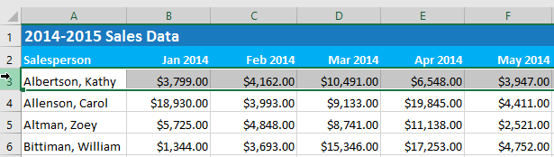

2. Trên tab ** Xem **, chọn lệnh ** Freeze Panes **, sau đó chọn ** Freeze Panes ** từ trình đơn thả xuống.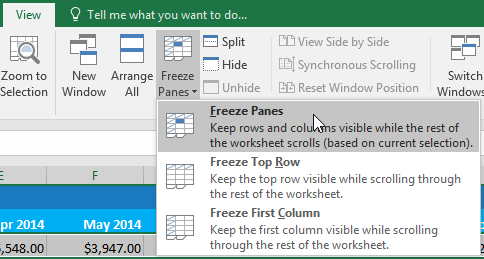

3. Các hàng sẽ được ** đóng băng ** tại chỗ, như được biểu thị bằng ** dòng ** màu xám ** **. Bạn có thể ** cuộn xuống ** bảng tính trong khi tiếp tục xem các hàng cố định ở trên cùng. Trong ví dụ của chúng tôi, chúng tôi đã cuộn xuống hàng ** 18 **.

#### Để cố định cột:

1. Chọn ** cột ** ở bên phải (các) 
cột bạn muốn ** đóng băng **. Trong ví dụ của chúng tôi, chúng tôi muốn cố định ** cột A **, vì vậy chúng tôi sẽ chọn cột ** B **.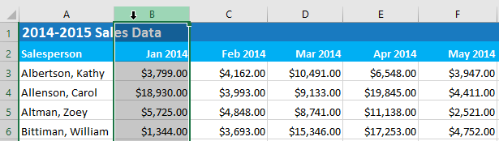

2. Trên tab ** Xem **, chọn lệnh ** Freeze Panes **, sau đó chọn ** Freeze Panes ** từ trình đơn thả xuống.

3. Cột sẽ được ** đóng băng ** tại chỗ, như được biểu thị bằng ** dòng ** màu xám ** **. Bạn có thể ** cuộn qua ** bảng tính trong khi tiếp tục xem cột cố định ở bên trái. Trong ví dụ của chúng tôi, chúng tôi đã cuộn qua cột ** E **.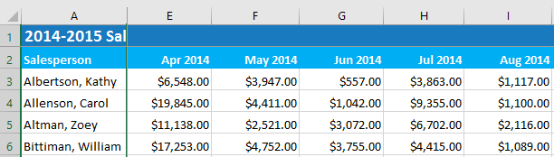

Nếu bạn chỉ cần cố định ** hàng trên cùng **(hàng 1) 
hoặc ** cột đầu tiên **(cột A) 
trong bảng tính, bạn chỉ cần chọn ** Cố định hàng trên ** hoặc ** Cố định cột đầu tiên ** từ trình đơn thả xuống.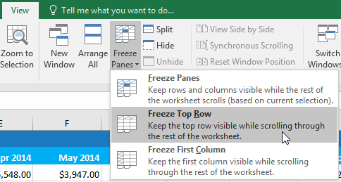

#### Để giải phóng các ngăn:

Nếu bạn muốn chọn một tùy chọn chế độ xem khác, trước tiên bạn có thể cần phải đặt lại bảng tính bằng cách giải phóng các ngăn. Để ** hủy cố định ** hàng hoặc cột, hãy nhấp vào lệnh ** Freeze Panes **, sau đó chọn ** Unfreeze Panes ** từ trình đơn thả xuống.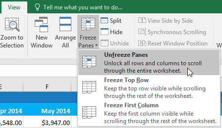

### Tùy chọn xem khác

Nếu sổ làm việc của bạn chứa nhiều nội dung, đôi khi có thể khó so sánh các phần khác nhau. Excel bao gồm các tùy chọn bổ sung để làm cho sổ làm việc của bạn dễ xem và so sánh hơn. Ví dụ: bạn có thể chọn ** mở một ** ** cửa sổ mới ** cho sổ làm việc của mình hoặc ** tách ** ** trang tính ** thành các ngăn riêng biệt.

#### Để mở một cửa sổ mới cho sổ làm việc hiện tại:

Excel cho phép bạn mở ** nhiều cửa sổ ** cho một sổ làm việc cùng lúc. Trong ví dụ của chúng tôi, chúng tôi sẽ sử dụng tính năng này để so sánh hai ** bảng tính ** khác nhau từ cùng một sổ làm việc.

1. Nhấp vào tab ** Xem ** trên ** Ribbon **, sau đó chọn lệnh ** Mới ** ** Cửa sổ **.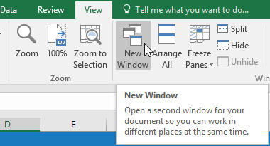

2.** Cửa sổ mới ** dành cho sổ làm việc sẽ xuất hiện.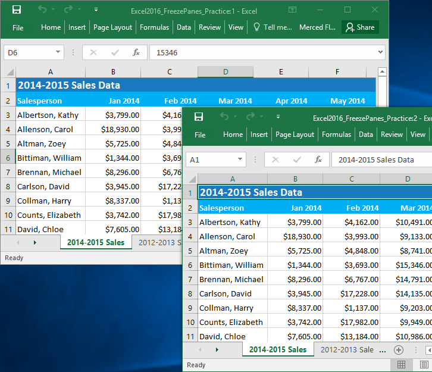

3. Bây giờ bạn có thể so sánh các trang tính khác nhau từ cùng một sổ làm việc trên các cửa sổ. Trong ví dụ của chúng tôi, chúng tôi sẽ chọn bảng tính ** Chế độ xem chi tiết doanh số bán hàng năm 2013 ** để so sánh doanh số bán hàng ** 2012 ** và ** 2013 **.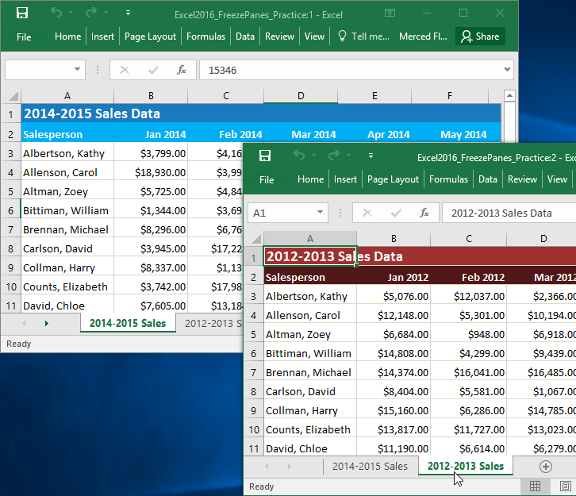

Nếu bạn mở nhiều cửa sổ cùng lúc, bạn có thể sử dụng lệnh ** Sắp xếp tất cả ** để sắp xếp lại chúng một cách nhanh chóng.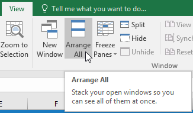

#### Để chia một bảng tính:

Đôi khi bạn có thể muốn so sánh các phần khác nhau của cùng một sổ làm việc mà không cần tạo cửa sổ mới. Lệnh ** Split ** cho phép bạn ** chia ** bảng tính thành nhiều ngăn cuộn riêng biệt.

1. Chọn ** ô ** nơi bạn muốn chia trang tính. Trong ví dụ của chúng tôi, chúng tôi sẽ chọn ô ** D6 **.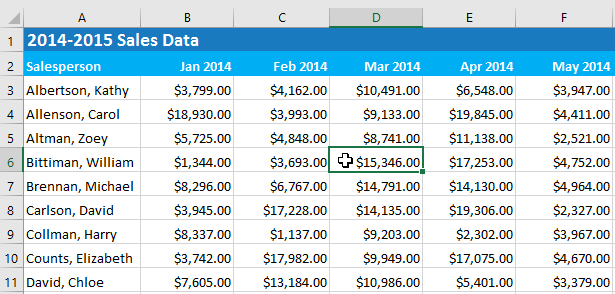

2. Nhấp vào tab ** Xem ** trên ** Ribbon **, sau đó chọn lệnh ** Split **.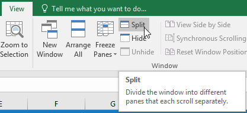

3. Sổ làm việc sẽ được ** chia ** thành các ** khung ** khác nhau. Bạn có thể cuộn qua từng ngăn riêng biệt bằng ** scroll bar **, cho phép bạn so sánh các phần khác nhau của sổ làm việc.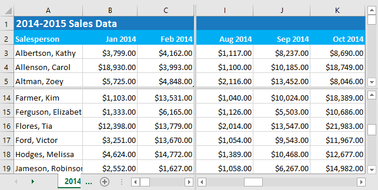

4. Sau khi tạo phần chia, bạn có thể nhấp và kéo các vạch chia dọc và ngang để thay đổi kích thước của từng phần.

Để xóa phần tách, hãy nhấp lại vào lệnh ** Split **.

### Thử thách!

Trong tệp ví dụ của chúng tôi, có RẤT NHIỀU dữ liệu bán hàng. Đối với thử thách này, chúng tôi muốn có thể so sánh dữ liệu của các năm khác nhau cạnh nhau. Để làm điều này:

1. Mở [sổ làm việc thực hành](practice_files/excel_freezepanes_practice.xlsx) 
của chúng tôi.
2. Mở ** cửa sổ mới ** cho sổ làm việc của bạn.
3.** Dừng cột đầu tiên ** và sử dụng scroll bar ngang để xem doanh số bán hàng từ năm 2015.
4.** Giải phóng ** cột đầu tiên.
5. Chọn ô ** G17 ** và nhấp vào ** Tách ** để chia trang tính thành nhiều ngăn.** Gợi ý **: Thao tác này sẽ chia trang tính thành các hàng 16 và 17 cũng như cột F và G.
6. Sử dụng scroll bar ngang ở dưới cùng bên phải của cửa sổ để di chuyển trang tính sao cho ** Cột N **, chứa dữ liệu cho tháng 1 năm 2015, nằm cạnh ** Cột ** ** F **.
7. Mở ** cửa sổ mới ** cho sổ làm việc của bạn và chọn tab ** Doanh số 2012-2013 **.
8. Di chuyển các cửa sổ của bạn để chúng ở cạnh nhau. Bây giờ bạn có thể so sánh dữ liệu của các tháng tương tự từ nhiều năm khác nhau. Màn hình của bạn sẽ trông giống như thế này: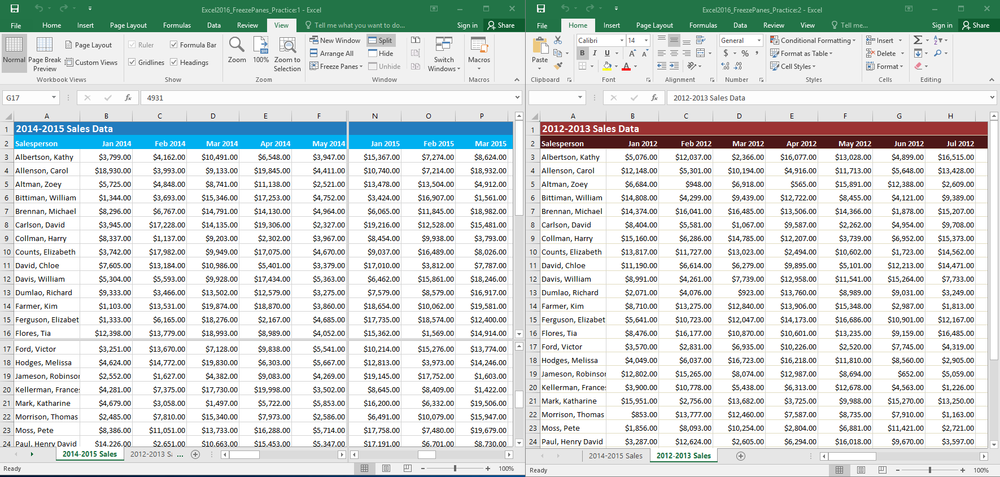

/en/excel/sắp xếp-dữ liệu/nội dung/