# Bài 19: sắp xếp dữ liệu

#### Bài 19: Sắp xếp dữ liệu

/en/excel/freezing-panes-and-view-options/content/

### Giới thiệu

Khi bạn thêm nhiều nội dung vào trang tính, việc sắp xếp thông tin này trở nên đặc biệt quan trọng. Bạn có thể nhanh chóng ** sắp xếp lại ** trang tính bằng cách ** sắp xếp ** dữ liệu của mình. Ví dụ: bạn có thể sắp xếp danh sách thông tin liên hệ theo họ. Nội dung có thể được sắp xếp theo thứ tự bảng chữ cái, số và theo nhiều cách khác.

Hãy xem video bên dưới để tìm hiểu thêm về cách sắp xếp dữ liệu trong Excel.

#### Các kiểu sắp xếp

Khi sắp xếp dữ liệu, điều quan trọng trước tiên là phải quyết định xem bạn muốn áp dụng sắp xếp cho ** toàn bộ trang tính ** hay chỉ một ** phạm vi ô **.

* ** Sắp xếp trang tính ** sắp xếp tất cả dữ liệu trong trang tính của bạn theo một cột. Thông tin liên quan trên mỗi hàng được lưu giữ cùng nhau khi áp dụng sắp xếp. Trong ví dụ bên dưới, cột ** Tên liên hệ **(cột ** A **) 
đã được sắp xếp để hiển thị tên theo thứ tự bảng chữ cái.

* ** Sắp xếp phạm vi ** sắp xếp dữ liệu trong một phạm vi ô, điều này có thể hữu ích khi làm việc với một trang tính có chứa nhiều bảng. Sắp xếp một phạm vi sẽ không ảnh hưởng đến nội dung khác trong bảng tính.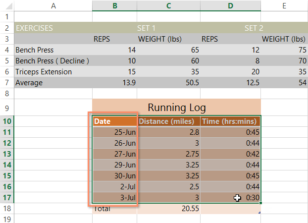

#### Để sắp xếp một trang tính:

Trong ví dụ của chúng tôi, chúng tôi sẽ sắp xếp mẫu đơn đặt hàng áo phông theo thứ tự bảng chữ cái theo ** Họ **(cột ** C **).

1. Chọn một ** ô ** trong cột bạn muốn sắp xếp. Trong ví dụ của chúng tôi, chúng tôi sẽ chọn ô ** C2 **.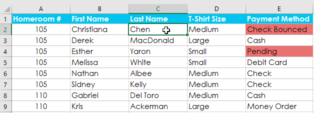

2. Chọn tab ** Dữ liệu ** trên ** Ribbon **, sau đó nhấp vào ** Lệnh A-Z ** để sắp xếp từ A đến Z hoặc ** Lệnh Z-A ** để sắp xếp Z đến A. Trong ví dụ của chúng tôi, chúng tôi sẽ sắp xếp từ A đến Z.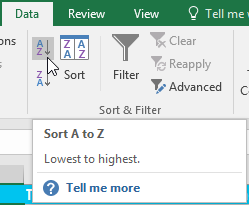

3. Bảng tính sẽ được ** sắp xếp ** theo cột đã chọn. Trong ví dụ của chúng tôi, trang tính hiện được sắp xếp theo ** họ **.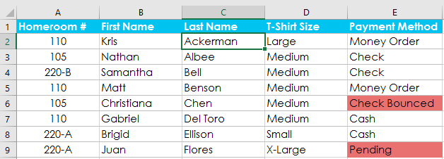

#### Để sắp xếp một phạm vi:

Trong ví dụ của chúng tôi, chúng tôi sẽ chọn một ** bảng riêng ** trong biểu mẫu đặt hàng áo phông để sắp xếp số lượng áo sơ mi được đặt hàng trong mỗi hạng.

1. Chọn ** phạm vi ô ** bạn muốn sắp xếp. Trong ví dụ của chúng tôi, chúng tôi sẽ chọn phạm vi ô ** G2:H6 **.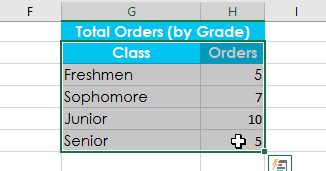

2. Chọn tab ** Dữ liệu ** trên ** Ribbon **, sau đó nhấp vào lệnh ** Sắp xếp **.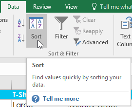

3. Hộp thoại ** Sắp xếp ** sẽ xuất hiện. Chọn ** cột ** bạn muốn sắp xếp. Trong ví dụ của chúng tôi, chúng tôi muốn sắp xếp dữ liệu theo số lượng đơn đặt hàng áo phông, vì vậy chúng tôi sẽ chọn **Đơn hàng **.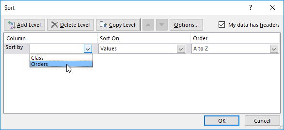

4. Quyết định ** thứ tự sắp xếp **(tăng dần hoặc giảm dần). Trong ví dụ của chúng tôi, chúng tôi sẽ sử dụng ** Lớn nhất đến Nhỏ nhất **.
5. Khi bạn đã hài lòng với lựa chọn của mình, hãy nhấp vào ** OK **.

6. Phạm vi ô sẽ được ** sắp xếp ** theo cột đã chọn. Trong ví dụ của chúng tôi, cột Đơn hàng sẽ được sắp xếp từ ** cao nhất đến thấp nhất **. Lưu ý rằng nội dung khác trong trang tính không bị ảnh hưởng bởi việc sắp xếp.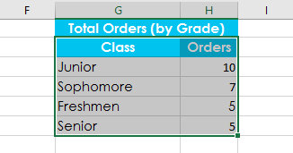

Nếu dữ liệu của bạn không được sắp xếp đúng cách, hãy kiểm tra kỹ các giá trị ô của bạn để đảm bảo chúng được nhập chính xác vào trang tính. Ngay cả một lỗi đánh máy nhỏ cũng có thể gây ra vấn đề khi sắp xếp một bảng tính lớn. Trong ví dụ bên dưới, chúng tôi đã quên thêm dấu gạch nối vào ô A18, khiến cho việc sắp xếp của chúng tôi hơi không chính xác.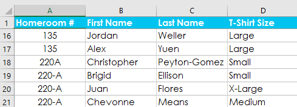

### Sắp xếp tùy chỉnh

Đôi khi bạn có thể thấy rằng các tùy chọn sắp xếp mặc định không thể sắp xếp dữ liệu theo thứ tự bạn cần. May mắn thay, Excel cho phép bạn tạo ** danh sách tùy chỉnh ** để xác định thứ tự sắp xếp của riêng bạn.

#### Để tạo một sắp xếp tùy chỉnh:

Trong ví dụ của chúng tôi, chúng tôi muốn sắp xếp trang tính theo ** T-Shirt Size **(cột ** D **). Việc sắp xếp thông thường sẽ sắp xếp các kích thước theo thứ tự bảng chữ cái, điều này sẽ không chính xác. Thay vào đó, chúng tôi sẽ tạo một danh sách tùy chỉnh để sắp xếp từ nhỏ nhất đến lớn nhất.

1. Chọn một ** ô ** trong cột bạn muốn sắp xếp. Trong ví dụ của chúng tôi, chúng tôi sẽ chọn ô ** D2 **.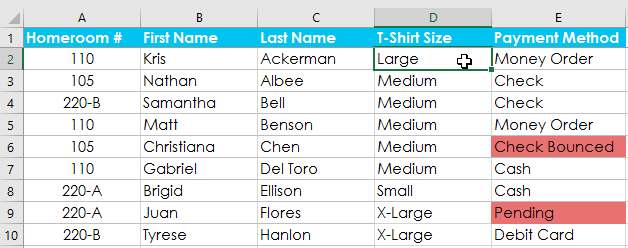

2. Chọn tab ** Dữ liệu **, sau đó nhấp vào lệnh ** Sắp xếp **.

3. Hộp thoại ** Sắp xếp ** sẽ xuất hiện. Chọn ** cột ** bạn muốn sắp xếp, sau đó chọn ** Danh sách tùy chỉnh...** từ trường **Đơn hàng **. Trong ví dụ của chúng tôi, chúng tôi sẽ chọn sắp xếp theo ** Kích thước áo phông **.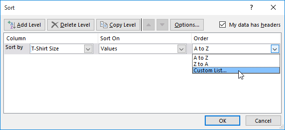

4. Hộp thoại ** Danh sách tùy chỉnh ** sẽ xuất hiện. Chọn ** DANH SÁCH MỚI ** từ hộp ** Danh sách tùy chỉnh:**.
5. Nhập các mục theo thứ tự tùy chỉnh mong muốn vào hộp ** Danh sách mục:**. Trong ví dụ của chúng tôi, chúng tôi muốn sắp xếp dữ liệu theo kích thước áo phông từ ** nhỏ nhất ** đến ** lớn nhất **, vì vậy, chúng tôi sẽ nhập ** Nhỏ **,** Trung bình **,** Lớn ** và ** X-Large **, nhấn ** Enter ** trên bàn phím sau mỗi mục.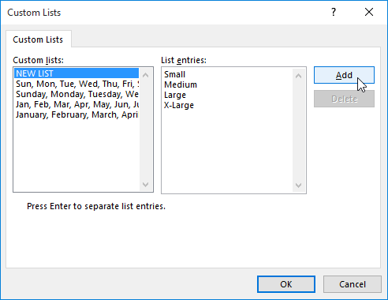

6. Nhấp vào ** Thêm ** để lưu thứ tự sắp xếp mới. Danh sách mới sẽ được thêm vào hộp ** Danh sách tùy chỉnh:**. Đảm bảo danh sách mới được ** chọn **, sau đó nhấp vào ** OK **.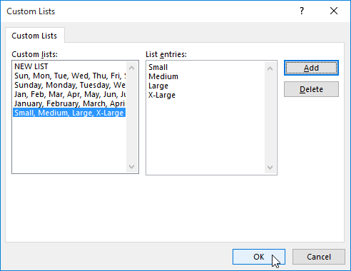

7. Hộp thoại ** Danh sách tùy chỉnh ** sẽ đóng lại. Nhấp vào ** OK ** trong hộp thoại ** Sắp xếp ** để thực hiện sắp xếp tùy chỉnh.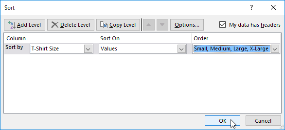

8. Bảng tính sẽ được ** sắp xếp ** theo thứ tự tùy chỉnh. Trong ví dụ của chúng tôi, bảng tính hiện được sắp xếp theo kích cỡ áo phông từ nhỏ nhất đến lớn nhất.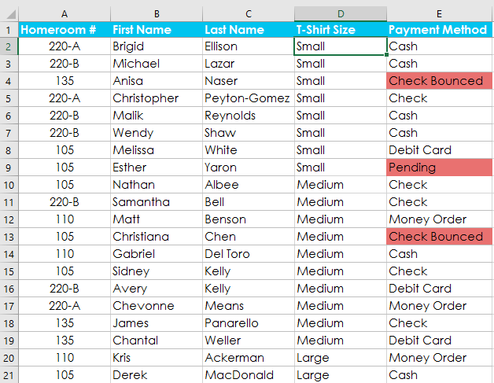

### Sắp xếp cấp độ

Nếu cần kiểm soát nhiều hơn cách sắp xếp dữ liệu, bạn có thể thêm nhiều ** cấp ** vào bất kỳ cách sắp xếp nào. Điều này cho phép bạn sắp xếp dữ liệu của mình theo ** nhiều hơn một ** ** cột **.

#### Để thêm một cấp độ:

Trong ví dụ bên dưới, chúng tôi sẽ sắp xếp trang tính theo ** Cỡ áo phông **(Cột ** D **), sau đó theo ** Phòng chủ nhiệm #**(cột ** A **).

1. Chọn một ** ô ** trong cột bạn muốn sắp xếp. Trong ví dụ của chúng tôi, chúng tôi sẽ chọn ô ** A2 **.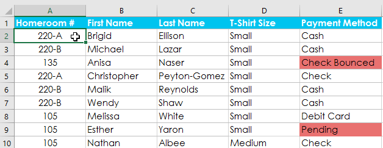

2. Nhấp vào tab ** Dữ liệu **, sau đó chọn lệnh ** Sắp xếp **.

3. Hộp thoại ** Sắp xếp ** sẽ xuất hiện. Chọn cột đầu tiên bạn muốn sắp xếp. Trong ví dụ này, chúng tôi sẽ sắp xếp theo ** Kích thước áo phông **(cột ** D **) 
với danh sách tùy chỉnh mà chúng tôi đã tạo trước đó cho trường Đơn hàng.
4. Nhấp vào ** Thêm cấp độ ** để thêm cột khác để sắp xếp.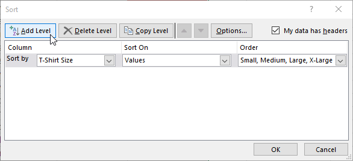

5. Chọn cột tiếp theo bạn muốn sắp xếp, sau đó nhấp vào ** OK **. Trong ví dụ của chúng tôi, chúng tôi sẽ sắp xếp theo ** Phòng chủ nhiệm #**(cột ** A **).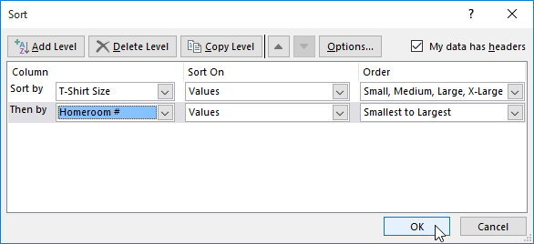

6. Bảng tính sẽ được ** sắp xếp ** theo thứ tự đã chọn. Trong ví dụ của chúng tôi, các đơn hàng được sắp xếp theo kích cỡ áo phông. Trong mỗi nhóm kích cỡ áo phông, học sinh được sắp xếp theo số phòng chủ nhiệm.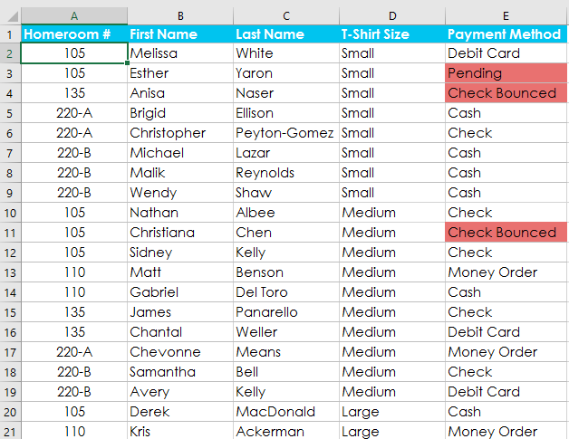

Nếu bạn cần thay đổi thứ tự sắp xếp theo nhiều cấp độ, bạn có thể dễ dàng kiểm soát cột nào được sắp xếp trước. Chỉ cần chọn ** cột ** mong muốn, sau đó nhấp vào mũi tên ** Di chuyển lên ** hoặc ** Di chuyển xuống ** để điều chỉnh mức độ ưu tiên của cột đó.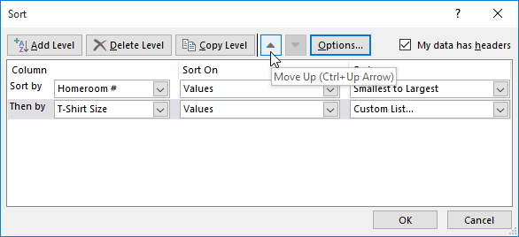

### Thử thách!

1. Mở [sổ làm việc thực hành](practice_files/excel_sorting_practice.xlsx) 
của chúng tôi.
2. Nhấp vào tab ** Thử thách ** ở phía dưới bên trái của sổ làm việc.
3. Đối với bảng chính, hãy tạo ** sắp xếp tùy chỉnh ** sắp xếp theo ** Cấp ** từ ** Nhỏ nhất đến Lớn nhất ** và sau đó theo ** Tên người cắm trại ** từ ** A đến Z **.
4. Tạo một sắp xếp cho phần ** Thông tin bổ sung **. Sắp xếp theo ** Người cố vấn (Cột H)** từ ** A đến Z **.
5. Khi bạn hoàn tất, sổ làm việc của bạn sẽ trông như thế này: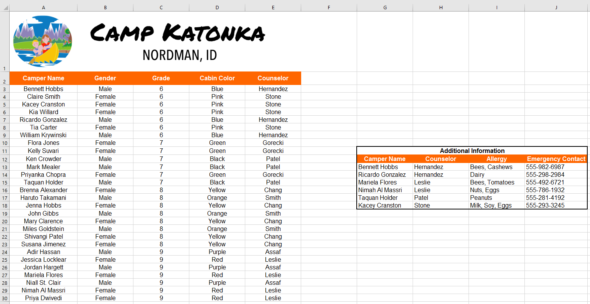

/en/excel/filtering-data/content/