# Bài 20: lọc dữ liệu

#### Bài 20: Lọc dữ liệu

/en/excel/sắp xếp-dữ liệu/nội dung/

### Giới thiệu

Nếu bảng tính của bạn chứa nhiều nội dung thì việc tìm kiếm thông tin một cách nhanh chóng có thể khó khăn.** Bộ lọc ** có thể được sử dụng để ** thu hẹp ** dữ liệu trong bảng tính của bạn, cho phép bạn chỉ xem thông tin bạn cần.

Hãy xem video bên dưới để tìm hiểu thêm về cách lọc dữ liệu trong Excel.

#### Để lọc dữ liệu:

Trong ví dụ của chúng tôi, chúng tôi sẽ áp dụng bộ lọc cho bảng tính nhật ký thiết bị để chỉ hiển thị máy tính xách tay và máy chiếu có sẵn để thanh toán.

1. Để quá trình lọc hoạt động chính xác, bảng tính của bạn phải bao gồm ** hàng tiêu đề **, được sử dụng để xác định tên của từng cột. Trong ví dụ của chúng tôi, trang tính của chúng tôi được sắp xếp thành các cột khác nhau được xác định bởi các ô tiêu đề ở hàng 1:** ID#**,** Loại **,** Thiết bị ** ** Chi tiết **, v.v.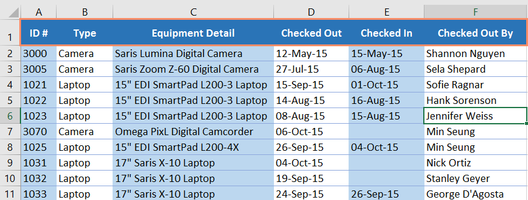

2. Chọn tab ** Dữ liệu **, sau đó nhấp vào lệnh ** Filter **.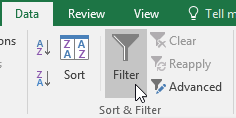

3.** Mũi tên thả xuống ** sẽ xuất hiện trong ô tiêu đề của mỗi cột.
4. Nhấp vào ** mũi tên thả xuống ** cho cột bạn muốn lọc. Trong ví dụ của chúng tôi, chúng tôi sẽ lọc cột ** B ** để chỉ xem một số loại thiết bị nhất định.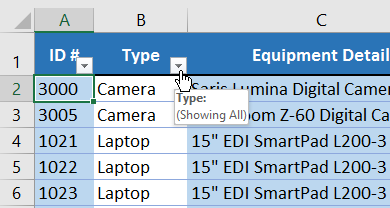

5.** Trình đơn ** Bộ lọc ** ** ** sẽ xuất hiện.
6.** Bỏ chọn ** hộp bên cạnh ** Chọn tất cả ** để nhanh chóng bỏ chọn tất cả dữ liệu.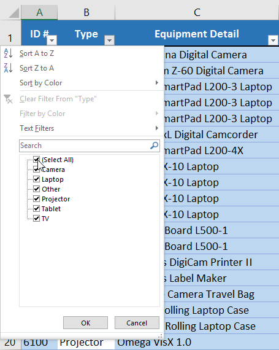

7.**Đánh dấu ** các hộp bên cạnh dữ liệu bạn muốn lọc, sau đó nhấp vào ** OK **. Trong ví dụ này, chúng tôi sẽ chọn ** Máy tính xách tay ** và ** Máy chiếu ** để chỉ xem các loại thiết bị này.

8. Dữ liệu sẽ được ** lọc **, tạm thời ẩn bất kỳ nội dung nào không phù hợp với tiêu chí. Trong ví dụ của chúng tôi, chỉ có máy tính xách tay và máy chiếu mới hiển thị.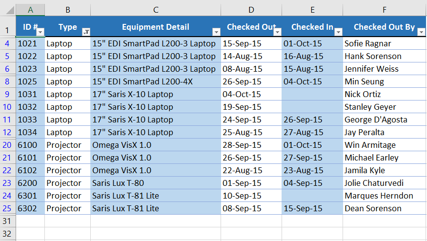

Bạn cũng có thể truy cập các tùy chọn lọc từ lệnh ** Sắp xếp & Lọc ** trên tab ** Trang chủ **.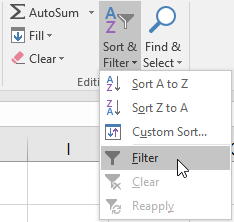

#### Để áp dụng nhiều bộ lọc:

Các bộ lọc là ** tích lũy **, nghĩa là bạn có thể áp dụng ** nhiều ** ** bộ lọc ** để giúp thu hẹp kết quả của mình. Trong ví dụ này, chúng tôi đã lọc bảng tính của mình để hiển thị máy tính xách tay và máy chiếu và chúng tôi muốn thu hẹp phạm vi hơn nữa để chỉ hiển thị máy tính xách tay và máy chiếu đã được kiểm tra trong tháng 8.

1. Nhấp vào ** mũi tên thả xuống ** cho cột bạn muốn lọc. Trong ví dụ này, chúng tôi sẽ thêm bộ lọc vào cột ** D ** để xem thông tin theo ngày.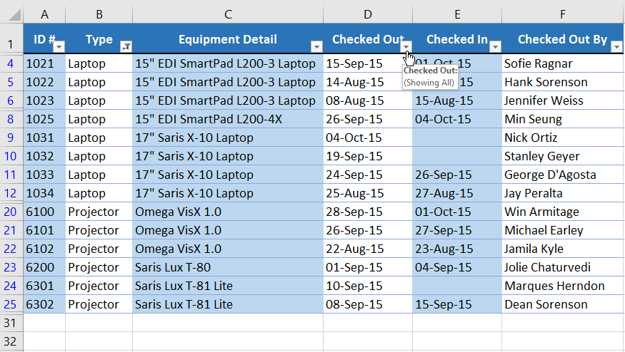

2.** Trình đơn Bộ lọc ** sẽ xuất hiện.
3.** Chọn ** hoặc ** bỏ chọn ** các hộp tùy thuộc vào dữ liệu bạn muốn lọc, sau đó nhấp vào ** OK **. Trong ví dụ của chúng tôi, chúng tôi sẽ bỏ chọn mọi thứ ngoại trừ ** tháng 8 **.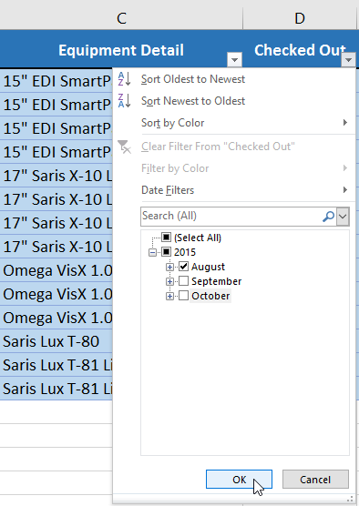

4. Bộ lọc mới sẽ được áp dụng. Trong ví dụ của chúng tôi, trang tính hiện được lọc để chỉ hiển thị máy tính xách tay và máy chiếu đã được kiểm tra trong tháng 8.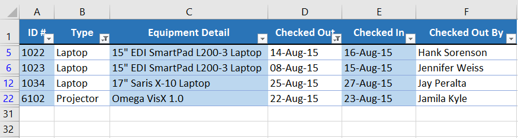

#### Để xóa bộ lọc:

Sau khi áp dụng bộ lọc, bạn có thể muốn xóa—hoặc ** xóa **—bộ lọc đó khỏi trang tính của mình để bạn có thể lọc nội dung theo nhiều cách khác nhau.

1. Nhấp vào ** mũi tên thả xuống ** cho bộ lọc bạn muốn xóa. Trong ví dụ của chúng tôi, chúng tôi sẽ xóa bộ lọc trong cột ** D **.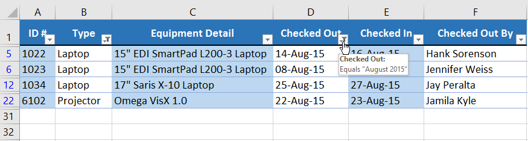

2.** Trình đơn Bộ lọc ** sẽ xuất hiện.
3. Chọn ** Xóa bộ lọc khỏi [TÊN CỘT]** từ menu Bộ lọc. Trong ví dụ của chúng tôi, chúng tôi sẽ chọn ** Xóa bộ lọc từ "Đã kiểm tra **".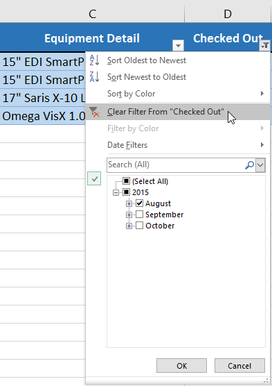

4. Bộ lọc sẽ bị xóa khỏi cột. Dữ liệu bị ẩn trước đó sẽ được hiển thị.

Để xóa tất cả bộ lọc khỏi bảng tính của bạn, hãy nhấp vào lệnh ** Filter ** trên tab ** Data **.

### Lọc nâng cao

Nếu bạn cần một bộ lọc cho nội dung nào đó cụ thể thì tính năng lọc cơ bản có thể không cung cấp cho bạn đủ tùy chọn. May mắn thay, Excel bao gồm một số công cụ ** nâng cao ** ** lọc ** **, bao gồm ** tìm kiếm **,** văn bản **,** ngày ** và ** số ** ** lọc **, có thể thu hẹp kết quả của bạn để giúp tìm thấy chính xác những gì bạn cần.

#### Để lọc bằng tìm kiếm:

Excel cho phép bạn ** tìm kiếm ** dữ liệu có chứa cụm từ, số, ngày tháng chính xác, v.v. Trong ví dụ của chúng tôi, chúng tôi sẽ sử dụng tính năng này để chỉ hiển thị các sản phẩm có thương hiệu ** Saris ** trong nhật ký thiết bị của chúng tôi.

1. Chọn tab ** Dữ liệu **, sau đó nhấp vào lệnh ** Filter **.** Mũi tên thả xuống ** sẽ xuất hiện trong ô tiêu đề của mỗi cột.** Lưu ý **: Nếu bạn đã thêm bộ lọc vào trang tính của mình, bạn có thể bỏ qua bước này.
2. Nhấp vào ** mũi tên thả xuống ** cho cột bạn muốn lọc. Trong ví dụ của chúng tôi, chúng tôi sẽ lọc cột ** C **.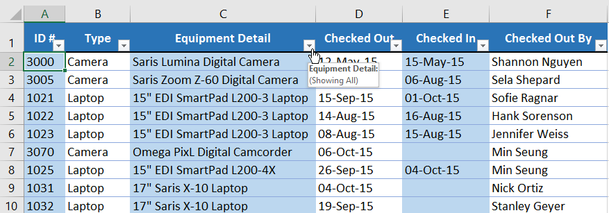

3.** Trình đơn Bộ lọc ** sẽ xuất hiện. Nhập ** cụm từ tìm kiếm ** vào ** hộp tìm kiếm **. Kết quả tìm kiếm sẽ tự động xuất hiện bên dưới trường ** Văn bản ** ** Bộ lọc ** khi bạn nhập. Trong ví dụ của chúng tôi, chúng tôi sẽ nhập ** saris ** để tìm tất cả thiết bị mang nhãn hiệu Saris. Khi bạn hoàn tất, hãy nhấp vào ** OK **.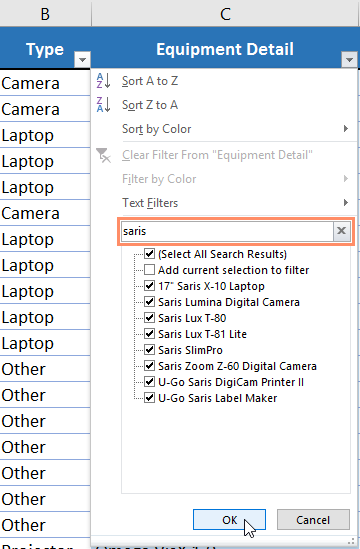

4. Bảng tính sẽ được ** lọc ** theo cụm từ tìm kiếm của bạn. Trong ví dụ của chúng tôi, bảng tính hiện được lọc để chỉ hiển thị thiết bị của thương hiệu Saris.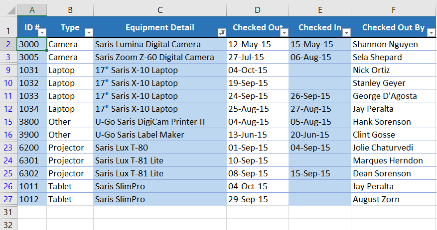

#### Để sử dụng bộ lọc văn bản nâng cao:** Bộ lọc văn bản nâng cao

 ** có thể được sử dụng để hiển thị thông tin cụ thể hơn, chẳng hạn như các ô chứa một số ký tự nhất định hoặc dữ liệu loại trừ một từ hoặc số cụ thể. Trong ví dụ của chúng tôi, chúng tôi muốn loại trừ bất kỳ mục nào có chứa từ ** máy tính xách tay **.

1. Chọn tab ** Dữ liệu **, sau đó nhấp vào lệnh ** Filter **.** Mũi tên thả xuống ** sẽ xuất hiện trong ô tiêu đề của mỗi cột.** Lưu ý **: Nếu bạn đã thêm bộ lọc vào trang tính của mình, bạn có thể bỏ qua bước này.
2. Nhấp vào ** mũi tên thả xuống ** cho cột bạn muốn lọc. Trong ví dụ của chúng tôi, chúng tôi sẽ lọc cột ** C **.

3.** Trình đơn Bộ lọc ** sẽ xuất hiện. Di chuột qua ** Bộ lọc văn bản **, sau đó chọn bộ lọc văn bản mong muốn từ trình đơn thả xuống. Trong ví dụ của chúng tôi, chúng tôi sẽ chọn ** Không chứa...** để xem dữ liệu không chứa văn bản cụ thể.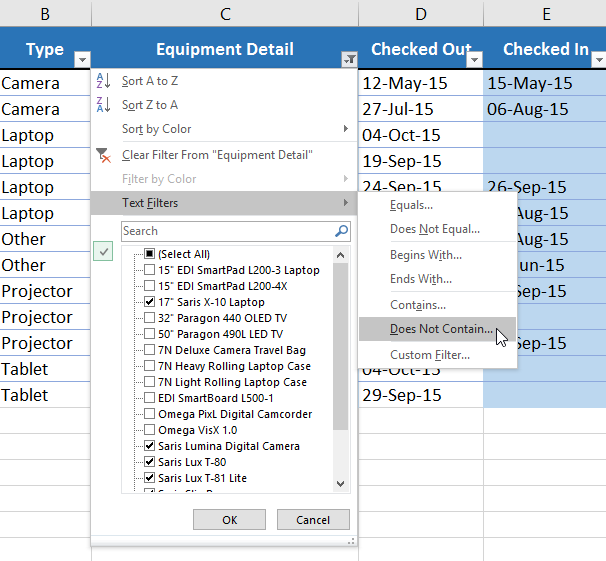

4. Hộp thoại ** Tự động lọc tùy chỉnh ** sẽ xuất hiện. Nhập ** văn bản mong muốn ** vào bên phải bộ lọc, sau đó nhấp vào ** OK **. Trong ví dụ của chúng tôi, chúng tôi sẽ nhập ** laptop ** để loại trừ bất kỳ mục nào có chứa từ này.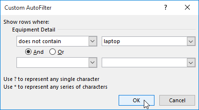

5. Dữ liệu sẽ được lọc theo bộ lọc văn bản đã chọn. Trong ví dụ của chúng tôi, bảng tính của chúng tôi hiện hiển thị các mục không chứa từ ** máy tính xách tay **.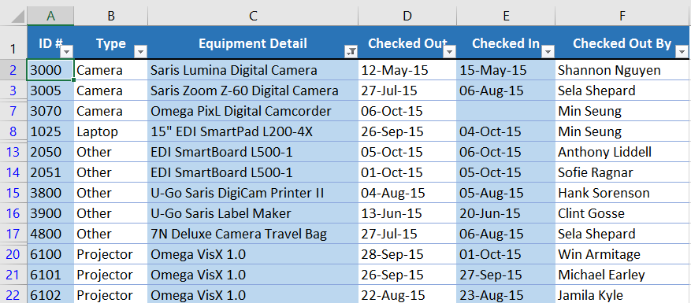

#### Để sử dụng bộ lọc số nâng cao:** Bộ lọc số nâng cao

 ** cho phép bạn thao tác dữ liệu được đánh số theo nhiều cách khác nhau. Trong ví dụ này, chúng tôi sẽ chỉ hiển thị một số loại thiết bị nhất định dựa trên phạm vi số ID.

1. Chọn tab ** Dữ liệu ** trên Ribbon, sau đó nhấp vào lệnh ** Filter **.** Mũi tên thả xuống ** sẽ xuất hiện trong ô tiêu đề của mỗi cột.** Lưu ý **: Nếu bạn đã thêm bộ lọc vào trang tính của mình, bạn có thể bỏ qua bước này.
2. Nhấp vào ** mũi tên thả xuống ** cho cột bạn muốn lọc. Trong ví dụ của chúng tôi, chúng tôi sẽ lọc cột ** A ** để chỉ xem một phạm vi số ID nhất định.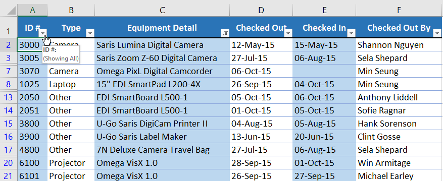

3.** Trình đơn Bộ lọc ** sẽ xuất hiện. Di chuột qua ** Bộ lọc số **, sau đó chọn bộ lọc số mong muốn từ menu thả xuống. Trong ví dụ của chúng tôi, chúng tôi sẽ chọn ** Giữa ** để xem số ID giữa một phạm vi số cụ thể.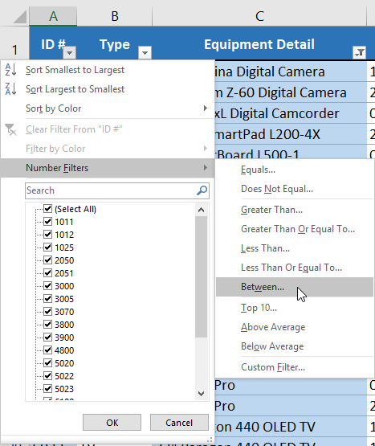

4. Hộp thoại ** Tự động lọc tùy chỉnh ** sẽ xuất hiện. Nhập ** số ** mong muốn vào bên phải mỗi bộ lọc, sau đó nhấp vào ** OK **. Trong ví dụ của chúng tôi, chúng tôi muốn lọc các số ID lớn hơn hoặc bằng ** 3000 ** nhưng nhỏ hơn hoặc bằng ** 6000 **, số này sẽ hiển thị số ID trong phạm vi 3000-6000.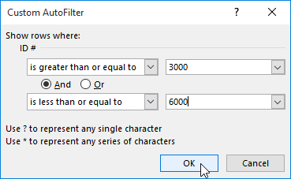

5. Dữ liệu sẽ được lọc theo bộ lọc số đã chọn. Trong ví dụ của chúng tôi, chỉ các mục có số ID từ ** 3000 ** đến ** 6000 ** mới hiển thị.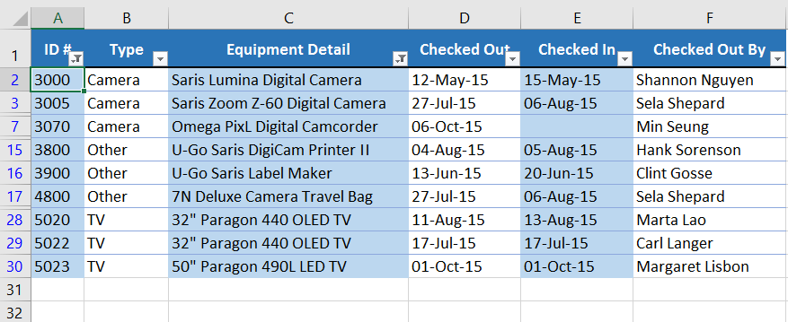

#### Để sử dụng bộ lọc ngày nâng cao:** Bộ lọc ngày nâng cao

 ** có thể được sử dụng để xem thông tin trong một khoảng thời gian nhất định, chẳng hạn như năm ngoái, quý tiếp theo hoặc giữa hai ngày. Trong ví dụ này, chúng tôi sẽ sử dụng bộ lọc ngày nâng cao để chỉ xem thiết bị đã được kiểm tra trong khoảng thời gian từ ngày 15 tháng 7 đến ngày 15 tháng 8.

1. Chọn tab ** Dữ liệu **, sau đó nhấp vào lệnh ** Filter **.** Mũi tên thả xuống ** sẽ xuất hiện trong ô tiêu đề của mỗi cột.** Lưu ý **: Nếu bạn đã thêm bộ lọc vào trang tính của mình, bạn có thể bỏ qua bước này.
2. Nhấp vào ** mũi tên thả xuống ** cho cột bạn muốn lọc. Trong ví dụ của chúng tôi, chúng tôi sẽ lọc cột ** D ** để chỉ xem một phạm vi ngày nhất định.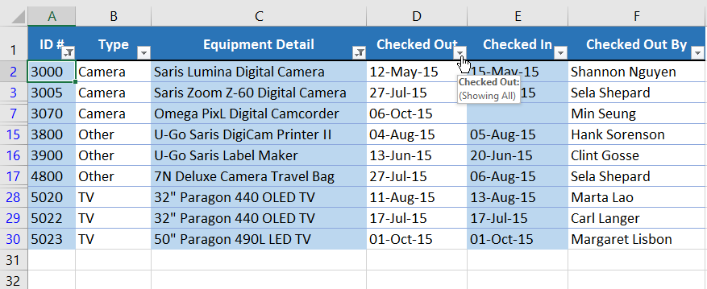

3.** Trình đơn Bộ lọc ** sẽ xuất hiện. Di chuột qua ** Bộ lọc ngày **, sau đó chọn bộ lọc ngày mong muốn từ menu thả xuống. Trong ví dụ của chúng tôi, chúng tôi sẽ chọn ** Giữa...** để xem thiết bị đã được kiểm tra trong khoảng thời gian từ ngày 15 tháng 7 đến ngày 15 tháng 8.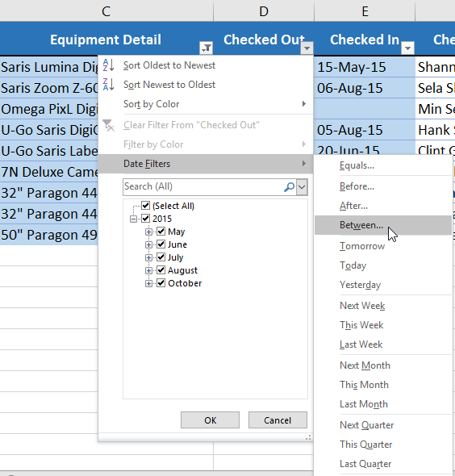

4. Hộp thoại ** Tự động lọc tùy chỉnh ** sẽ xuất hiện. Nhập ** ngày ** mong muốn vào bên phải mỗi bộ lọc, sau đó nhấp vào ** OK **. Trong ví dụ của chúng tôi, chúng tôi muốn lọc các ngày sau hoặc bằng ** ngày 15 tháng 7 năm 2015 ** và trước hoặc bằng ** ngày 15 tháng 8 năm 2015 **, sẽ hiển thị một phạm vi giữa các ngày này.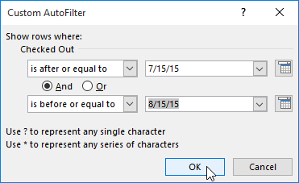

5. Bảng tính sẽ được lọc theo bộ lọc ngày đã chọn. Trong ví dụ của chúng tôi, giờ đây chúng tôi có thể xem những mặt hàng nào đã được thanh toán ** từ ngày 15 tháng 7 đến ngày 15 tháng 8 **.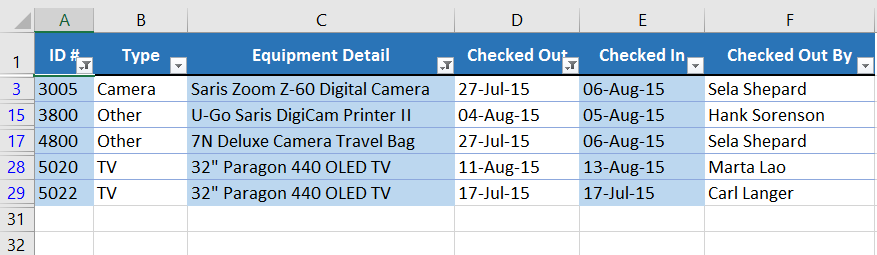

### Thử thách!

1. Mở [sổ làm việc thực hành](practice_files/excel_filtering_practice.xlsx) 
của chúng tôi.
2. Nhấp vào tab ** Thử thách ** ở phía dưới bên trái của sổ làm việc.
3.**Áp dụng bộ lọc ** để chỉ hiển thị **Điện tử ** và ** Dụng cụ **.
4. Sử dụng tính năng ** Tìm kiếm ** để lọc mô tả mục có chứa từ ** Sansei **. Sau khi thực hiện việc này, bạn sẽ thấy ** sáu ** mục nhập.
5.** Xóa ** bộ lọc Mô tả Mục.
6. Sử dụng ** bộ lọc số **, hiển thị số tiền vay ** lớn hơn hoặc bằng **$100.
7. Lọc để chỉ hiển thị các mục có thời hạn vào năm 2016.
8. Khi bạn hoàn tất, sổ làm việc của bạn sẽ trông như thế này: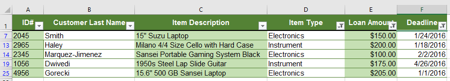

/en/excel/groups-and-subtotals/content/