# Bài 21: nhóm và tổng phụ

#### Bài 21: Nhóm và tổng phụ

/en/excel/filtering-data/content/

### Giới thiệu

Các bảng tính có nhiều nội dung đôi khi có thể khiến bạn cảm thấy choáng ngợp và thậm chí có thể trở nên khó đọc. May mắn thay, Excel có thể sắp xếp dữ liệu thành ** nhóm **, cho phép bạn dễ dàng ** hiển thị ** và ** ẩn ** các phần khác nhau trong trang tính của mình. Bạn cũng có thể tóm tắt các nhóm khác nhau bằng cách sử dụng lệnh ** Tổng phụ ** và tạo ** phác thảo ** cho trang tính của mình.

Xem video bên dưới để tìm hiểu thêm về nhóm và tổng phụ trong Excel.

#### Để nhóm các hàng hoặc cột:

1. Chọn ** hàng ** hoặc ** cột ** bạn muốn nhóm. Trong ví dụ này, chúng tôi sẽ chọn các cột ** B **,** C ** và ** D **.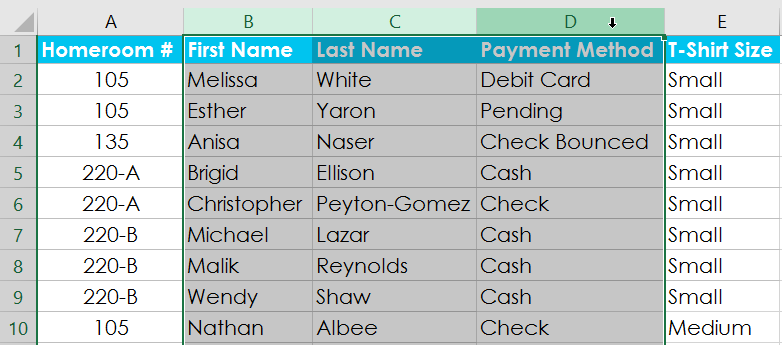

2. Chọn tab ** Dữ liệu ** trên ** Ribbon **, sau đó nhấp vào lệnh ** Group **.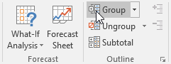

3. Các hàng hoặc cột đã chọn sẽ được ** nhóm lại **. Trong ví dụ của chúng tôi, các cột ** B **,** C ** và ** D ** được nhóm lại.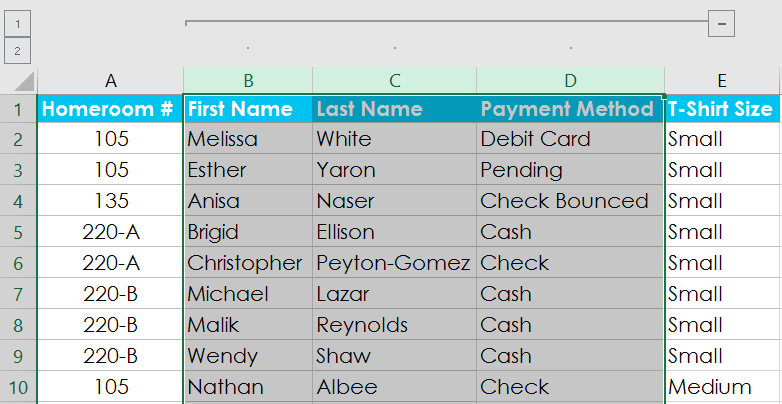

Để ** ungroup ** dữ liệu, hãy chọn các hàng hoặc cột được nhóm, sau đó nhấp vào lệnh ** Ungroup **.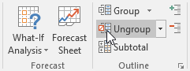

#### Để ẩn và hiển thị các nhóm:

1. Để ẩn một nhóm, hãy nhấp vào dấu trừ, còn được gọi là nút **Ẩn chi tiết **.

2. Nhóm sẽ ** ẩn **. Để hiển thị một nhóm ẩn, hãy nhấp vào dấu cộng, còn được gọi là nút ** Hiển thị chi tiết **.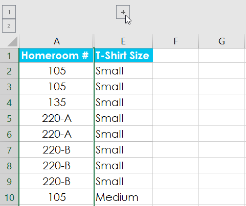

### Tạo tổng phụ

Lệnh ** Tổng phụ ** cho phép bạn tự động ** tạo nhóm ** và sử dụng các hàm phổ biến như SUM, COUNT và AVERAGE để giúp ** tóm tắt ** dữ liệu của bạn. Ví dụ: lệnh ** Tổng phụ ** có thể giúp tính toán chi phí vật tư văn phòng theo loại từ một đơn hàng tồn kho lớn. Nó sẽ tạo ra một hệ thống phân cấp các nhóm, được gọi là ** phác thảo **, để giúp sắp xếp trang tính của bạn.

Dữ liệu của bạn phải được ** sắp xếp ** chính xác trước khi sử dụng lệnh Tổng phụ, vì vậy, bạn có thể muốn xem lại bài học của chúng tôi về [Sắp xếp dữ liệu](../../sorting-data/1/index.html) 
để tìm hiểu thêm.

#### Để tạo tổng phụ:

Trong ví dụ của chúng tôi, chúng tôi sẽ sử dụng lệnh Tổng phụ với biểu mẫu đặt hàng áo phông để xác định số lượng áo phông được đặt hàng ở mỗi kích cỡ (Nhỏ, Trung bình, Lớn và X-Lớn). Điều này sẽ tạo một ** phác thảo ** cho bảng tính của chúng ta với một ** nhóm ** cho mỗi kích cỡ áo phông và sau đó ** đếm ** tổng số áo sơ mi trong mỗi nhóm.

1. Đầu tiên,** sắp xếp ** bảng tính của bạn theo dữ liệu bạn muốn tính tổng phụ. Trong ví dụ này, chúng tôi sẽ tạo tổng phụ cho từng kích cỡ áo phông, vì vậy bảng tính của chúng tôi đã được sắp xếp theo kích cỡ áo phông từ nhỏ nhất đến lớn nhất.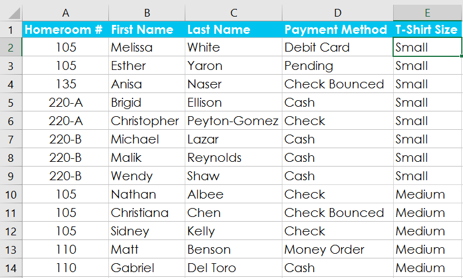

2. Chọn tab ** Dữ liệu **, sau đó nhấp vào lệnh ** Tổng phụ **.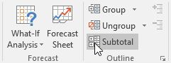

3. Hộp thoại ** Tổng phụ ** sẽ xuất hiện. Nhấp vào mũi tên thả xuống cho trường ** Tại mỗi thay đổi trong:** để chọn ** cột ** bạn muốn tính tổng phụ. Trong ví dụ của chúng tôi, chúng tôi sẽ chọn ** Cỡ áo phông **.
4. Nhấp vào mũi tên thả xuống cho trường ** Sử dụng hàm:** để chọn ** hàm ** bạn muốn sử dụng. Trong ví dụ của chúng tôi, chúng tôi sẽ chọn ** COUNT ** để đếm số lượng áo sơ mi được đặt theo từng kích cỡ.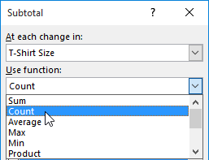

5. Trong trường ** Thêm tổng phụ vào:**, hãy chọn ** cột ** nơi bạn muốn ** tổng phụ được tính ** xuất hiện. Trong ví dụ của chúng tôi, chúng tôi sẽ chọn ** Cỡ áo phông **. Khi bạn hài lòng với lựa chọn của mình, hãy nhấp vào ** OK **.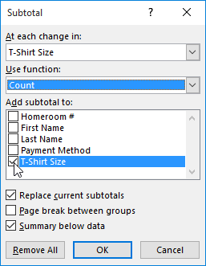

6. Trang tính sẽ ** được trình bày ** thành ** nhóm ** và ** tổng phụ ** sẽ được liệt kê bên dưới mỗi nhóm. Trong ví dụ của chúng tôi, dữ liệu hiện được nhóm theo kích cỡ áo phông và số lượng áo sơ mi được đặt hàng theo kích thước đó sẽ xuất hiện bên dưới mỗi nhóm.

#### Để xem nhóm theo cấp độ:

Khi bạn tạo tổng phụ, bảng tính của bạn sẽ được chia thành các ** mức ** khác nhau. Bạn có thể chuyển đổi giữa các cấp độ này để kiểm soát nhanh lượng thông tin được hiển thị trong trang tính bằng cách nhấp vào nút ** Cấp ** ở bên trái trang tính. Trong ví dụ của chúng tôi, chúng tôi sẽ chuyển đổi giữa cả ba cấp độ trong dàn bài của mình. Mặc dù ví dụ này chỉ chứa ba cấp độ nhưng Excel có thể chứa tới tám cấp độ.

1. Nhấp vào ** mức thấp nhất ** để hiển thị ít chi tiết nhất. Trong ví dụ của chúng tôi, chúng tôi sẽ chọn ** cấp 1 **, chỉ chứa ** Grand ** ** Count ** hoặc tổng số áo phông được đặt hàng.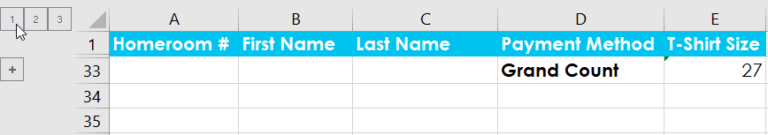

2. Nhấp vào ** cấp độ tiếp theo ** để mở rộng chi tiết. Trong ví dụ của chúng tôi, chúng tôi sẽ chọn ** cấp 2 **, chứa mỗi hàng tổng phụ nhưng ẩn tất cả dữ liệu khác khỏi trang tính.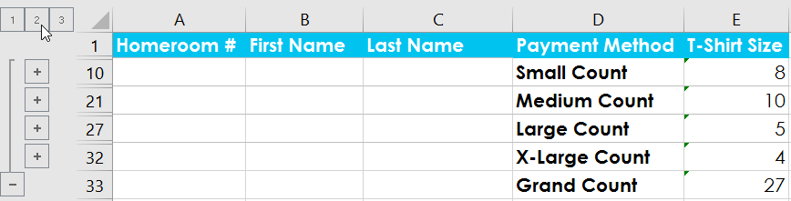

3. Nhấp vào ** mức cao nhất ** để xem và mở rộng tất cả dữ liệu trang tính của bạn. Trong ví dụ của chúng tôi, chúng tôi sẽ chọn ** cấp 3 **.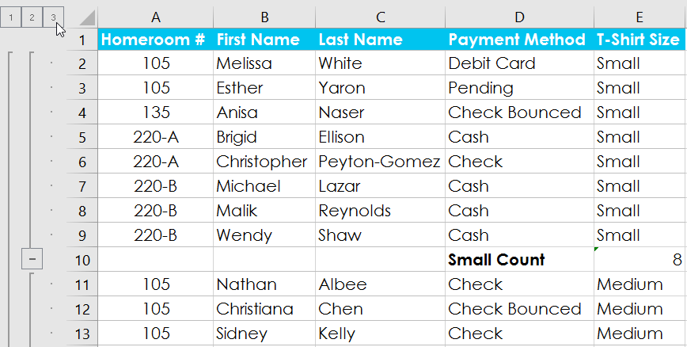

Bạn cũng có thể sử dụng các nút ** Hiển thị chi tiết ** và **Ẩn ** ** Chi tiết ** để hiển thị và ẩn các nhóm trong đường viền.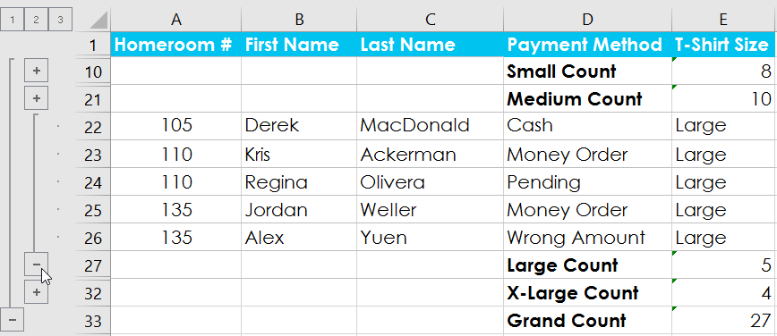

#### Để loại bỏ tổng phụ:

Đôi khi bạn có thể không muốn giữ tổng phụ trong trang tính của mình, đặc biệt nếu bạn muốn sắp xếp lại dữ liệu theo những cách khác nhau. Nếu bạn không muốn sử dụng tính tổng phụ nữa, bạn sẽ cần ** xóa ** ** nó ** khỏi bảng tính của mình.

1. Chọn tab ** Dữ liệu **, sau đó nhấp vào lệnh ** Tổng phụ **.

2. Hộp thoại ** Tổng phụ ** sẽ xuất hiện. Nhấp vào ** Xóa ** ** Tất cả **.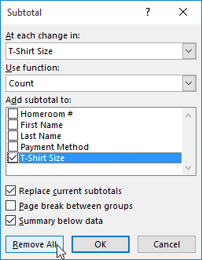

3. Tất cả dữ liệu trang tính sẽ được ** hủy nhóm ** và các tổng phụ sẽ bị ** xóa **.

Để xóa tất cả các nhóm mà không xóa tổng phụ, hãy nhấp vào mũi tên thả xuống của lệnh ** Ungroup **, sau đó chọn ** Xóa dàn bài **.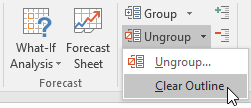

### Thử thách!

1. Mở [sổ làm việc thực hành](practice_files/excel_subtotals_practice.xlsx) 
của chúng tôi.
2. Nhấp vào tab ** Thử thách ** ở phía dưới bên trái của sổ làm việc.
3.** Sắp xếp ** sổ làm việc theo ** Cấp ** từ nhỏ nhất đến lớn nhất.
4. Sử dụng lệnh ** Tổng phụ ** để nhóm tại mỗi thay đổi trong ** Lớp **. Sử dụng hàm ** SUM ** và thêm tổng phụ vào ** Số tiền đã huy động **.
5. Chọn ** cấp 2 ** để bạn chỉ nhìn thấy tổng phụ và tổng cuối.
6. Khi bạn hoàn tất, sổ làm việc của bạn sẽ trông như thế này: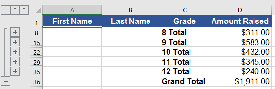

/en/excel/tables/content/