# Bài học 22: bảng

#### Bài học 22: Bàn

/en/excel/groups-and-subtotals/content/

### Giới thiệu

Sau khi nhập thông tin vào bảng tính, bạn có thể muốn định dạng dữ liệu của mình dưới dạng ** bảng **. Cũng giống như định dạng thông thường, bảng có thể cải thiện ** giao diện ** sổ làm việc của bạn và chúng cũng sẽ giúp ** sắp xếp ** nội dung của bạn và giúp dữ liệu của bạn dễ sử dụng hơn. Excel bao gồm một số ** công cụ ** và ** kiểu bảng được xác định trước **, cho phép bạn tạo bảng nhanh chóng và dễ dàng.

Xem video bên dưới để tìm hiểu thêm về cách làm việc với bảng.

#### Để định dạng dữ liệu dưới dạng bảng:

1. Chọn ** ô ** bạn muốn định dạng dưới dạng bảng. Trong ví dụ của chúng tôi, chúng tôi sẽ chọn phạm vi ô ** A2:D9 **.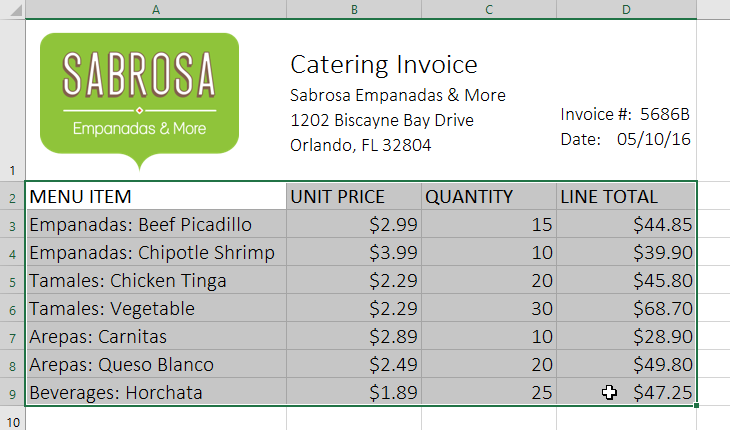

2. Từ tab ** Trang chủ **, nhấp vào lệnh **Định dạng dưới dạng Bảng ** trong nhóm ** Styles **.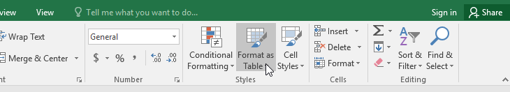

3. Chọn ** kiểu bảng ** từ trình đơn thả xuống.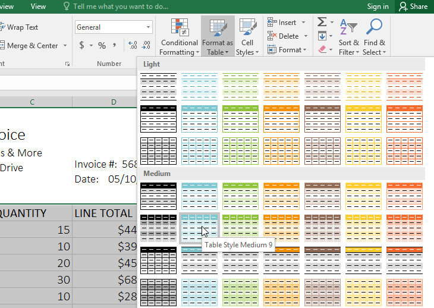

4. Một hộp thoại sẽ xuất hiện, xác nhận ** phạm vi ô ** đã chọn cho bảng.
5. Nếu bảng của bạn có ** tiêu đề **, hãy chọn hộp bên cạnh ** Bảng của tôi có tiêu đề **, sau đó nhấp vào ** OK **.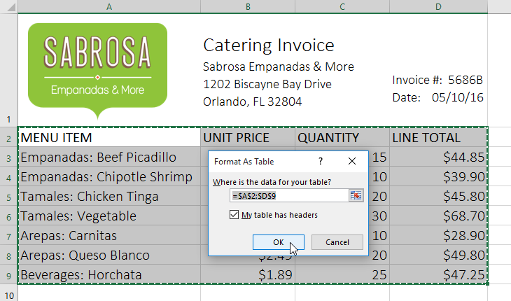

6. Phạm vi ô sẽ được định dạng theo ** kiểu bảng ** đã chọn.

Các bảng bao gồm ** lọc ** theo mặc định. Bạn có thể lọc dữ liệu của mình bất kỳ lúc nào bằng cách sử dụng ** mũi tên thả xuống ** trong các ô tiêu đề. Để tìm hiểu thêm, hãy xem lại bài học của chúng tôi về [Lọc dữ liệu](../../filtering-data/1/index.html).

### Sửa đổi bảng

Thật dễ dàng để sửa đổi giao diện của bất kỳ bảng nào sau khi thêm nó vào trang tính. Excel bao gồm một số tùy chọn để tùy chỉnh bảng, bao gồm ** thêm hàng hoặc cột ** và thay đổi ** kiểu bảng **.

#### Để thêm hàng hoặc cột vào bảng:

Nếu bạn cần đưa nhiều nội dung hơn vào bảng của mình, bạn có thể sửa đổi ** kích thước bảng ** bằng cách bao gồm các hàng và cột bổ sung. Có hai cách đơn giản để thay đổi kích thước bảng:

* Nhập ** mới ** ** nội dung ** vào bất kỳ hàng hoặc cột liền kề nào. Hàng hoặc cột sẽ được tự động đưa vào bảng.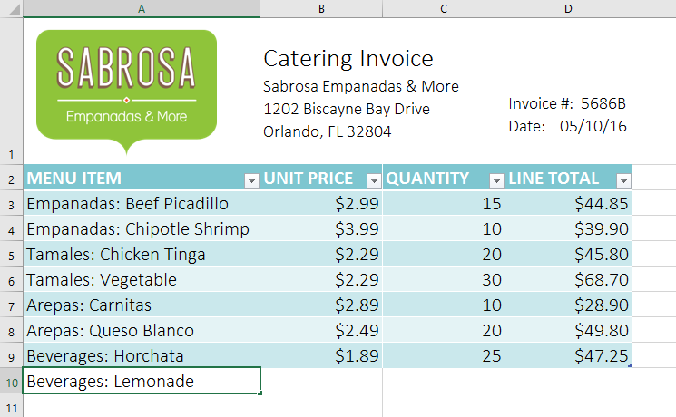

* Nhấp và kéo ** góc dưới cùng bên phải ** của bảng để tạo thêm hàng hoặc cột.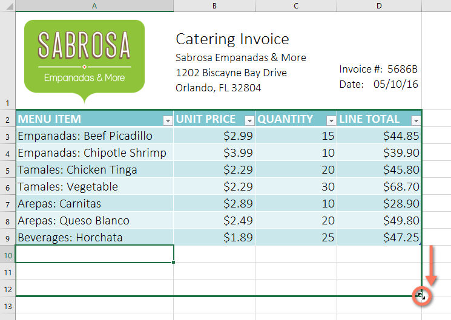

#### Để thay đổi kiểu bảng:

1. Chọn ** bất kỳ ô nào ** trong bảng của bạn, sau đó nhấp vào tab ** Thiết kế **.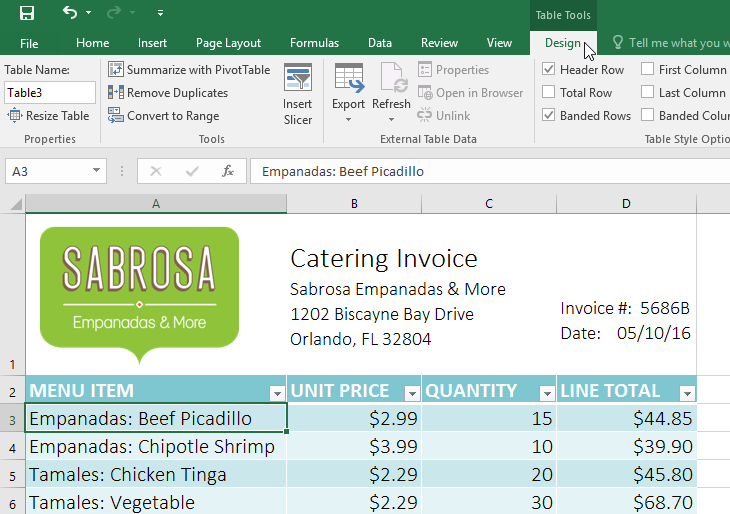

2. Xác định vị trí nhóm ** kiểu bảng **, sau đó nhấp vào mũi tên thả xuống ** Thêm ** để xem tất cả các kiểu bảng có sẵn.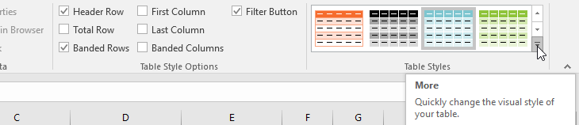

3. Chọn ** kiểu bảng ** mong muốn.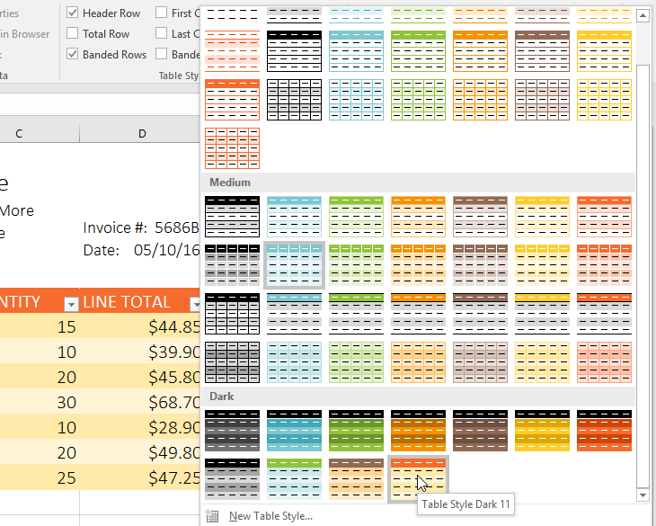

4.** kiểu bảng ** sẽ được áp dụng.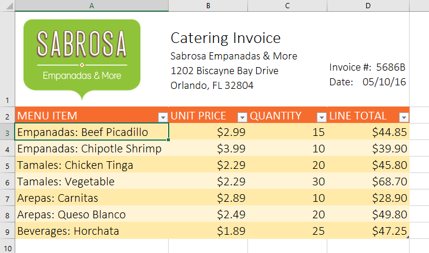

#### Để sửa đổi các tùy chọn kiểu bảng:

Bạn có thể bật nhiều tùy chọn khác nhau ** bật ** hoặc ** tắt ** để thay đổi giao diện của bất kỳ bảng nào. Có một số tùy chọn:** Hàng tiêu đề **,** Hàng tổng **,** Hàng có ribbon **,** Cột đầu tiên **,** Cột cuối cùng **,** Cột có ribbon ** và ** Nút bộ lọc **.

1. Chọn ** bất kỳ ô nào ** trong bảng của bạn, sau đó nhấp vào tab ** Thiết kế **.
2.** C **

* ** chết tiệt ** hoặc ** bỏ chọn ** các tùy chọn mong muốn trong nhóm ** Tùy chọn kiểu bảng **. Trong ví dụ của chúng tôi, chúng tôi sẽ kiểm tra ** Tổng hàng ** để tự động bao gồm ** tổng ** cho bảng của chúng tôi.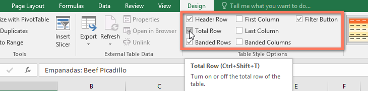

3. Kiểu bảng sẽ được sửa đổi. Trong ví dụ của chúng tôi, một ** mới ** ** hàng ** đã được thêm vào bảng với ** công thức ** tự động tính tổng giá trị của các ô trong cột D.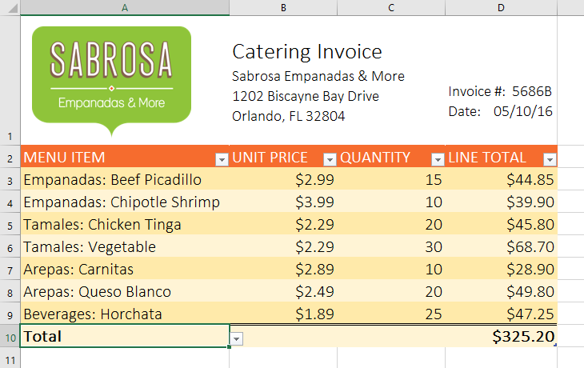

Tùy thuộc vào loại ** nội dung ** bạn có—và ** kiểu bảng ** bạn đã chọn—các tùy chọn này có thể ảnh hưởng đến giao diện bảng của bạn theo nhiều cách khác nhau. Bạn có thể cần thử nghiệm một vài lựa chọn để tìm ra phong cách chính xác mà bạn muốn.

#### Để xóa một bảng:

Bạn có thể xóa bảng khỏi sổ làm việc mà không làm mất bất kỳ dữ liệu nào. Tuy nhiên, điều này có thể gây ra sự cố với một số loại ** định dạng ** nhất định, bao gồm màu sắc, phông chữ và các hàng có dải phân cách. Trước khi sử dụng tùy chọn này, hãy chuẩn bị định dạng lại các ô của bạn nếu cần.

1. Chọn ** bất kỳ ô nào ** trong bảng của bạn, sau đó nhấp vào tab ** Thiết kế **.
2. Nhấp vào lệnh ** Convert to Range ** trong nhóm ** Tools **.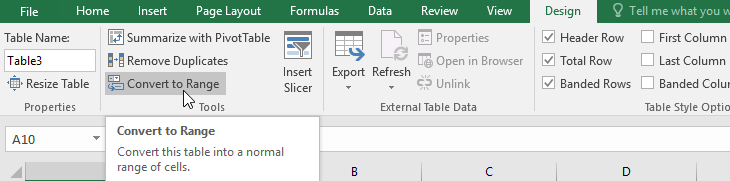

3. Một hộp thoại sẽ xuất hiện. Nhấp vào ** Có **.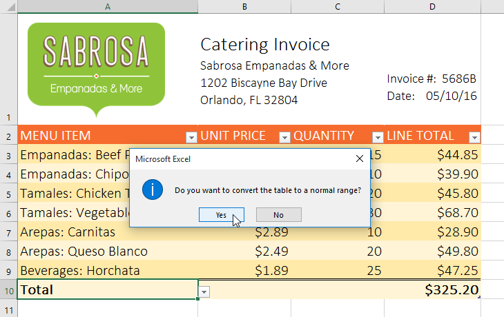

4. Phạm vi sẽ không còn là bảng nữa nhưng các ô sẽ giữ lại dữ liệu và định dạng của chúng.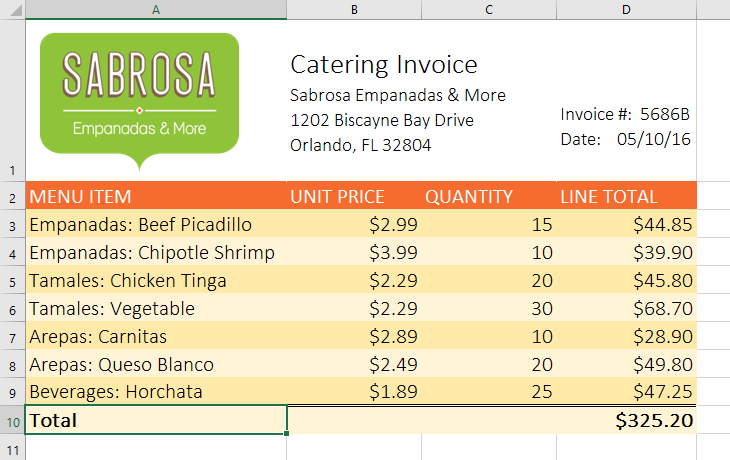

Để khởi động lại định dạng của bạn từ đầu, hãy nhấp vào lệnh ** Xóa ** trên tab ** Trang chủ **. Tiếp theo, chọn ** Xóa định dạng ** từ menu.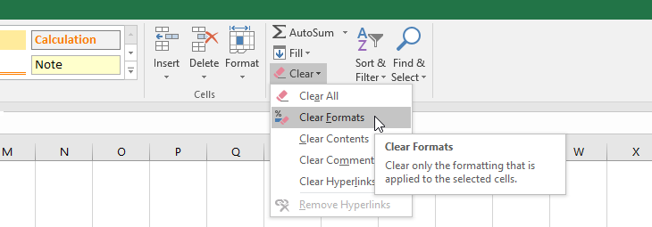

### Thử thách!

1. Mở [sổ làm việc thực hành](practice_files/excel_tables_practice.xlsx) 
của chúng tôi.
2. Nhấp vào tab ** Thử thách ** ở phía dưới bên trái của sổ làm việc.
3. Chọn các ô ** A2:D9 ** và ** định dạng dưới dạng bảng **. Chọn một trong các ** kiểu nhẹ nhàng **.
4.** Chèn một hàng ** giữa hàng 4 và 5. Trong hàng bạn vừa tạo, nhập ** Empanadas: Banana and Nutella **, với đơn giá **$3,25 ** và số lượng ** 12 **.
5. Thay đổi ** kiểu bảng ** thành ** kiểu bảng Medium 10 **.
6. Trong ** Tùy chọn kiểu bảng **, bỏ chọn ** hàng có ribbon ** và chọn ** cột có ribbon **.
7. Khi bạn hoàn tất, sổ làm việc của bạn sẽ trông như thế này: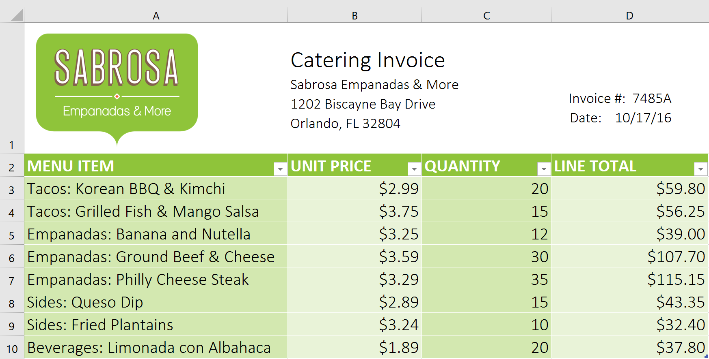

/en/excel/biểu đồ/nội dung/