# Bài 23: biểu đồ

#### Bài học 23: Biểu đồ

/en/excel/tables/content/

### Giới thiệu

Có thể khó diễn giải các sổ làm việc Excel chứa nhiều dữ liệu.** Biểu đồ ** cho phép bạn minh họa dữ liệu sổ làm việc của mình ** bằng đồ họa **, giúp bạn dễ dàng hình dung ** so sánh ** và ** xu hướng **.

Xem video dưới đây để tìm hiểu thêm về biểu đồ.

#### Hiểu biểu đồ

Excel có một số ** loại biểu đồ **, cho phép bạn chọn loại biểu đồ phù hợp nhất với dữ liệu của mình. Để sử dụng biểu đồ một cách hiệu quả, bạn cần hiểu cách sử dụng các biểu đồ khác nhau.

Bấm vào mũi tên trong trình chiếu bên dưới để tìm hiểu thêm về các loại biểu đồ trong Excel.

* 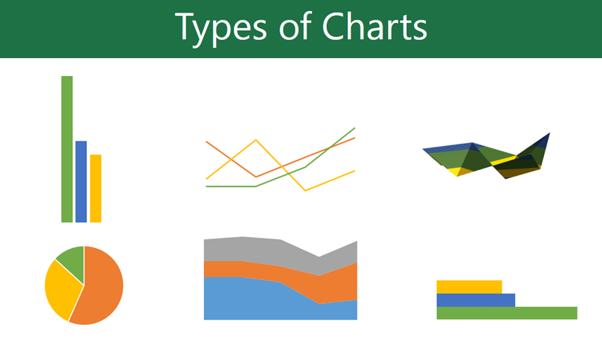

 
Excel có rất nhiều loại biểu đồ, mỗi loại đều có ưu điểm riêng. Bấm vào mũi tên để xem một số loại biểu đồ khác nhau có sẵn trong Excel.

* 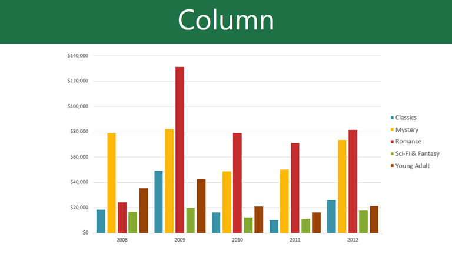

 
Biểu đồ cột sử dụng các thanh dọc để thể hiện dữ liệu. Chúng có thể làm việc với nhiều loại dữ liệu khác nhau nhưng chúng được sử dụng thường xuyên nhất để so sánh thông tin.

* 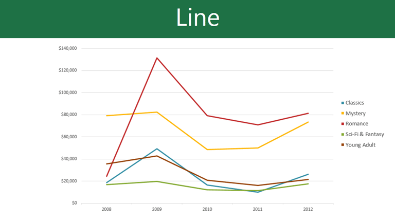

 
Biểu đồ đường là lý tưởng để hiển thị xu hướng. Các điểm dữ liệu được kết nối bằng các đường, giúp dễ dàng xem liệu các giá trị đang tăng hay giảm theo thời gian.

* 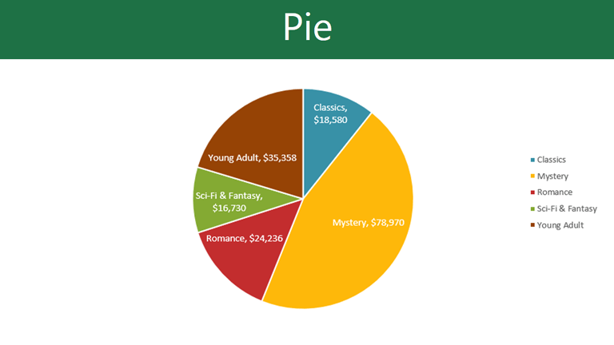

 
Biểu đồ tròn giúp dễ dàng so sánh tỷ lệ. Mỗi giá trị được hiển thị dưới dạng một phần của chiếc bánh, vì vậy thật dễ dàng để biết giá trị nào chiếm phần trăm của tổng thể.

* 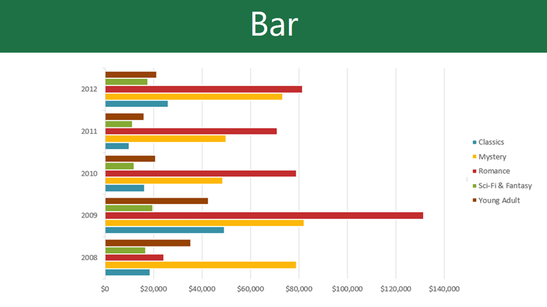

 
Biểu đồ thanh hoạt động giống như biểu đồ cột nhưng chúng sử dụng thanh ngang thay vì thanh dọc.

* 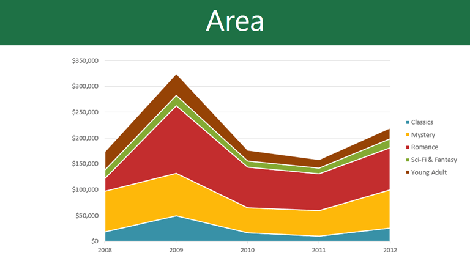

 
Biểu đồ vùng tương tự như biểu đồ đường, ngoại trừ các vùng bên dưới đường được điền vào.

* 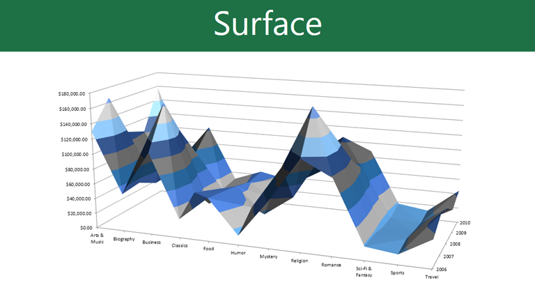

 
Biểu đồ bề mặt cho phép bạn hiển thị dữ liệu trên toàn cảnh 3D. Chúng hoạt động tốt nhất với các tập dữ liệu lớn, cho phép bạn xem nhiều thông tin cùng một lúc.

* 

Ngoài các loại biểu đồ, bạn sẽ cần hiểu cách ** đọc biểu đồ **. Biểu đồ chứa một số thành phần hoặc phần có thể giúp bạn diễn giải dữ liệu.

Nhấp vào các nút trong phần tương tác bên dưới để tìm hiểu về các phần khác nhau của biểu đồ.

chỉnh sửa các điểm nóng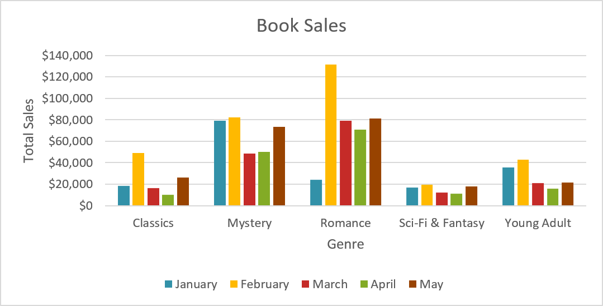

## Chuỗi dữ liệu

 ** Chuỗi dữ liệu ** bao gồm các điểm dữ liệu có liên quan trong biểu đồ. Trong ví dụ này, như chúng ta có thể thấy trong chú giải, các cột màu vàng biểu thị doanh thu thuần trong tháng Hai.

## Trục ngang

 ** Trục ngang **(còn được gọi là ** trục x **) 
là phần nằm ngang của biểu đồ.
 
Ở đây, trục ngang xác định ** danh mục ** trong biểu đồ. Trong ví dụ này, mỗi thể loại được đặt trong ** nhóm ** riêng.

## Huyền thoại

 ** Chú giải ** xác định chuỗi dữ liệu mà mỗi ** màu ** trên biểu đồ đại diện.
 
Trong ví dụ này, chú giải xác định các tháng khác nhau trong biểu đồ.

## Tiêu đề biểu đồ

Tiêu đề phải mô tả rõ ràng biểu đồ đang minh họa điều gì.

## Trục dọc

 ** trục tung **(còn được gọi là ** trục y **) 
là phần thẳng đứng của biểu đồ.
 
Ở đây, trục tung đo ** giá trị ** của các cột. Trong ví dụ này, giá trị đo được là tổng doanh thu của từng thể loại.

#### Để chèn biểu đồ:

1. Chọn ** ô ** bạn muốn lập biểu đồ, bao gồm ** tiêu đề cột ** và ** nhãn hàng **. Các ô này sẽ là dữ liệu nguồn cho biểu đồ. Trong ví dụ của chúng tôi, chúng tôi sẽ chọn các ô A1:F6.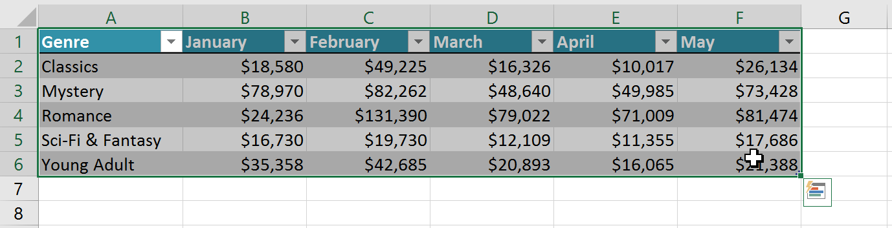

2. Từ tab ** Chèn **, nhấp vào lệnh ** Biểu đồ ** mong muốn. Trong ví dụ của chúng tôi, chúng tôi sẽ chọn ** Cột **.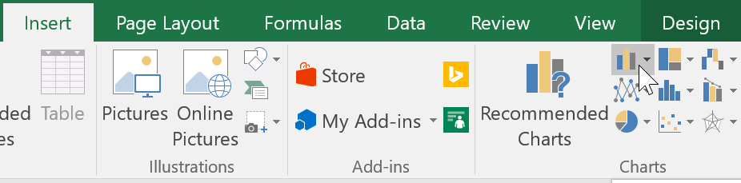

3. Chọn ** loại biểu đồ ** mong muốn từ trình đơn thả xuống.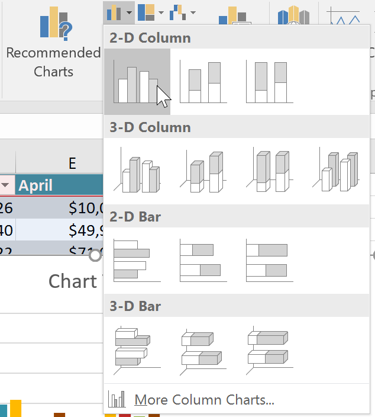

4. Biểu đồ đã chọn sẽ được chèn vào bảng tính.

Nếu bạn không chắc chắn nên sử dụng loại biểu đồ nào, lệnh ** Biểu đồ được đề xuất ** sẽ đề xuất một số biểu đồ dựa trên dữ liệu nguồn.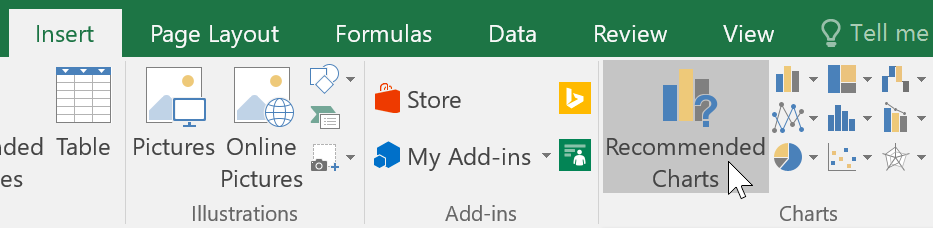

### Phong cách biểu đồ và bố cục

Sau khi chèn biểu đồ, có một số điều bạn có thể muốn thay đổi về cách hiển thị dữ liệu của mình. Thật dễ dàng để chỉnh sửa ** bố cục ** và ** kiểu ** của biểu đồ từ tab ** Thiết kế **.

* Excel cho phép bạn thêm ** thành phần biểu đồ **—bao gồm ** tiêu đề biểu đồ **,** chú giải ** và ** nhãn dữ liệu **—để giúp biểu đồ của bạn dễ đọc hơn. Để thêm thành phần biểu đồ, hãy nhấp vào lệnh ** Thêm thành phần biểu đồ ** trên tab ** Thiết kế **, sau đó chọn ** thành phần mong muốn ** từ trình đơn thả xuống.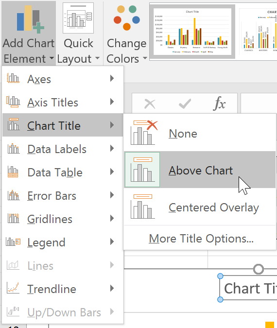

* Để ** chỉnh sửa ** thành phần biểu đồ, chẳng hạn như ** tiêu đề biểu đồ **, chỉ cần nhấp đúp vào ** giữ chỗ ** và bắt đầu nhập.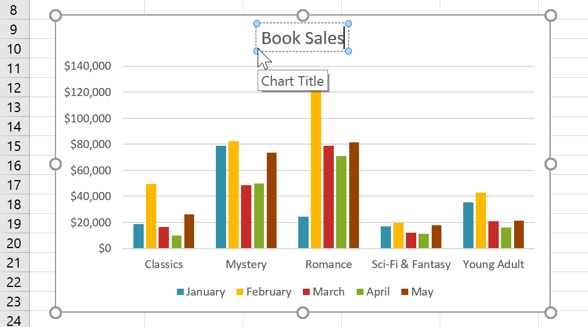

* Nếu không muốn thêm các thành phần biểu đồ riêng lẻ, bạn có thể sử dụng một trong các bố cục được xác định trước của Excel. Chỉ cần nhấp vào lệnh ** Bố cục nhanh **, sau đó chọn ** bố cục mong muốn ** từ trình đơn thả xuống.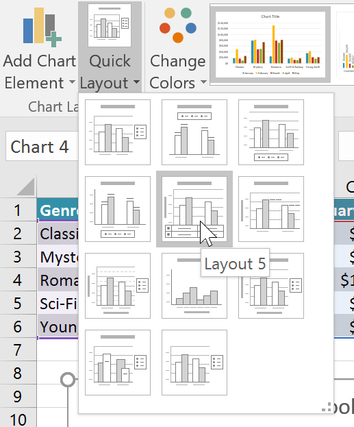

* Excel cũng bao gồm một số ** kiểu biểu đồ **, cho phép bạn nhanh chóng sửa đổi giao diện của biểu đồ. Để thay đổi kiểu biểu đồ, hãy chọn ** kiểu mong muốn ** từ nhóm ** kiểu biểu đồ **. Bạn cũng có thể nhấp vào mũi tên thả xuống ở bên phải để xem thêm kiểu.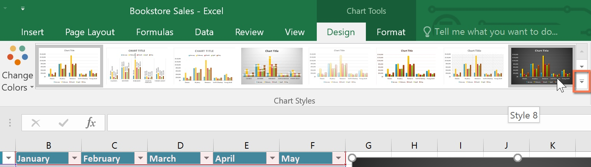

Bạn cũng có thể sử dụng các nút phím tắt định dạng biểu đồ để nhanh chóng ** thêm các thành phần biểu đồ **, thay đổi ** kiểu biểu đồ ** và ** lọc ** dữ liệu biểu đồ.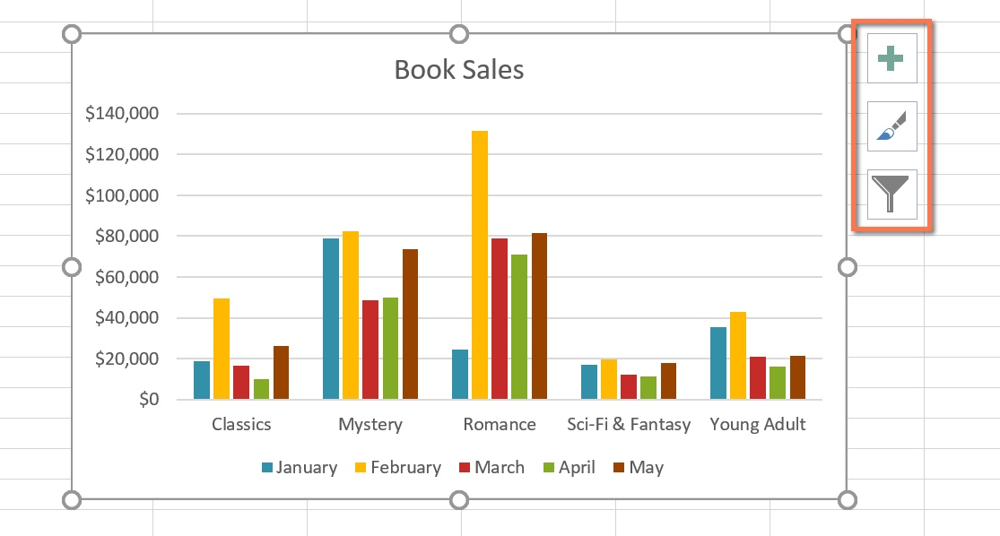

chỉnh sửa điểm nóng

### Tùy chọn biểu đồ khác

Có nhiều cách khác để tùy chỉnh và sắp xếp biểu đồ của bạn. Ví dụ: Excel cho phép bạn ** sắp xếp lại ** dữ liệu của biểu đồ, thay đổi ** loại biểu đồ ** và thậm chí ** di chuyển ** biểu đồ đến một vị trí khác trong sổ làm việc.

#### Để chuyển đổi dữ liệu hàng và cột:

Đôi khi bạn có thể muốn thay đổi cách biểu đồ ** nhóm ** dữ liệu của mình. Ví dụ: trong biểu đồ bên dưới, dữ liệu Doanh số bán sách được nhóm ** theo thể loại **, với các cột cho ** mỗi tháng **. Tuy nhiên, chúng ta có thể chuyển đổi hàng và cột để biểu đồ sẽ nhóm dữ liệu ** theo tháng **, với các cột cho ** mỗi thể loại **. Trong cả hai trường hợp, biểu đồ đều chứa cùng một dữ liệu—chỉ là nó được sắp xếp khác nhau.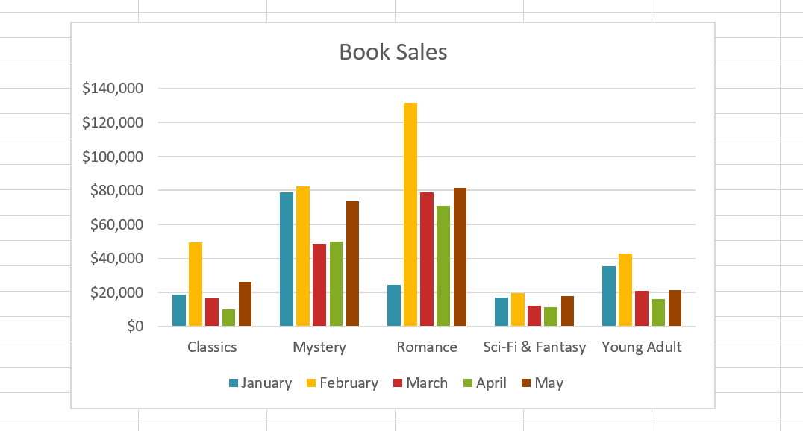

1. Chọn ** biểu đồ ** bạn muốn sửa đổi.
2. Từ tab ** Thiết kế **, chọn lệnh ** Chuyển hàng/Cột **.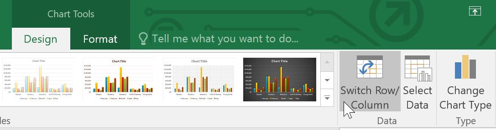

3. Các hàng và cột sẽ được ** chuyển đổi **. Trong ví dụ của chúng tôi, dữ liệu hiện được nhóm theo tháng, với các cột cho từng thể loại.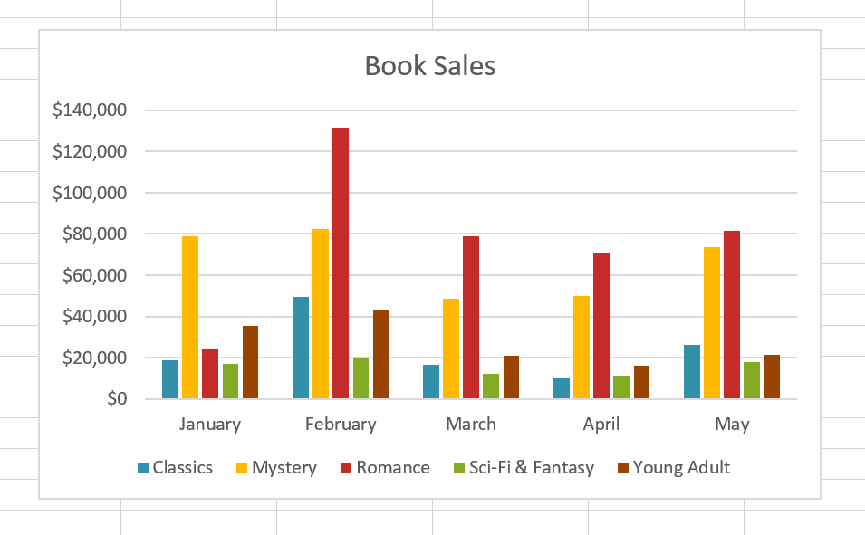

#### Để thay đổi loại biểu đồ:

Nếu bạn nhận thấy dữ liệu của mình không hoạt động tốt trong một biểu đồ nhất định, bạn có thể dễ dàng chuyển sang loại biểu đồ mới. Trong ví dụ của chúng tôi, chúng tôi sẽ thay đổi biểu đồ của mình từ biểu đồ cột thành biểu đồ đường.

1. Từ tab ** Thiết kế **, hãy nhấp vào lệnh ** Thay đổi loại biểu đồ **.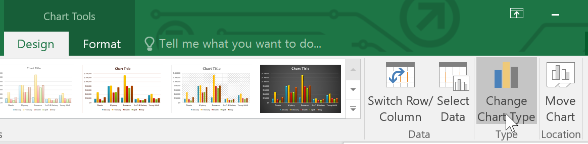

2. Hộp thoại ** Thay đổi loại biểu đồ ** sẽ xuất hiện. Chọn biểu đồ mới ** loại ** và ** bố cục **, sau đó nhấp vào ** OK **. Trong ví dụ của chúng tôi, chúng tôi sẽ chọn biểu đồ ** Line **.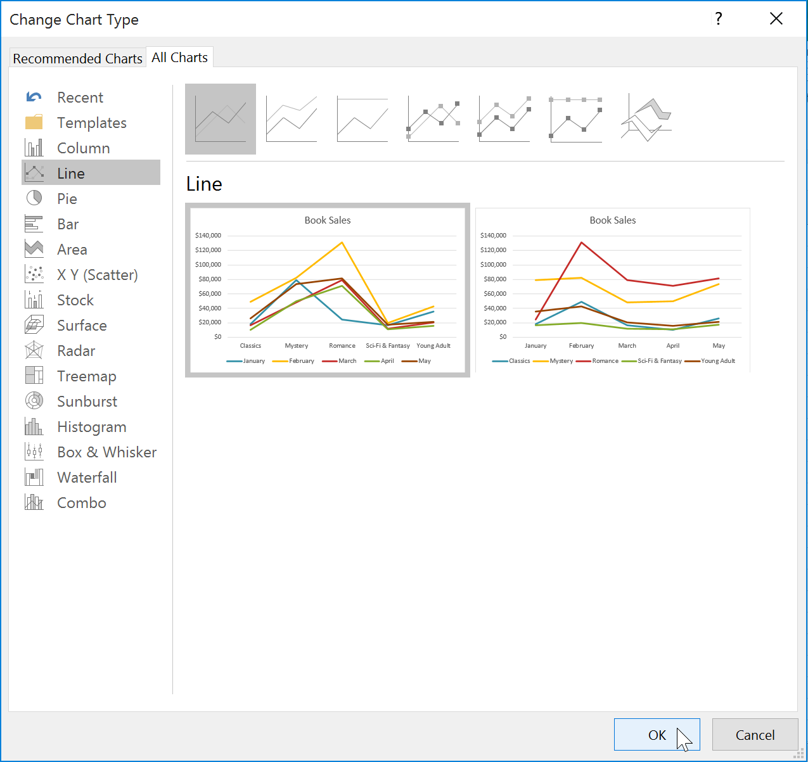

3. Loại biểu đồ đã chọn sẽ xuất hiện. Trong ví dụ của chúng tôi, biểu đồ đường giúp dễ dàng xem xu hướng dữ liệu bán hàng theo thời gian.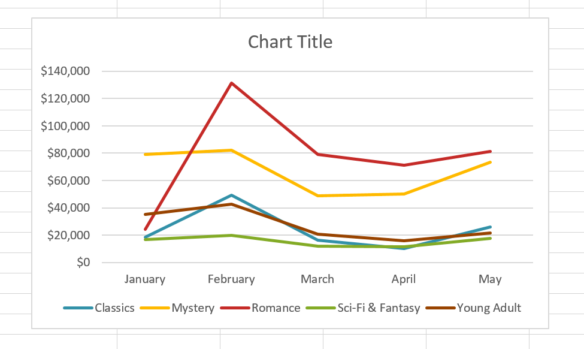

#### Để di chuyển biểu đồ:

Bất cứ khi nào bạn chèn một biểu đồ mới, nó sẽ xuất hiện dưới dạng một đối tượng trên cùng một trang tính chứa dữ liệu nguồn của nó. Bạn có thể dễ dàng ** di chuyển ** biểu đồ sang ** trang tính mới ** để giúp sắp xếp dữ liệu của mình.

1. Chọn ** biểu đồ ** bạn muốn di chuyển.
2. Nhấp vào tab ** Thiết kế **, sau đó chọn lệnh ** Di chuyển biểu đồ **.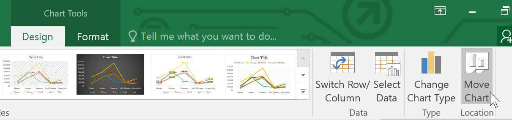

3. Hộp thoại ** Di chuyển biểu đồ ** sẽ xuất hiện. Chọn ** vị trí mong muốn ** cho biểu đồ. Trong ví dụ của chúng tôi, chúng tôi sẽ chọn di chuyển nó sang ** Trang tính mới **, trang tính này sẽ tạo một trang tính mới.
4. Nhấp vào ** OK **.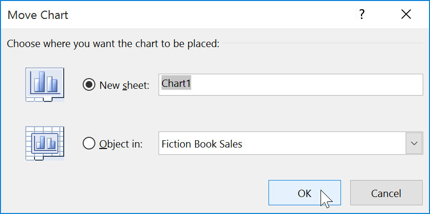

5. Biểu đồ sẽ xuất hiện ở vị trí đã chọn. Trong ví dụ của chúng tôi, biểu đồ hiện xuất hiện trên một trang tính mới.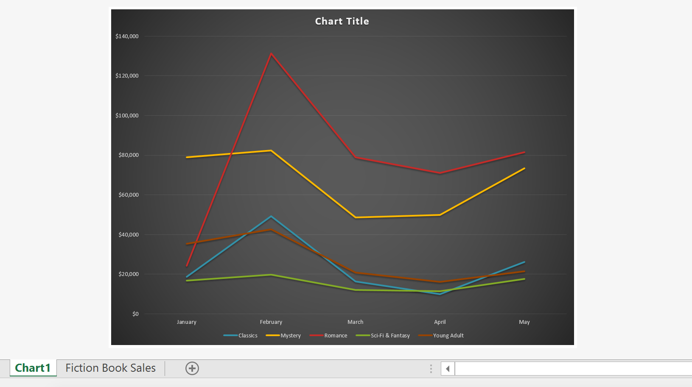

#### Luôn cập nhật biểu đồ

Theo mặc định, khi bạn thêm nhiều dữ liệu hơn vào bảng tính, biểu đồ có thể không bao gồm dữ liệu mới. Để khắc phục điều này, bạn có thể điều chỉnh ** phạm vi dữ liệu **. Chỉ cần nhấp vào biểu đồ và nó sẽ làm nổi bật phạm vi dữ liệu trong bảng tính của bạn. Sau đó, bạn có thể nhấp và kéo ** tay cầm ** ở góc dưới bên phải để thay đổi phạm vi dữ liệu.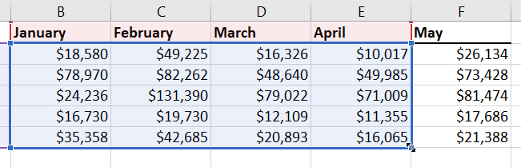

Nếu bạn thường xuyên thêm nhiều dữ liệu hơn vào bảng tính của mình thì việc cập nhật phạm vi dữ liệu có thể trở nên tẻ nhạt. May mắn thay, có một cách dễ dàng hơn. Chỉ cần định dạng dữ liệu nguồn của bạn dưới dạng ** bảng **, sau đó tạo ** biểu đồ dựa trên bảng đó **. Khi bạn thêm nhiều dữ liệu bên dưới bảng, dữ liệu đó sẽ tự động được đưa vào cả bảng và biểu đồ, giúp mọi thứ nhất quán và cập nhật.

Xem video bên dưới để tìm hiểu cách sử dụng bảng để cập nhật biểu đồ.

### Thử thách!

1. Mở [sổ làm việc thực hành](practice_files/excel_charts_practice.xlsx) 
của chúng tôi.
2. Nhấp vào tab ** Thử thách ** ở phía dưới bên trái của sổ làm việc.
3. Chọn các ô ** A1:E6 ** và chèn biểu đồ ** Cột cụm 2D **.
4. Thay đổi ** tiêu đề biểu đồ ** thành ** Doanh số tháng 9 đến tháng 12 **.
5. Sử dụng lệnh ** Chuyển hàng/cột **. Bây giờ, các cột sẽ được nhóm theo tháng với màu khác nhau cho mỗi nhân viên bán hàng.
6.** Di chuyển ** biểu đồ sang ** trang tính mới **.
7. Thay đổi ** loại biểu đồ ** thành ** dòng có điểm đánh dấu **.
8. Sử dụng lệnh ** Bố cục nhanh ** để thay đổi bố cục của biểu đồ.
9. Khi bạn hoàn tất, sổ làm việc của bạn sẽ trông giống như thế này: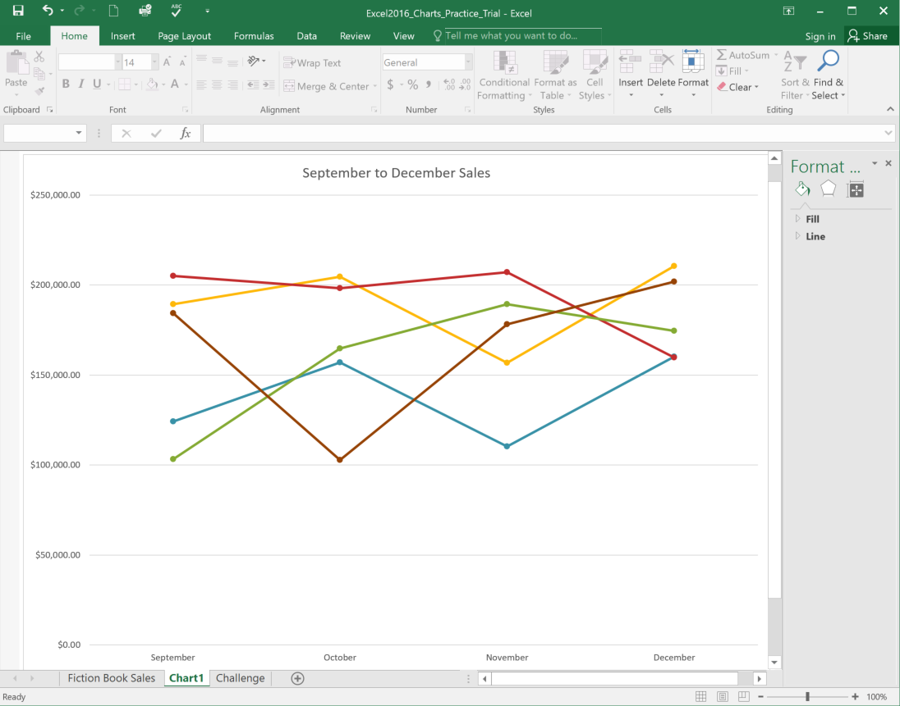

/en/excel/định dạng có điều kiện/nội dung/