# Bài 24: Định dạng có điều kiện

#### Bài 24: Định dạng có điều kiện

/en/excel/biểu đồ/nội dung/

### Giới thiệu

Giả sử bạn có một bảng tính có hàng nghìn hàng dữ liệu. Sẽ cực kỳ khó để nhìn thấy các mô hình và xu hướng chỉ từ việc kiểm tra thông tin thô. Tương tự như biểu đồ và biểu đồ thu nhỏ,** định dạng có điều kiện ** cung cấp cách trực quan hóa dữ liệu và làm cho bảng tính dễ hiểu hơn.

Xem video bên dưới để tìm hiểu thêm về định dạng có điều kiện trong Excel.

#### Hiểu định dạng có điều kiện

Định dạng có điều kiện cho phép bạn tự động áp dụng định dạng—chẳng hạn như ** màu sắc **,** biểu tượng ** và ** thanh dữ liệu **—cho một hoặc nhiều ô dựa trên ** ô ** ** giá trị **. Để thực hiện việc này, bạn cần tạo một ** định dạng có điều kiện ** ** quy tắc **. Ví dụ: quy tắc định dạng có điều kiện có thể là:** Nếu giá trị nhỏ hơn $2000, hãy tô màu đỏ cho ô **. Bằng cách áp dụng quy tắc này, bạn có thể nhanh chóng xem ô nào chứa giá trị nhỏ hơn $2000.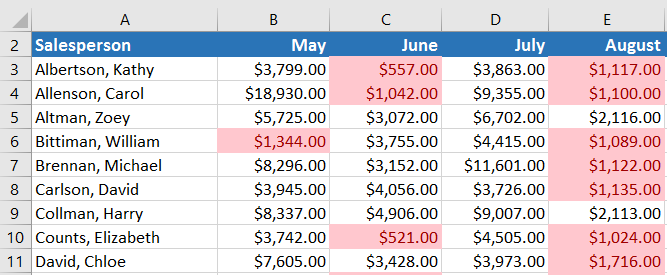

#### Để tạo quy tắc định dạng có điều kiện:

Trong ví dụ của chúng tôi, chúng tôi có một bảng tính chứa dữ liệu bán hàng và chúng tôi muốn xem nhân viên bán hàng nào đang đáp ứng mục tiêu bán hàng hàng tháng của họ. Mục tiêu bán hàng là $4000 mỗi tháng, vì vậy chúng tôi sẽ tạo quy tắc định dạng có điều kiện cho bất kỳ ô nào chứa giá trị cao hơn 4000.

1. Chọn ** ô mong muốn ** cho quy tắc định dạng có điều kiện.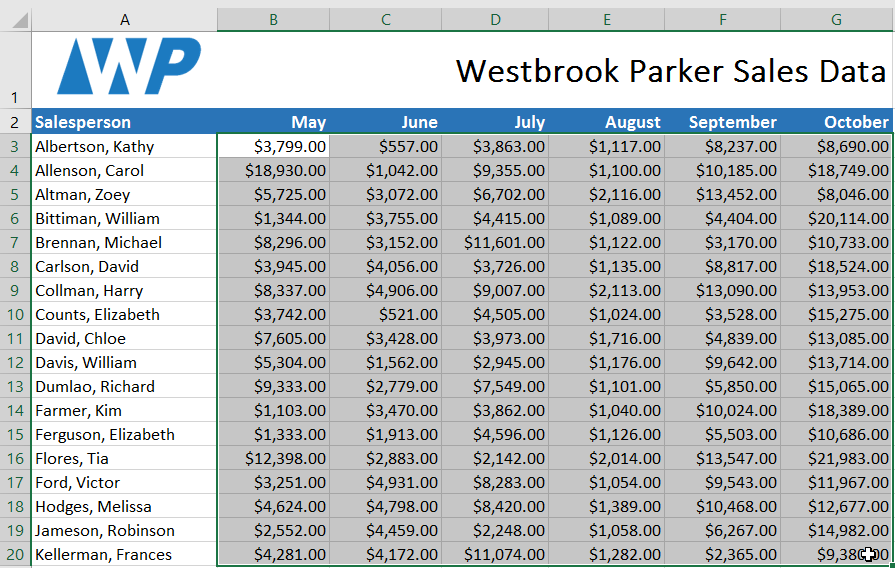

2. Từ tab ** Trang chủ **, hãy nhấp vào lệnh **Định dạng có điều kiện **. Một menu thả xuống sẽ xuất hiện.
3. Di chuột qua ** loại định dạng có điều kiện ** mong muốn, sau đó chọn ** quy tắc mong muốn ** từ trình đơn xuất hiện. Trong ví dụ của chúng tôi, chúng tôi muốn ** đánh dấu các ô ** có giá trị ** lớn hơn **$4000.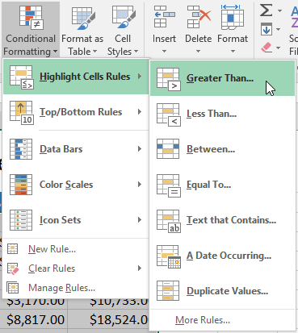

4. Một hộp thoại sẽ xuất hiện. Nhập **(các) 
giá trị mong muốn ** vào trường trống. Trong ví dụ của chúng tôi, chúng tôi sẽ nhập 4000 làm giá trị của mình.
5. Chọn ** định dạng ** ** kiểu ** từ trình đơn thả xuống. Trong ví dụ của chúng tôi, chúng tôi sẽ chọn ** Tô màu xanh lục với văn bản màu xanh đậm **, sau đó nhấp vào ** OK **.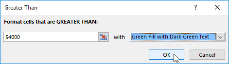

6. Định dạng có điều kiện sẽ được áp dụng cho các ô đã chọn. Trong ví dụ của chúng tôi, thật dễ dàng để biết nhân viên bán hàng nào đã đạt được mục tiêu doanh số 4000 USD mỗi tháng.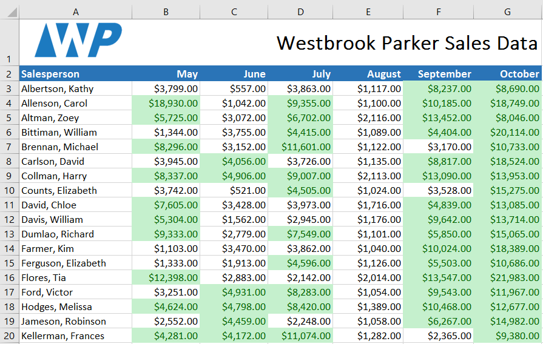

Bạn có thể áp dụng nhiều quy tắc định dạng có điều kiện cho một phạm vi ô hoặc bảng tính, cho phép bạn trực quan hóa các xu hướng và mẫu khác nhau trong dữ liệu của mình.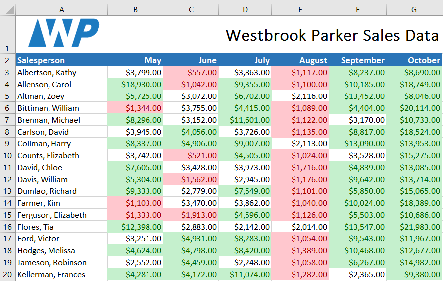

### Cài đặt trước định dạng có điều kiện

Excel có một số kiểu được xác định trước—hoặc ** đặt trước **—bạn có thể sử dụng để nhanh chóng áp dụng định dạng có điều kiện cho dữ liệu của mình. Chúng được nhóm thành ba loại:

* ** Thanh dữ liệu ** là các thanh ngang được thêm vào mỗi ô, giống như ** biểu đồ thanh **.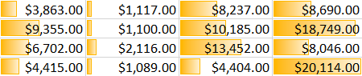

* ** Thang màu ** thay đổi màu của từng ô dựa trên giá trị của nó. Mỗi thang màu sử dụng ** chuyển màu hai hoặc ba màu **. Ví dụ: trong thang màu ** Xanh-Vàng-Đỏ **, giá trị ** cao nhất ** là màu xanh lá cây, giá trị ** trung bình ** là màu vàng và giá trị ** thấp nhất ** là màu đỏ.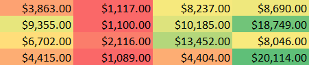

* ** Bộ biểu tượng ** thêm biểu tượng cụ thể vào từng ô dựa trên giá trị của nó.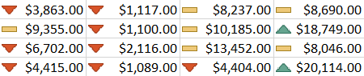

#### Để sử dụng định dạng có điều kiện đặt trước:

1. Chọn ** ô mong muốn ** cho quy tắc định dạng có điều kiện.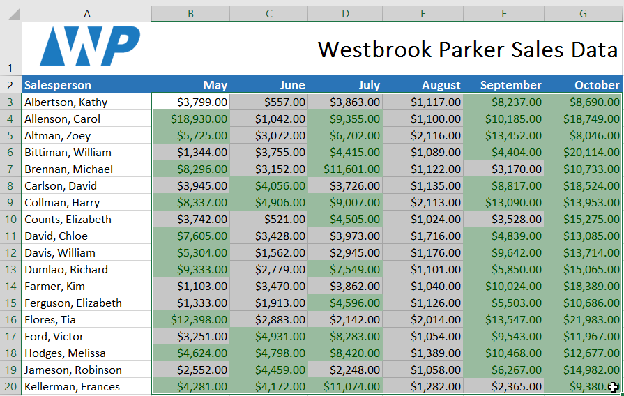

2. Nhấp vào lệnh **Định dạng có điều kiện **. Một menu thả xuống sẽ xuất hiện.
3. Di chuột qua ** giá trị đặt trước mong muốn **, sau đó chọn ** kiểu đặt trước ** từ trình đơn xuất hiện.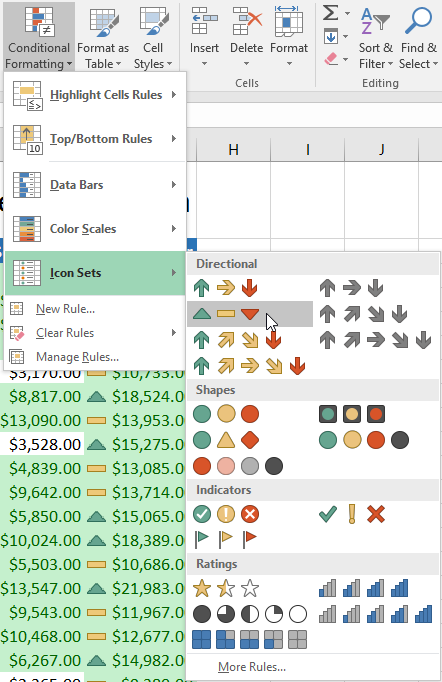

4. Định dạng có điều kiện sẽ được áp dụng cho các ô đã chọn.

### Loại bỏ định dạng có điều kiện

#### Để loại bỏ định dạng có điều kiện:

1. Nhấp vào lệnh **Định dạng có điều kiện **. Một menu thả xuống sẽ xuất hiện.
2. Di chuột qua ** Xóa quy tắc **, sau đó chọn quy tắc bạn muốn xóa. Trong ví dụ của chúng tôi, chúng tôi sẽ chọn ** Xóa quy tắc khỏi toàn bộ trang tính ** để xóa tất cả định dạng có điều kiện khỏi trang tính.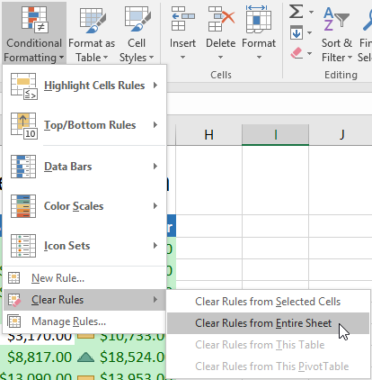

3. Định dạng có điều kiện sẽ bị loại bỏ.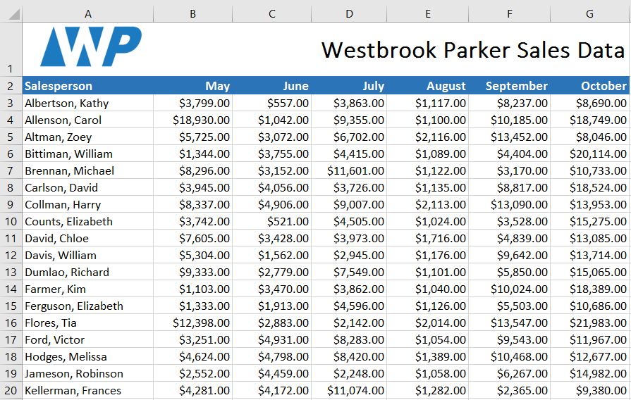

Nhấp vào ** Quản lý quy tắc ** để chỉnh sửa hoặc xóa các quy tắc ** riêng lẻ **. Điều này đặc biệt hữu ích nếu bạn đã áp dụng ** nhiều quy tắc ** cho một trang tính.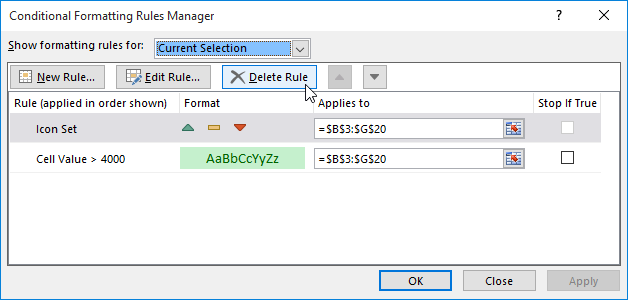

### Thử thách!

1. Mở [sổ làm việc thực hành](practice_files/excel_conditionalformatting_practice.xlsx) 
của chúng tôi.
2. Nhấp vào tab bảng tính ** Thử thách ** ở phía dưới bên trái của bảng tính.
3. Chọn ô ** B3:J17 **.
4. Giả sử bạn là giáo viên và muốn dễ dàng xem tất cả các điểm dưới mức đạt. Áp dụng **Định dạng có điều kiện ** sao cho nó **Đánh dấu các ô ** chứa các giá trị ** Nhỏ hơn 70 ** với ** màu đỏ nhạt **.
5. Bây giờ bạn muốn xem các điểm so sánh với nhau như thế nào. Trong tab **Định dạng có điều kiện **, chọn ** Bộ biểu tượng ** có tên là ** 3 Biểu tượng (Khoanh tròn)**.** Gợi ý **: Tên của các bộ biểu tượng sẽ xuất hiện khi bạn di chuột qua chúng.
6. Bảng tính của bạn sẽ trông như thế này: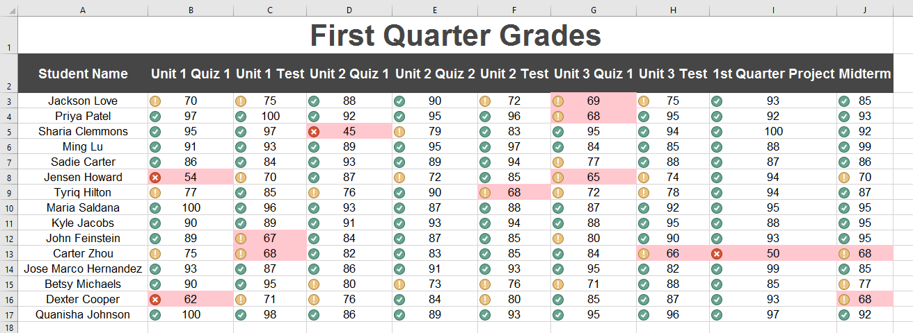

7. Sử dụng tính năng Quản lý quy tắc, xóa ** màu đỏ nhạt ** nhưng vẫn giữ ** bộ biểu tượng **.

/en/excel/comments-and-coauthoring/content/