# Bài 25: bình luận và đồng tác giả

#### Bài 25: Bình luận và đồng tác giả

/en/excel/định dạng có điều kiện/nội dung/

### Giới thiệu

Có thể đôi khi bạn đang làm việc trên sổ làm việc và thấy rằng mình cần sự giúp đỡ của người khác. Excel cung cấp hai tính năng mạnh mẽ cho phép bạn làm việc với những người khác trên cùng một bảng tính:** nhận xét ** và ** đồng tác giả **.

Xem video bên dưới để tìm hiểu thêm về nhận xét và đồng tác giả.

Tính năng ** Theo dõi các thay đổi ** cũng có thể hữu ích để xem lại các thay đổi trước khi biến chúng thành vĩnh viễn. Nó vẫn có sẵn trong Office 365 nhưng hiện tại ** bị ẩn theo mặc định **. Bạn có thể tìm hiểu thêm về Theo dõi các thay đổi trong bài học Excel 2016 của chúng tôi [tại đây](../../../excel2016/track-changes-and-comments/1/index.html).

### Chia sẻ sổ làm việc với người khác

Để những người khác cộng tác trên sổ làm việc, trước tiên bạn cần ** chia sẻ ** sổ làm việc đó với họ.

1. Nhấp vào nút ** Chia sẻ ** ở góc trên bên phải.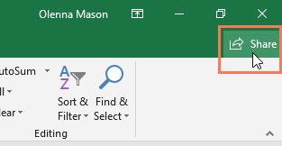

2. Bấm vào tùy chọn ** OneDrive ** được liên kết với tài khoản của bạn để tải sổ làm việc lên.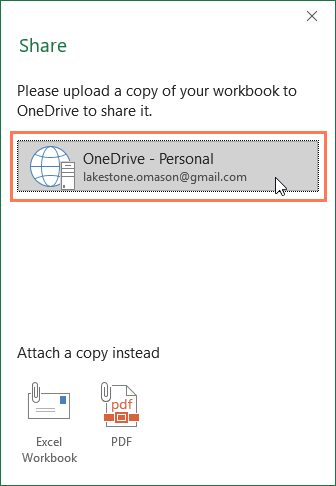

3. Khung ** Chia sẻ ** sẽ xuất hiện ở bên phải màn hình. Nhập ** địa chỉ email ** của người mà bạn muốn chia sẻ sổ làm việc.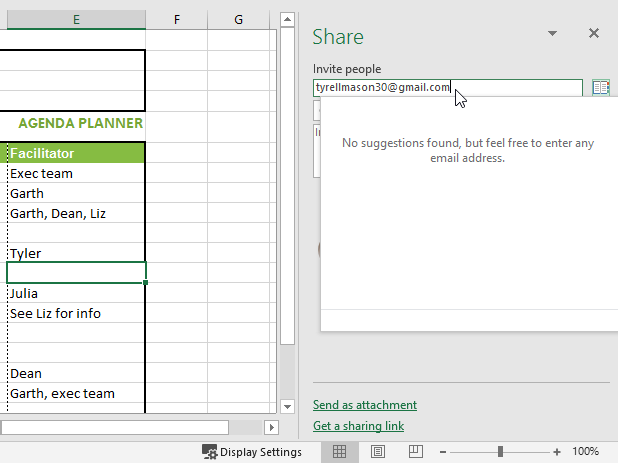

4. Chọn ** Có thể chỉnh sửa ** từ menu thả xuống để cho phép người này chỉnh sửa sổ làm việc.

5. Nhập tin nhắn nếu bạn muốn bao gồm một tin nhắn, sau đó nhấp vào ** Chia sẻ **.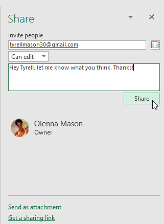

6. Giờ đây, cộng tác viên của bạn sẽ có thể truy cập vào sổ làm việc.

### Bình luận

Một cách để cộng tác trên sổ làm việc là thông qua ** nhận xét **. Đôi khi bạn có thể muốn cung cấp phản hồi hoặc đặt câu hỏi mà không cần chỉnh sửa nội dung của ô. Bạn có thể thực hiện việc này bằng cách ** thêm nhận xét **.

#### Để thêm nhận xét:

1. Chọn ** ô ** nơi bạn muốn bình luận xuất hiện. Trong ví dụ của chúng tôi, chúng tôi sẽ chọn ô ** D17 **.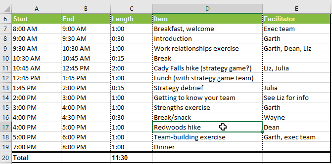

2. Từ tab **Đánh giá **, hãy nhấp vào lệnh ** Nhận xét mới **.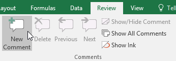

3.** hộp bình luận ** sẽ xuất hiện. Nhập nhận xét của bạn, sau đó nhấp vào bất kỳ đâu bên ngoài hộp để đóng nhận xét.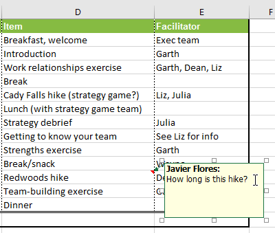

4. Nhận xét sẽ được thêm vào ô, được biểu thị bằng ** hình tam giác màu đỏ ** ở góc trên bên phải.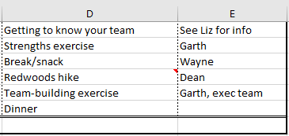

5. Chọn lại ô để xem nhận xét.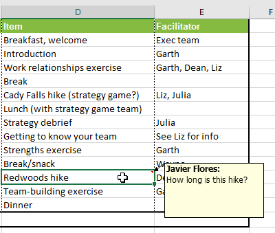

#### Để chỉnh sửa một bình luận:

1. Chọn ** ô ** chứa nhận xét bạn muốn chỉnh sửa.
2. Từ tab **Đánh giá **, hãy nhấp vào lệnh ** Chỉnh sửa nhận xét **.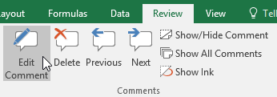

3.** hộp bình luận ** sẽ xuất hiện. Chỉnh sửa nhận xét theo ý muốn, sau đó nhấp vào bất kỳ đâu bên ngoài hộp để đóng nhận xét.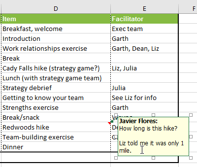

#### Để hiển thị hoặc ẩn nhận xét:

1. Từ tab **Đánh giá **, hãy nhấp vào lệnh ** Hiển thị tất cả nhận xét ** để xem mọi nhận xét trong bảng tính của bạn cùng một lúc.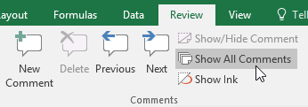

2. Tất cả các ý kiến ​​​​trong bảng tính sẽ xuất hiện. Nhấp lại vào lệnh ** Hiển thị tất cả nhận xét ** để ẩn chúng.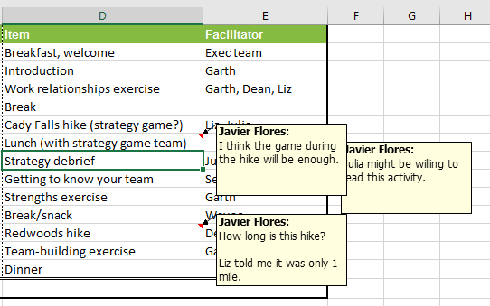

Bạn cũng có thể chọn hiển thị và ẩn từng nhận xét bằng cách chọn ô mong muốn và nhấp vào lệnh ** Hiển thị/Ẩn Nhận xét **.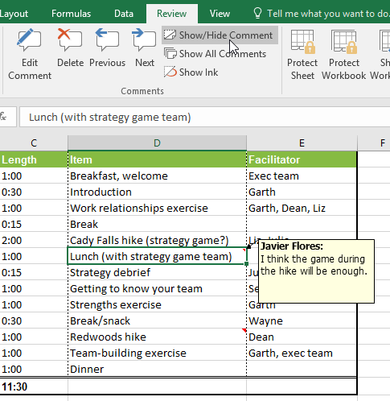

#### Để xóa một bình luận:

1. Chọn ** ô ** chứa nhận xét bạn muốn xóa. Trong ví dụ của chúng tôi, chúng tôi sẽ chọn ô ** E13 **.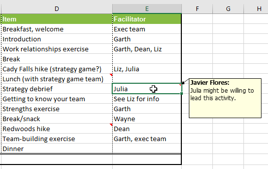

2. Từ tab **Đánh giá **, hãy nhấp vào lệnh ** Xóa ** trong nhóm ** Nhận xét **.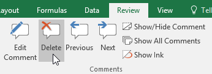

3. Bình luận sẽ bị xóa.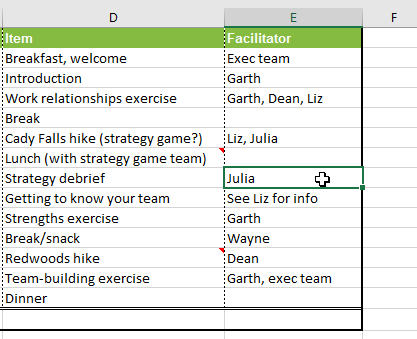

### Đồng tác giả

Một công cụ cộng tác khác là ** đồng tác giả **, cho phép người khác xem và chỉnh sửa sổ làm việc của bạn trong thời gian thực. Điều này giúp việc cộng tác trên sổ làm việc với nhóm của bạn trở nên dễ dàng và nhanh chóng hơn. Sau khi chia sẻ sổ làm việc với người khác, họ sẽ có thể đồng tác giả.

Đồng tác giả theo thời gian thực yêu cầu ** đăng ký Office 365 **.

Khi đồng tác giả một sổ làm việc, bạn có thể nhìn thấy những người khác đang làm việc vì mỗi người sẽ có ** màu sắc riêng **. Nếu bạn muốn biết ai hiện đang chỉnh sửa sổ làm việc, bạn có thể ** di chuột qua hoạt động ** để xem tên của họ.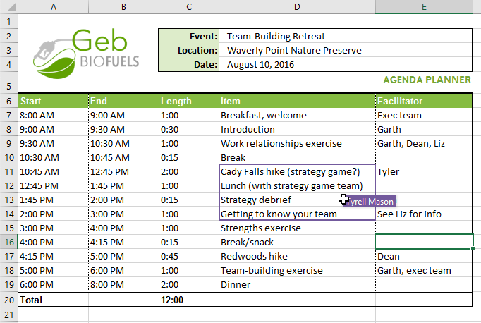

#### Khôi phục phiên bản trước

Khi bạn hoặc bất kỳ ai khác thực hiện các thay đổi đối với sổ làm việc, các thay đổi đó sẽ ** được lưu tự động **. Tuy nhiên, nếu bạn không hài lòng với những thay đổi này, bạn luôn có thể ** khôi phục phiên bản trước **.

1. Nhấp vào biểu tượng ** đồng hồ ** bên cạnh nút ** Chia sẻ **.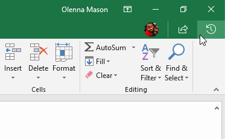

2. Ngăn ** Lịch sử phiên bản ** sẽ xuất hiện ở bên phải màn hình. Nhấp đúp vào phiên bản bạn muốn khôi phục.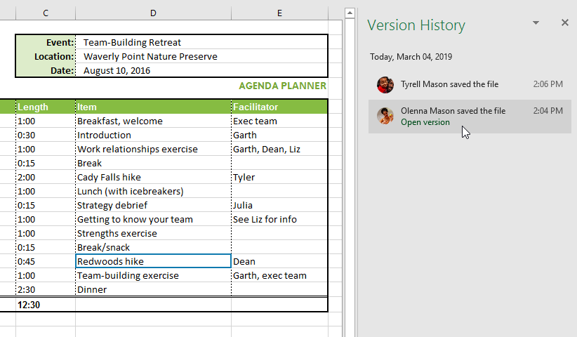

3. Khi bạn đã quyết định đây là phiên bản mình muốn, hãy nhấp vào ** Khôi phục **.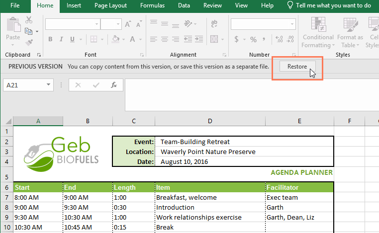

4. Phiên bản trước đó sẽ được khôi phục.

### Thử thách!

1. Mở [sổ làm việc thực hành](practice_files/excel_trackchangescomments_practice.xlsx) 
của chúng tôi.
2. Thêm ** bốn nhận xét ** vào bảng tính.
3.** Xóa ** một trong các bình luận.
4. Hiển thị tất cả nhận xét bằng cách sử dụng ** Hiển thị tất cả nhận xét **.
5. Khi bạn hoàn tất, sổ làm việc của bạn sẽ trông giống như thế này: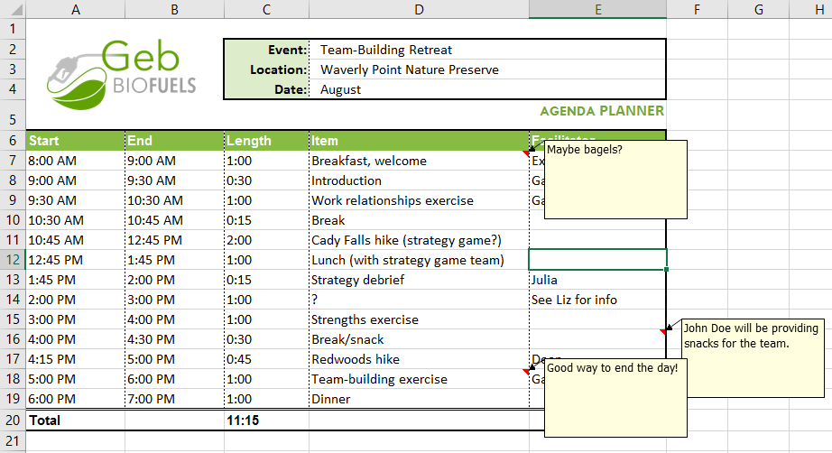

6. Tùy chọn:** Chia sẻ ** tài liệu với người bạn biết và thử nghiệm một số ** tính năng đồng tác giả ** khác nhau.

/en/excel/inspecting-and-protecting-workbooks/content/