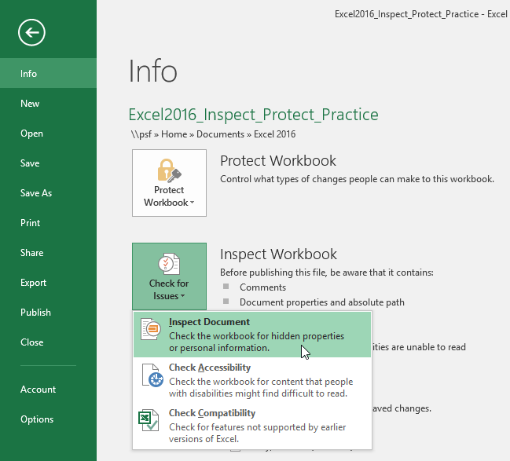
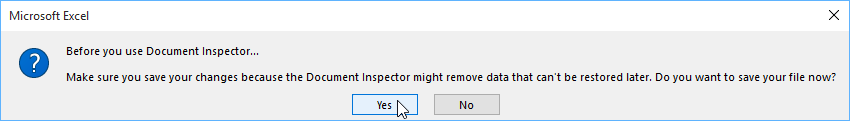
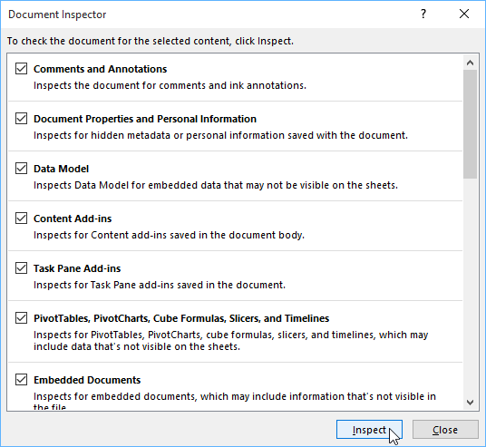
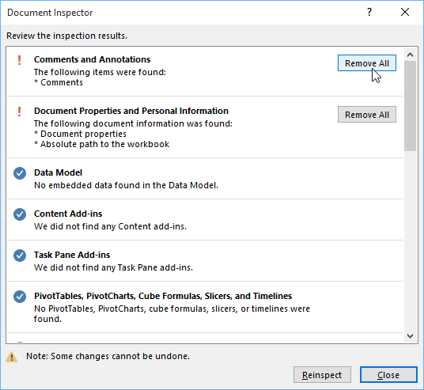
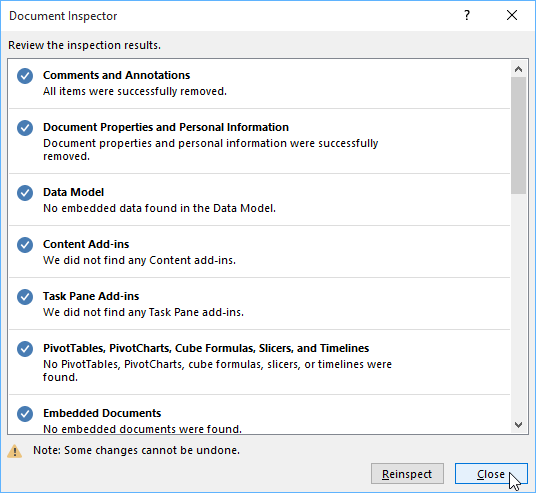
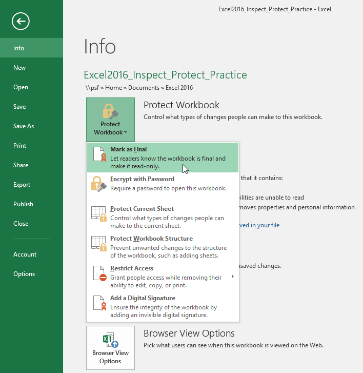
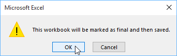
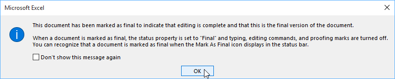
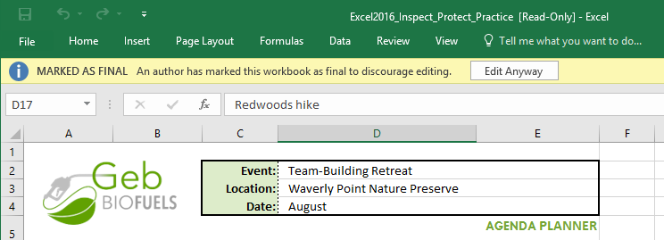
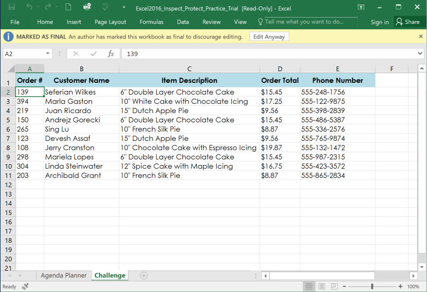

# Bài 26: sổ làm việc kiểm tra và bảo vệ

#### Bài 26: Kiểm tra và bảo vệ Workbook

/en/excel/comments-and-coauthoring/content/

### Giới thiệu

Trước khi chia sẻ sổ làm việc, bạn cần đảm bảo rằng sổ làm việc đó không có bất kỳ lỗi chính tả hoặc thông tin nào bạn muốn giữ riêng tư. May mắn thay, Excel có một số công cụ giúp ** hoàn thiện ** và ** bảo vệ ** sổ làm việc của bạn, bao gồm tính năng ** Tài liệu ** ** Thanh tra ** và ** Bảo vệ sổ làm việc **.

Xem video bên dưới để tìm hiểu thêm về cách kiểm tra và bảo vệ sổ làm việc.

### Người kiểm tra tài liệu

Bất cứ khi nào bạn tạo hoặc chỉnh sửa sổ làm việc, một số ** thông tin cá nhân ** nhất định có thể được tự động thêm vào tệp. Bạn có thể sử dụng Trình kiểm tra Tài liệu để xóa thông tin này trước khi chia sẻ sổ làm việc với người khác.

Vì một số thay đổi có thể là vĩnh viễn nên bạn nên lưu bản sao bổ sung của sổ làm việc trước khi sử dụng Trình kiểm tra Tài liệu để xóa thông tin.

#### Để sử dụng Trình kiểm tra Tài liệu:

1. Nhấp vào tab ** Tệp ** để truy cập ** Backstage view **.
2. Từ ngăn ** Thông tin **, hãy nhấp vào ** Kiểm tra sự cố **, sau đó chọn ** Kiểm tra ** ** Tài liệu ** từ trình đơn thả xuống.

3. Bạn có thể được nhắc lưu tệp của mình trước khi chạy ** Trình kiểm tra tài liệu **.

4.** Trình kiểm tra tài liệu ** sẽ xuất hiện. Chọn hoặc bỏ chọn các hộp, tùy thuộc vào nội dung bạn muốn xem lại, sau đó nhấp vào ** Kiểm tra **. Trong ví dụ của chúng tôi, chúng tôi sẽ chọn mọi thứ.

5.** kết quả ** ** kiểm tra ** sẽ xuất hiện. Trong ví dụ của chúng tôi, chúng tôi có thể thấy rằng sổ làm việc của chúng tôi chứa các nhận xét và một số thông tin cá nhân, vì vậy chúng tôi sẽ nhấp vào ** Xóa Tất cả ** trên cả hai mục để xóa thông tin này khỏi sổ làm việc.

6. Khi bạn hoàn tất, hãy nhấp vào **Đóng **.

### Bảo vệ sổ làm việc của bạn

Theo mặc định, bất kỳ ai có quyền truy cập vào sổ làm việc của bạn đều có thể mở, sao chép và chỉnh sửa nội dung của nó trừ khi bạn ** bảo vệ ** nó. Có một số cách để bảo vệ sổ làm việc, tùy thuộc vào nhu cầu của bạn.

#### Để bảo vệ sổ làm việc của bạn:

1. Nhấp vào tab ** Tệp ** để truy cập ** Backstage view **.
2. Từ ngăn ** Thông tin **, hãy nhấp vào lệnh ** Bảo vệ sổ làm việc **.
3. Trong menu thả xuống, hãy chọn tùy chọn phù hợp nhất với nhu cầu của bạn. Trong ví dụ của chúng tôi, chúng tôi sẽ chọn **Đánh dấu ** ** là Cuối cùng **. Đánh dấu sổ làm việc của bạn là cuối cùng là một cách hay để ngăn cản người khác chỉnh sửa sổ làm việc, trong khi các tùy chọn khác thậm chí còn cung cấp cho bạn nhiều quyền kiểm soát hơn nếu cần.

4. Một hộp thoại sẽ xuất hiện, nhắc bạn lưu. Nhấp vào ** OK **.

5. Một hộp thoại khác sẽ xuất hiện. Nhấp vào ** OK **.

6. Sổ làm việc sẽ được đánh dấu là cuối cùng.

Việc đánh dấu sổ làm việc là cuối cùng sẽ không ngăn cản người khác chỉnh sửa sổ làm việc đó. Nếu bạn muốn ngăn mọi người chỉnh sửa nó, thay vào đó bạn có thể sử dụng tùy chọn ** Hạn chế truy cập **.

### Thử thách!

1. Mở [sổ làm việc thực hành](practice_files/excel_inspectprotect_practice.xlsx) 
của chúng tôi.
2. Sử dụng ** Trình kiểm tra tài liệu ** để kiểm tra sổ làm việc và ** xóa ** mọi thứ nó tìm thấy.
3.** Bảo vệ ** sổ làm việc bằng cách **Đánh dấu là cuối cùng **.
4. Khi bạn hoàn tất, sổ làm việc của bạn sẽ trông giống như thế này:

/en/excel/intro-to-pivottables/content/