# Bài 27: giới thiệu về bảng xoay vòng

#### Bài 27: Giới thiệu về PivotTable

/en/excel/inspecting-and-protecting-workbooks/content/

### Giới thiệu

Khi bạn có nhiều dữ liệu, đôi khi có thể khó phân tích tất cả thông tin trong bảng tính của bạn.** PivotTables ** có thể giúp làm cho bảng tính của bạn dễ quản lý hơn bằng cách ** tóm tắt ** dữ liệu và cho phép bạn ** thao tác ** dữ liệu theo nhiều cách khác nhau.

Xem video bên dưới để tìm hiểu thêm về PivotTable.

#### Sử dụng PivotTable để trả lời câu hỏi

Hãy xem xét ví dụ dưới đây. Giả sử chúng ta muốn trả lời câu hỏi ** Số lượng bán được của mỗi nhân viên bán hàng là bao nhiêu?** Việc trả lời câu hỏi này có thể tốn thời gian và khó khăn; mỗi nhân viên bán hàng xuất hiện trên nhiều hàng và chúng tôi sẽ cần tính tổng tất cả các đơn hàng khác nhau của họ một cách riêng lẻ. Chúng ta có thể sử dụng lệnh ** Subtotal ** để giúp tìm tổng số cho mỗi nhân viên bán hàng, nhưng chúng ta vẫn sẽ có nhiều dữ liệu để làm việc.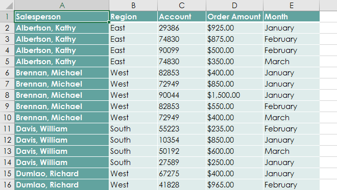

May mắn thay, PivotTable có thể ngay lập tức ** tính toán ** và ** tóm tắt ** dữ liệu theo cách giúp dữ liệu dễ đọc hơn nhiều. Khi chúng ta hoàn tất, PivotTable sẽ trông giống như thế này: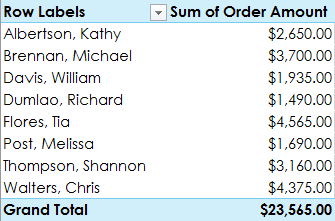

Sau khi tạo PivotTable, bạn có thể sử dụng nó để trả lời các câu hỏi khác nhau bằng cách sắp xếp lại—hoặc ** xoay vòng **—dữ liệu. Ví dụ: giả sử chúng tôi muốn trả lời ** Tổng số tiền bán được trong mỗi tháng là bao nhiêu?** Chúng tôi có thể sửa đổi PivotTable của mình để trông như thế này: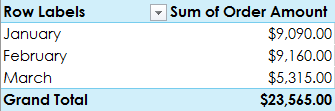

#### Để tạo PivotTable:

1. Chọn ** bảng ** hoặc ** ô **(bao gồm tiêu đề cột) 
mà bạn muốn đưa vào PivotTable của mình.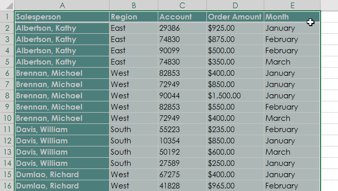

2. Từ tab ** Chèn **, hãy nhấp vào lệnh ** PivotTable **.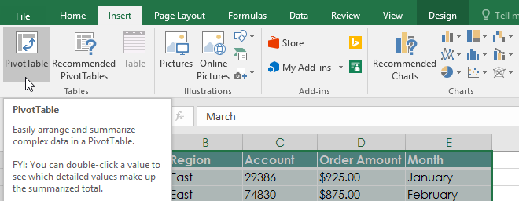

3. Hộp thoại ** Tạo PivotTable ** sẽ xuất hiện. Chọn cài đặt của bạn, sau đó nhấp vào ** OK **. Trong ví dụ của chúng tôi, chúng tôi sẽ sử dụng ** Bảng1 ** làm dữ liệu nguồn và đặt PivotTable vào ** trang tính mới **.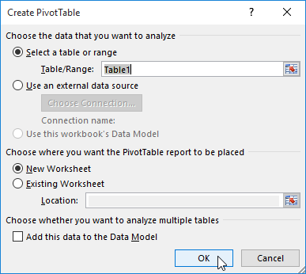

4.** PivotTable ** và ** Danh sách trường ** trống sẽ xuất hiện trong trang tính mới.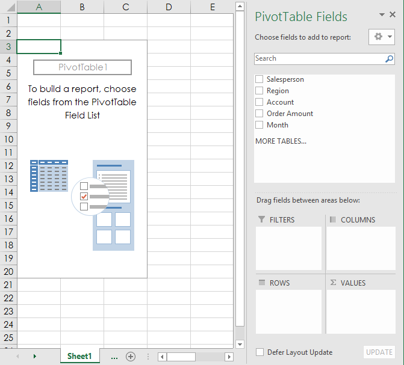

5. Sau khi tạo PivotTable, bạn sẽ cần quyết định ** trường ** nào cần thêm. Mỗi trường chỉ đơn giản là một ** tiêu đề cột ** từ dữ liệu nguồn. Trong danh sách ** PivotTable ** ** Trường **, hãy chọn hộp cho từng trường bạn muốn thêm. Trong ví dụ của chúng tôi, chúng tôi muốn biết tổng số ** số tiền ** được bán bởi mỗi ** nhân viên bán hàng **, vì vậy chúng tôi sẽ kiểm tra các trường ** Salesperson ** và ** Order ** ** Amount **.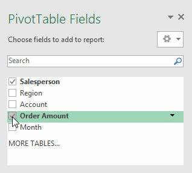

6. Các trường đã chọn sẽ được thêm vào một trong bốn khu vực bên dưới. Trong ví dụ của chúng tôi, trường ** Nhân viên bán hàng ** đã được thêm vào khu vực ** Hàng **, trong khi ** Số tiền đặt hàng ** đã được thêm vào ** Giá trị **. Bạn cũng có thể ** kéo ** ** và thả ** các trường trực tiếp vào khu vực mong muốn.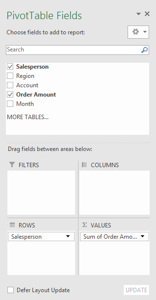

7. PivotTable sẽ tính toán và tóm tắt các trường đã chọn. Trong ví dụ của chúng tôi, PivotTable hiển thị ** số tiền mà mỗi nhân viên bán hàng ** đã bán.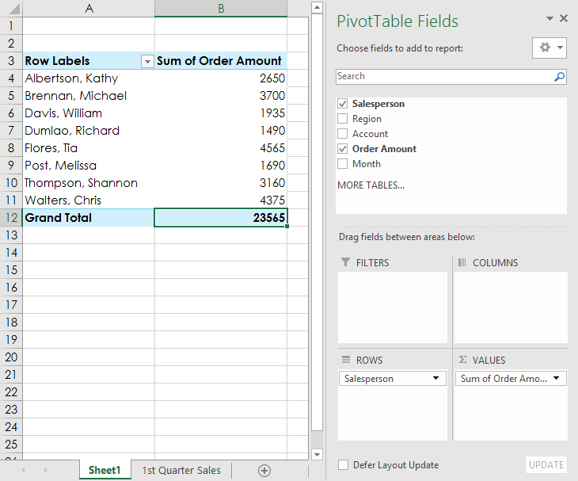

Cũng giống như bảng tính thông thường, bạn có thể sắp xếp dữ liệu trong PivotTable bằng lệnh ** Sắp xếp & Lọc ** trên tab Trang chủ. Bạn cũng có thể áp dụng bất kỳ loại ** định dạng số ** nào bạn muốn. Ví dụ: bạn có thể muốn thay đổi định dạng số thành ** Tiền tệ **. Tuy nhiên, hãy lưu ý rằng một số loại định dạng có thể biến mất khi bạn sửa đổi PivotTable.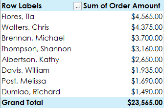

Nếu bạn thay đổi bất kỳ dữ liệu nào trong trang tính nguồn của mình, PivotTable ** sẽ không tự động cập nhật **. Để cập nhật thủ công, hãy chọn PivotTable rồi đi tới ** Phân tích > Làm mới **.

### Xoay dữ liệu

Một trong những điều tuyệt vời nhất về PivotTable là chúng có thể nhanh chóng ** xoay vòng **—hoặc sắp xếp lại—dữ liệu của bạn, cho phép bạn kiểm tra trang tính của mình theo nhiều cách. Xoay dữ liệu có thể giúp bạn trả lời ** các câu hỏi khác nhau ** và thậm chí ** thử nghiệm ** dữ liệu của bạn để khám phá các xu hướng và mẫu mới.

#### Để thêm cột:

Cho đến nay, PivotTable của chúng tôi chỉ hiển thị ** một cột ** dữ liệu tại một thời điểm. Để hiển thị ** nhiều cột **, bạn cần thêm một trường vào khu vực ** Cột **.

1. Kéo một trường từ ** Danh sách trường ** vào khu vực ** Cột **. Trong ví dụ của chúng tôi, chúng tôi sẽ sử dụng trường ** Tháng **.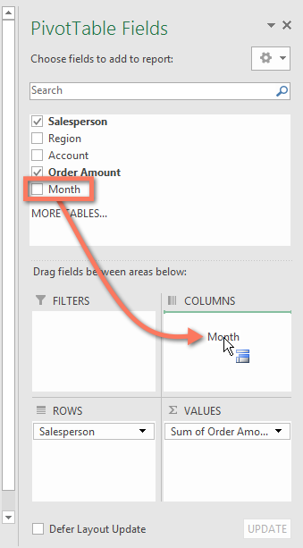

2. PivotTable sẽ bao gồm nhiều cột. Trong ví dụ của chúng tôi, hiện có một cột cho ** doanh số hàng tháng ** của mỗi người, ngoài ** tổng cộng **.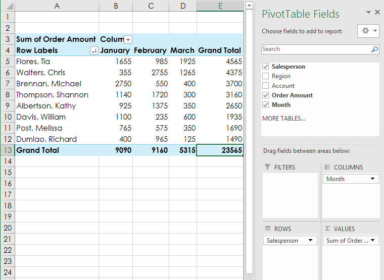

#### Để thay đổi một hàng hoặc cột:** Thay đổi

 ** một hàng hoặc cột có thể mang lại cho bạn cái nhìn hoàn toàn khác về dữ liệu của mình. Tất cả những gì bạn phải làm là ** xóa ** trường được đề cập, sau đó ** thay thế ** trường đó bằng trường khác.

1. Kéo trường bạn muốn xóa ra khỏi ** khu vực hiện tại ** của nó. Bạn cũng có thể ** bỏ chọn ** hộp thích hợp trong ** Danh sách trường **. Trong ví dụ này, chúng tôi đã xóa các trường ** Tháng ** và ** Nhân viên bán hàng **.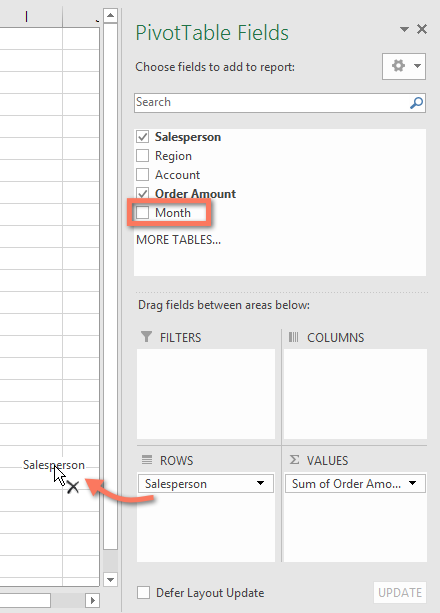

2. Kéo ** trường mới ** vào ** vùng mong muốn **. Trong ví dụ của chúng tôi, chúng tôi sẽ đặt trường ** Vùng ** bên dưới ** Hàng **.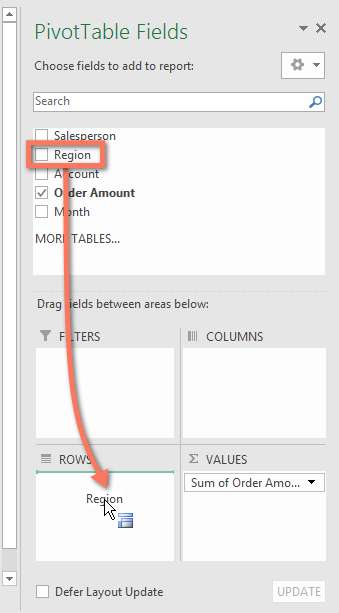

3. PivotTable sẽ điều chỉnh—hoặc xoay—để hiển thị dữ liệu mới. Trong ví dụ của chúng tôi, nó hiện hiển thị ** số lượng bán theo từng khu vực **.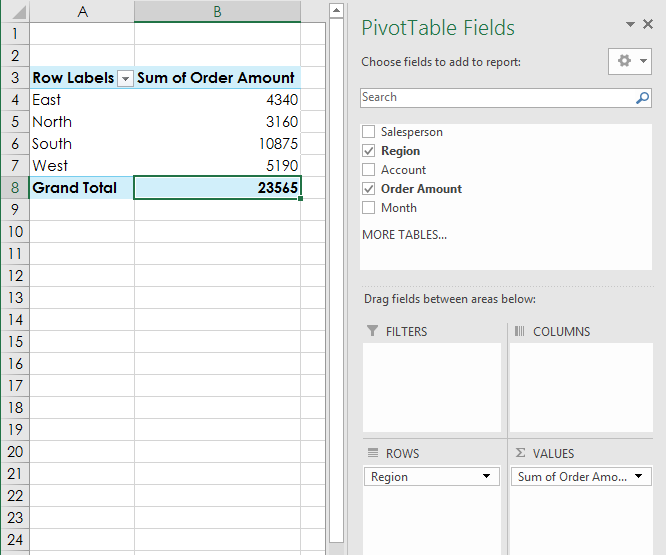

#### Để tìm hiểu thêm:

Sau khi bạn cảm thấy thoải mái với PivotTable, hãy xem lại bài học [Làm nhiều hơn với PivotTable](../../doing-more-with-pivottables/1/index.html) 
của chúng tôi để biết thêm các cách tùy chỉnh và thao tác với dữ liệu.

### Thử thách!

1. Mở [sổ làm việc thực hành](practice_files/excel_intropivottables_practice.xlsx) 
của chúng tôi.
2. Tạo ** PivotTable ** trong một trang tính riêng biệt.
3. Chúng tôi muốn trả lời câu hỏi ** Tổng số tiền bán được ở mỗi khu vực là bao nhiêu?**Để thực hiện việc này, hãy chọn ** Khu vực ** và ** Số tiền đặt hàng **. Khi bạn hoàn tất, sổ làm việc của bạn sẽ trông như thế này: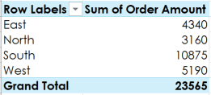

4. Trong khu vực ** Hàng **, hãy xóa ** Vùng ** và thay thế bằng ** Nhân viên bán hàng **.
5. Thêm ** Tháng ** vào khu vực ** Cột **.
6. Thay đổi định dạng số của các ô ** B5:E13 ** thành ** Tiền tệ **.** Lưu ý **: Bạn có thể phải mở rộng cột C và D để xem các giá trị.
7. Khi bạn hoàn tất, sổ làm việc của bạn sẽ trông như thế này: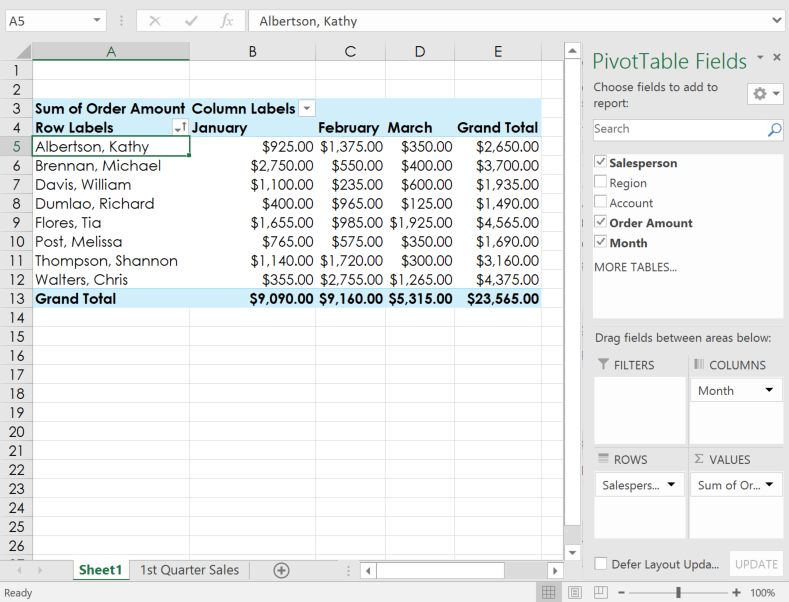

/en/excel/doing-more-with-pivottables/content/