# Bài học 28: làm được nhiều việc hơn với bảng xoay

#### Bài học 28: Làm được nhiều việc hơn với PivotTable

/en/excel/intro-to-pivottables/content/

### Giới thiệu

Như bạn đã học trong [bài học trước](../../intro-to-pivottables/1/index.html) 
của chúng tôi, PivotTable có thể được sử dụng để tóm tắt và phân tích hầu hết mọi loại dữ liệu. Để thao tác với PivotTable—và hiểu rõ hơn nữa về dữ liệu của bạn—Excel cung cấp ba công cụ bổ sung:** bộ lọc **,** s ** ** licers ** và ** PivotCharts **.

Xem video bên dưới để tìm hiểu thêm về cách nâng cao PivotTable.

#### Bộ lọc

Đôi khi bạn có thể muốn tập trung vào một phần dữ liệu nhất định của mình.** Bộ lọc ** có thể được sử dụng để ** thu hẹp ** dữ liệu trong PivotTable để bạn chỉ có thể xem thông tin mình cần.

#### Để thêm bộ lọc:

Trong ví dụ bên dưới, chúng tôi sẽ lọc ra ** nhân viên bán hàng ** nhất định để xác định doanh số bán hàng riêng lẻ của họ tác động như thế nào đến từng khu vực.

1. Kéo một trường từ ** Danh sách trường ** vào khu vực ** Bộ lọc **. Trong ví dụ này, chúng tôi sẽ sử dụng trường ** Nhân viên bán hàng **.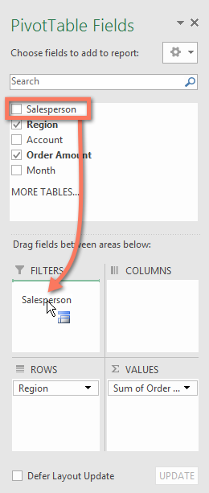

2.** bộ lọc ** sẽ xuất hiện phía trên PivotTable. Nhấp vào ** mũi tên thả xuống **, sau đó chọn hộp bên cạnh ** Chọn nhiều mục **.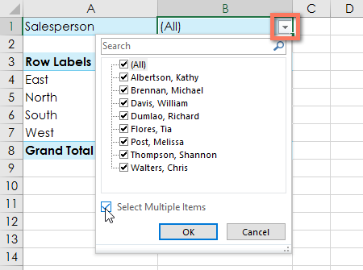

3.** Bỏ chọn ** hộp bên cạnh bất kỳ mục nào bạn không muốn đưa vào PivotTable. Trong ví dụ của chúng tôi, chúng tôi sẽ bỏ chọn các hộp dành cho một số nhân viên bán hàng, sau đó nhấp vào ** OK **.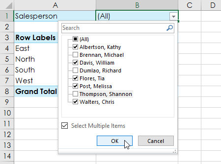

4. PivotTable sẽ ** điều chỉnh ** để phản ánh những thay đổi.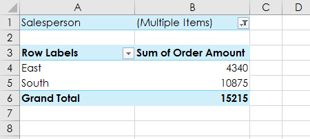

### Máy thái

 ** Bộ cắt ** giúp việc lọc dữ liệu trong PivotTable trở nên dễ dàng hơn nữa. Bộ cắt về cơ bản chỉ là ** bộ lọc ** nhưng sử dụng dễ dàng hơn và nhanh hơn, cho phép bạn xoay vòng dữ liệu của mình ngay lập tức. Nếu bạn thường xuyên lọc PivotTable của mình, bạn có thể cân nhắc sử dụng bộ cắt thay vì bộ lọc.

#### Để thêm một slicer:

1. Chọn ** bất kỳ ô nào ** trong PivotTable.
2. Từ tab ** Analyze **, hãy nhấp vào lệnh ** Insert Slicer **.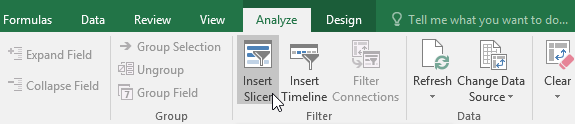

3. Một hộp thoại sẽ xuất hiện. Đánh dấu vào ô bên cạnh ** trường ** mong muốn. Trong ví dụ của chúng tôi, chúng tôi sẽ chọn ** Nhân viên bán hàng **, sau đó nhấp vào ** OK **.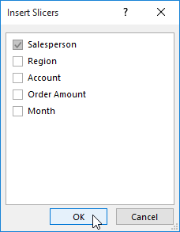

4. Bộ cắt sẽ xuất hiện bên cạnh PivotTable. Mỗi mục đã chọn sẽ được đánh dấu bằng ** màu xanh **. Trong ví dụ bên dưới, bộ cắt chứa tất cả tám nhân viên bán hàng, nhưng hiện chỉ ** năm ** trong số họ được chọn.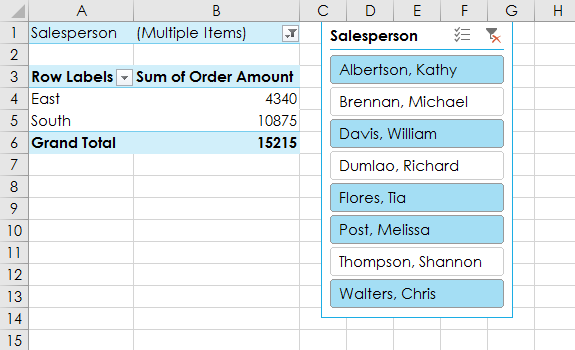

5. Cũng giống như các bộ lọc, chỉ các mục ** đã chọn ** mới được sử dụng trong PivotTable. Khi bạn ** chọn ** hoặc ** bỏ chọn ** một mục, PivotTable sẽ ngay lập tức phản ánh sự thay đổi. Hãy thử chọn các mục khác nhau để xem chúng ảnh hưởng như thế nào đến PivotTable. Nhấn và giữ phím ** Ctrl ** trên bàn phím để chọn ** nhiều ** mục cùng một lúc.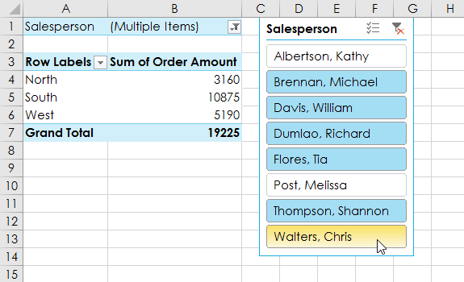

Bạn cũng có thể nhấp vào ** biểu tượng Bộ lọc ** ở góc trên bên phải của bộ cắt để chọn ** tất cả ** mục cùng một lúc.

### Biểu đồ Pivot

 ** PivotCharts ** giống như các biểu đồ thông thường, ngoại trừ việc chúng hiển thị dữ liệu từ ** PivotTable **. Giống như các biểu đồ thông thường, bạn sẽ có thể chọn ** loại biểu đồ **,** bố cục ** và ** kiểu ** sẽ thể hiện dữ liệu tốt nhất.

#### Để tạo PivotChart:

Trong ví dụ bên dưới, PivotTable của chúng tôi hiển thị một phần ** số liệu bán hàng ** của từng khu vực. Chúng tôi sẽ sử dụng PivotChart để có thể xem thông tin rõ ràng hơn.

1. Chọn ** bất kỳ ô nào ** trong PivotTable của bạn.
2. Từ tab ** Chèn **, hãy nhấp vào lệnh ** PivotChart **.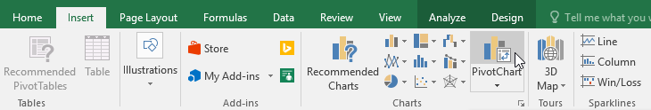

3. Hộp thoại ** Chèn biểu đồ ** sẽ xuất hiện. Chọn ** loại biểu đồ ** và ** bố cục ** mong muốn, sau đó nhấp vào ** OK **.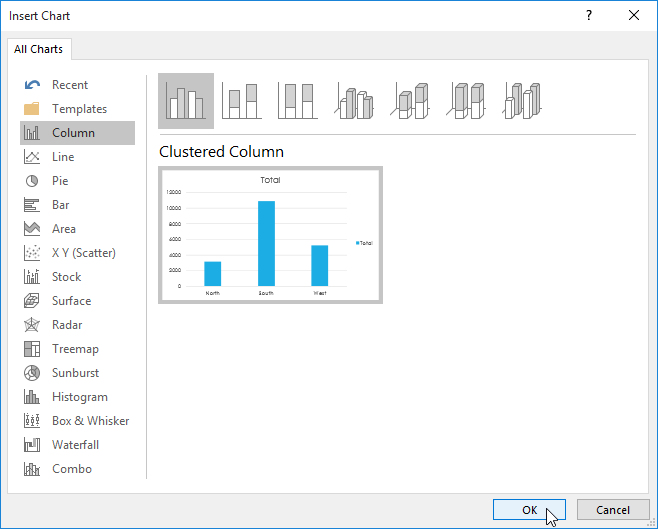

4. PivotChart sẽ xuất hiện.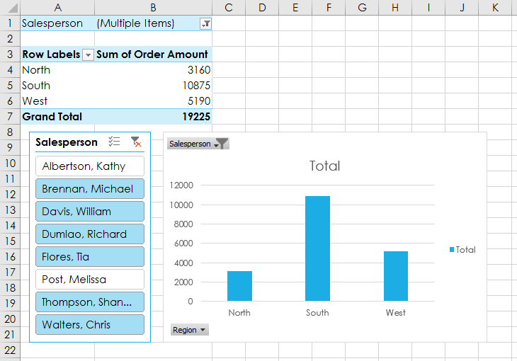

Hãy thử sử dụng ** bộ lọc ** hoặc ** bộ cắt ** để thu hẹp dữ liệu trong PivotChart của bạn. Để xem các tập hợp thông tin con khác nhau, hãy thay đổi ** cột ** hoặc ** hàng ** trong PivotTable của bạn. Trong ví dụ bên dưới, chúng tôi đã thay đổi PivotTable để xem ** doanh số hàng tháng ** của mỗi nhân viên bán hàng.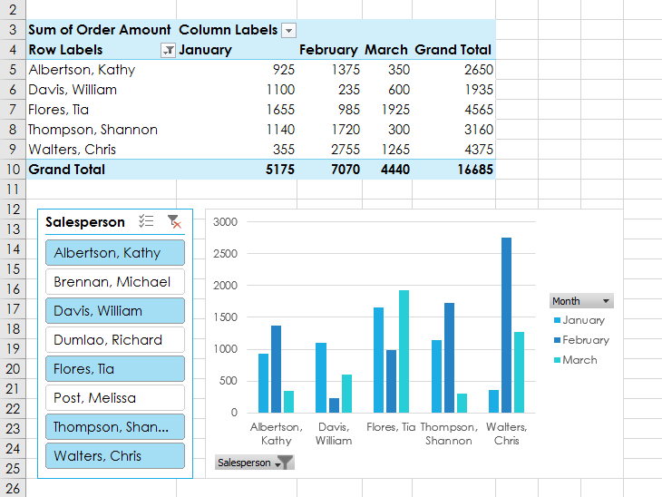

### Thử thách!

1. Mở [sổ làm việc thực hành](practice_files/excel_morepivottables_practice.xlsx) 
của chúng tôi.
2. Trong khu vực ** Hàng **, hãy xóa ** Vùng ** và thay thế bằng ** Nhân viên bán hàng **.
3. Chèn ** PivotChart ** và chọn loại ** Dòng có điểm đánh dấu **.
4. Chèn ** slicer ** cho ** Vùng **.
5. Sử dụng ** slicer ** để chỉ hiển thị các vùng ** Nam ** và **Đông **.
6. Thay đổi loại ** PivotChart ** thành ** Cột xếp chồng **.
7. Trong khung ** Trường PivotChart ** ở bên phải, hãy thêm ** Tháng ** vào khu vực ** Chú giải (Chuỗi)**.** Lưu ý **: Bạn cũng có thể bấm vào PivotTable và thêm ** Tháng ** vào khu vực ** Cột ** để có kết quả tương tự.
8. Khi bạn hoàn tất, sổ làm việc của bạn sẽ trông giống như thế này: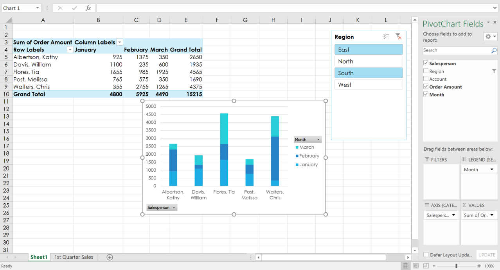

/en/excel/whatif-analysis/content/