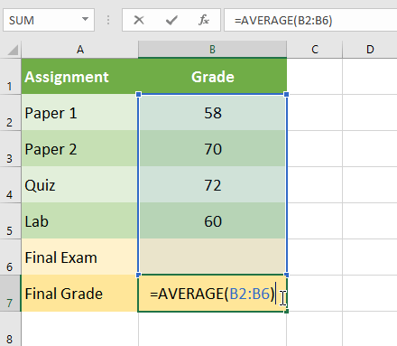
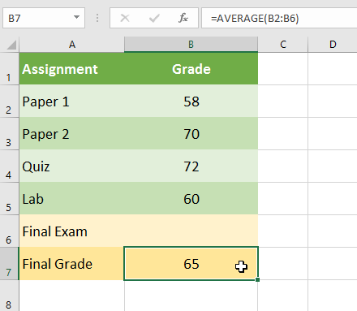
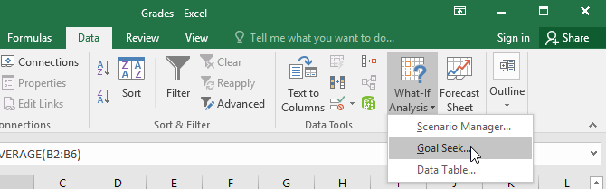
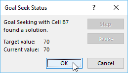
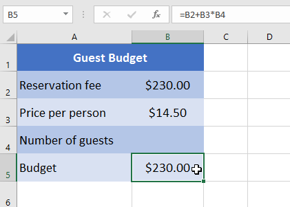
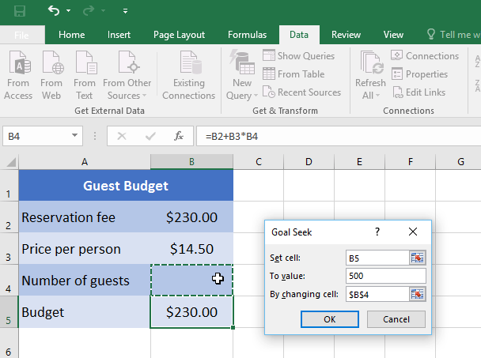
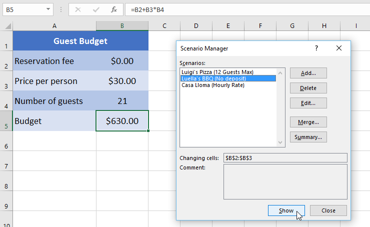
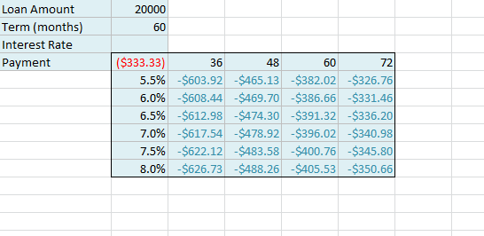
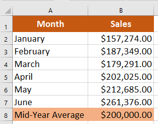

# Bài 29: phân tích whatif

#### Bài học 29: Phân tích giả định

/en/excel/doing-more-with-pivottables/content/

### Giới thiệu

Excel bao gồm các công cụ mạnh mẽ để thực hiện các phép tính toán học phức tạp, bao gồm ** phân tích giả định **. Tính năng này có thể giúp bạn ** thử nghiệm ** và ** trả lời câu hỏi ** với dữ liệu của bạn, ngay cả khi dữ liệu chưa đầy đủ. Trong bài học này, bạn sẽ học cách sử dụng công cụ phân tích giả định có tên ** Tìm kiếm mục tiêu **.

Xem video bên dưới để tìm hiểu thêm về phân tích giả định và Tìm kiếm mục tiêu.

### Tìm kiếm mục tiêu

Bất cứ khi nào bạn tạo một công thức hoặc hàm trong Excel, bạn sẽ ghép nhiều phần khác nhau lại với nhau để tính ** kết quả **.** Tìm kiếm mục tiêu ** hoạt động theo cách ngược lại: Nó cho phép bạn bắt đầu với ** kết quả mong muốn ** và tính toán ** giá trị đầu vào ** sẽ mang lại cho bạn kết quả đó. Chúng tôi sẽ sử dụng một số ví dụ để chỉ ra cách sử dụng Goal Seek.

#### Để sử dụng Tìm kiếm mục tiêu (ví dụ 1)
:

Giả sử bạn đã đăng ký vào một lớp học. Bạn hiện có số điểm là 65 và bạn cần ít nhất 70 điểm để vượt qua lớp học. May mắn thay, bạn có một bài tập cuối cùng có thể giúp nâng cao điểm trung bình của bạn. Bạn có thể sử dụng Goal Seek để tìm hiểu ** bạn cần đạt điểm bao nhiêu trong bài tập cuối cùng ** để vượt qua lớp học.

Trong hình ảnh bên dưới, bạn có thể thấy điểm của bốn bài tập đầu tiên là ** 58 **,** 70 **,** 72 ** và ** 60 **. Mặc dù chúng ta không biết lớp năm sẽ như thế nào, nhưng chúng ta có thể viết một công thức—hoặc hàm—để tính điểm cuối cùng. Trong trường hợp này, mỗi bài tập đều có trọng số như nhau, vì vậy tất cả những gì chúng ta phải làm là tính trung bình cộng của cả năm điểm bằng cách nhập **=AVERAGE(B2:B6)**. Khi chúng tôi sử dụng Tìm kiếm mục tiêu, ô ** B6 ** sẽ hiển thị cho chúng tôi điểm tối thiểu mà chúng tôi cần đạt được cho bài tập đó.

1. Chọn ô có giá trị bạn muốn thay đổi. Bất cứ khi nào bạn sử dụng Goal Seek, bạn sẽ cần chọn một ô đã chứa ** công thức ** hoặc ** hàm **. Trong ví dụ của chúng tôi, chúng tôi sẽ chọn ô ** B7 ** vì nó chứa công thức **=AVERAGE(B2:B6)**.

2. Từ tab ** Dữ liệu **, hãy nhấp vào lệnh ** What-If ** ** Analysis **, sau đó chọn ** Tìm kiếm mục tiêu ** từ trình đơn thả xuống.

3. Một hộp thoại sẽ xuất hiện với ba trường. Trường đầu tiên,**Đặt ô:**, sẽ chứa kết quả mong muốn. Trong ví dụ của chúng tôi, ô ** B7 ** đã được chọn.
 
 Trường thứ hai,** To value:**, là kết quả mong muốn. Trong ví dụ của chúng tôi, chúng tôi sẽ nhập ** 70 ** vì chúng tôi cần kiếm được ít nhất số tiền đó để vượt qua lớp học.
 
 Trường thứ ba,** B **

* ** y ô thay đổi:**, là ô nơi Goal Seek sẽ đặt câu trả lời. Trong ví dụ của chúng tôi, chúng tôi sẽ chọn ô ** B6 ** vì chúng tôi muốn xác định điểm chúng tôi cần đạt được trong bài tập cuối cùng.
4. Khi bạn hoàn tất, hãy nhấp vào ** OK.** 5. Hộp thoại sẽ cho bạn biết liệu Goal Seek có thể tìm ra giải pháp hay không. Nhấp vào ** OK **.

6. Kết quả sẽ xuất hiện trong ô được chỉ định. Trong ví dụ của chúng tôi, Goal Seek đã tính toán rằng chúng tôi sẽ cần đạt ít nhất 90 điểm trong bài tập cuối cùng để đạt điểm đậu.

#### Để sử dụng Goal Seek (ví dụ 2)
:

Giả sử bạn đang lên kế hoạch cho một sự kiện và muốn mời càng nhiều người càng tốt mà không vượt quá ngân sách 500 USD. Chúng ta có thể sử dụng Goal Seek để tìm ra số lượng người cần mời. Trong ví dụ bên dưới của chúng tôi, ô ** B5 ** chứa công thức **=B2+B3\*B4 ** để tính tổng chi phí đặt phòng, cộng với chi phí cho mỗi người.

1. Chọn ô có giá trị bạn muốn thay đổi. Trong ví dụ của chúng tôi, chúng tôi sẽ chọn ô ** B5 **.

2. Từ tab ** Dữ liệu **, hãy nhấp vào lệnh ** What-If ** ** Analysis **, sau đó chọn ** Tìm kiếm mục tiêu ** từ trình đơn thả xuống.

3. Một hộp thoại sẽ xuất hiện với ba trường. Trường đầu tiên,**Đặt ô:**, sẽ chứa kết quả mong muốn. Trong ví dụ của chúng tôi, ô ** B5 ** đã được chọn. Trường thứ hai,**Để giá trị:**, là kết quả mong muốn. Trong ví dụ của chúng tôi, chúng tôi sẽ nhập ** 500 ** vì chúng tôi chỉ muốn chi 500 đô la.
 
 Trường thứ ba,** Bằng cách thay đổi ô:**, là ô nơi Goal Seek sẽ đặt câu trả lời. Trong ví dụ của chúng tôi, chúng tôi sẽ chọn ô ** B4 ** vì chúng tôi muốn biết mình có thể mời bao nhiêu khách mà không phải chi quá 500 USD.
4. Khi bạn hoàn tất, hãy nhấp vào ** OK **.

5. Hộp thoại sẽ cho bạn biết liệu Goal Seek có thể tìm ra giải pháp hay không. Nhấp vào ** OK **.
6. Kết quả sẽ xuất hiện trong ô được chỉ định. Trong ví dụ của chúng tôi, Goal Seek đã tính toán câu trả lời là khoảng 18,62. Trong trường hợp này, câu trả lời cuối cùng của chúng ta cần phải là một số nguyên, vì vậy chúng ta sẽ cần làm tròn câu trả lời lên hoặc xuống. Vì việc làm tròn số sẽ khiến chúng tôi vượt quá ngân sách nên chúng tôi sẽ ** làm tròn ** thành 18 khách.

Như bạn có thể thấy trong ví dụ trên, một số tình huống sẽ yêu cầu đáp án là số nguyên. Nếu Goal Seek cung cấp cho bạn số thập phân, bạn sẽ cần ** làm tròn lên hoặc xuống **, tùy thuộc vào tình huống.

### Các loại phân tích what-if khác

Đối với các dự án nâng cao hơn, bạn có thể muốn xem xét các loại phân tích giả định khác:** kịch bản ** và ** bảng dữ liệu **. Thay vì bắt đầu từ kết quả mong muốn và làm việc ngược lại, như với Goal Seek, các tùy chọn này cho phép bạn kiểm tra nhiều giá trị và xem kết quả thay đổi như thế nào.

* ** Kịch bản ** cho phép bạn thay thế các giá trị cho ** nhiều ô **(tối đa 32) 
cùng một lúc. Bạn có thể tạo bao nhiêu kịch bản tùy thích rồi so sánh chúng mà không cần thay đổi giá trị theo cách thủ công. Trong ví dụ bên dưới, chúng tôi đang sử dụng các tình huống để so sánh các địa điểm khác nhau cho sự kiện sắp tới.

Để biết thêm thông tin về các kịch bản, hãy đọc [this bài viết](../../../not-offline.html?url=https:/support.microsoft.com/en-us/office/switch-between-various-sets-of-values-by-USE-scenarios-20 68afb1-ecdf-4956-9822-19ec479f55a2?ocmsassetid=hp010072669&ctt=1&correlationid=5c034d22-eb63-470d-9feb-b40a0c7c2f0e&ui=en-us&rs=en-us&ad=us) 
từ Microsoft.

* ** Bảng dữ liệu ** cho phép bạn lấy một hoặc hai biến trong công thức và thay thế chúng bằng ** bao nhiêu giá trị khác nhau tùy thích **, sau đó xem kết quả trong bảng. Tùy chọn này đặc biệt mạnh mẽ vì nó hiển thị ** nhiều kết quả ** cùng một lúc, không giống như các tình huống hoặc Tìm kiếm mục tiêu. Trong ví dụ dưới đây, chúng ta có thể xem 24 kết quả có thể xảy ra đối với khoản vay mua ô tô.

Để biết thêm thông tin về bảng dữ liệu, hãy đọc [this bài viết](../../../not-offline.html?url=https:/support.microsoft.com/en-us/office/calcate-multiple-results-by-USE-a-data-table-e95e24 87-6ca6-4413-ad12-77542a5ea50b?ocmsassetid=hp010342214&ctt=1&correlationid=6fb69dd1-4b01-4468-aae3-44e4669379d4&ui=en-us&rs=en-us&ad=us) 
từ Microsoft.

### Thử thách!

1. Mở [sổ làm việc thực hành](practice_files/excel_whatifanalysis_practice.xlsx) 
của chúng tôi.
2. Nhấp vào tab ** Thử thách ** ở phía dưới bên trái của sổ làm việc.
3. Trong ô ** B8 **, hãy tạo một ** hàm ** tính ** trung bình ** của doanh số bán hàng trong ** B2:B7 **.
4. Sổ làm việc cho thấy số tiền bán hàng hàng tháng của Dave trong nửa đầu năm. Nếu anh ta đạt mức trung bình 200.000 USD vào giữa năm, anh ta sẽ nhận được 5% tiền thưởng. Sử dụng ** Tìm kiếm mục tiêu ** để biết anh ấy cần bán bao nhiêu trong tháng 6 để kiếm được mức trung bình 200.000 USD.
5. Khi bạn hoàn tất, sổ làm việc của bạn sẽ trông như thế này:

/en/excel/what-is-office-365/content/