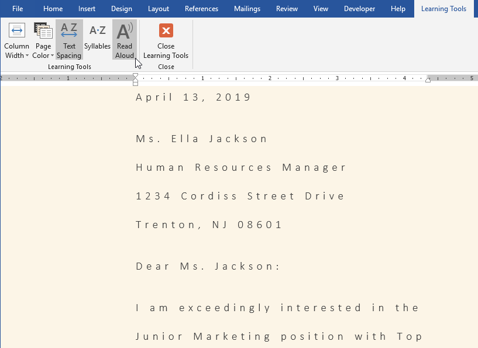
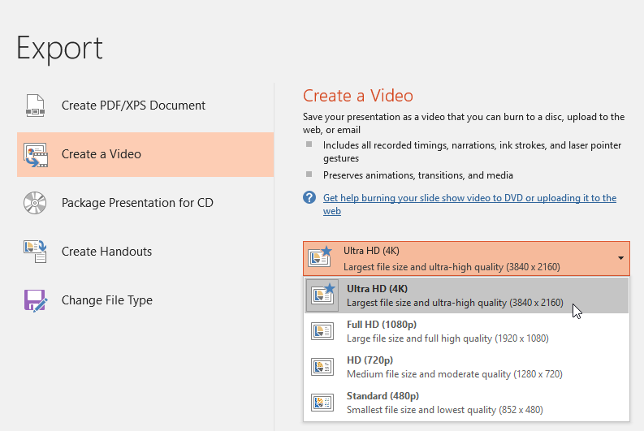
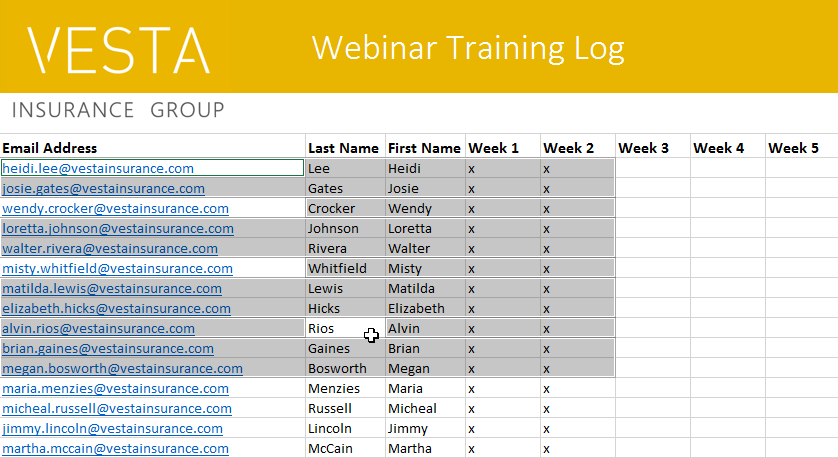

# Bài 31: tính năng mới trong văn phòng-2019

#### Bài 31: Tính năng mới trong Office 2019

/en/excel/what-is-office-365/content/

### Các tính năng mới trong Office 2019

Office 2019 được phát hành vào tháng 9 năm 2018. Nếu bạn đã sử dụng Office 2016 hoặc các phiên bản cũ hơn, có thể bạn sẽ thấy Office 2019 quen thuộc. Giao diện tương tự và hầu hết các tính năng vẫn hoạt động như cũ. Tuy nhiên, có một số cải tiến được thiết kế để giúp Office 2019 mạnh mẽ hơn và dễ sử dụng hơn.

Office 2019 chỉ khả dụng cho các máy tính chạy ** Windows 10 ** hoặc một trong ** ba phiên bản macOS mới nhất **.

Xem video bên dưới để tìm hiểu thêm về những cải tiến và tính năng mới của Office 2019.

#### Cập nhật trực quan

Office 2019 đi kèm với một số tính năng mới giúp tùy chỉnh hình ảnh cho dự án của bạn. Có một thư viện đồ họa mới có tên ** Biểu tượng ** mà bạn có thể sử dụng và tùy chỉnh theo cách bạn muốn. Bạn cũng có thể biến bản vẽ của mình thành các hình dạng tiêu chuẩn bằng cách sử dụng chức năng ** Ink to Shape ** và chèn ** mô hình 3D tương tác ** vào dự án của mình.

#### Từ

Word có một tính năng mới tên là ** Công cụ Học tập ** có thể giúp văn bản dễ đọc hơn mà không cần thực hiện các thay đổi vĩnh viễn đối với tài liệu của bạn. Bạn có thể thay đổi khoảng cách văn bản, màu trang hoặc thậm chí để Word đọc to văn bản của bạn.

#### PowerPoint

PowerPoint bao gồm chuyển tiếp ** Biến đổi ** mới cho phép bạn tạo hiệu ứng động cho các đối tượng giữa các trang chiếu trong một khoảng thời gian ngắn. Nếu bạn muốn lưu bản trình bày của mình dưới dạng tệp video thì giờ đây PowerPoint cũng cung cấp cho bạn khả năng xuất bản trình bày của mình ở ** độ phân giải 4K **.

#### Excel

Có một số loại biểu đồ mới trong Excel:** biểu đồ bản đồ ** và ** biểu đồ kênh **. Ngoài ra còn có một tính năng được gọi là ** lựa chọn chính xác **, cho phép bạn bỏ chọn từng ô sau khi đã đánh dấu chúng.

#### Office 2019 so với Office 365

Điều quan trọng cần lưu ý là Office 2019 ** không có nhiều tính năng mới như Office 365 **. Nếu quan tâm đến các bản cập nhật năng động hơn, bạn có thể muốn xem xét Office 365 dựa trên đăng ký thay thế.

Nhiều thay đổi và cải tiến trong Office 2019 tuy nhỏ nhưng có thể giúp tăng năng suất và khả năng sử dụng dễ dàng trong một số trường hợp nhất định.

/en/excel/what-are-reference-styles/content/