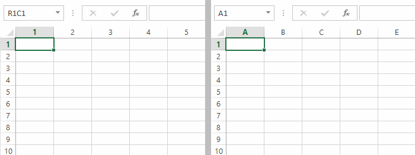
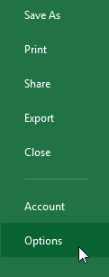
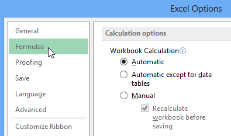

# Bài 32: kiểu tham chiếu là gì

#### Bài 32: Kiểu tham chiếu là gì?

/en/excel/new-features-in-office-2019/content/

### Phong cách tham khảo là gì?

Mỗi bảng tính Excel đều chứa ** hàng ** và ** cột **. Thông thường, các cột được xác định bằng ** chữ cái ** **(A, B, C)** và các hàng được xác định bằng ** số (1, 2, 3)**. Trong Excel, đây được gọi là kiểu ** A1 ** ** tham chiếu ** **. Tuy nhiên, một số người thích sử dụng một phương pháp khác trong đó các cột cũng được xác định bằng số. Đây được gọi là ** kiểu tham chiếu R1C1 ** **.

Trong ví dụ bên dưới, hình ảnh bên trái có ** số ** trên mỗi cột, nghĩa là nó đang sử dụng kiểu tham chiếu ** R1C1 **. Hình ảnh bên phải đang sử dụng kiểu tham chiếu ** A1 **.

Mặc dù kiểu tham chiếu R1C1 hữu ích trong một số trường hợp nhất định nhưng có thể bạn sẽ muốn sử dụng kiểu tham chiếu A1 trong hầu hết thời gian. Hướng dẫn này sẽ sử dụng kiểu tham chiếu A1. Nếu hiện đang sử dụng kiểu tham chiếu R1C1, bạn cần ** tắt nó **.

#### Để tắt kiểu tham chiếu R1C1:

1. Nhấp vào tab ** Tệp ** để truy cập ** Backstage view **.

2. Nhấp vào ** Tùy chọn **.

3. Hộp thoại ** Tùy chọn Excel ** sẽ xuất hiện. Nhấp vào ** Công thức ** ở bên trái hộp thoại.

4. Bỏ chọn hộp bên cạnh ** kiểu tham chiếu R1C1 **, sau đó nhấp vào ** OK **. Excel bây giờ sẽ sử dụng kiểu tham chiếu A1.

/en/excel/office-intelligent-services/content/