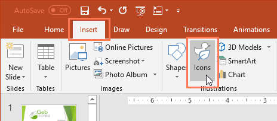
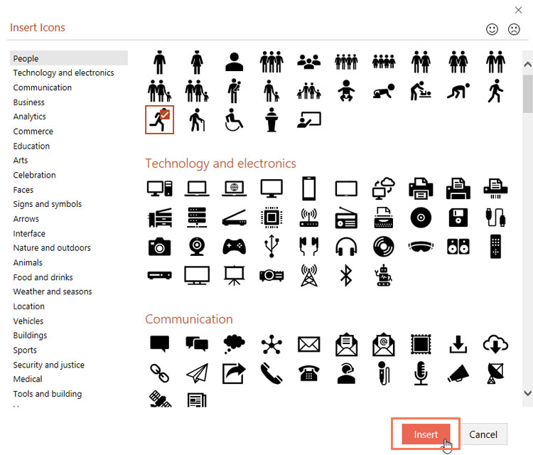
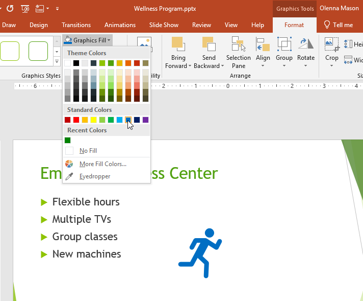
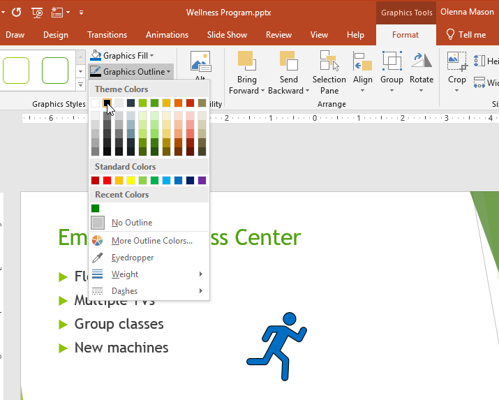
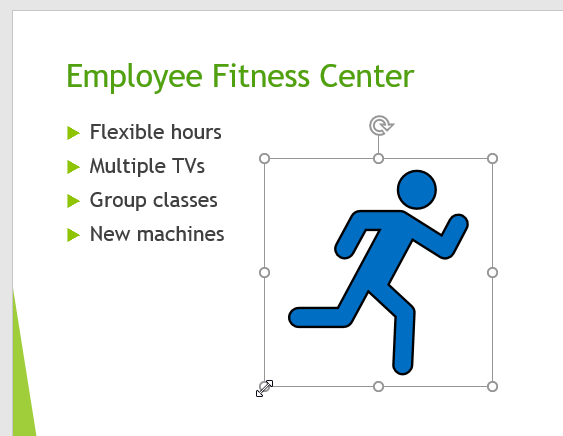
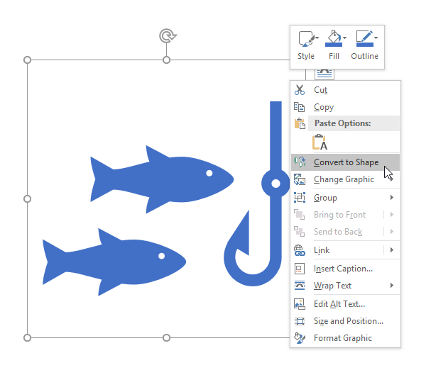
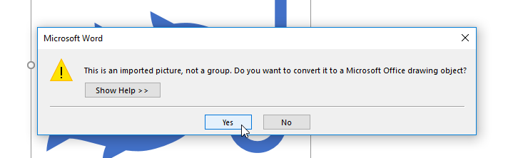
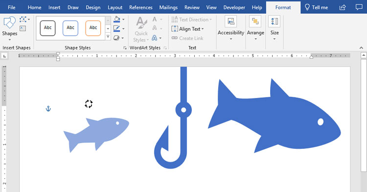

# Bài 35: làm việc với icon

#### Bài 35: Làm việc với Icon

/en/excel/using-the-draw-tab/content/

### Làm việc với các biểu tượng

Nếu bạn cần đồ họa cho một dự án, bạn có thể sử dụng một tính năng có tên là ** biểu tượng **. Biểu tượng là một thư viện ** đồ họa hiện đại, chuyên nghiệp ** đi kèm với Office 365 và 2019 và chúng có thể được ** tùy chỉnh ** để phù hợp với nhu cầu của bạn. Các biểu tượng có sẵn trong ** Word **,** Excel **,** Outlook ** và ** PowerPoint **.

Xem video dưới đây để tìm hiểu thêm về các biểu tượng.

#### Chèn biểu tượng

Để chèn một biểu tượng, hãy nhấp vào tab ** Chèn ** rồi chọn ** Biểu tượng **.

Trình đơn ** Chèn biểu tượng ** sẽ xuất hiện. Bạn có thể cuộn qua nhiều chủ đề khác nhau, bao gồm con người, công nghệ, thương mại, nghệ thuật, v.v. Khi bạn tìm thấy biểu tượng mình thích, hãy chọn biểu tượng đó rồi nhấp vào ** Chèn **.

#### Tùy chỉnh biểu tượng

Sau khi chèn biểu tượng, có một số cách khác nhau để bạn có thể tùy chỉnh biểu tượng đó.

Để thay đổi ** màu ** của một biểu tượng, hãy chọn biểu tượng bạn muốn chỉnh sửa. Tab **Định dạng ** sẽ xuất hiện. Sau đó nhấp vào ** Graphics Fill ** và chọn màu từ menu thả xuống.

Để thêm ** đường viền ** vào biểu tượng của bạn, hãy nhấp vào ** Hình dạng đường viền ** và chọn màu từ menu thả xuống.

Bạn cũng có thể thay đổi ** kích thước ** của biểu tượng bằng cách giữ một trong các ** bộ điều khiển định cỡ ** và kéo biểu tượng đó. Vì chúng là **[đồ họa vector](../../../beginning-graphic-design/images/1/index.html)** nên bạn có thể tạo biểu tượng lớn như bạn muốn mà không trông như bị pixel.

#### Chia một biểu tượng thành nhiều phần

Một số biểu tượng có thể được ** chia thành các phần riêng biệt **, cho phép bạn chỉnh sửa từng phần riêng lẻ để tùy chỉnh thêm.

1. Nhấp chuột phải vào biểu tượng và chọn ** Chuyển đổi thành hình dạng **.

2. Nhấp vào ** Có ** trong hộp thoại.

3. Nếu biểu tượng của bạn có các phần riêng lẻ thì giờ đây bạn có thể tự chỉnh sửa từng phần, thay đổi kích thước, màu sắc và vị trí của phần đó.

Các biểu tượng cung cấp rất nhiều khả năng để tùy chỉnh giao diện dự án của bạn. Hãy dùng thử nếu bạn đang tìm kiếm một số hình ảnh đơn giản, bóng bẩy để nâng cao nội dung của mình.

/en/excel/excel-quiz/content/