# Bài 10: sử dụng-tìm-thay thế

#### Bài 10: Sử dụng Tìm & Thay thế

/en/excel/working-with-multiple-worksheets/content/

### Giới thiệu

Khi làm việc với nhiều dữ liệu trong Excel, việc xác định thông tin cụ thể có thể khó khăn và tốn thời gian. Bạn có thể dễ dàng tìm kiếm sổ làm việc của mình bằng tính năng ** Tìm **, tính năng này cũng cho phép bạn sửa đổi nội dung bằng tính năng ** Thay thế **.

Xem video bên dưới để tìm hiểu thêm về cách sử dụng Tìm và Thay thế.

#### Để tìm nội dung ô:

Trong ví dụ của chúng tôi, chúng tôi sẽ sử dụng lệnh Tìm để định vị một bộ phận cụ thể trong danh sách này.

1. Từ tab ** Trang chủ **, hãy nhấp vào lệnh ** Tìm và chọn **, sau đó chọn ** Tìm ** từ trình đơn thả xuống.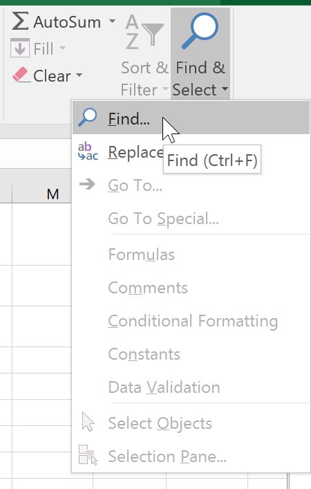

2. Hộp thoại ** Tìm và Thay thế ** sẽ xuất hiện. Nhập ** nội dung ** bạn muốn tìm. Trong ví dụ của chúng tôi, chúng tôi sẽ nhập tên của bộ phận.
3. Nhấp vào ** Tìm tiếp **. Nếu tìm thấy nội dung, ô chứa nội dung đó sẽ được ** chọn **.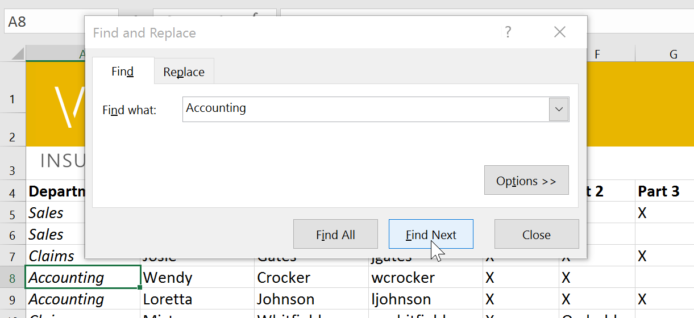

4. Nhấp vào ** Tìm tiếp ** để tìm thêm trường hợp hoặc ** Tìm tất cả ** để xem mọi trường hợp của cụm từ tìm kiếm.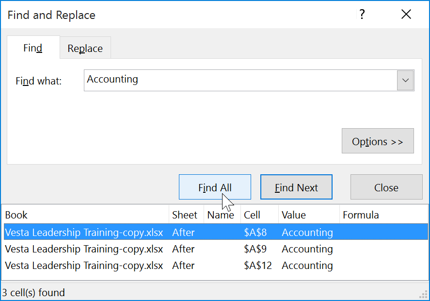

5. Khi bạn hoàn tất, hãy nhấp vào **Đóng ** để thoát khỏi hộp thoại Tìm và Thay thế.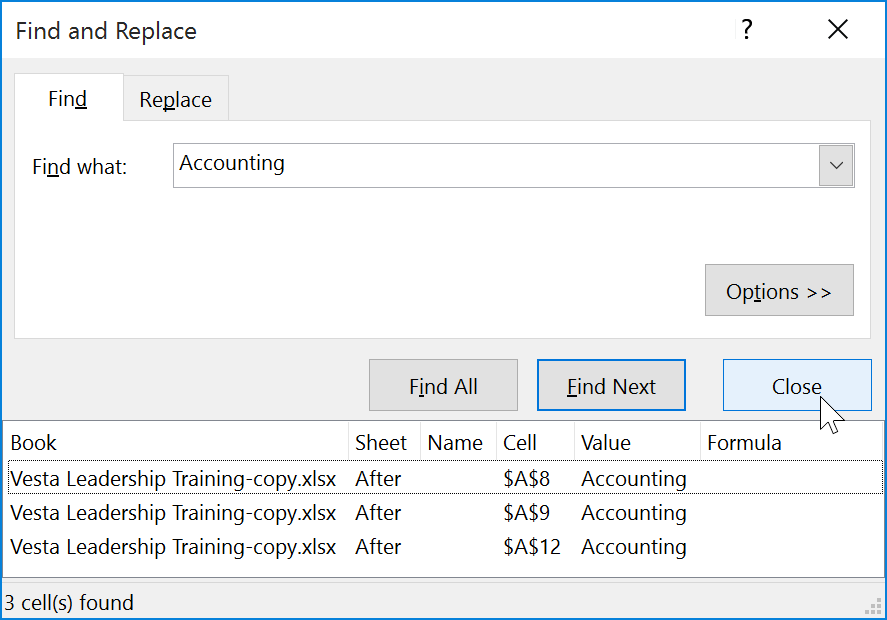

Bạn cũng có thể truy cập lệnh Tìm bằng cách nhấn ** Ctrl+F ** trên bàn phím.

Nhấp vào ** Tùy chọn ** để xem tiêu chí tìm kiếm nâng cao trong hộp thoại Tìm và Thay thế.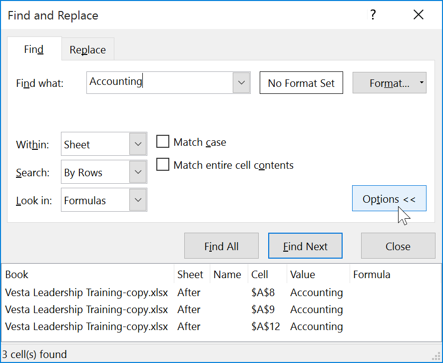

#### Để thay thế nội dung ô:

Đôi khi, bạn có thể phát hiện ra rằng mình đã liên tục mắc lỗi trong suốt sổ làm việc của mình (chẳng hạn như viết sai chính tả tên của ai đó) 
hoặc bạn cần đổi một từ hoặc cụm từ cụ thể bằng một từ hoặc cụm từ khác. Bạn có thể sử dụng tính năng ** Tìm và Thay thế ** của Excel để thực hiện các sửa đổi nhanh chóng. Trong ví dụ của chúng tôi, chúng tôi sẽ sử dụng Tìm và Thay thế để sửa danh sách tên bộ phận.

1. Từ tab ** Trang chủ **, nhấp vào lệnh ** Tìm & Chọn **, sau đó chọn ** Thay thế...** từ trình đơn thả xuống.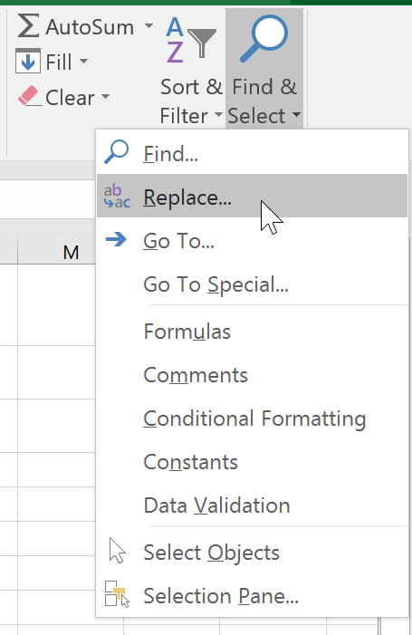

2. Hộp thoại ** Tìm và Thay thế ** sẽ xuất hiện. Nhập văn bản bạn muốn tìm vào trường ** Find what:**.
3. Nhập văn bản bạn muốn thay thế vào trường ** Thay thế bằng:**, sau đó nhấp vào ** Tìm tiếp **.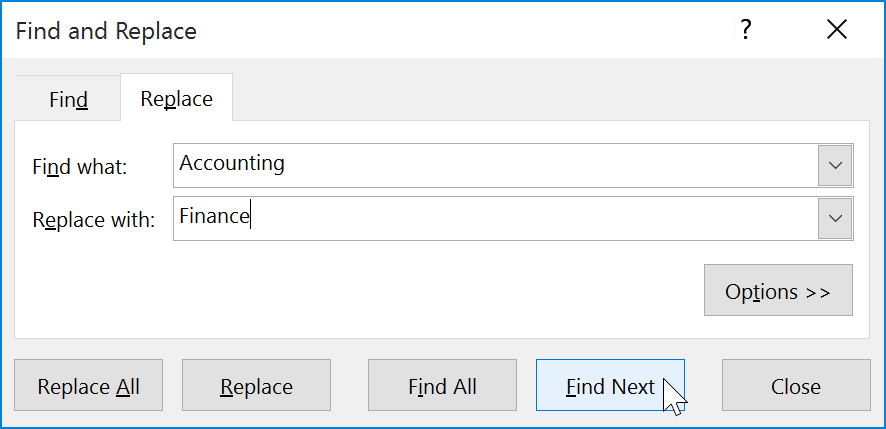

4. Nếu tìm thấy nội dung, ô chứa nội dung này sẽ được ** chọn **.
5.** Xem lại ** văn bản để đảm bảo bạn muốn thay thế nó.
6. Nếu bạn muốn thay thế nó, hãy chọn một trong các tùy chọn ** thay thế **. Việc chọn ** Thay thế ** sẽ thay thế các phiên bản riêng lẻ, trong khi ** Thay thế tất cả ** sẽ thay thế mọi phiên bản của văn bản trong toàn bộ sổ làm việc. Trong ví dụ của chúng tôi, chúng tôi sẽ chọn tùy chọn này để tiết kiệm thời gian.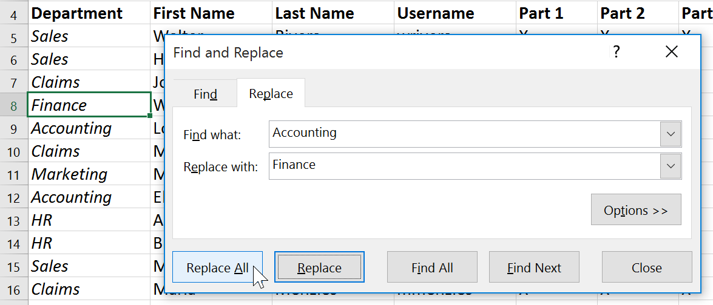

7. Một hộp thoại sẽ xuất hiện xác nhận số lần thay thế đã thực hiện. Nhấp vào ** OK ** để tiếp tục.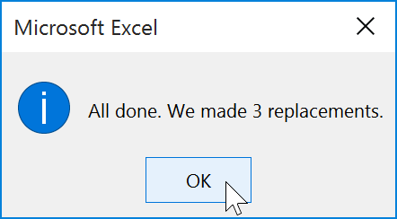

8. Nội dung ô đã chọn sẽ được ** thay thế **.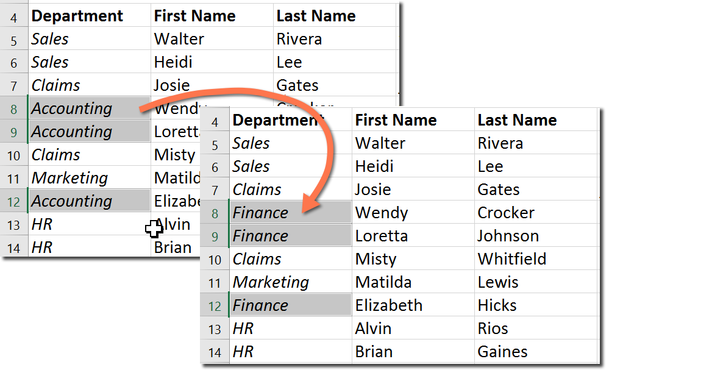

9. Khi bạn hoàn tất, hãy bấm Đóng để thoát khỏi hộp thoại Tìm và Thay thế.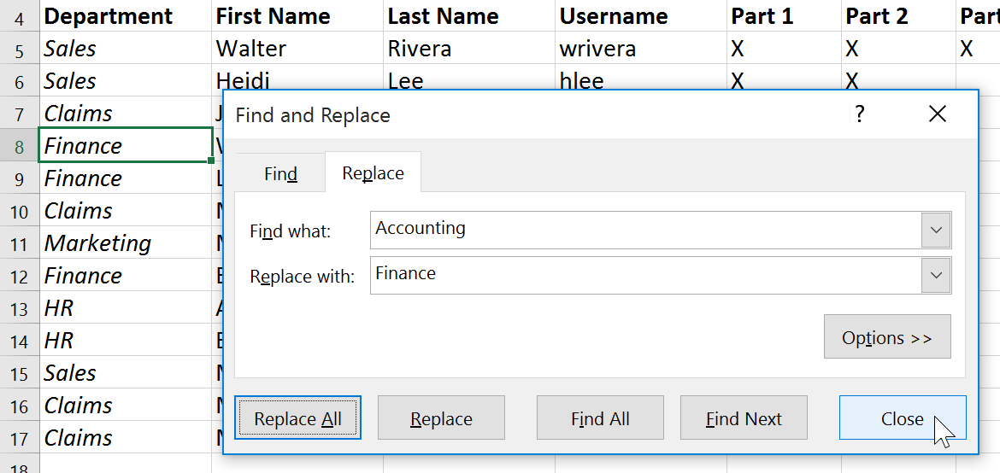

Nói chung, tốt nhất bạn nên tránh sử dụng ** Thay thế tất cả ** vì nó không cung cấp cho bạn tùy chọn bỏ qua bất cứ điều gì bạn không muốn thay đổi. Bạn chỉ nên sử dụng tùy chọn này nếu bạn hoàn toàn chắc chắn rằng nó sẽ không thay thế bất cứ thứ gì bạn không mong muốn.

### Thử thách!

1. Mở [sổ làm việc thực hành](practice_files/excel_findreplace_practice.xlsx) 
của chúng tôi.
2. Nhấp vào tab ** Thử thách ** ở phía dưới bên trái của sổ làm việc.
3. Crystal Lewis kết hôn và đổi họ của mình thành Taylor. Sử dụng ** Tìm và thay thế ** để thay đổi họ của Crystal từ ** Lewis ** thành ** Taylor **. Hãy cẩn thận ** chỉ ** thay đổi họ của Crystal!
4. Tìm và thay thế ** Bio ** bằng ** Biology **. Hãy cẩn thận ** không ** thay đổi chuyên ngành Kỹ thuật Y sinh!
5. Sử dụng ** Tìm và thay thế tất cả ** để thay thế chuyên ngành ** Vật lý ** thành ** Khoa học vật lý **.
6. Khi bạn hoàn tất, bảng tính của bạn sẽ trông như thế này:

/en/excel/kiểm tra chính tả/nội dung/