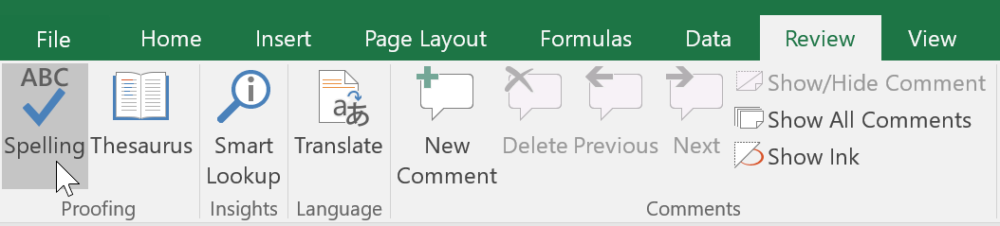
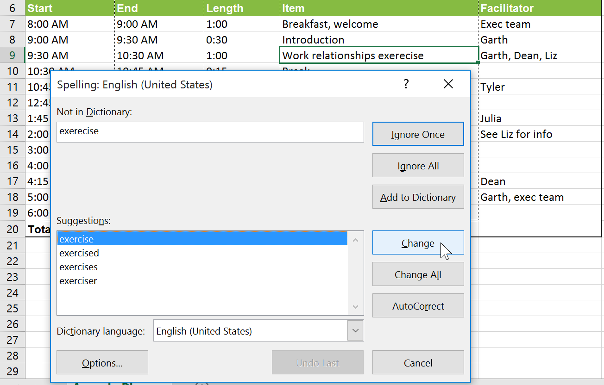
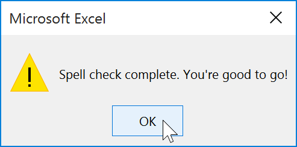
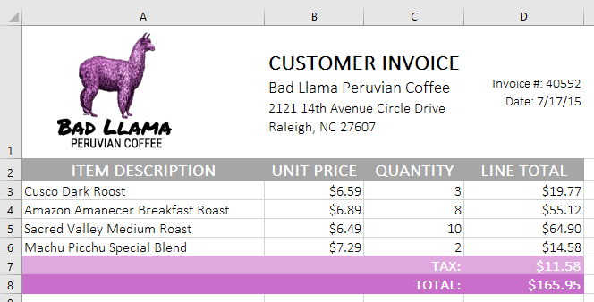

# Bài 11: kiểm tra chính tả

#### Bài 11: Kiểm tra chính tả

/en/excel/using-find-replace/content/

### Giới thiệu

Trước khi chia sẻ sổ làm việc, bạn cần đảm bảo sổ làm việc không có bất kỳ lỗi chính tả nào. May mắn thay, Excel có công cụ ** kiểm tra chính tả ** mà bạn có thể sử dụng để đảm bảo mọi thứ trong sổ làm việc của bạn đều đúng chính tả.

Nếu bạn đã sử dụng tính năng kiểm tra chính tả trong Microsoft Word, chỉ cần lưu ý rằng công cụ kiểm tra chính tả trong Excel tuy hữu ích nhưng không mạnh mẽ bằng. Ví dụ: nó sẽ không kiểm tra các vấn đề ngữ pháp hoặc kiểm tra chính tả khi bạn nhập.

#### Để sử dụng tính năng kiểm tra chính tả:

1. Từ tab **Đánh giá **, hãy nhấp vào lệnh ** Chính tả **.

2. Hộp thoại ** Chính tả ** sẽ xuất hiện. Đối với mỗi lỗi chính tả trong bảng tính của bạn, nó sẽ cố gắng đưa ra ** gợi ý ** cho cách viết đúng. Chọn một gợi ý rồi nhấn ** Thay đổi ** để sửa lỗi.

3. Một hộp thoại sẽ xuất hiện sau khi xem lại tất cả các lỗi chính tả. Nhấp vào ** OK ** để đóng kiểm tra chính tả.

Nếu không có gợi ý phù hợp, bạn cũng có thể nhập đúng chính tả theo cách thủ công.

#### Bỏ qua "lỗi" chính tả

Kiểm tra chính tả ** không phải lúc nào cũng đúng **. Đôi khi nó sẽ đánh dấu một số từ nhất định là sai ngay cả khi chúng viết đúng chính tả. Điều này thường xảy ra với những cái tên có thể không có trong từ điển. Bạn có thể chọn ** không ** để thay đổi "lỗi" chính tả bằng một trong ba tùy chọn sau:

* ** Bỏ qua một lần **: Thao tác này sẽ bỏ qua từ mà không thay đổi từ đó.

* ** Bỏ qua tất cả **: Thao tác này sẽ bỏ qua từ mà không thay đổi nó và cũng bỏ qua tất cả các trường hợp khác của từ trong trang tính của bạn.

* ** Thêm **: Thao tác này sẽ thêm từ vào từ điển để nó sẽ không bao giờ xuất hiện dưới dạng lỗi nữa. Đảm bảo từ đó được viết đúng chính tả trước khi chọn tùy chọn này.

### Thử thách!

1. Mở [sổ làm việc thực hành](practice_files/excel_checkspelling_practice.xlsx) 
của chúng tôi.
2. Nhấp vào tab bảng tính ** Thử thách ** ở phía dưới bên trái của bảng tính.
3. Chạy ** kiểm tra chính tả ** để sửa mọi lỗi chính tả trong sổ làm việc.
4. Sửa các từ ** coffe ** và ** medum ** bằng ** cách viết gợi ý **.
5.** Bỏ qua ** gợi ý chính tả cho từ ** Amanecer **.
6. Khi bạn hoàn tất, bảng tính của bạn sẽ trông như thế này:

7.** Bước thưởng!** Có một lỗi chính tả không được phát hiện. Bạn có thể nhận ra nó?** Gợi ý:** Nó nằm trong một trong các mô tả sản phẩm.

/en/excel/page-layout-and-printing/content/