# Bài 12: Bố cục trang và in ấn

#### Bài 12: Bố cục trang và in ấn

/en/excel/kiểm tra chính tả/nội dung/

### Giới thiệu

Có thể đôi khi bạn muốn ** in sổ làm việc ** để xem và chia sẻ dữ liệu của mình ** ngoại tuyến **. Sau khi bạn đã chọn cài đặt ** bố cục trang **, bạn có thể dễ dàng xem trước và in sổ làm việc từ Excel bằng cách sử dụng ngăn ** In **.

Xem video bên dưới để tìm hiểu thêm về bố cục trang và in ấn.

#### Để truy cập khung In:

1. Chọn tab ** Tệp **.** Backstage view ** sẽ xuất hiện.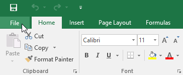

2. Chọn ** In **. Khung ** In ** sẽ xuất hiện.

Nhấp vào các nút trong phần tương tác bên dưới để tìm hiểu thêm về cách sử dụng khung In.

chỉnh sửa điểm phát sóng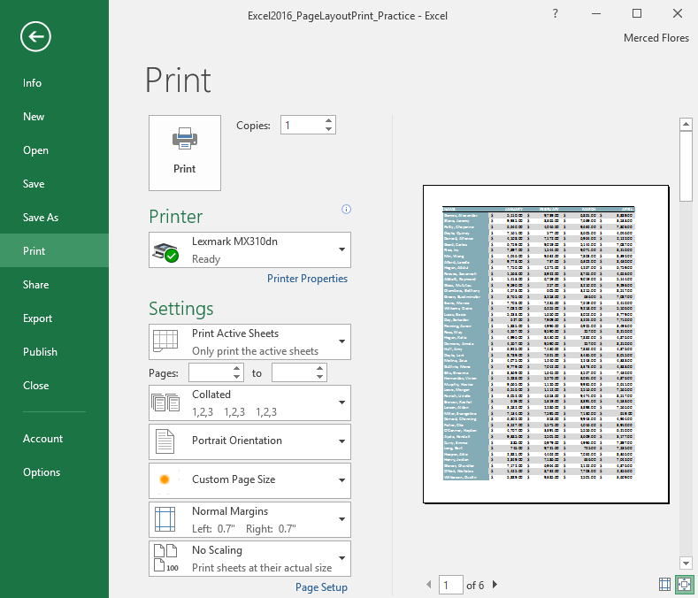

## Chia tỷ lệ

Tại đây, bạn có thể chọn cách chia tỷ lệ bảng tính của mình để in.

## Lề

Tại đây, bạn có thể điều chỉnh lề trang.

## Khổ giấy

Bạn có thể chọn khổ giấy muốn sử dụng nếu máy in của bạn hỗ trợ cài đặt này.

## Định hướng trang

Tại đây, bạn có thể chọn hướng dọc hoặc hướng ngang.

## đối chiếu

Nếu bạn in nhiều bản sao, bạn có thể chọn xem chúng sẽ được chia bộ hay không chia bộ.

## Phạm vi in

Tại đây, bạn có thể chọn in các trang tính đang hoạt động, toàn bộ sổ làm việc hoặc một vùng chọn.

## Máy in

Nếu bạn có nhiều máy in, hãy chọn máy in bạn muốn sử dụng.

## In

Bấm vào nút này để in sổ làm việc.

## Bản sao

Tại đây, bạn có thể chọn số lượng bản sao bạn muốn in.

## Lựa chọn trang

Bạn có thể nhấp vào mũi tên để xem một trang khác trong khung Xem trước.

## Phóng to trang/Hiển thị lề

Nút Zoom to Page ở bên phải sẽ phóng to và thu nhỏ trong khung Preview.
 
Nút Hiển thị lề ở bên trái sẽ hiển thị lề trong khung Xem trước.

## Ngăn xem trước

Tại đây, bạn có thể xem bản xem trước trang tính của mình sẽ trông như thế nào khi được in.

#### Để in một sổ làm việc:

1. Điều hướng đến khung ** In **, sau đó chọn ** máy in ** mong muốn.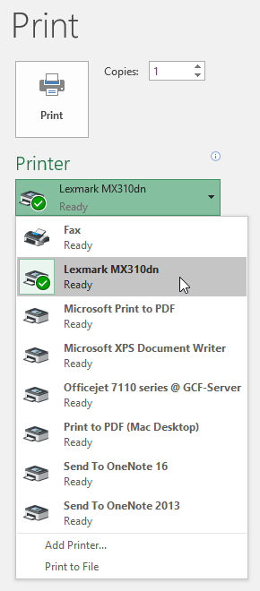

2. Nhập số lượng ** bản sao ** bạn muốn in.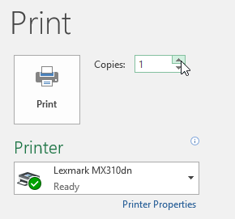

3. Chọn bất kỳ ** cài đặt ** bổ sung nào nếu cần (xem phần tương tác ở trên).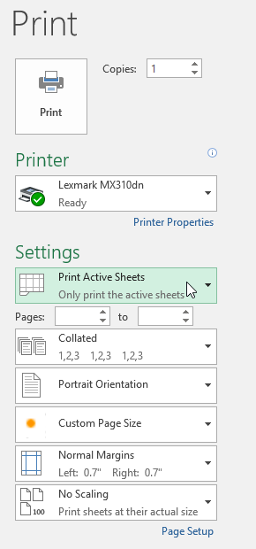

4. Nhấp vào ** In **.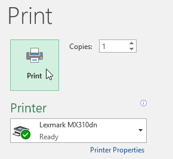

### Chọn vùng in

Trước khi in sổ làm việc Excel, điều quan trọng là phải quyết định chính xác thông tin bạn muốn in. Ví dụ: nếu bạn có nhiều trang tính trong sổ làm việc, bạn sẽ cần phải quyết định xem bạn muốn in ** toàn bộ ** ** sổ làm việc ** hay chỉ ** hoạt động ** ** trang tính **. Cũng có thể đôi khi bạn chỉ muốn in một ** lựa chọn ** nội dung từ sổ làm việc của mình.

#### Để in các trang đang hoạt động:

Các trang tính được coi là đang hoạt động khi ** được chọn **.

1. Chọn ** bảng tính ** bạn muốn in. Để in ** nhiều ** ** trang tính **, hãy nhấp vào trang tính đầu tiên, giữ phím ** Ctrl ** trên bàn phím, sau đó nhấp vào bất kỳ trang tính nào khác mà bạn muốn chọn.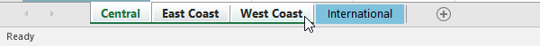

2. Điều hướng đến khung ** In **.
3. Chọn ** In các trang hiện hoạt ** từ trình đơn thả xuống ** Phạm vi in **.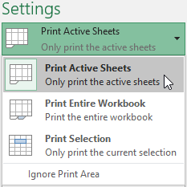

4. Nhấp vào nút ** In **.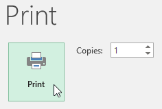

#### Để in toàn bộ sổ làm việc:

1. Điều hướng đến khung ** In **.
2. Chọn ** In toàn bộ sổ làm việc ** từ trình đơn thả xuống ** Phạm vi in **.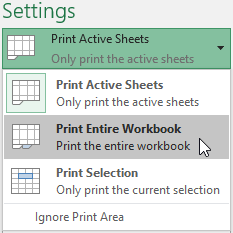

3. Nhấp vào nút ** In **.

#### Để in một lựa chọn:

Trong ví dụ của chúng tôi, chúng tôi sẽ in bản ghi của 40 nhân viên bán hàng hàng đầu trên bảng tính Central.

1. Chọn ** ô ** bạn muốn in.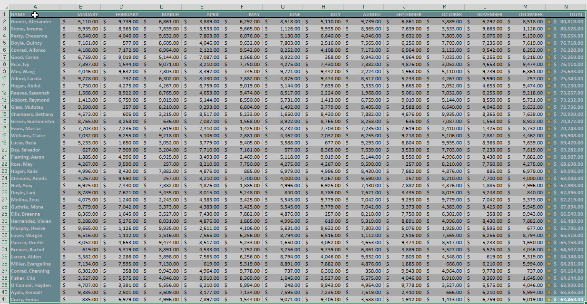

2. Điều hướng đến khung ** In **.
3. Chọn ** Lựa chọn in ** từ trình đơn thả xuống ** Phạm vi in **.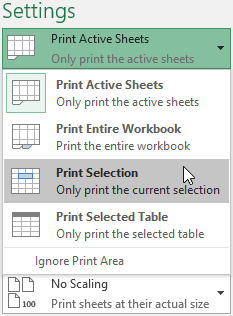

4.** bản xem trước ** lựa chọn của bạn sẽ xuất hiện trong khung ** Xem trước **.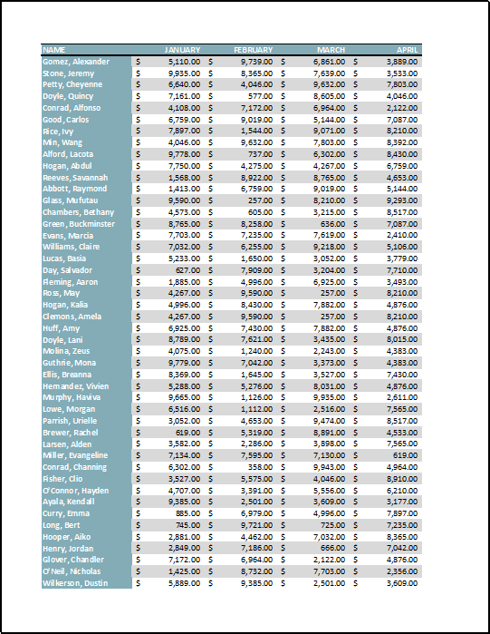

5. Nhấp vào nút ** In ** để in lựa chọn.

Nếu muốn, bạn cũng có thể đặt trước ** vùng in ** để có thể hình dung được ô nào sẽ được in khi bạn làm việc trong Excel. Chỉ cần ** chọn ** các ô bạn muốn in, nhấp vào tab ** Bố cục trang **, chọn lệnh ** Vùng in **, sau đó chọn **Đặt vùng in **. Hãy nhớ rằng nếu bạn cần in toàn bộ sổ làm việc, bạn cần phải xóa vùng in.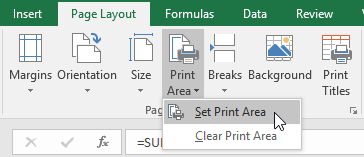

### Điều chỉnh nội dung

Đôi khi, bạn có thể cần thực hiện ** điều chỉnh nhỏ ** từ ngăn In để nội dung sổ làm việc của bạn vừa khít với trang in. Ngăn In bao gồm một số công cụ giúp điều chỉnh và chia tỷ lệ nội dung của bạn, bao gồm ** chia tỷ lệ ** và ** trang ** ** lề **.

#### Để thay đổi hướng trang:

Excel cung cấp hai tùy chọn hướng trang:** ngang ** và ** dọc **.** Phong cảnh ** định hướng trang ** theo chiều ngang **, trong khi ** dọc ** định hướng trang ** theo chiều dọc **. Trong ví dụ của chúng tôi, chúng tôi sẽ đặt hướng trang thành ngang.

1. Điều hướng đến khung ** In **.
2. Chọn hướng mong muốn từ trình đơn thả xuống ** Hướng trang **. Trong ví dụ của chúng tôi, chúng tôi sẽ chọn **Định hướng cảnh quan **.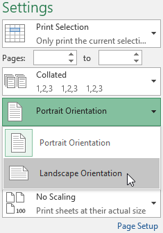

3. Hướng trang mới sẽ được hiển thị trong khung Xem trước.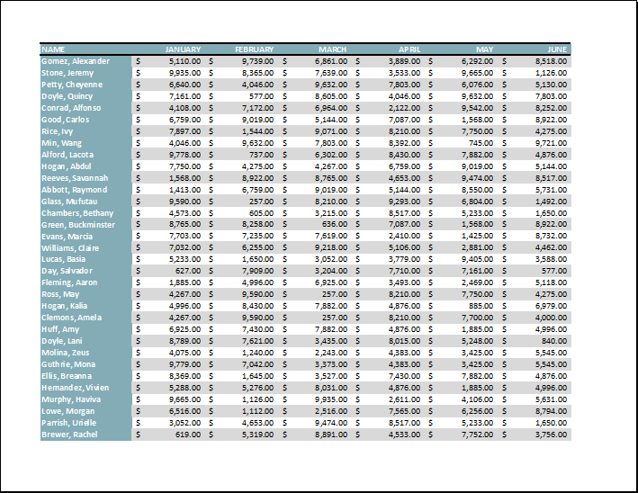

#### Để vừa nội dung trước khi in:

Nếu một số nội dung của bạn bị máy in cắt bỏ, bạn có thể sử dụng ** chia tỷ lệ ** để tự động điều chỉnh sổ làm việc của mình cho phù hợp với trang.

1. Điều hướng đến khung ** In **. Trong ví dụ của chúng tôi, chúng tôi có thể thấy trong khung Xem trước rằng nội dung của chúng tôi sẽ bị cắt khi in.

2. Chọn tùy chọn mong muốn từ menu thả xuống ** Scaling **. Trong ví dụ của chúng tôi, chúng tôi sẽ chọn ** Khớp tất cả các cột trên một trang **.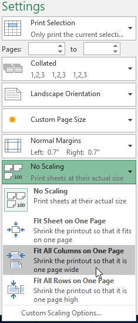

3. Bảng tính sẽ được ** cô đọng ** để vừa với một trang duy nhất.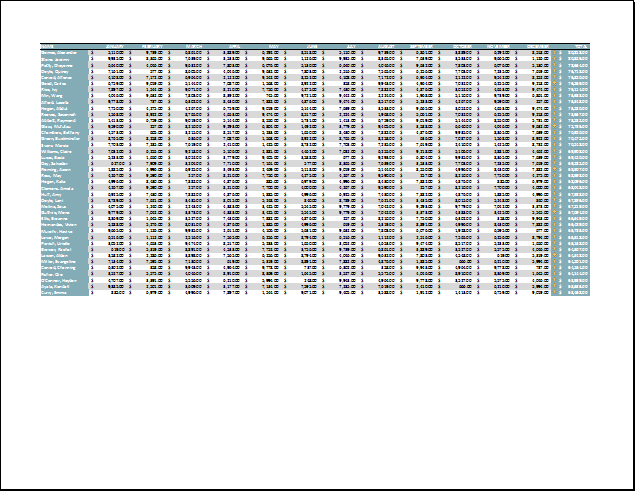

Hãy nhớ rằng các trang tính sẽ trở nên ** khó đọc ** hơn ** khi chúng được thu nhỏ lại, vì vậy bạn có thể không muốn sử dụng tùy chọn này khi in một trang tính có nhiều thông tin. Trong ví dụ của chúng tôi, chúng tôi sẽ thay đổi cài đặt chia tỷ lệ thành ** Không chia tỷ lệ **.

#### Để bao gồm Tiêu đề In:

Nếu bảng tính của bạn sử dụng ** tiêu đề ** ** tiêu đề **, điều quan trọng là phải đưa các tiêu đề này vào mỗi trang trong bảng tính được in của bạn. Sẽ rất khó để đọc một cuốn sách in nếu tiêu đề chỉ xuất hiện ở trang đầu tiên. Lệnh ** In Tiêu đề ** cho phép bạn chọn các hàng và cột cụ thể để xuất hiện trên mỗi trang.

1. Nhấp vào tab ** Bố cục trang ** trên ** Ribbon **, sau đó chọn lệnh ** In tiêu đề **.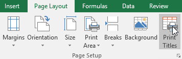

2. Hộp thoại ** Thiết lập trang ** sẽ xuất hiện. Từ đây, bạn có thể chọn ** hàng ** hoặc ** cột ** để lặp lại trên mỗi trang. Trong ví dụ của chúng tôi, chúng tôi sẽ lặp lại một hàng trước.
3. Nhấp vào nút ** Thu gọn hộp thoại ** bên cạnh trường ** Hàng lặp lại ở trên cùng:**.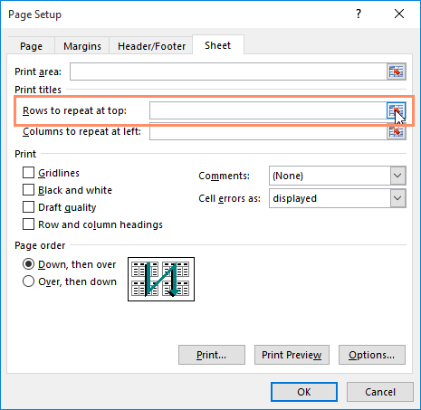

4. Con trỏ sẽ trở thành một ** mũi tên lựa chọn ** nhỏ và hộp thoại ** Thiết lập trang ** sẽ được thu gọn. Chọn ** hàng ** bạn muốn lặp lại ở đầu mỗi trang được in. Trong ví dụ của chúng tôi, chúng tôi sẽ chọn hàng 1.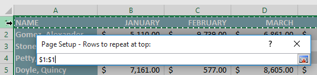

5. Hàng 1 sẽ được thêm vào trường ** Hàng lặp lại ở trên cùng:**. Nhấp lại vào nút ** Thu gọn hộp thoại **.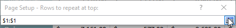

6. Hộp thoại ** Thiết lập trang ** sẽ mở rộng. Để lặp lại một cột, hãy sử dụng quy trình tương tự được hiển thị trong bước 4 và 5. Trong ví dụ của chúng tôi, chúng tôi đã chọn lặp lại hàng 1 và cột A.
7. Khi bạn hài lòng với lựa chọn của mình, hãy nhấp vào ** OK **.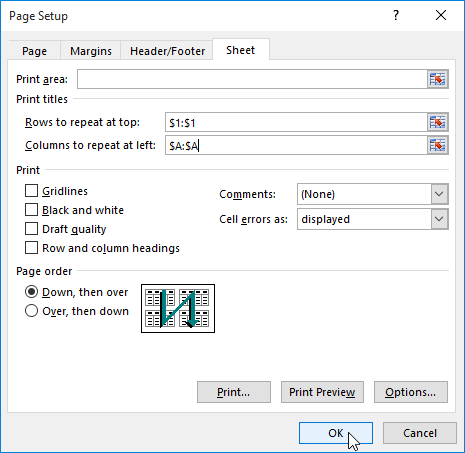

8. Trong ví dụ của chúng tôi, hàng 1 xuất hiện ở đầu mỗi trang và cột A xuất hiện ở bên trái mỗi trang.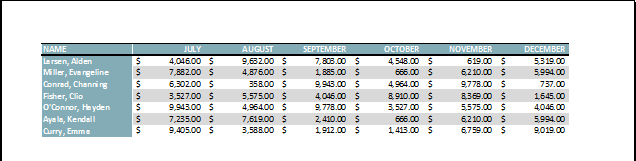

#### Để điều chỉnh ngắt trang:

1. Bấm vào lệnh ** Xem trước ngắt trang ** để thay đổi sang chế độ xem Ngắt trang.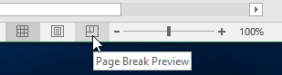

2. Dọc và ngang ** đường chấm màu xanh ** biểu thị ngắt trang. Nhấp và kéo một trong những dòng này để điều chỉnh ngắt trang.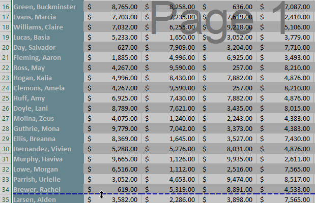

3. Trong ví dụ của chúng tôi, chúng tôi đã đặt ngắt trang theo chiều ngang giữa hàng 21 và 22.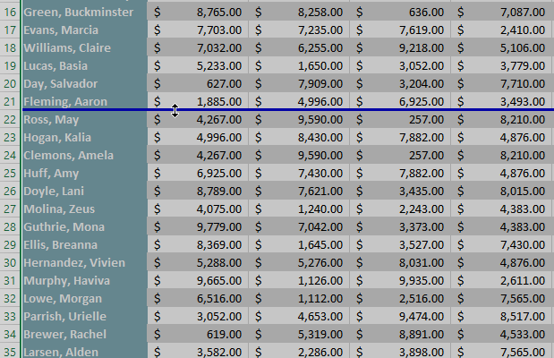

4. Trong ví dụ của chúng tôi, tất cả các trang hiện hiển thị cùng số hàng do có sự thay đổi trong ngắt trang.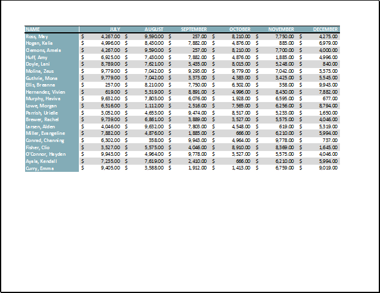

#### Để sửa đổi lề trong khung Xem trước:** lề

 ** là khoảng cách giữa nội dung của bạn và cạnh của trang. Đôi khi bạn có thể cần ** điều chỉnh ** lề để làm cho dữ liệu của bạn vừa vặn hơn. Bạn có thể sửa đổi lề trang từ khung ** In **.

1. Điều hướng đến khung ** In **.
2. Chọn kích thước lề mong muốn từ trình đơn thả xuống ** Lề trang **. Trong ví dụ của chúng tôi, chúng tôi sẽ chọn ** Thu hẹp **.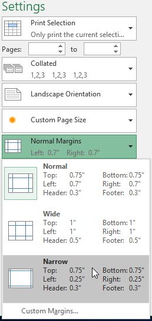

3. Lề trang mới sẽ được hiển thị trong khung Preview.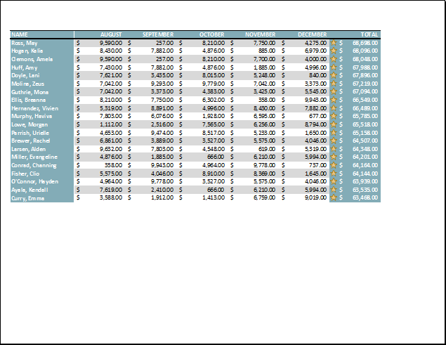

Bạn có thể điều chỉnh lề theo cách thủ công bằng cách nhấp vào nút ** Hiển thị lề ** ở góc dưới bên phải, sau đó kéo ** điểm đánh dấu lề ** trong ngăn ** Xem trước **.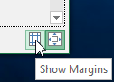

### Thử thách!

1. Mở [sổ làm việc thực hành](practice_files/excel_pagelayoutprint_practice.xlsx) 
của chúng tôi.
2. Nhấp vào tab ** East Coast ** ở cuối sổ làm việc.
3. Trong tab ** Bố cục trang **, hãy sử dụng tính năng ** In tiêu đề ** để lặp lại ** hàng 1 ** ở trên cùng và ** cột A ** ở bên trái.
4. Sử dụng lệnh ** Xem trước ngắt trang **, di chuyển dấu ngắt giữa các hàng 47 và 48 lên trên để nó nằm giữa các hàng 40 và 41.
5. Trong ** B **

* ** chế độ xem giai đoạn đóng gói **, hãy mở ** Khung in **.
6. Trong ** Khung in **, thay đổi ** hướng ** thành ** Phong cảnh **.
7. Thay đổi lề thành ** Thu hẹp **.
8. Thay đổi tỷ lệ thành ** Vừa tất cả các cột trên một trang **.
9. Khi bạn hoàn tất, bản xem trước bản in của bạn sẽ trông như thế này: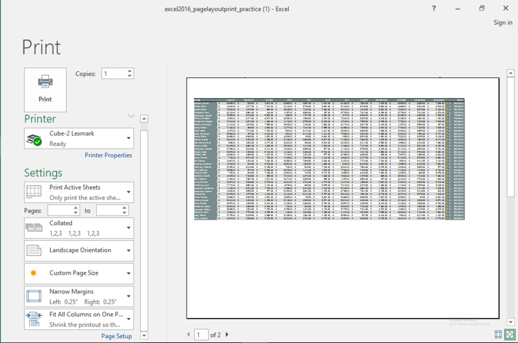

/en/excel/giới thiệu công thức/nội dung/