# Bài 1: Làm quen với excel

#### Bài 1: Làm quen với Excel

### Giới thiệu

Excel là ** chương trình bảng tính ** cho phép bạn ** lưu trữ **,** sắp xếp ** và ** phân tích ** ** thông tin **. Mặc dù bạn có thể cho rằng Excel chỉ được một số người nhất định sử dụng để xử lý dữ liệu phức tạp nhưng bất kỳ ai cũng có thể tìm hiểu cách tận dụng các tính năng ** mạnh mẽ ** ** ** của chương trình. Cho dù bạn đang lập ngân sách, sắp xếp nhật ký đào tạo hay tạo hóa đơn, Excel đều giúp bạn dễ dàng làm việc với các loại dữ liệu khác nhau.

Hãy xem video bên dưới để tìm hiểu thêm về Excel.

#### Về hướng dẫn này

Các quy trình trong hướng dẫn này sẽ áp dụng cho ** tất cả các phiên bản Microsoft Excel gần đây **, bao gồm ** Excel 2019 **,** Excel 2016 ** và ** Office 365 **. Có thể có một số khác biệt nhỏ, nhưng nhìn chung các phiên bản này đều giống nhau. Tuy nhiên, nếu đang sử dụng ** phiên bản cũ hơn **, bạn có thể tham khảo một trong các [hướng dẫn Excel](../../../topics/excel/index.html) 
khác của chúng tôi.

#### Excel Start Screen

Khi bạn mở Excel lần đầu tiên,** Excel Start Screen ** sẽ xuất hiện. Từ đây, bạn sẽ có thể tạo ** sổ làm việc mới **, chọn ** mẫu ** và truy cập ** gần đây ** ** đã chỉnh sửa ** ** sổ làm việc ** của mình.

* Từ ** Excel Start Screen **, tìm và chọn ** Blank workbook ** để truy cập vào giao diện Excel.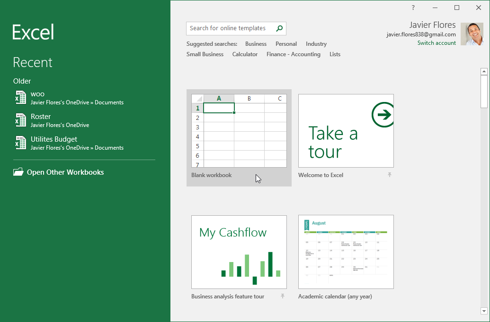

#### Các phần của cửa sổ Excel

Một số phần của cửa sổ Excel (như ** Ribbon ** và ** scroll bar **) 
là tiêu chuẩn trong hầu hết các chương trình khác của Microsoft. Tuy nhiên, có những tính năng khác dành riêng cho bảng tính, chẳng hạn như ** thanh công thức **,** hộp tên ** và ** worksheet tab **.

Nhấp vào các nút trong phần tương tác bên dưới để làm quen với các phần của giao diện Excel.

donechỉnh sửa các điểm nóng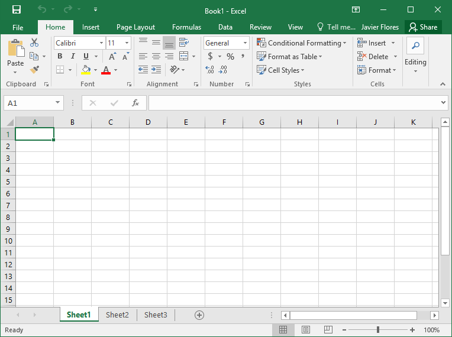

## Quick Access Toolbar

 ** Quick Access Toolbar ** cho phép bạn truy cập các lệnh phổ biến bất kể tab nào được chọn. Bạn có thể tùy chỉnh các lệnh tùy theo sở thích của mình.

## Name Box

 ** Hộp Tên ** hiển thị ** vị trí ** hoặc ** tên ** của ** ô đã chọn **.

## Formula Bar

Trong ** thanh công thức **, bạn có thể nhập hoặc chỉnh sửa ** dữ liệu **, công thức hoặc ** hàm ** sẽ xuất hiện trong một ô cụ thể.

## Cột

 ** cột ** là một nhóm các ô chạy từ đầu trang đến cuối trang. Trong Excel, các cột được xác định bằng ** chữ cái **.

## Ribbon

 ** Ribbon ** chứa tất cả các ** lệnh ** bạn sẽ cần để thực hiện các tác vụ phổ biến trong Excel. Nó có nhiều ** tab **, mỗi tab có một số ** nhóm ** lệnh.

## Tài khoản Microsoft

Từ đây, bạn có thể truy cập thông tin ** tài khoản Microsoft ** của mình, xem ** hồ sơ ** của bạn và ** chuyển đổi ** ** tài khoản **.

## Tell me

Hộp ** Tell me ** hoạt động giống như một thanh tìm kiếm giúp bạn nhanh chóng tìm thấy các công cụ hoặc lệnh bạn muốn sử dụng.

## Ô

Mỗi hình chữ nhật trong sổ làm việc được gọi là ** ô **. Ô là ** giao điểm ** của một hàng và một cột. Chỉ cần nhấp để ** chọn ** một ô.

## Hàng ngang

 ** hàng ** là một nhóm các ô chạy từ bên trái sang bên phải của trang. Trong Excel, các hàng được xác định bằng ** số **.

## Bảng tính

Các tệp Excel được gọi là ** sổ làm việc **. Mỗi sổ làm việc chứa một hoặc nhiều ** bảng tính **. Nhấp vào các tab để chuyển đổi giữa chúng hoặc nhấp chuột phải để có thêm tùy chọn.

## Kiểm soát thu phóng

Nhấp và kéo ** thanh trượt ** để sử dụng ** điều khiển thu phóng **. Số ở bên phải thanh trượt phản ánh ** phần trăm thu phóng **.

## Tùy chọn xem bảng tính

Có ba cách để xem một bảng tính. Chỉ cần nhấp vào một lệnh để chọn chế độ xem mong muốn.

## Scroll bar dọc và ngang

Các scroll bar cho phép bạn cuộn lên xuống hoặc sang bên. Để thực hiện việc này, hãy nhấp và kéo ** dọc ** hoặc ** scroll bar ngang **.

### Làm việc với môi trường Excel

 ** Ribbon ** và ** Quick Access Toolbar ** là nơi bạn sẽ tìm thấy các lệnh để thực hiện các tác vụ phổ biến trong Excel.** Backstage view ** cung cấp cho bạn nhiều tùy chọn khác nhau để lưu, mở tệp, in và chia sẻ tài liệu của bạn.

### Ribbon

Excel sử dụng ** hệ thống Ribbon theo thẻ ** thay vì các menu truyền thống.** Ribbon ** chứa ** nhiều tab **, mỗi tab có một số ** nhóm ** ** lệnh **. Bạn sẽ sử dụng các tab này để thực hiện ** các tác vụ phổ biến ** nhất trong Excel.

* Mỗi tab sẽ có một hoặc nhiều nhóm.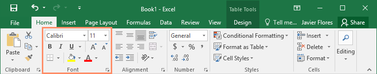

* Một số nhóm sẽ có mũi tên bạn có thể nhấp vào để có thêm tùy chọn.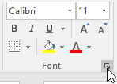

* Bấm vào một tab để xem thêm lệnh.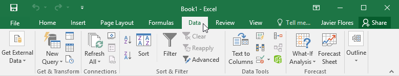

* Bạn có thể điều chỉnh cách hiển thị Ribbon bằng Ribbon Display Options.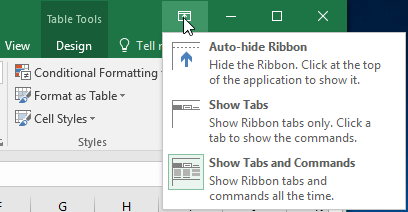

#### Để thay đổi Ribbon Display Options:

Ribbon được thiết kế để đáp ứng tác vụ hiện tại của bạn nhưng bạn có thể chọn ** thu nhỏ ** nó nếu bạn thấy nó chiếm quá nhiều không gian màn hình. Nhấp vào mũi tên ** Ribbon Display Options ** ở góc trên bên phải của Ribbon để hiển thị menu thả xuống.

Có ba chế độ trong menu Ribbon Display Options:

* ** Tự động ẩn Ribbon **: Tự động ẩn hiển thị sổ làm việc của bạn ở chế độ toàn màn hình và ẩn hoàn toàn Ribbon. Để ** hiển thị Ribbon **, hãy nhấp vào lệnh ** Mở rộng Ribbon ** ở đầu màn hình.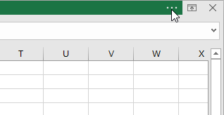

* ** Show Tabs **: Tùy chọn này ẩn tất cả các nhóm lệnh khi chúng không được sử dụng, nhưng ** tab ** sẽ vẫn hiển thị. Để ** hiển thị Ribbon **, chỉ cần nhấp vào một tab.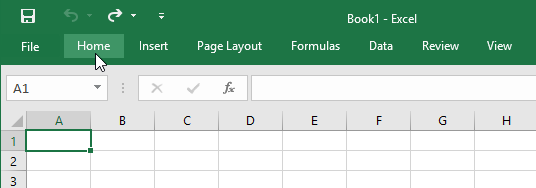

* ** Show Tabs và Lệnh **: Tùy chọn này tối đa hóa Ribbon. Tất cả các tab và lệnh sẽ hiển thị. Tùy chọn này được ** chọn theo mặc định ** khi bạn mở Excel lần đầu tiên.

### Quick Access Toolbar

Nằm ngay phía trên Ribbon,** Quick Access Toolbar ** cho phép bạn truy cập các lệnh phổ biến bất kể tab nào được chọn. Theo mặc định, nó bao gồm các lệnh ** Save **,** Undo ** và ** Repeat **. Bạn có thể thêm các lệnh khác tùy theo sở thích của mình.

#### Để thêm lệnh vào Quick Access Toolbar:

1. Nhấp vào ** mũi tên thả xuống ** ở bên phải ** Quick Access Toolbar **.
2. Chọn ** lệnh ** bạn muốn thêm từ menu thả xuống. Để chọn từ các lệnh bổ sung, hãy chọn ** Lệnh khác **.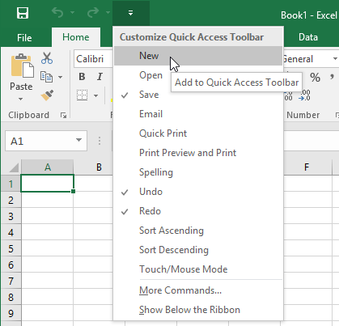

3. Lệnh sẽ được ** thêm ** vào Quick Access Toolbar.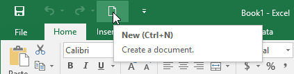

#### Cách sử dụng Hãy cho tôi biết:

Hộp ** Tell me ** hoạt động giống như một thanh tìm kiếm giúp bạn nhanh chóng tìm thấy các công cụ hoặc lệnh bạn muốn sử dụng.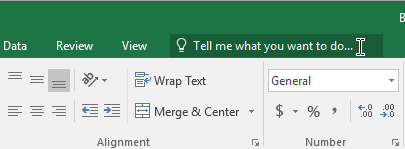

1. Nhập từ ngữ của riêng bạn những gì bạn muốn làm.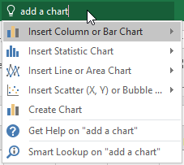

2. Kết quả sẽ cung cấp cho bạn một vài lựa chọn phù hợp. Để sử dụng một cái, hãy nhấp vào nó giống như bạn thực hiện một lệnh trên Ribbon.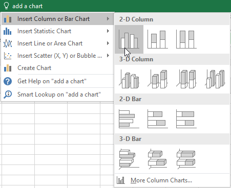

### Chế độ xem bảng tính

Excel có nhiều tùy chọn xem giúp thay đổi cách hiển thị sổ làm việc của bạn. Những chế độ xem này có thể hữu ích cho nhiều tác vụ khác nhau, đặc biệt nếu bạn định ** in ** bảng tính. Để ** thay đổi chế độ xem trang tính **, hãy tìm các lệnh ở góc dưới bên phải của cửa sổ Excel và chọn ** Chế độ xem bình thường **,** Chế độ xem bố cục trang ** hoặc ** Chế độ xem ngắt trang **.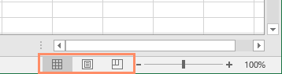

* ** Chế độ xem bình thường ** là chế độ xem mặc định cho tất cả các trang tính trong Excel.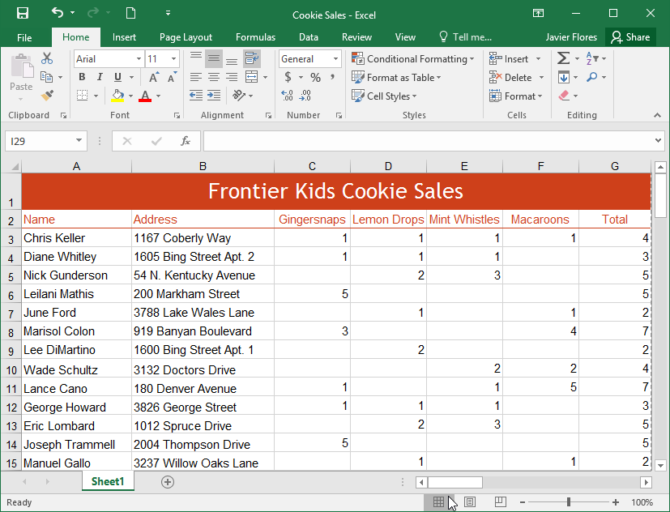

* ** Chế độ xem Bố cục Trang ** hiển thị cách trang tính của bạn sẽ xuất hiện khi được in. Bạn cũng có thể thêm đầu trang và chân trang trong chế độ xem này.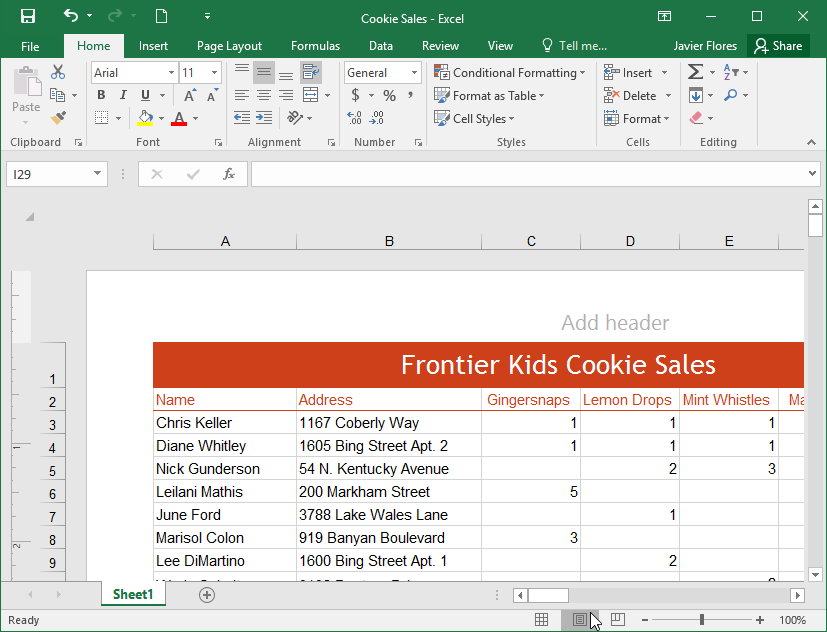

* ** Chế độ xem ngắt trang ** cho phép bạn thay đổi vị trí ngắt trang, điều này đặc biệt hữu ích khi in nhiều dữ liệu từ Excel.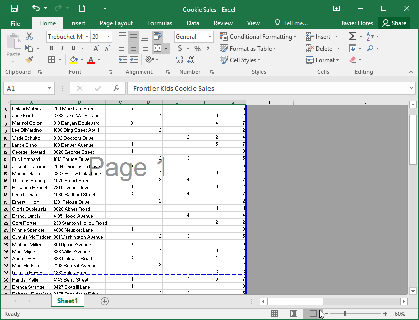

### Xem hậu trường

 ** Backstage view ** cung cấp cho bạn nhiều tùy chọn khác nhau để lưu, mở tệp, in và chia sẻ sổ làm việc của bạn.

#### Để truy cập chế độ xem Hậu trường:

1. Nhấp vào tab ** Tệp ** trên ** Ribbon **.** Backstage view ** sẽ xuất hiện.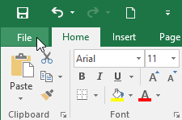

Nhấp vào các nút trong phần tương tác bên dưới để tìm hiểu thêm về cách sử dụng chế độ xem Hậu trường.

chỉnh sửa điểm phát sóng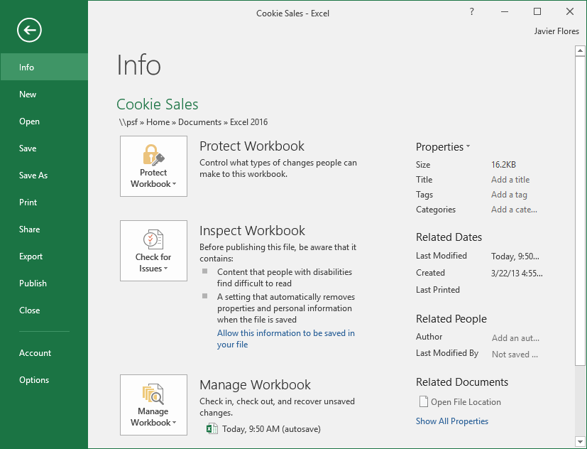

## Quay lại Excel

Bạn có thể sử dụng mũi tên để ** đóng ** ** Backstage view ** và quay lại Excel.

## Thông tin

Khung ** Thông tin ** sẽ xuất hiện bất cứ khi nào bạn truy cập chế độ xem Backstage. Nó chứa ** thông tin ** về sổ làm việc hiện tại.

## Mới

Từ đây, bạn có thể tạo ** sổ làm việc trống mới ** hoặc chọn từ bộ sưu tập lớn ** mẫu **.

## Mở

Từ đây, bạn có thể ** mở các sổ làm việc gần đây ** cũng như các sổ làm việc được lưu vào ** OneDrive ** hoặc trên ** máy tính ** của bạn.

## Lưu và lưu dưới dạng

Sử dụng ** Save ** và ** Save As ** để lưu sổ làm việc của bạn vào ** máy tính ** hoặc vào ** OneDrive ** của bạn.

## In

Từ ngăn ** In **, bạn có thể thay đổi ** cài đặt in ** và in sổ làm việc của mình. Bạn cũng có thể xem ** bản xem trước ** sổ làm việc của mình.

## Chia sẻ

Từ đây, bạn có thể mời mọi người ** xem và cộng tác ** trên sổ làm việc của mình. Bạn cũng có thể chia sẻ sổ làm việc của mình bằng cách gửi email dưới dạng tệp đính kèm.

## Xuất khẩu

Bạn có thể chọn ** xuất ** sổ làm việc của mình ở định dạng khác, chẳng hạn như ** PDF/XPS ** hoặc ** Excel 1997-2003 **.

## Xuất bản

Tại đây, bạn có thể xuất bản sổ làm việc của mình lên ** Power BI **, dịch vụ chia sẻ đám mây của Microsoft dành cho sổ làm việc Excel.

## Đóng

Bấm vào đây để ** đóng ** sổ làm việc hiện tại.

## Tài khoản

Từ khung ** Tài khoản **, bạn có thể truy cập thông tin ** tài khoản Microsoft ** của mình, sửa đổi ** chủ đề ** và ** nền ** cũng như ** đăng xuất ** khỏi tài khoản của mình.

## Tùy chọn

Tại đây, bạn có thể thay đổi nhiều tùy chọn ** tùy chọn Excel **,** cài đặt ** và ** ngôn ngữ **.

### Thử thách!

1. Mở ** Excel **.
2. Nhấp vào ** Blank workbook ** để mở bảng tính mới.
3. Thay đổi ** Ribbon Display Options ** thành ** Show Tabs **.
4. Sử dụng ** Quick Access Toolbar tùy chỉnh **, nhấp để thêm ** Mới **,** In nhanh ** và ** Chính tả **.
5. Trong thanh ** Tell me **, nhập từ ** Màu **. Di chuột qua ** Tô màu ** và chọn ** màu vàng **. Điều này sẽ lấp đầy một ô với màu vàng.
6. Thay đổi chế độ xem trang tính thành tùy chọn ** Bố cục Trang **.
7. Khi bạn hoàn tất, màn hình của bạn sẽ trông như thế này: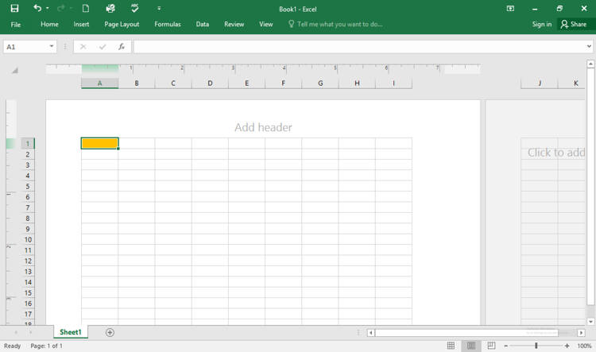

8. Thay đổi ** Tùy chọn hiển thị ribbon ** trở lại ** Show Tabs và lệnh **.
9.**Đóng ** Excel và ** Không lưu ** các thay đổi.

/en/excel/hiểu-onedrive/content/