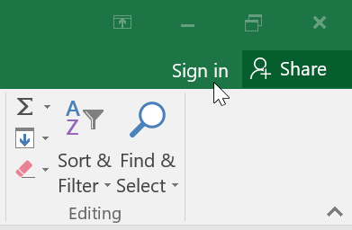
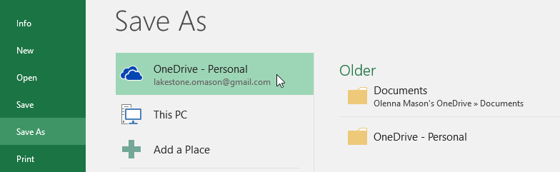

# Bài 2: hiểu-onedrive

#### Bài 2: Tìm hiểu OneDrive

/en/excel/getting-started-with-excel/content/

### Giới thiệu

Nhiều tính năng trong Microsoft Office hướng đến việc lưu và chia sẻ tệp trực tuyến.** OneDrive ** là dung lượng lưu trữ trực tuyến của Microsoft mà bạn có thể sử dụng để lưu, chỉnh sửa và chia sẻ tài liệu cũng như các tệp khác của mình. Bạn có thể truy cập OneDrive từ máy tính, điện thoại thông minh hoặc bất kỳ thiết bị nào bạn sử dụng.

Để bắt đầu với OneDrive, tất cả những gì bạn cần làm là thiết lập một ** tài khoản Microsoft ** miễn phí nếu bạn chưa có tài khoản.

Nếu chưa có tài khoản Microsoft, bạn có thể xem bài học [Tạo tài khoản Microsoft](../../../microsoftaccount/creating-a-microsoft-account/2/index.html) 
trong phần hướng dẫn về Tài khoản Microsoft của chúng tôi.

Sau khi có tài khoản Microsoft, bạn sẽ có thể đăng nhập vào Office. Chỉ cần nhấp vào **Đăng nhập ** ở góc trên bên phải của cửa sổ Excel.

#### Lợi ích của việc sử dụng OneDrive

Sau khi bạn đăng nhập vào tài khoản Microsoft của mình, có một số điều bạn có thể thực hiện với OneDrive:

* ** Truy cập tệp của bạn ở mọi nơi **: Khi lưu tệp vào OneDrive, bạn sẽ có thể truy cập chúng từ bất kỳ máy tính, máy tính bảng hoặc điện thoại thông minh nào có kết nối Internet. Bạn cũng có thể tạo tài liệu mới từ OneDrive.

* ** Sao lưu tệp của bạn **: Việc lưu tệp vào OneDrive sẽ mang đến cho chúng thêm một lớp bảo vệ. Ngay cả khi có điều gì đó xảy ra với máy tính của bạn, OneDrive sẽ giữ cho các tệp của bạn an toàn và có thể truy cập được.

* ** Chia sẻ tệp **: Thật dễ dàng để chia sẻ tệp OneDrive của bạn với bạn bè và đồng nghiệp. Bạn có thể chọn xem họ có thể chỉnh sửa hay chỉ đọc tệp. Tùy chọn này rất phù hợp cho việc cộng tác vì nhiều người có thể chỉnh sửa tài liệu cùng một lúc (điều này còn được gọi là đồng tác giả).

#### Lưu và mở tập tin

Khi bạn đăng nhập vào tài khoản Microsoft của mình, OneDrive sẽ xuất hiện dưới dạng tùy chọn bất cứ khi nào bạn lưu hoặc mở tệp. Bạn vẫn có tùy chọn lưu tập tin vào máy tính của mình. Tuy nhiên, việc lưu tệp vào OneDrive cho phép bạn truy cập chúng từ bất kỳ máy tính nào khác và nó cũng cho phép bạn chia sẻ tệp với bạn bè và đồng nghiệp.

Ví dụ: khi bạn bấm vào ** Lưu dưới dạng **, bạn có thể chọn OneDrive hoặc PC này làm vị trí lưu.

/en/excel/tạo-và-mở-workbooks/nội dung/