# Bài 3: Tạo và mở Workbook

#### Bài 3: Tạo và mở Workbook

/en/excel/hiểu-onedrive/content/

### Giới thiệu

Các tệp Excel được gọi là ** sổ làm việc **. Bất cứ khi nào bạn bắt đầu một dự án mới trong Excel, bạn sẽ cần ** tạo ** ** sổ làm việc mới **. Có một số cách để bắt đầu làm việc với sổ làm việc trong Excel. Bạn có thể chọn ** tạo sổ làm việc mới **—bằng ** sổ làm việc trống ** hoặc ** mẫu ** được thiết kế sẵn—hoặc ** mở ** ** sổ làm việc ** hiện có.

Xem video bên dưới để tìm hiểu thêm về cách tạo và mở sổ làm việc trong Excel.

#### Giới thiệu về OneDrive

Bất cứ khi nào bạn mở hoặc lưu sổ làm việc, bạn sẽ có tùy chọn sử dụng ** OneDrive **, đây là dịch vụ lưu trữ tệp trực tuyến đi kèm với tài khoản Microsoft của bạn. Để bật tùy chọn này, bạn cần ** đăng nhập ** vào Office. Để tìm hiểu thêm, hãy truy cập bài học của chúng tôi về [Tìm hiểu về OneDrive](../../under Hiểu-onedrive/1/index.html).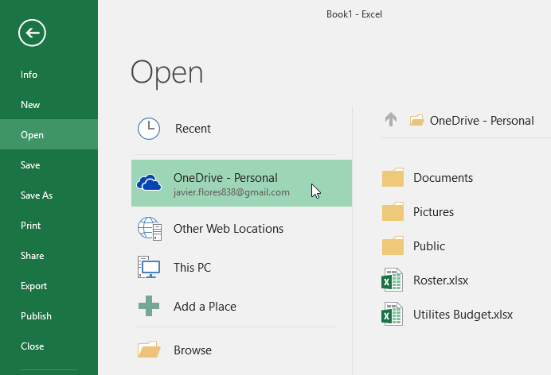

#### Để tạo một sổ làm việc trống mới:

1. Chọn tab ** Tệp **.** Backstage view ** sẽ xuất hiện.

2. Chọn ** Mới **, sau đó nhấp vào ** Blank workbook **.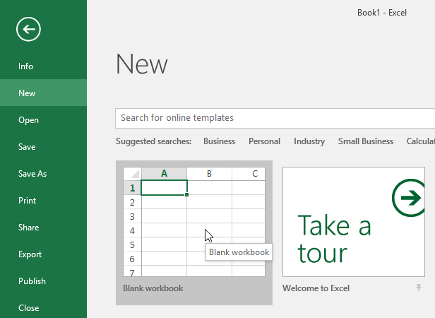

3. Một sổ làm việc trống mới sẽ xuất hiện.

#### Để mở một sổ làm việc hiện có:

Ngoài việc tạo sổ làm việc mới, bạn thường cần mở sổ làm việc đã được lưu trước đó. Để tìm hiểu thêm về cách lưu sổ làm việc, hãy truy cập bài học của chúng tôi về [Lưu và chia sẻ sổ làm việc](../../ Saving-and-sharing-workbooks/1/index.html).

1. Điều hướng đến ** Backstage view **, sau đó nhấp vào ** Mở **.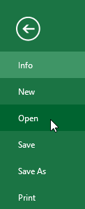

2. Chọn ** Máy tính **, sau đó nhấp vào ** Duyệt **. Bạn cũng có thể chọn ** OneDrive ** để mở các tệp được lưu trữ trên ** OneDrive ** của mình.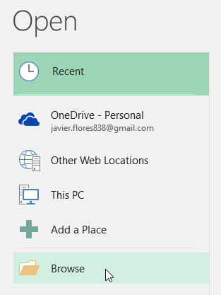

3. Hộp thoại ** Mở ** sẽ xuất hiện. Xác định vị trí và chọn ** sổ làm việc ** của bạn, sau đó nhấp vào ** Mở **.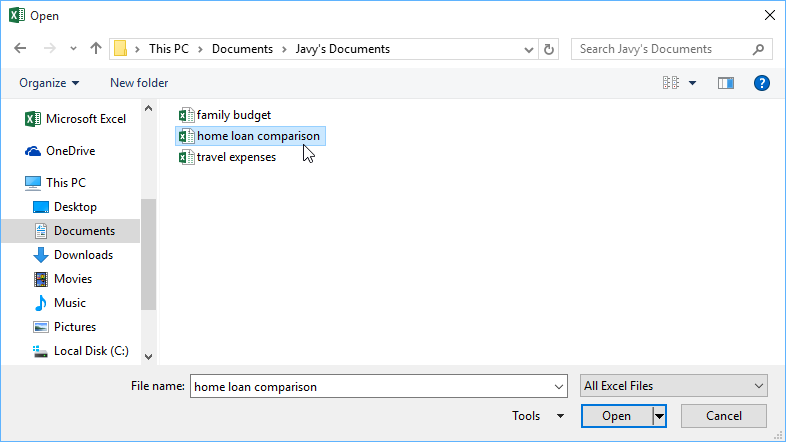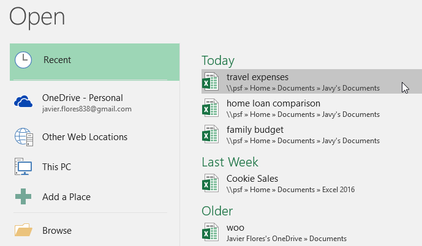

#### Để ghim một sổ làm việc:

Nếu bạn thường xuyên làm việc với ** cùng một sổ làm việc **, bạn có thể ** ghim nó ** vào chế độ xem Backstage để truy cập nhanh hơn.

1. Điều hướng tới ** Hậu trường ** ** xem **, sau đó nhấp vào ** Mở **.** sổ làm việc được chỉnh sửa gần đây ** của bạn sẽ xuất hiện.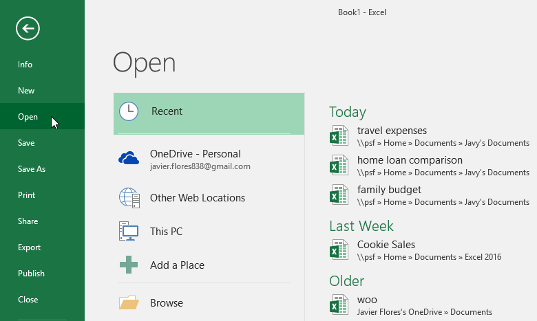

2. Di chuột qua ** sổ làm việc ** bạn muốn ghim.** biểu tượng đinh ghim ** ** ** sẽ xuất hiện bên cạnh sổ làm việc. Nhấp vào ** biểu tượng đinh ghim **.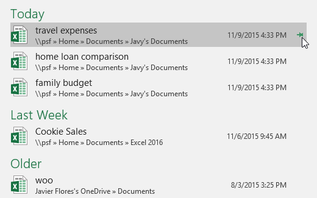

3. Sổ làm việc sẽ ở trong Sổ làm việc Gần đây. Để ** bỏ ghim ** sổ làm việc, chỉ cần nhấp lại vào biểu tượng đinh ghim.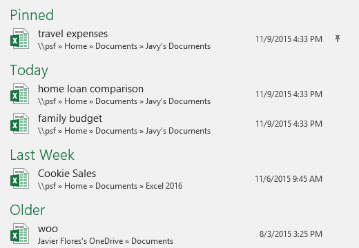

### Sử dụng mẫu

 ** mẫu ** là một ** bảng tính được thiết kế sẵn ** mà bạn có thể sử dụng để tạo sổ làm việc mới một cách nhanh chóng. Các mẫu thường bao gồm ** tùy chỉnh ** ** định dạng ** và ** được xác định trước ** ** công thức **, vì vậy chúng có thể giúp bạn tiết kiệm rất nhiều thời gian và công sức khi bắt đầu một dự án mới.

#### Để tạo một sổ làm việc mới từ một mẫu:

1. Nhấp vào tab ** Tệp ** để truy cập ** Hậu trường ** ** xem **.

2. Chọn ** Mới **. Một số mẫu sẽ xuất hiện bên dưới tùy chọn ** Blank workbook **.
3. Chọn một ** mẫu ** để xem lại.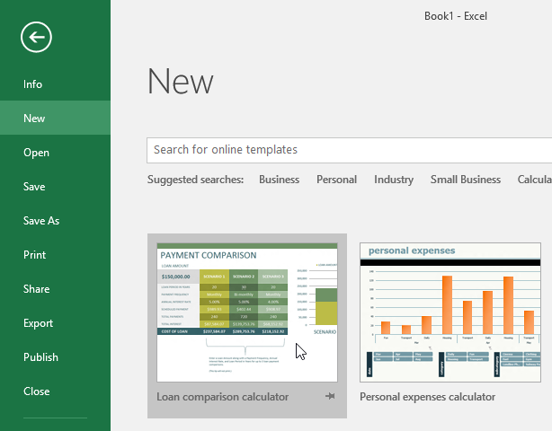

4.** bản xem trước ** của mẫu sẽ xuất hiện cùng với ** thông tin bổ sung ** ** ** về cách sử dụng mẫu.
5. Nhấp vào ** Tạo ** để sử dụng mẫu đã chọn.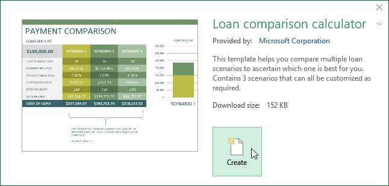

6. Một sổ làm việc mới sẽ xuất hiện cùng với ** mẫu đã chọn ** **.

Bạn cũng có thể duyệt các mẫu theo ** danh mục ** hoặc sử dụng ** thanh tìm kiếm ** để tìm nội dung cụ thể hơn.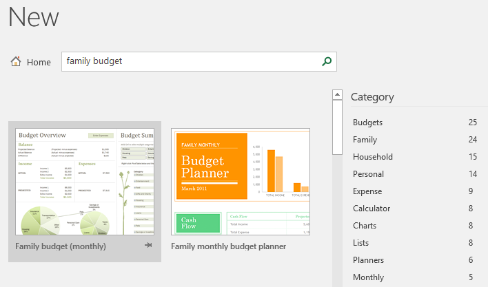

Điều quan trọng cần lưu ý là không phải tất cả các mẫu đều do Microsoft tạo. Nhiều mẫu được tạo bởi nhà cung cấp bên thứ ba và thậm chí cả người dùng cá nhân, vì vậy một số mẫu có thể hoạt động tốt hơn những mẫu khác.

### Chế độ tương thích

Đôi khi bạn có thể cần làm việc với sổ làm việc được tạo trong các phiên bản Microsoft Excel cũ hơn, như Excel 2010 hoặc Excel 2007. Khi bạn mở các loại sổ làm việc này, chúng sẽ xuất hiện trong ** Chế độ tương thích **.

Chế độ tương thích ** tắt ** một số tính năng nhất định, do đó bạn sẽ chỉ có thể truy cập các lệnh có trong chương trình được sử dụng để tạo sổ làm việc. Ví dụ: nếu bạn mở sổ làm việc được tạo bằng Excel 2003, bạn chỉ có thể sử dụng các tab và lệnh có trong Excel 2003.

Trong hình ảnh bên dưới, bạn có thể thấy sổ làm việc đang ở Chế độ tương thích, được chỉ báo ở đầu cửa sổ, bên phải tên tệp. Điều này sẽ vô hiệu hóa một số tính năng của Excel, tính năng này sẽ chuyển sang màu xám trên Ribbon.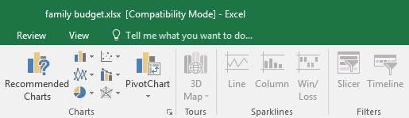

Để thoát khỏi Chế độ tương thích, bạn cần ** chuyển đổi ** sổ làm việc sang loại phiên bản hiện tại. Tuy nhiên, nếu bạn đang cộng tác với những người khác chỉ có quyền truy cập vào phiên bản Excel cũ hơn, tốt nhất bạn nên để sổ làm việc ở Chế độ tương thích để định dạng không thay đổi.

#### Để chuyển đổi một sổ làm việc:

Nếu bạn muốn truy cập vào các tính năng mới hơn, bạn có thể ** chuyển đổi ** bảng tính sang định dạng tệp hiện tại.

Lưu ý rằng việc chuyển đổi tệp có thể gây ra một số thay đổi đối với ** bố cục ban đầu ** của sổ làm việc.

1. Nhấp vào tab ** Tệp ** để truy cập chế độ xem Hậu trường.

2. Xác định vị trí và chọn lệnh ** Convert **.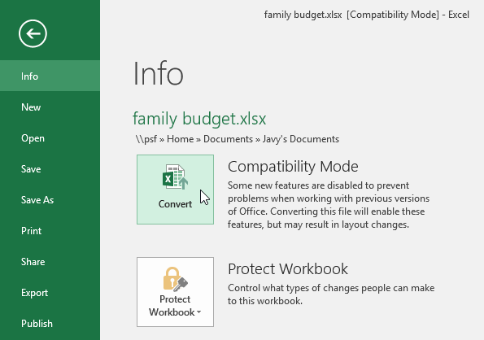

3. Hộp thoại ** Save As ** sẽ xuất hiện. Chọn ** vị trí ** nơi bạn muốn lưu sổ làm việc, nhập ** tên tệp ** cho sổ làm việc và nhấp vào ** Lưu **.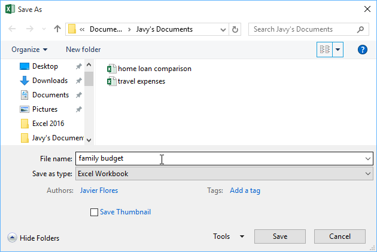

4. Sổ làm việc sẽ được chuyển đổi sang loại tệp mới nhất.

### Thử thách!

1. Mở [sổ làm việc thực hành](practice_files/excel_creatingopening_practice.xls) 
của chúng tôi.
2. Lưu ý rằng sổ làm việc của chúng tôi mở ở ** Chế độ tương thích **.** Chuyển đổi ** sổ làm việc sang định dạng tệp hiện tại. Một hộp thoại sẽ xuất hiện hỏi bạn có muốn đóng và mở lại tệp để xem các tính năng mới hay không. Chọn ** Có **.
3. Trong chế độ xem Backstage,** ghim ** một tệp hoặc thư mục.

/en/excel/save-and-sharing-workbooks/content/