# Bài 4: Lưu và chia sẻ sổ làm việc

#### Bài 4: Lưu và chia sẻ Workbook

/en/excel/tạo-và-mở-workbooks/nội dung/

### Giới thiệu

Bất cứ khi nào bạn tạo một sổ làm việc mới trong Excel, bạn sẽ cần biết cách ** lưu ** sổ làm việc đó để truy cập và chỉnh sửa sổ làm việc đó sau này. Giống như các phiên bản Excel trước, bạn có thể lưu tệp ** cục bộ ** vào máy tính của mình. Bạn cũng có thể lưu sổ làm việc vào ** đám mây ** bằng ** OneDrive **, cũng như ** xuất ** và ** chia sẻ ** sổ làm việc với người khác trực tiếp từ Excel.

Xem video bên dưới để tìm hiểu thêm về cách lưu và chia sẻ sổ làm việc trong Excel.

#### Giới thiệu về OneDrive

Bất cứ khi nào bạn mở hoặc lưu sổ làm việc, bạn sẽ có tùy chọn sử dụng ** OneDrive **, đây là dịch vụ lưu trữ tệp trực tuyến đi kèm với tài khoản Microsoft của bạn. Để bật tùy chọn này, bạn cần ** đăng nhập ** vào Office. Để tìm hiểu thêm, hãy truy cập bài học của chúng tôi về [Tìm hiểu về OneDrive](../../under Hiểu-onedrive/1/index.html).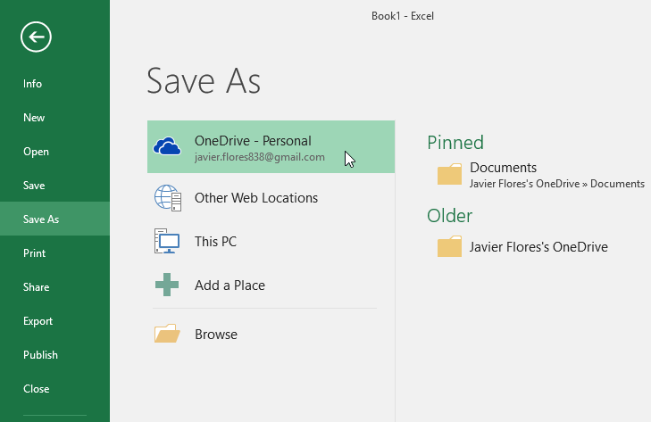

#### Lưu và lưu dưới dạng

Excel cung cấp hai cách để lưu tệp:** Save ** và ** Save As **. Các tùy chọn này hoạt động theo những cách tương tự nhau, với một số khác biệt quan trọng:

* ** Save **: Khi bạn tạo hoặc chỉnh sửa sổ làm việc, bạn sẽ sử dụng lệnh ** Save ** để lưu các thay đổi của mình. Bạn sẽ sử dụng lệnh này hầu hết thời gian. Khi lưu tệp, lần đầu tiên bạn chỉ cần chọn tên tệp và vị trí. Sau đó, bạn có thể chỉ cần nhấp vào lệnh Lưu để lưu nó với cùng tên và vị trí.

* ** Save As **: Bạn sẽ sử dụng lệnh này để tạo ** bản sao ** của sổ làm việc trong khi vẫn giữ bản gốc. Khi sử dụng Lưu dưới dạng, bạn cần chọn tên và/hoặc vị trí khác cho phiên bản đã sao chép.

#### Để lưu một sổ làm việc:

Điều quan trọng là ** lưu sổ làm việc của bạn ** bất cứ khi nào bạn bắt đầu một dự án mới hoặc thực hiện các thay đổi đối với dự án hiện có. Lưu sớm và thường xuyên có thể giúp công việc của bạn không bị thất lạc. Bạn cũng cần chú ý đến ** nơi bạn lưu ** sổ làm việc để có thể dễ dàng tìm thấy sau này.

1. Xác định vị trí và chọn lệnh ** Save ** trên ** Quick ** ** Access Toolbar **.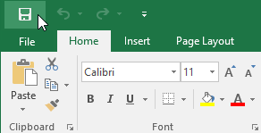

2. Nếu bạn lưu tệp lần đầu tiên, khung ** Save As ** sẽ xuất hiện trong ** Backstage ** ** view **.
3. Sau đó, bạn cần chọn ** nơi lưu ** tệp và đặt cho nó một ** tên tệp **. Để lưu sổ làm việc vào máy tính của bạn, hãy chọn ** Máy tính **, sau đó nhấp vào ** Duyệt **. Bạn cũng có thể bấm vào ** OneDrive ** để lưu tệp vào OneDrive của mình.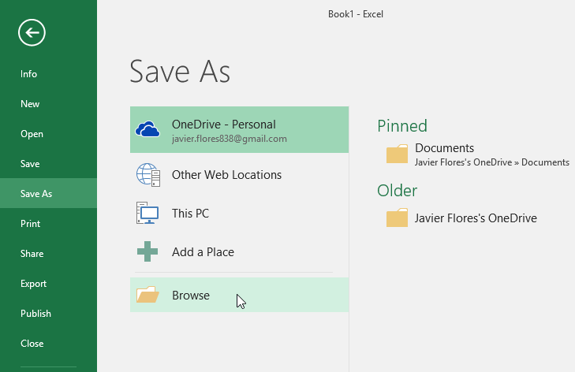

4. Hộp thoại ** Save As ** sẽ xuất hiện. Chọn ** vị trí ** nơi bạn muốn lưu sổ làm việc.
5. Nhập ** tên tệp ** cho sổ làm việc, sau đó nhấp vào ** Lưu **.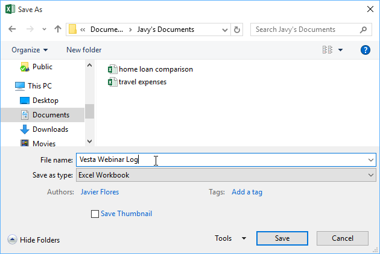

6. Sổ làm việc sẽ được ** lưu **. Bạn có thể bấm lại vào lệnh ** Save ** để lưu các thay đổi khi sửa đổi sổ làm việc.

#### Sử dụng Save As để tạo bản sao

Nếu bạn muốn lưu ** phiên bản khác ** của sổ làm việc trong khi vẫn giữ bản gốc, bạn có thể tạo ** bản sao **. Ví dụ: nếu bạn có tệp có tên ** Dữ liệu bán hàng **, bạn có thể lưu tệp đó dưới dạng ** Dữ liệu bán hàng 2 ** để bạn có thể chỉnh sửa tệp mới và vẫn tham khảo lại phiên bản gốc.

Để thực hiện việc này, hãy nhấp vào lệnh ** Save As ** trong chế độ xem Backstage. Giống như khi lưu tệp lần đầu tiên, bạn sẽ cần chọn ** nơi lưu ** tệp và đặt cho nó một ** tên tệp ** mới.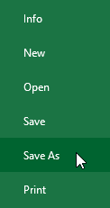

#### Để thay đổi vị trí lưu mặc định:

Nếu bạn không muốn sử dụng ** OneDrive **, bạn có thể cảm thấy thất vọng vì OneDrive được chọn làm vị trí mặc định khi lưu. Nếu bạn thấy bất tiện khi chọn ** Máy tính ** mỗi lần, bạn có thể thay đổi ** vị trí lưu mặc định ** để ** Máy tính ** được chọn theo mặc định.

1. Nhấp vào tab ** Tệp ** để truy cập ** Hậu trường ** ** xem **.

2. Nhấp vào ** Tùy chọn **.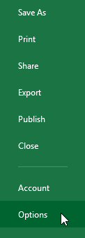

3. Hộp thoại ** Tùy chọn Excel ** sẽ xuất hiện. Chọn ** Lưu **,** chọn hộp ** bên cạnh ** Lưu vào máy tính theo mặc định **, sau đó nhấp vào ** OK **. Vị trí lưu mặc định sẽ được thay đổi.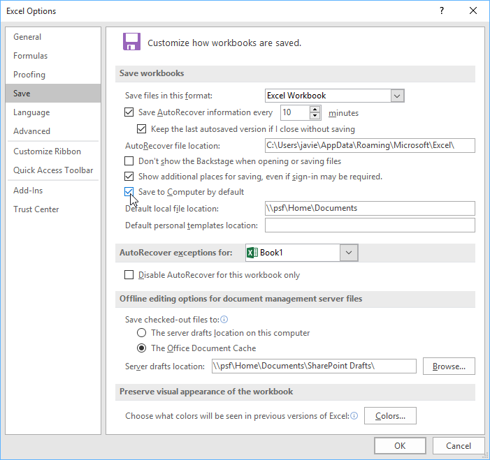

### Tự động Phục hồi

Excel tự động lưu sổ làm việc của bạn vào một thư mục tạm thời trong khi bạn đang làm việc với chúng. Nếu bạn quên lưu các thay đổi hoặc nếu Excel gặp sự cố, bạn có thể khôi phục tệp bằng ** Tự động Phục hồi **.

#### Để sử dụng Tự động Phục hồi:

1. Mở Excel. Nếu tìm thấy ** phiên bản lưu tự động ** của một tệp, khung ** Tài liệu ** ** Phục hồi ** sẽ xuất hiện.
2. Bấm để ** mở ** một tập tin có sẵn. Sổ làm việc sẽ được ** phục hồi **.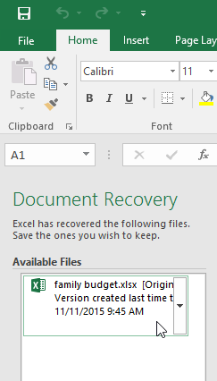

Theo mặc định, Excel sẽ tự động lưu cứ sau 10 phút. Nếu bạn đang chỉnh sửa sổ làm việc dưới 10 phút, Excel có thể không tạo phiên bản lưu tự động.

Nếu bạn không thấy tệp mình cần, bạn có thể duyệt tất cả các tệp được lưu tự động từ ** Backstage ** ** view **. Chỉ cần chọn tab ** Tệp **, nhấp vào ** Quản lý sổ làm việc **, sau đó chọn ** Khôi phục sổ làm việc chưa được lưu **.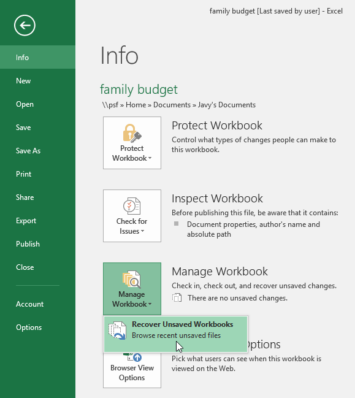

### Xuất sổ làm việc

Theo mặc định, sổ làm việc Excel được lưu ở dạng tệp **.xlsx **. Tuy nhiên, có thể đôi khi bạn cần sử dụng ** loại tệp khác ** như ** PDF ** hoặc ** sổ làm việc Excel 97-2003 **. Thật dễ dàng để ** xuất ** sổ làm việc của bạn từ Excel sang nhiều loại tệp khác nhau.

#### Để xuất sổ làm việc dưới dạng tệp PDF:

Xuất sổ làm việc của bạn dưới dạng ** tài liệu Adobe Acrobat **, thường được gọi là ** tệp PDF **, có thể đặc biệt hữu ích nếu bạn đang chia sẻ sổ làm việc với người không có Excel. PDF sẽ giúp người nhận có thể xem nhưng không thể chỉnh sửa nội dung sổ làm việc của bạn.

1. Nhấp vào tab ** Tệp ** để truy cập ** Hậu trường ** ** xem **.
2. Nhấp vào ** Xuất **, sau đó chọn ** Tạo PDF/XPS **.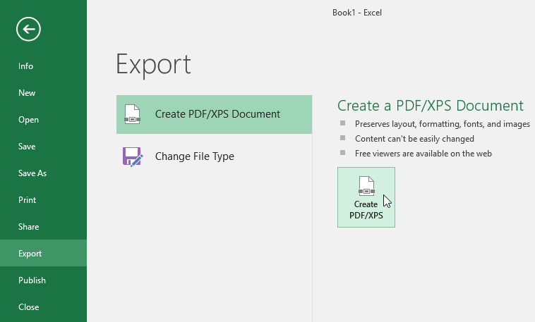

3. Hộp thoại ** Save As ** sẽ xuất hiện. Chọn ** vị trí ** nơi bạn muốn xuất sổ làm việc, nhập ** tên tệp **, sau đó nhấp vào ** Xuất bản **.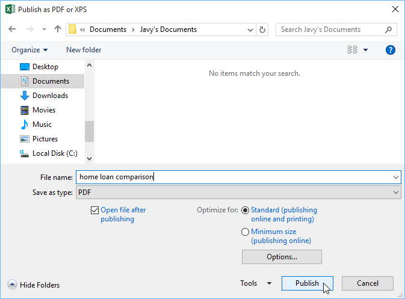

Theo mặc định, Excel sẽ chỉ xuất ** bảng tính ** hoạt động ** **. Nếu bạn có nhiều trang tính và muốn lưu tất cả chúng vào cùng một tệp PDF, hãy nhấp vào ** Tùy chọn ** trong hộp thoại ** Save As **. Hộp thoại ** Tùy chọn ** sẽ xuất hiện. Chọn ** Toàn bộ sổ làm việc **, sau đó nhấp vào ** OK **.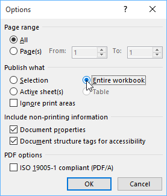

Bất cứ khi nào bạn xuất sổ làm việc dưới dạng PDF, bạn cũng cần xem xét cách dữ liệu sổ làm việc của bạn sẽ xuất hiện trên mỗi ** trang ** của tệp PDF, giống như ** in ** sổ làm việc. Hãy truy cập bài học [Bố cục và In Trang](../../page-layout-and-printing/1/index.html) 
của chúng tôi để tìm hiểu thêm về những điều cần cân nhắc trước khi xuất sổ làm việc dưới dạng PDF.

#### Để xuất sổ làm việc sang các loại tệp khác:

Bạn cũng có thể thấy hữu ích khi xuất sổ làm việc của mình sang các loại tệp khác, chẳng hạn như ** sổ làm việc Excel 97-2003 ** nếu bạn cần chia sẻ với những người sử dụng phiên bản Excel cũ hơn hoặc **.tệp CSV ** nếu bạn cần ** phiên bản văn bản thuần ** của sổ làm việc.

1. Nhấp vào tab ** Tệp ** để truy cập ** Hậu trường ** ** xem **.
2. Nhấp vào ** Xuất **, sau đó chọn ** Thay đổi loại tệp **.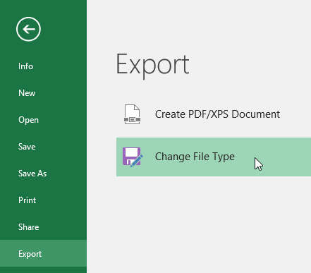

3. Chọn một ** tệp ** ** loại ** chung, sau đó nhấp vào ** Lưu ** ** Dưới dạng **.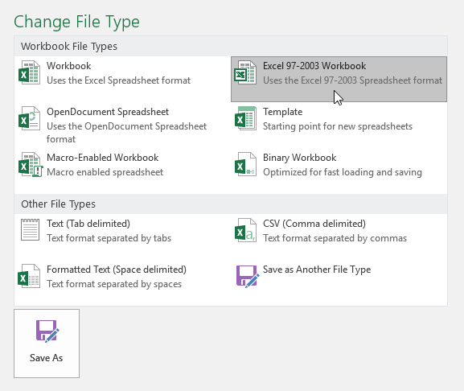

4. Hộp thoại ** Save As ** sẽ xuất hiện. Chọn ** vị trí ** nơi bạn muốn xuất sổ làm việc, nhập ** tên tệp **, sau đó nhấp vào ** Lưu **.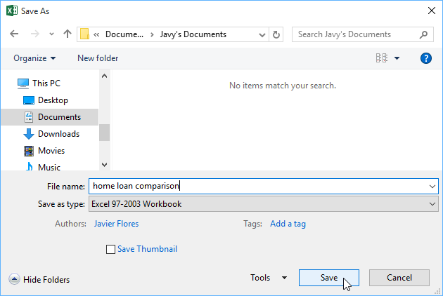

Bạn cũng có thể sử dụng trình đơn thả xuống ** Save as type:** trong hộp thoại ** Save As ** để lưu sổ làm việc ở nhiều loại tệp khác nhau.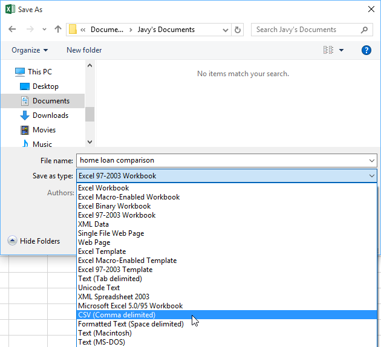

### Chia sẻ sổ làm việc

Excel giúp việc ** chia sẻ ** ** và cộng tác ** trên sổ làm việc bằng cách sử dụng ** OneDrive ** trở nên dễ dàng. Trước đây, nếu bạn muốn chia sẻ tệp với ai đó, bạn có thể gửi tệp đó dưới dạng tệp đính kèm email. Mặc dù thuận tiện nhưng hệ thống này cũng tạo ** nhiều phiên bản ** của cùng một tệp, điều này có thể gây khó khăn cho việc sắp xếp.

Khi bạn chia sẻ sổ làm việc từ Excel, thực tế là bạn đang cấp cho người khác quyền truy cập vào ** chính xác tệp **. Điều này cho phép bạn và những người bạn chia sẻ ** chỉnh sửa cùng một sổ làm việc ** mà không cần phải theo dõi nhiều phiên bản.

Để chia sẻ một sổ làm việc, trước tiên sổ làm việc đó phải được ** lưu ** ** vào ** ** của bạn ** ** OneDrive **.

#### Để chia sẻ một sổ làm việc:

1. Nhấp vào tab ** Tệp ** để truy cập ** Hậu trường ** ** xem **, sau đó nhấp vào ** Chia sẻ **.

2. Excel sẽ trở về chế độ xem Bình thường và mở bảng ** Chia sẻ ** ở bên phải cửa sổ. Từ đây, bạn có thể mời mọi người chia sẻ tài liệu của mình, xem danh sách những người có quyền truy cập vào tài liệu và đặt xem họ có thể chỉnh sửa hay chỉ xem tài liệu.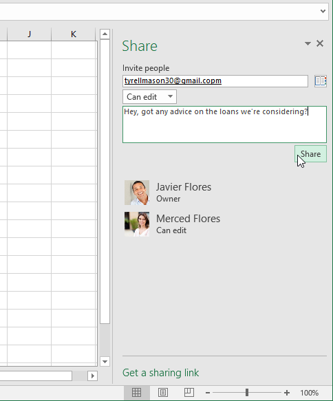

### Thử thách!

1. Mở [sổ làm việc thực hành](practice_files/excel_savingsharing_practice.xlsx) 
của chúng tôi.
2. Sử dụng tùy chọn ** Save As **, tạo một bản sao của sổ làm việc và đặt tên là ** Thử thách thực hành tiết kiệm **. Bạn có thể lưu bản sao vào một thư mục trên máy tính hoặc vào ** OneDrive ** của mình.
3.** Xuất ** sổ làm việc dưới dạng tệp ** PDF **.

/en/excel/cell-basics/content/