# Bài 5: kiến ​​thức cơ bản về ô

#### Bài học 5: Khái niệm cơ bản về ô

/en/excel/save-and-sharing-workbooks/content/

### Giới thiệu

Bất cứ khi nào bạn làm việc với Excel, bạn sẽ nhập thông tin—hoặc ** nội dung **—vào ** ô **. Các ô là các khối xây dựng cơ bản của một bảng tính. Bạn sẽ cần tìm hiểu kiến ​​thức cơ bản về ** ô ** và ** nội dung ô ** để tính toán, phân tích và sắp xếp dữ liệu trong Excel.

Xem video bên dưới để tìm hiểu thêm về những điều cơ bản khi làm việc với ô.

#### Hiểu ô

Mỗi trang tính được tạo thành từ hàng nghìn hình chữ nhật, được gọi là ** ô **. Ô là ** giao điểm ** của ** hàng ** và ** cột **. Nói cách khác, đó là nơi hàng và cột gặp nhau.

Các cột được xác định bằng ** chữ cái ** **(A, B, C)**, trong khi các hàng được xác định bằng ** số (1, 2, 3)**. Mỗi ô có ** tên **—hoặc ** địa chỉ ô **—dựa trên cột và hàng riêng. Trong ví dụ bên dưới, ô được chọn giao nhau với ** cột C ** và ** hàng 5 ** nên địa chỉ ô là ** C5 **.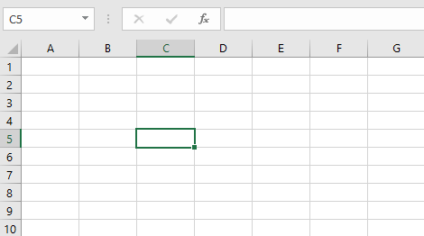

Lưu ý rằng địa chỉ ô cũng xuất hiện trong ** hộp Tên ** ở góc trên cùng bên trái và ** cột ** và ** tiêu đề hàng ** của ô được ** đánh dấu ** khi ô được chọn.

Bạn cũng có thể chọn ** nhiều ô ** cùng một lúc. Một nhóm ô được gọi là ** phạm vi ô **. Thay vì chỉ một địa chỉ ô, bạn sẽ tham chiếu đến một phạm vi ô bằng cách sử dụng địa chỉ ô của các ô ** đầu tiên ** và ** cuối ** trong phạm vi ô, được phân tách bằng ** dấu hai chấm **. Ví dụ: một phạm vi ô bao gồm các ô A1, A2, A3, A4 và A5 sẽ được viết là ** A1:A5 **. Hãy xem các phạm vi ô khác nhau dưới đây:

* Phạm vi ô ** A1:A8

* ** Phạm vi ô ** A1:F1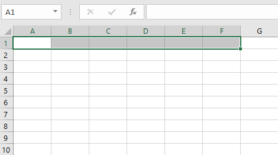

* ** Phạm vi ô ** A1:F8** Nếu các cột trong bảng tính của bạn được gắn nhãn bằng số thay vì chữ cái, bạn sẽ cần thay đổi ** kiểu tham chiếu ** mặc định cho Excel. Xem lại phần bổ sung của chúng tôi về [Phong cách tham chiếu là gì?](../../what-are-reference-styles/1/index.html) 
để tìm hiểu cách thực hiện.

#### Để chọn một ô:

Để nhập hoặc chỉnh sửa nội dung ô, trước tiên bạn cần ** chọn ** ô.

1. Nhấp vào ** ô ** để chọn ô đó. Trong ví dụ của chúng tôi, chúng tôi sẽ chọn ô ** D9 **.
2.** đường viền ** sẽ xuất hiện xung quanh ô đã chọn và ** tiêu đề cột ** và ** tiêu đề hàng ** sẽ được đánh dấu. Ô sẽ vẫn được chọn cho đến khi bạn bấm vào một ô khác trong bảng tính.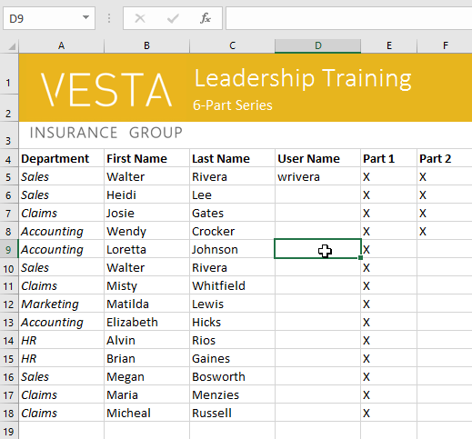

Bạn cũng có thể chọn các ô bằng ** phím mũi tên ** trên bàn phím.

#### Để chọn một phạm vi ô:

Đôi khi bạn có thể muốn chọn một nhóm ô lớn hơn hoặc một ** phạm vi ô **.

1. Nhấp và kéo chuột cho đến khi tất cả ** liền kề ** ** ô ** bạn muốn chọn được ** đánh dấu **. Trong ví dụ của chúng tôi, chúng tôi sẽ chọn phạm vi ô ** B5:C18 **.
2. Nhả chuột để ** chọn ** phạm vi ô mong muốn. Các ô sẽ vẫn được chọn cho đến khi bạn bấm vào một ô khác trong bảng tính.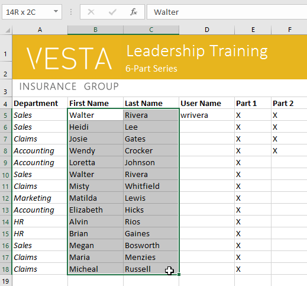

### Nội dung ô

Mọi thông tin bạn nhập vào bảng tính sẽ được lưu trữ trong một ô. Mỗi ô có thể chứa các loại ** nội dung ** khác nhau, bao gồm ** văn bản **,** định dạng **,** công thức ** và ** hàm **.

* ** Văn bản **:Các ô có thể chứa ** văn bản **, chẳng hạn như chữ cái, số và ngày tháng.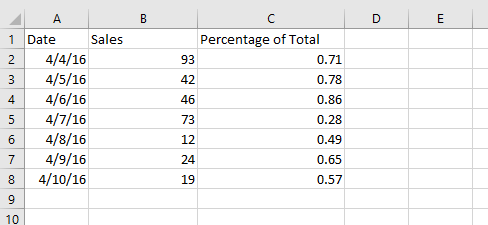

* ** Thuộc tính định dạng **:Các ô có thể chứa ** thuộc tính định dạng ** thay đổi cách hiển thị chữ cái, số và ngày. Ví dụ: tỷ lệ phần trăm có thể xuất hiện dưới dạng 0,15 hoặc 15%. Bạn thậm chí có thể thay đổi ** văn bản ** hoặc ** màu nền ** của ô.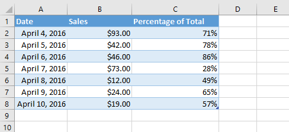

* ** Công thức và hàm **: Ô có thể chứa ** công thức ** và ** hàm ** tính toán giá trị ô. Trong ví dụ của chúng tôi,** SUM(B2:B8)** thêm giá trị của từng ô trong phạm vi ô B2:B8 và hiển thị tổng số trong ô B9.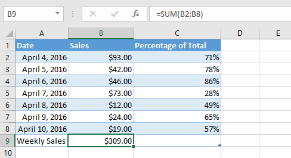

#### Để chèn nội dung:

1. Nhấp vào ** ô ** để chọn ô đó. Trong ví dụ của chúng tôi, chúng tôi sẽ chọn ô ** F9 **.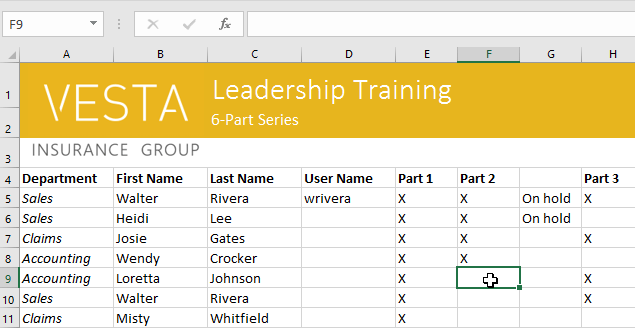

2. Nhập nội dung nào đó vào ô đã chọn, sau đó nhấn ** Enter ** trên bàn phím của bạn. Nội dung sẽ xuất hiện trong ** ô ** và ** công thức ** ** thanh **. Bạn cũng có thể nhập và chỉnh sửa nội dung ô trong thanh công thức.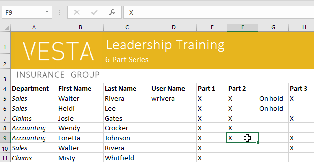

#### Để xóa (hoặc xóa) 
nội dung ô:

1. Chọn ** ô ** có nội dung bạn muốn xóa. Trong ví dụ của chúng tôi, chúng tôi sẽ chọn phạm vi ô ** A10:H10 **.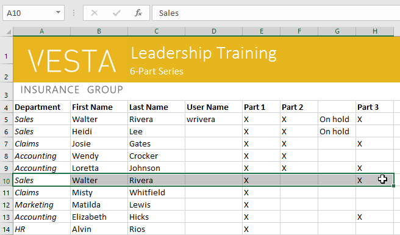

2. Chọn lệnh ** Xóa ** trên tab ** Trang chủ **, sau đó nhấp vào ** Xóa nội dung **.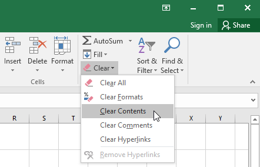

3. Nội dung ô sẽ bị xóa.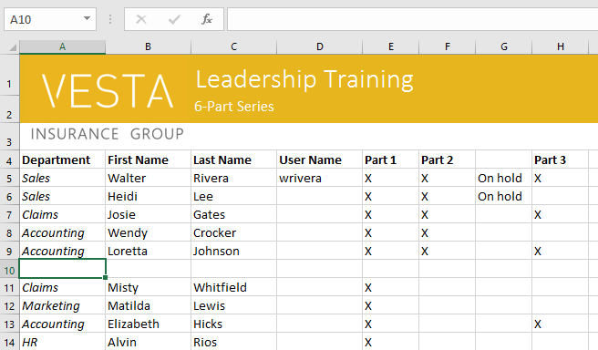

Bạn cũng có thể sử dụng phím ** Xóa ** trên bàn phím để xóa nội dung khỏi ** nhiều ô ** cùng một lúc. Phím ** Backspace ** sẽ chỉ xóa nội dung khỏi một ô mỗi lần.

#### Để xóa ô:

Có một sự khác biệt quan trọng giữa việc xóa nội dung của một ô và ** xóa chính ô đó **. Nếu bạn xóa toàn bộ ô, các ô bên dưới nó sẽ ** dịch chuyển ** ** để điền vào chỗ trống ** và ** thay thế ** ** các ô đã xóa **.

1. Chọn **(các) 
ô ** bạn muốn xóa. Trong ví dụ của chúng tôi, chúng tôi sẽ chọn ** A10:H10 **.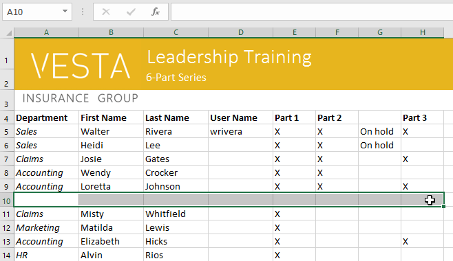

2. Chọn lệnh ** Xóa ** từ tab ** Trang chủ ** trên ** Ribbon **.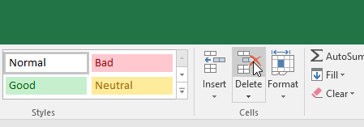

3. Các ô bên dưới sẽ ** dịch chuyển ** ** lên ** và ** điền vào chỗ trống **.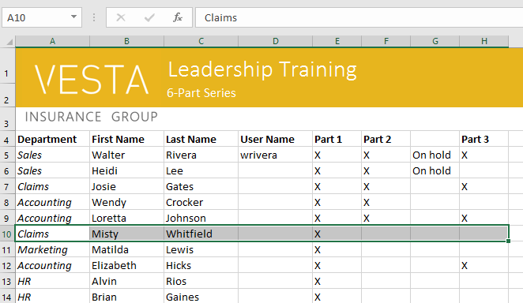

#### Để sao chép và dán nội dung ô:

Excel cho phép bạn ** sao chép ** nội dung đã được nhập vào bảng tính của bạn và ** dán ** nội dung này vào các ô khác, điều này có thể giúp bạn tiết kiệm thời gian và công sức.

1. Chọn **(các) 
ô ** bạn muốn ** sao chép **. Trong ví dụ của chúng tôi, chúng tôi sẽ chọn ** F9 **.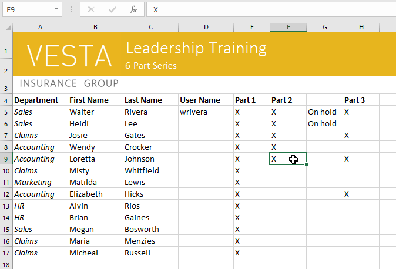

2. Nhấp vào lệnh ** Sao chép ** trên tab ** Trang chủ ** hoặc nhấn ** Ctrl+C ** trên bàn phím của bạn.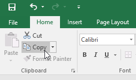

3. Chọn **(các) 
ô ** nơi bạn muốn ** dán ** nội dung. Trong ví dụ của chúng tôi, chúng tôi sẽ chọn ** F12:F17 **. (Các) 
ô được sao chép sẽ có ** hộp nét đứt ** xung quanh chúng.![selecting a destination for the copied cell(s)
]
(images/cellb_copy_paste_destination.png)

4. Nhấp vào lệnh ** Dán ** trên tab ** Trang chủ ** hoặc nhấn ** Ctrl+V ** trên bàn phím của bạn.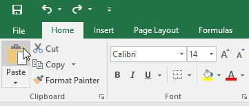

5. Nội dung sẽ được ** dán ** vào các ô đã chọn.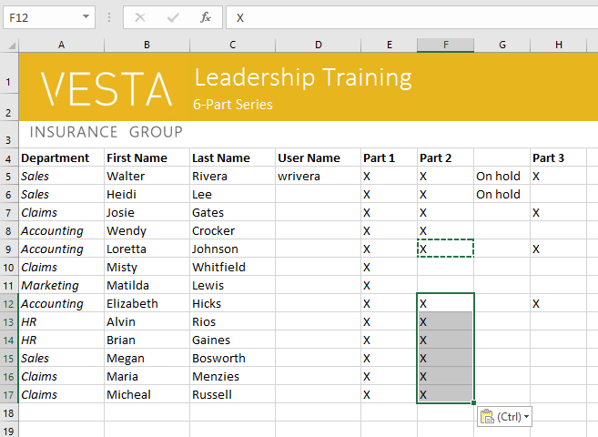

#### Để truy cập các tùy chọn dán bổ sung:

Bạn cũng có thể truy cập ** tùy chọn dán bổ sung **, đặc biệt thuận tiện khi làm việc với các ô chứa ** công thức ** hoặc ** định dạng **. Chỉ cần nhấp vào ** mũi tên thả xuống ** trên lệnh ** Dán ** để xem các tùy chọn này.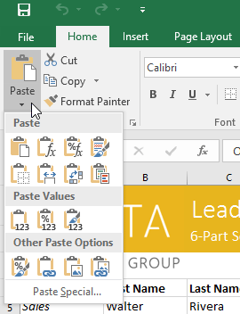

Thay vì chọn lệnh từ Ribbon, bạn có thể truy cập lệnh nhanh chóng bằng cách ** nhấp chuột phải **. Chỉ cần chọn ** ô ** bạn muốn ** định dạng **, sau đó nhấp chuột phải.** menu thả xuống ** sẽ xuất hiện, tại đó bạn sẽ tìm thấy một số ** lệnh ** cũng nằm trên Ribbon.

#### 

#### Để cắt và dán nội dung ô:

Không giống như sao chép và dán,** sao chép ** nội dung ô,** cắt ** cho phép bạn ** di chuyển ** nội dung giữa các ô.

1. Chọn **(các) 
ô ** bạn muốn ** cắt **. Trong ví dụ của chúng tôi, chúng tôi sẽ chọn ** G5:G6 **.
2. Nhấp chuột phải và chọn lệnh ** Cut **. Bạn cũng có thể sử dụng lệnh trên tab ** Trang chủ ** hoặc nhấn ** Ctrl+X ** trên bàn phím.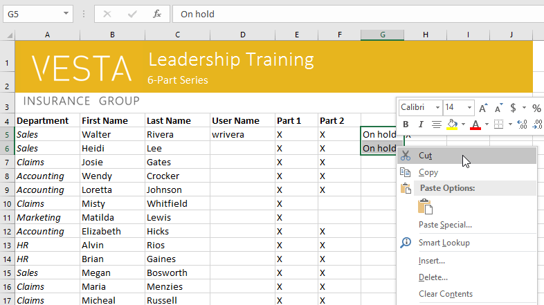

3. Chọn các ô mà bạn muốn ** dán ** nội dung. Trong ví dụ của chúng tôi, chúng tôi sẽ chọn ** F10:F11 **. Bây giờ, các ô đã cắt sẽ có ** hộp nét đứt ** xung quanh chúng.
4. Nhấp chuột phải và chọn lệnh ** Dán **. Bạn cũng có thể sử dụng lệnh trên tab ** Trang chủ ** hoặc nhấn ** Ctrl+V ** trên bàn phím.

5. Nội dung cắt sẽ được ** xóa ** khỏi các ô ban đầu và ** dán ** vào các ô đã chọn.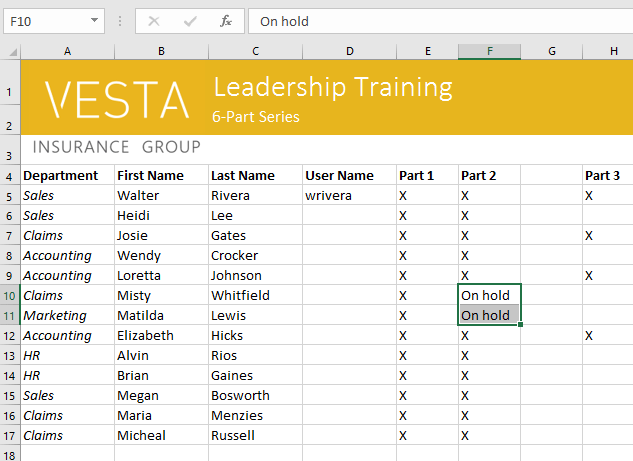

#### Để kéo và thả ô:

Thay vì cắt, sao chép và dán, bạn có thể ** kéo và thả ** ô để di chuyển nội dung của chúng.

1. Chọn **(các) 
ô ** bạn muốn ** di chuyển **. Trong ví dụ của chúng tôi, chúng tôi sẽ chọn ** H4:H12 **.
2. Di chuột qua ** đường viền ** của (các) 
ô đã chọn cho đến khi chuột chuyển thành ** con trỏ có bốn mũi tên **.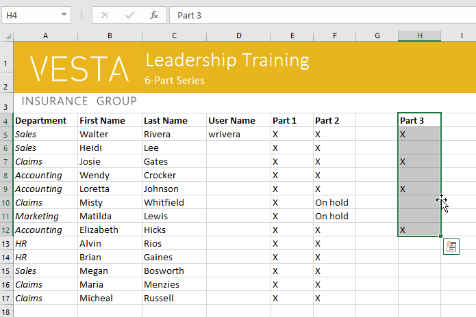

3. Nhấp và kéo các ô đến ** mong muốn ** ** vị trí **. Trong ví dụ của chúng tôi, chúng tôi sẽ chuyển chúng sang ** G4:G12 **.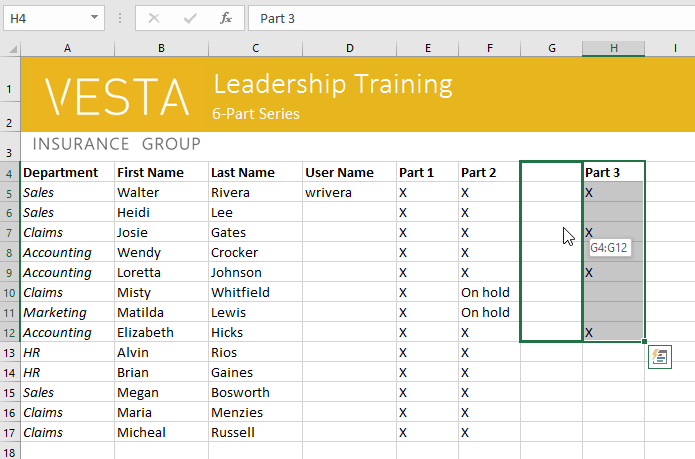

4. Thả chuột. Các ô sẽ được ** thả ** ở vị trí đã chọn.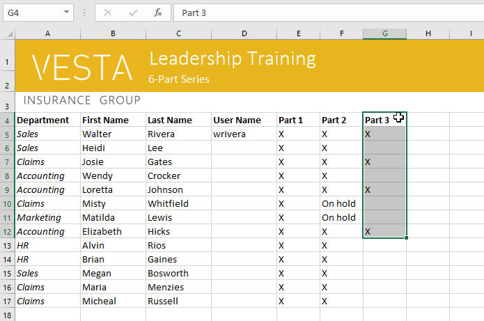

#### Để sử dụng núm điều khiển điền:

Nếu bạn đang sao chép nội dung ô sang các ô liền kề trong cùng một hàng hoặc cột,** điền vào ** là một lựa chọn thay thế phù hợp cho lệnh sao chép và dán.

1. Chọn ** ô (các)** chứa nội dung bạn muốn sử dụng, sau đó di chuột qua góc dưới bên phải của ô để ** bộ điều khiển điền ** xuất hiện.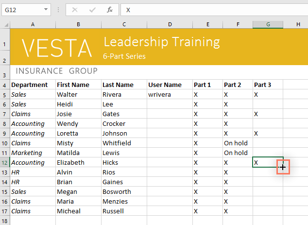

2. Nhấp và kéo ** bộ điều khiển điền ** cho đến khi tất cả các ô bạn muốn điền đều được chọn. Trong ví dụ của chúng tôi, chúng tôi sẽ chọn ** G13:G17 **.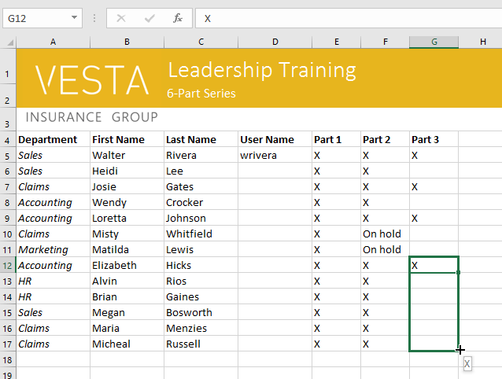

3. Nhả chuột để ** điền ** các ô đã chọn.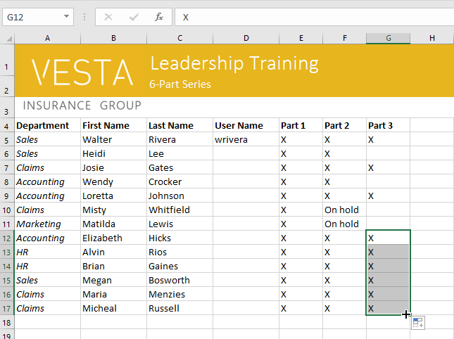

#### Để tiếp tục một loạt bài có núm điều khiển điền:

Tay cầm điền cũng có thể được sử dụng để ** tiếp tục ** ** một chuỗi **. Bất cứ khi nào nội dung của một hàng hoặc cột tuân theo một thứ tự tuần tự, như ** số ** **(1, 2, 3)** hoặc ** ngày ** **(Thứ Hai, Thứ Ba, Thứ Tư)**, bộ điều khiển điền có thể đoán điều gì sẽ xảy ra tiếp theo trong chuỗi. Trong hầu hết các trường hợp, bạn sẽ cần chọn ** nhiều ô ** trước khi sử dụng núm điều khiển điền để giúp Excel xác định thứ tự chuỗi. Chúng ta hãy xem một ví dụ:

1. Chọn phạm vi ô chứa chuỗi bạn muốn tiếp tục. Trong ví dụ của chúng tôi, chúng tôi sẽ chọn ** E4:G4 **.
2. Nhấp và kéo núm điều khiển điền để tiếp tục chuỗi.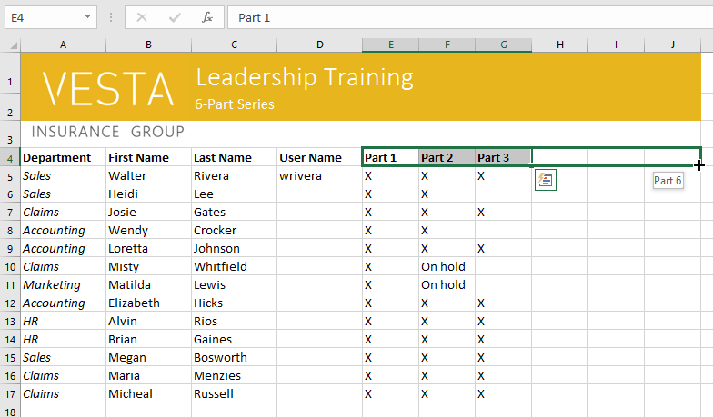

3. Thả chuột. Nếu Excel hiểu chuỗi này thì nó sẽ được tiếp tục trong các ô đã chọn. Trong ví dụ của chúng tôi, Excel đã thêm ** Phần 4 **,** Phần 5 ** và ** Phần 6 ** vào ** H4:J4 **.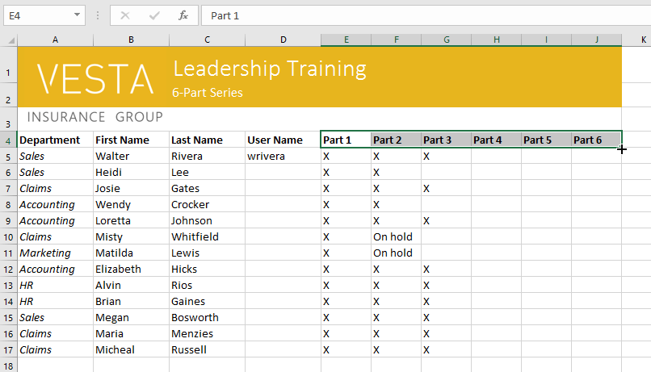

Bạn cũng có thể ** bấm đúp ** vào ô điều khiển điền thay vì nhấp và kéo. Điều này có thể hữu ích với các bảng tính lớn hơn, nơi việc nhấp và kéo có thể gặp khó khăn.

Xem video bên dưới để biết ví dụ về cách bấm đúp vào núm điều khiển điền.

### Thử thách!

1. Mở [sổ làm việc thực hành](practice_files/excel_cellbasics_practice.xlsx) 
của chúng tôi.
2. Chọn ô ** D6 ** và nhập ** hlee **.
3.** Xóa nội dung ** ở hàng 14.
4.** Xóa ** cột G.
5. Sử dụng ** cắt và dán ** hoặc ** kéo và thả **, di chuyển nội dung của hàng 18 sang hàng 14.
6. Sử dụng ** bộ điều khiển điền ** để đặt dấu X vào các ô F9:F17.
7. Khi bạn hoàn tất, sổ làm việc của bạn sẽ trông như thế này: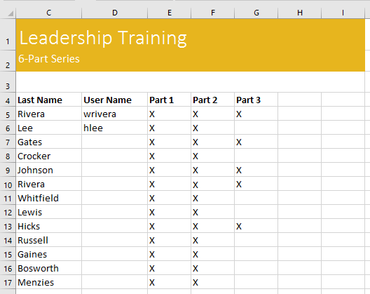

/en/excel/modifying-columns-rows-and-cells/content/