# Bài 6: sửa-cột-hàng-ô

#### Bài 6: Sửa đổi Cột, Hàng và Ô

/en/excel/cell-basics/content/

### Giới thiệu

Theo mặc định, mọi hàng và cột của sổ làm việc mới được đặt có cùng ** chiều cao ** và ** chiều rộng **. Excel cho phép bạn sửa đổi chiều rộng của cột và chiều cao của hàng theo nhiều cách khác nhau, bao gồm ** gói văn bản ** và ** hợp nhất các ô **.

Xem video bên dưới để tìm hiểu thêm về cách sửa đổi cột, hàng và ô.

#### Để sửa đổi độ rộng cột:

Trong ví dụ bên dưới của chúng tôi, cột C quá hẹp để hiển thị tất cả nội dung trong các ô này. Chúng tôi có thể hiển thị tất cả nội dung này bằng cách thay đổi ** chiều rộng ** của cột C.

1. Đặt chuột lên ** dòng cột ** trong ** tiêu đề cột ** để con trỏ trở thành ** mũi tên kép **.

2. Nhấp và kéo chuột để ** tăng ** hoặc ** giảm ** chiều rộng cột.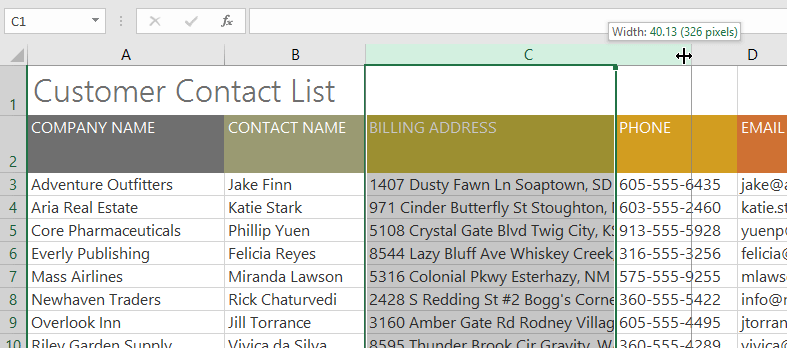

3. Thả chuột.** chiều rộng cột ** sẽ được thay đổi.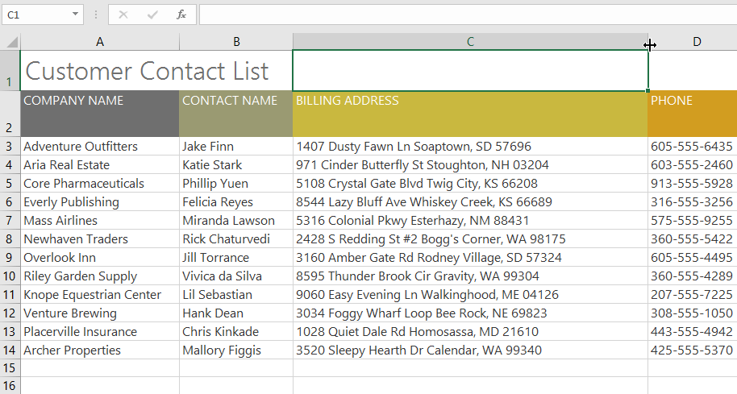

Với dữ liệu số, ô sẽ hiển thị ** dấu thăng **(#######) 
nếu cột quá hẹp. Chỉ cần ** tăng chiều rộng cột ** để hiển thị dữ liệu.

#### Để Tự động khớp chiều rộng cột:

Tính năng ** AutoFit ** sẽ cho phép bạn đặt chiều rộng của cột để vừa với nội dung của nó ** tự động **.

1. Đặt chuột lên ** dòng cột ** trong ** tiêu đề cột ** để con trỏ trở thành ** mũi tên kép **.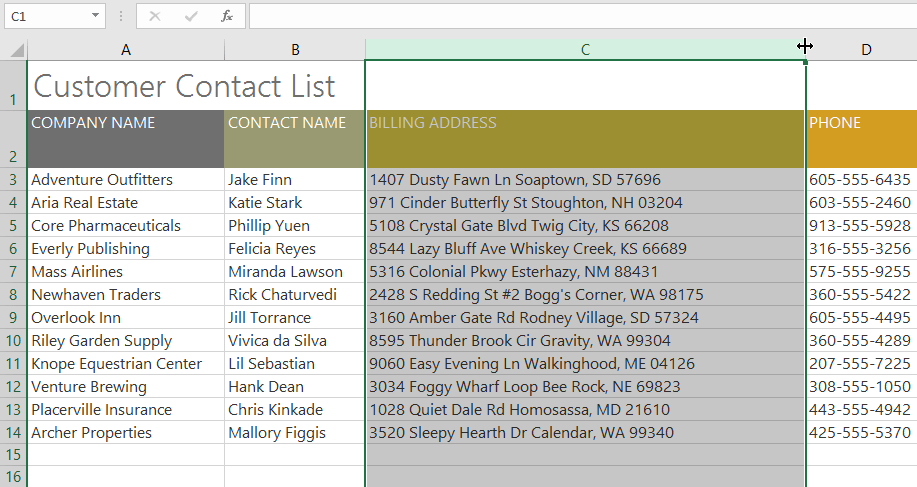

2. Bấm đúp chuột.** độ rộng cột ** sẽ được thay đổi tự động để phù hợp với nội dung.

Bạn cũng có thể Tự động điều chỉnh chiều rộng cho nhiều cột cùng lúc. Chỉ cần chọn các cột bạn muốn Tự động khớp, sau đó chọn lệnh ** Tự động khớp chiều rộng cột ** từ trình đơn thả xuống **Định dạng ** trên tab ** Trang chủ **. Phương pháp này cũng có thể được sử dụng cho ** chiều cao hàng **.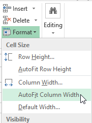

#### Để sửa đổi chiều cao hàng:

1. Định vị ** con trỏ ** trên ** dòng hàng ** để con trỏ trở thành ** mũi tên kép **.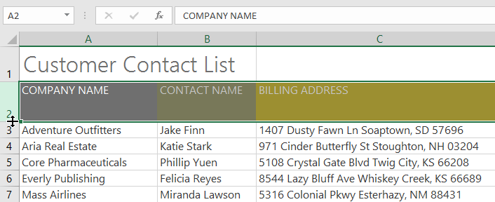

2. Nhấp và kéo chuột để ** tăng ** hoặc ** giảm ** chiều cao của hàng.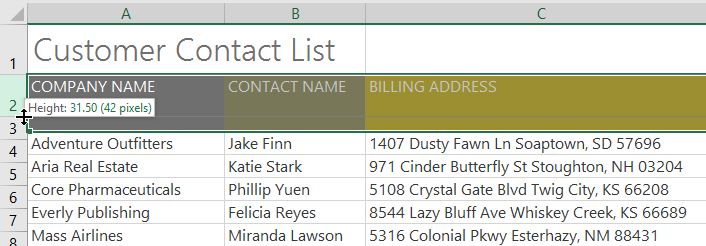

3. Thả chuột.** chiều cao ** của hàng đã chọn sẽ được thay đổi.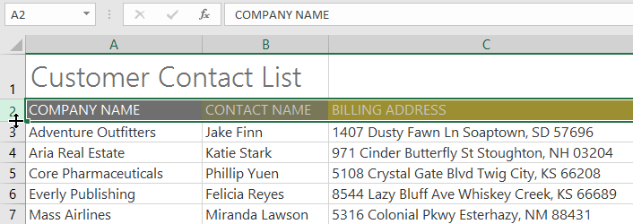

#### Để sửa đổi tất cả các hàng hoặc cột:

Thay vì thay đổi kích thước hàng và cột riêng lẻ, bạn có thể sửa đổi chiều cao và chiều rộng của từng hàng và cột cùng một lúc. Phương pháp này cho phép bạn đặt ** kích thước đồng đều ** cho mỗi hàng và cột trong bảng tính của bạn. Trong ví dụ của chúng tôi, chúng tôi sẽ đặt ** chiều cao hàng đồng đều **.

1. Xác định vị trí và nhấp vào nút ** Chọn tất cả ** ngay bên dưới hộp ** tên ** để chọn mọi ô trong trang tính.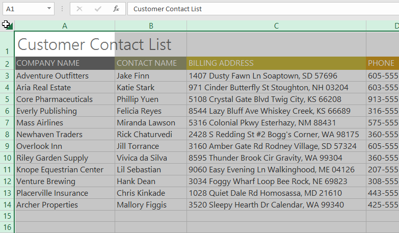

2. Đặt chuột lên ** dòng ** để con trỏ trở thành ** mũi tên kép **.
3. Nhấp và kéo chuột để ** tăng ** hoặc ** giảm ** chiều cao của hàng, sau đó thả chuột khi đã hài lòng. Chiều cao hàng sẽ được thay đổi cho toàn bộ bảng tính.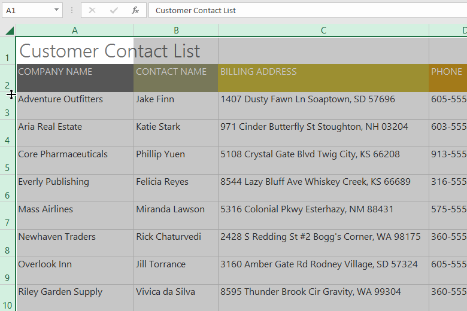

### Chèn, xóa, di chuyển và ẩn

Sau khi làm việc với sổ làm việc được một thời gian, bạn có thể thấy rằng bạn muốn ** chèn ** cột hoặc hàng mới,** xóa ** các hàng hoặc cột nhất định,** di chuyển ** chúng đến một vị trí khác trong trang tính hoặc thậm chí ** ẩn ** chúng.

#### Để chèn hàng:

1. Chọn ** hàng ** ** tiêu đề ** bên dưới nơi bạn muốn hàng mới xuất hiện. Trong ví dụ này, chúng tôi muốn chèn một hàng giữa hàng 4 và 5, vì vậy chúng tôi sẽ chọn ** hàng 5 **.

2. Nhấp vào lệnh ** Chèn ** trên tab ** Trang chủ **.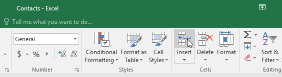

3.** hàng mới ** sẽ xuất hiện ** phía trên ** hàng đã chọn.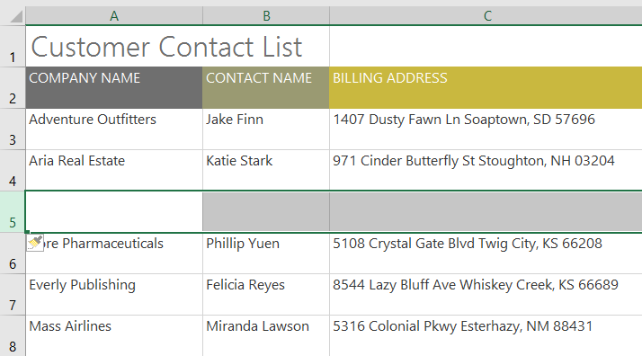

Khi chèn hàng, cột hoặc ô mới, bạn sẽ thấy ** biểu tượng cọ vẽ ** bên cạnh các ô được chèn. Nút này cho phép bạn chọn cách Excel định dạng các ô này. Theo mặc định, Excel định dạng các hàng được chèn có định dạng giống với các ô ở hàng trên. Để truy cập các tùy chọn bổ sung, hãy di chuột qua biểu tượng, sau đó nhấp vào ** mũi tên thả xuống **.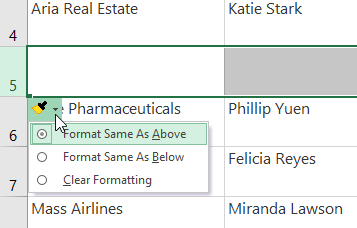

#### Để chèn cột:

1. Chọn ** cột ** ** tiêu đề ** ở bên phải nơi bạn muốn cột mới xuất hiện. Ví dụ: nếu bạn muốn chèn một cột giữa cột D và E, hãy chọn ** cột E **.

2. Nhấp vào lệnh ** Chèn ** trên tab ** Trang chủ **.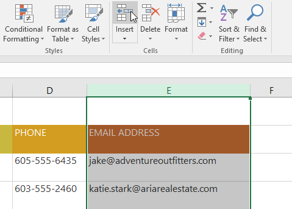

3.** cột mới ** sẽ xuất hiện ** ở bên trái ** của cột đã chọn.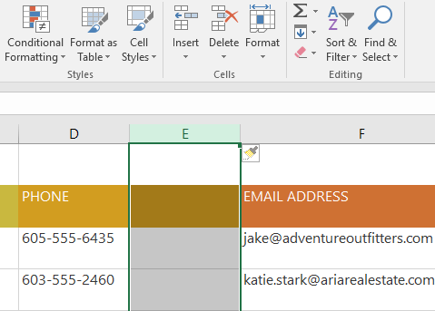

Khi chèn hàng và cột, hãy đảm bảo chọn toàn bộ hàng hoặc cột bằng cách nhấp vào ** tiêu đề **. Nếu bạn chỉ chọn một ô trong hàng hoặc cột, lệnh ** Insert ** sẽ chỉ chèn một ô mới.

#### Để xóa một hàng hoặc cột:

Thật dễ dàng để xóa một hàng hoặc cột mà bạn không cần nữa. Trong ví dụ của chúng tôi, chúng tôi sẽ xóa một hàng, nhưng bạn có thể xóa một cột theo cách tương tự.

1. Chọn ** hàng ** bạn muốn xóa. Trong ví dụ của chúng tôi, chúng tôi sẽ chọn ** hàng 9 **.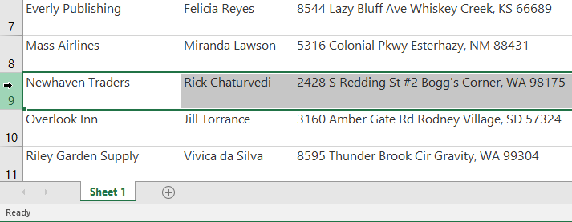

2. Nhấp vào lệnh ** Xóa ** trên tab ** Trang chủ **.

3.** Hàng đã chọn ** sẽ bị xóa và những hàng xung quanh nó sẽ ** chuyển đổi **. Trong ví dụ của chúng tôi,** hàng ** ** 10 ** đã di chuyển lên nên bây giờ là ** hàng 9 **.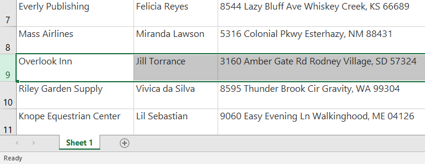

Điều quan trọng là phải hiểu sự khác biệt giữa ** xóa ** một hàng hoặc cột và chỉ ** xóa ** ** nội dung của nó **. Nếu bạn muốn xóa ** nội dung ** khỏi một hàng hoặc cột mà không khiến những nội dung khác phải dịch chuyển, hãy ** nhấp chuột phải vào một ** ** tiêu đề **, sau đó chọn ** Xóa nội dung ** từ trình đơn thả xuống.

#### Để di chuyển một hàng hoặc cột:

Đôi khi bạn có thể muốn ** di chuyển ** một cột hoặc hàng để sắp xếp lại nội dung trang tính của mình. Trong ví dụ của chúng tôi, chúng tôi sẽ di chuyển một cột, nhưng bạn có thể di chuyển một hàng theo cách tương tự.

1. Chọn ** tiêu đề cột ** mong muốn cho cột bạn muốn di chuyển.

2. Nhấp vào lệnh ** Cut ** trên tab ** Home ** hoặc nhấn ** Ctrl+X ** trên bàn phím của bạn.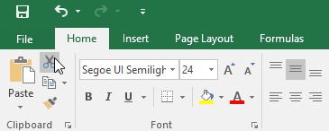

3. Chọn ** cột ** ** tiêu đề ** ở bên phải nơi bạn muốn di chuyển cột. Ví dụ: nếu bạn muốn di chuyển một cột giữa cột E và F, hãy chọn ** cột F **.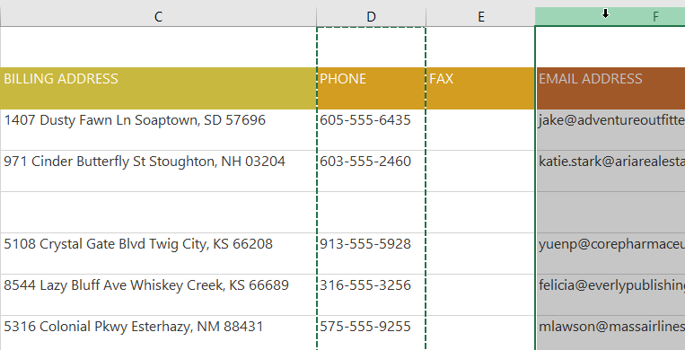

4. Nhấp vào lệnh ** Chèn ** trên tab ** Trang chủ **, sau đó chọn ** Chèn ô cắt ** từ trình đơn thả xuống.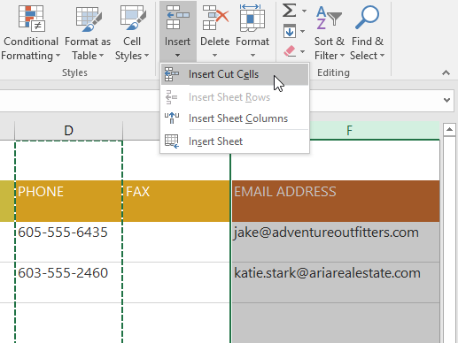

5. Cột sẽ được ** di chuyển ** đến vị trí đã chọn và các cột xung quanh nó sẽ dịch chuyển.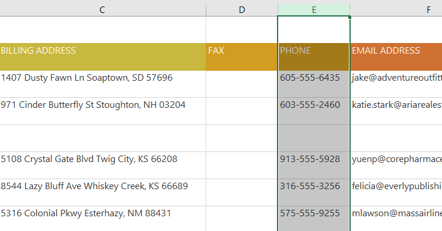

Bạn cũng có thể truy cập các lệnh ** Cut ** và ** Insert ** bằng cách nhấp chuột phải và chọn ** mong muốn ** ** lệnh ** từ trình đơn thả xuống.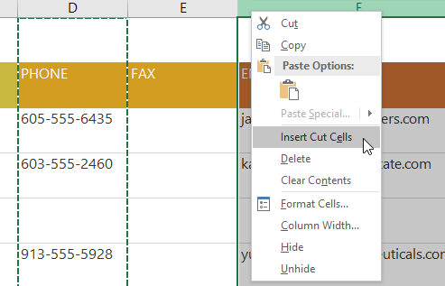

#### Để ẩn và hiện một hàng hoặc cột:

Đôi khi, bạn có thể muốn ** so sánh ** các hàng hoặc cột nhất định mà không thay đổi cách tổ chức trang tính của mình. Để thực hiện việc này, Excel cho phép bạn ** ẩn ** hàng và cột nếu cần. Trong ví dụ của chúng tôi, chúng tôi sẽ ẩn một số cột nhưng bạn có thể ẩn các hàng theo cách tương tự.

1. Chọn ** cột ** bạn muốn ** ẩn **, nhấp chuột phải, sau đó chọn **Ẩn ** từ menu ** định dạng **. Trong ví dụ của chúng tôi, chúng tôi sẽ ẩn các cột C, D và E.

2. Các cột sẽ bị ** ẩn **.** Dòng cột màu xanh lá cây ** cho biết vị trí của các cột bị ẩn.

3. Để ** bỏ ẩn ** các cột, hãy chọn các cột ở ** cả hai ** ** cạnh ** của các cột bị ẩn. Trong ví dụ của chúng tôi, chúng tôi sẽ chọn các cột ** B ** và ** F **. Sau đó nhấp chuột phải và chọn ** Bỏ ẩn ** từ trình đơn ** định dạng **.

4. Các cột bị ẩn sẽ xuất hiện trở lại.

### Ngắt dòng văn bản và hợp nhất các ô

Bất cứ khi nào bạn có quá nhiều nội dung ô cần hiển thị trong một ô, bạn có thể quyết định ** ngắt văn bản ** hoặc ** hợp nhất ** ô thay vì đổi kích thước cột. Việc ngắt dòng văn bản sẽ tự động sửa đổi ** chiều cao hàng ** của ô, cho phép hiển thị nội dung ô ** trên nhiều dòng **. Việc hợp nhất cho phép bạn kết hợp một ô với các ô trống liền kề để tạo ** một ô lớn **.

#### Để ngắt dòng văn bản trong ô:

1. Chọn các ô bạn muốn ngắt dòng. Trong ví dụ này, chúng tôi sẽ chọn các ô trong ** cột C **.
2. Nhấp vào lệnh ** Ngắt văn bản ** trên tab ** Trang chủ **.

3. Văn bản trong các ô đã chọn sẽ được ** ngắt **.

Nhấp lại vào lệnh ** Bọc văn bản ** để ** mở gói ** văn bản.

#### Để hợp nhất các ô bằng lệnh Hợp nhất & Trung tâm:

1. Chọn ** phạm vi ô ** bạn muốn hợp nhất. Trong ví dụ của chúng tôi, chúng tôi sẽ chọn ** A1:F1 **.
2. Nhấp vào lệnh ** Hợp nhất & Trung tâm ** trên tab ** Trang chủ **. Trong ví dụ của chúng tôi, chúng tôi sẽ chọn phạm vi ô ** A1:F1 **.

3. Các ô đã chọn sẽ được ** hợp nhất ** và văn bản sẽ được ** căn giữa **.

#### Để truy cập các tùy chọn hợp nhất bổ sung:

Nếu bạn nhấp vào mũi tên thả xuống bên cạnh lệnh ** Hợp nhất & Trung tâm ** trên tab ** Trang chủ **, trình đơn thả xuống ** Hợp nhất ** sẽ xuất hiện.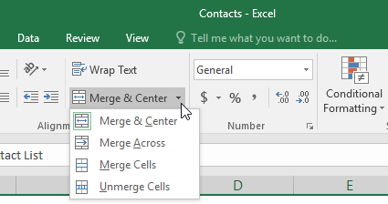

Từ đây, bạn có thể chọn:

* ** Hợp nhất & Căn giữa **: Thao tác này sẽ hợp nhất các ô đã chọn thành ** một ô ** và ** giữa ** văn bản.

* ** Hợp nhất khắp **: Thao tác này sẽ hợp nhất các ô đã chọn thành ** ô lớn hơn ** trong khi vẫn tách biệt từng ** hàng **.

* ** Hợp nhất Ô**: Thao tác này sẽ hợp nhất các ô đã chọn thành một ô nhưng ** không căn giữa ** văn bản.

* ** Hủy hợp nhất các ô **: Thao tác này sẽ hủy hợp nhất các ô đã chọn.

Hãy cẩn thận khi sử dụng tính năng này. Nếu bạn hợp nhất nhiều ô chứa dữ liệu, Excel sẽ chỉ giữ lại nội dung của ô phía trên bên trái và loại bỏ mọi thứ khác.

#### Căn giữa vùng chọn

Việc hợp nhất có thể hữu ích cho việc tổ chức dữ liệu của bạn nhưng nó cũng có thể gây ra các vấn đề sau này. Ví dụ: có thể khó di chuyển, sao chép và dán nội dung từ các ô đã hợp nhất. Một cách thay thế tốt cho việc hợp nhất là ** Center Across Selection **, cách này tạo ra hiệu ứng tương tự mà không thực sự kết hợp các ô.

Xem video bên dưới để tìm hiểu lý do tại sao bạn nên sử dụng Center Across Selection thay vì hợp nhất các ô.

#### Để sử dụng Center Across Selection:

1. Chọn phạm vi ô mong muốn. Trong ví dụ của chúng tôi, chúng tôi sẽ chọn ** A1:F1 **.** Lưu ý **: Nếu bạn đã hợp nhất các ô này, bạn nên ** hủy hợp nhất ** ** chúng ** trước khi tiếp tục bước 2.
2. Nhấp vào ** mũi tên nhỏ ** ở góc dưới bên phải của nhóm ** Căn chỉnh ** trên tab ** Trang chủ **.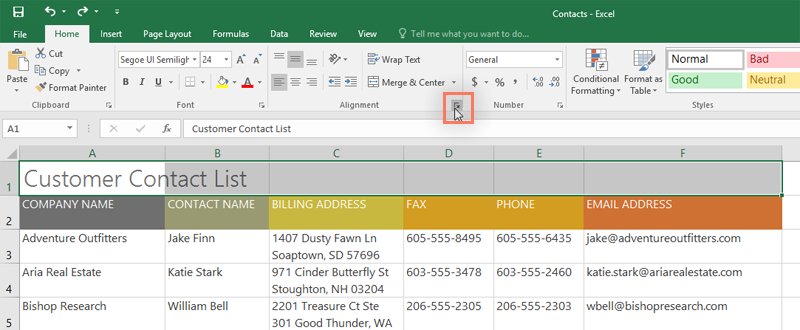

3. Một hộp thoại sẽ xuất hiện. Xác định vị trí và chọn trình đơn thả xuống ** Ngang **, chọn ** Center Across Selection **, sau đó nhấp vào ** OK **.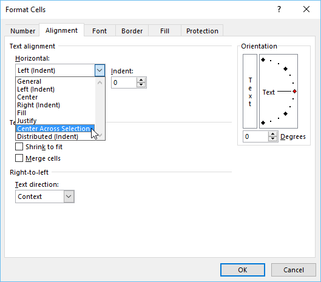

4. Nội dung sẽ được căn giữa trên phạm vi ô đã chọn. Như bạn có thể thấy, điều này tạo ra kết quả trực quan tương tự như việc hợp nhất và căn giữa, nhưng nó giữ nguyên từng ô trong A1:F1.

### Thử thách!

1. Mở [sổ làm việc thực hành](practice_files/excel_modifyingcells_practice.xlsx) 
của chúng tôi.
2.** Tự động điều chỉnh độ rộng cột ** cho toàn bộ sổ làm việc.
3. Sửa đổi ** chiều cao hàng ** cho hàng 3 đến 14 thành ** 22,5 (30 pixel)**.
4.** Xóa ** hàng 10.
5.** Chèn ** một cột vào bên trái cột C. Nhập ** LIÊN HỆ THỨ HAI ** vào ô ** C2 **.
6. Đảm bảo ô ** C2 ** vẫn được chọn và chọn ** Gói văn bản **.
7.** Hợp nhất và căn giữa ** ô A1:F1.
8.**Ẩn ** cột **Địa chỉ thanh toán ** và **Điện thoại **.
9. Khi bạn hoàn tất, sổ làm việc của bạn sẽ trông giống như thế này:

/en/excel/formatting-cells/content/