# Bài 7: định dạng ô

#### Bài 7: Định dạng ô

/en/excel/modifying-columns-rows-and-cells/content/

### Giới thiệu

Theo mặc định, tất cả nội dung ô đều sử dụng ** định dạng ** giống nhau, điều này có thể gây khó khăn khi đọc sổ làm việc có nhiều thông tin. Định dạng cơ bản có thể tùy chỉnh ** giao diện ** sổ làm việc của bạn, cho phép bạn thu hút sự chú ý đến các phần cụ thể và làm cho nội dung của bạn dễ xem và dễ hiểu hơn.

Xem video bên dưới để tìm hiểu thêm về định dạng ô trong Excel.

#### Để thay đổi kích thước phông chữ:

1. Chọn **(các) 
ô ** bạn muốn sửa đổi.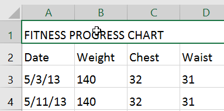

2. Trên tab ** Trang chủ **, nhấp vào ** mũi tên thả xuống ** bên cạnh lệnh ** Cỡ chữ **, sau đó chọn ** cỡ chữ ** mong muốn. Trong ví dụ của chúng tôi, chúng tôi sẽ chọn ** 24 ** để làm cho văn bản ** lớn hơn **.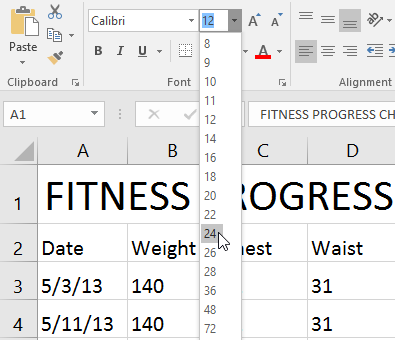

3. Văn bản sẽ thay đổi thành ** cỡ chữ đã chọn **.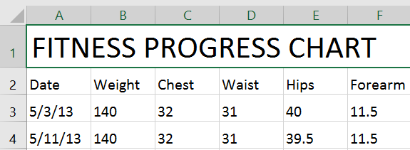

Bạn cũng có thể sử dụng lệnh ** Tăng phông chữ ** ** Kích thước ** và ** Giảm phông chữ ** ** Kích thước ** hoặc nhập ** cỡ phông chữ tùy chỉnh ** bằng bàn phím.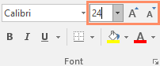

#### Để thay đổi phông chữ:

Theo mặc định, phông chữ của mỗi sổ làm việc mới được đặt thành Calibri. Tuy nhiên, Excel cung cấp nhiều phông chữ khác mà bạn có thể sử dụng để tùy chỉnh văn bản ô của mình. Trong ví dụ bên dưới, chúng tôi sẽ định dạng ** ô tiêu đề ** để giúp phân biệt nó với phần còn lại của trang tính.

1. Chọn **(các) 
ô ** bạn muốn sửa đổi.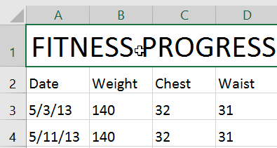

2. Trên tab ** Trang chủ **, nhấp vào ** mũi tên thả xuống ** bên cạnh lệnh ** Phông chữ **, sau đó chọn ** phông chữ ** mong muốn. Trong ví dụ của chúng tôi, chúng tôi sẽ chọn ** Century Gothic **.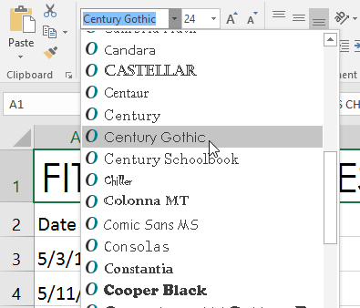

3. Văn bản sẽ thay đổi thành ** phông chữ đã chọn **.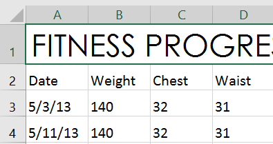

Khi tạo sổ làm việc tại nơi làm việc, bạn sẽ muốn chọn phông chữ dễ đọc. Cùng với Calibri, các phông chữ đọc tiêu chuẩn bao gồm Cambria, Times New Roman và Arial.

#### Để thay đổi màu phông chữ:

1. Chọn **(các) 
ô ** bạn muốn sửa đổi.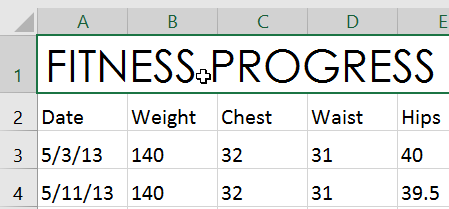

2. Trên tab ** Trang chủ **, nhấp vào ** mũi tên thả xuống ** bên cạnh lệnh ** Màu phông chữ **, sau đó chọn ** phông chữ ** ** màu ** mong muốn. Trong ví dụ của chúng tôi, chúng tôi sẽ chọn ** Xanh **.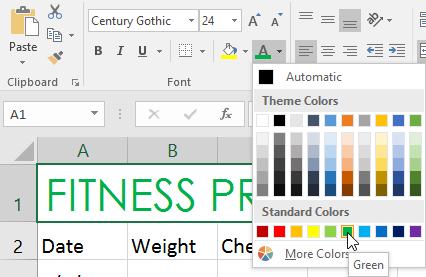

3. Văn bản sẽ thay đổi thành ** màu phông chữ đã chọn **.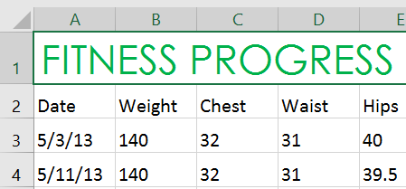

Chọn ** Màu khác ** ở cuối menu để truy cập các tùy chọn màu bổ sung. Chúng tôi đã thay đổi màu phông chữ thành màu hồng tươi.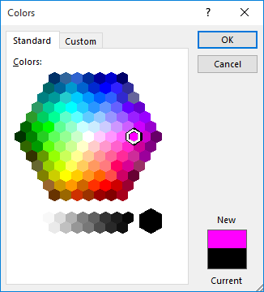

#### Để sử dụng các lệnh In đậm, Nghiêng và Gạch chân:

1. Chọn **(các) 
ô ** bạn muốn sửa đổi.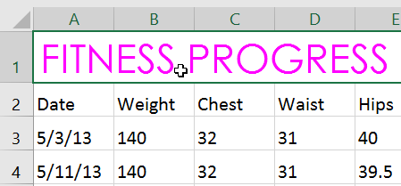

2. Bấm vào lệnh In đậm (** B **), Nghiêng (*I*) 
hoặc Gạch chân (U) 
trên tab ** Trang chủ **. Trong ví dụ của chúng tôi, chúng tôi sẽ làm cho các ô được chọn ** đậm **.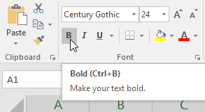

3.** kiểu đã chọn ** sẽ được áp dụng cho văn bản.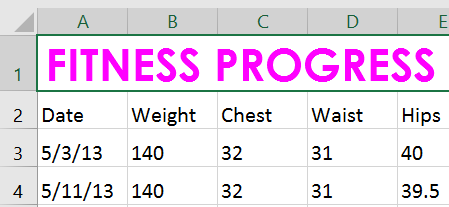

Bạn cũng có thể nhấn ** Ctrl+B ** trên bàn phím để tô đậm ** văn bản đã chọn,** Ctrl+I ** để áp dụng ** chữ in nghiêng ** và ** Ctrl+U ** để áp dụng ** gạch chân **.

### Viền ô và tô màu

 **Đường viền ô ** và ** tô màu ** cho phép bạn tạo ranh giới rõ ràng và xác định cho các phần khác nhau trong trang tính của mình. Dưới đây, chúng tôi sẽ thêm đường viền ô và tô màu cho ** ô tiêu đề ** để giúp phân biệt chúng với phần còn lại của trang tính.

#### Để thêm màu tô:

1. Chọn **(các) 
ô ** bạn muốn sửa đổi.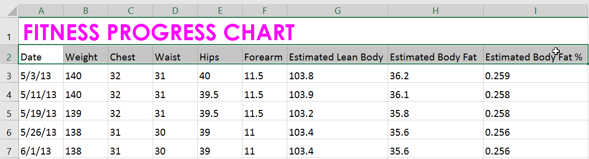

2. Trên tab ** Trang chủ **, nhấp vào ** mũi tên thả xuống ** bên cạnh lệnh ** Tô màu **, sau đó chọn ** màu tô ** bạn muốn sử dụng. Trong ví dụ của chúng tôi, chúng tôi sẽ chọn màu xám đậm.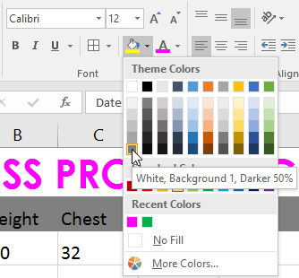

3.** Màu tô đã chọn ** sẽ xuất hiện trong các ô đã chọn. Chúng tôi cũng đã thay đổi ** màu phông chữ ** thành ** màu trắng ** để dễ đọc hơn với màu tô tối này.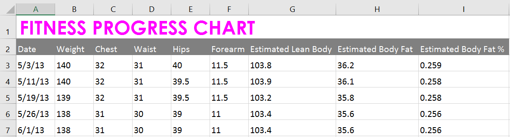

#### Để thêm đường viền:

1. Chọn **(các) 
ô ** bạn muốn sửa đổi.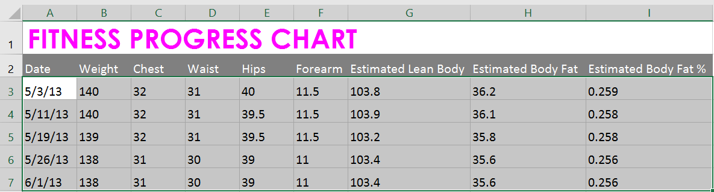

2. Trên tab ** Trang chủ **, hãy nhấp vào ** mũi tên thả xuống ** bên cạnh lệnh ** Biên giới **, sau đó chọn ** viền ** ** kiểu ** bạn muốn sử dụng. Trong ví dụ của chúng tôi, chúng tôi sẽ chọn hiển thị ** Tất cả các đường viền **.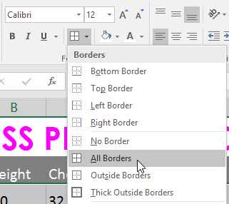

3.** kiểu đường viền đã chọn ** sẽ xuất hiện.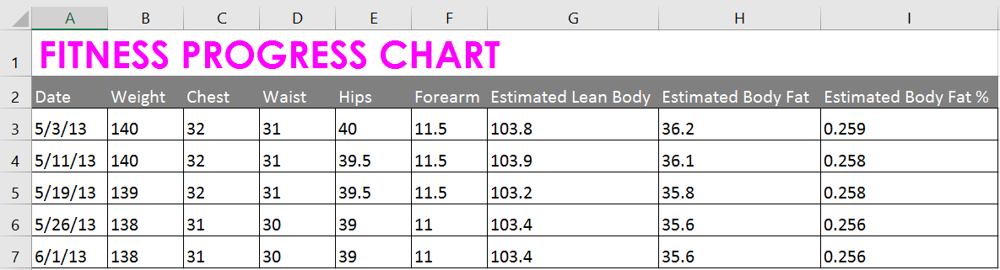

Bạn có thể vẽ đường viền và thay đổi ** kiểu đường ** và ** màu ** của đường viền bằng công cụ ** Vẽ Đường viền ** ở cuối trình đơn thả xuống Đường viền.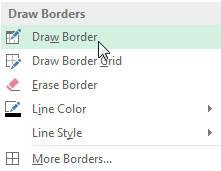

### Kiểu ô

Thay vì định dạng ô theo cách thủ công, bạn có thể sử dụng ** kiểu ô được thiết kế sẵn ** của Excel. Kiểu ô là cách nhanh chóng để đưa định dạng chuyên nghiệp vào các phần khác nhau trong sổ làm việc của bạn, như ** tiêu đề ** và ** tiêu đề **.

#### Để áp dụng kiểu ô:

Trong ví dụ của chúng tôi, chúng tôi sẽ áp dụng kiểu ô mới cho các ô ** tiêu đề ** và ** tiêu đề ** ** ** hiện có của chúng tôi.

1. Chọn **(các) 
ô ** bạn muốn sửa đổi.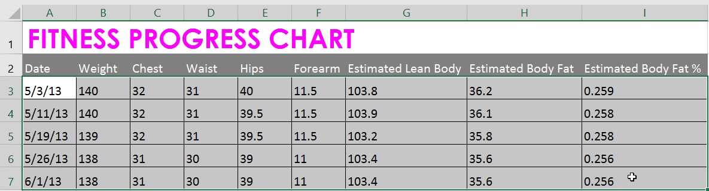

2. Nhấp vào lệnh ** kiểu ô ** trên tab ** Trang chủ **, sau đó chọn ** kiểu mong muốn ** từ trình đơn thả xuống.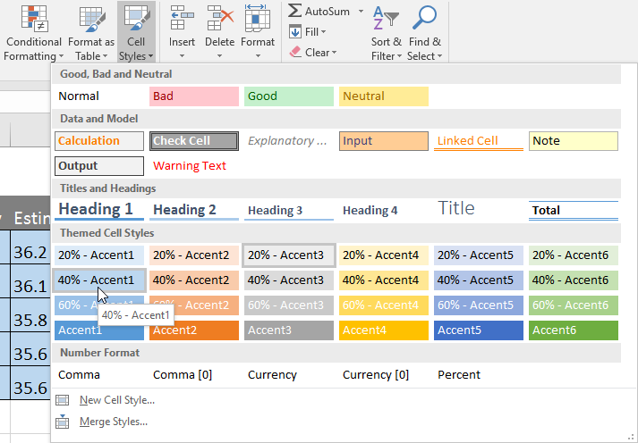

3.** kiểu ô đã chọn ** sẽ xuất hiện.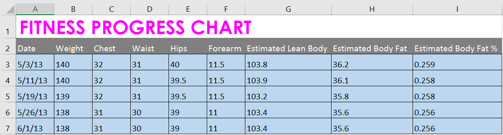

Việc áp dụng kiểu ô sẽ ** thay thế ** mọi định dạng ô hiện có ngoại trừ việc căn chỉnh văn bản. Bạn có thể không muốn sử dụng kiểu ô nếu bạn đã thêm nhiều định dạng vào sổ làm việc của mình.

### Căn chỉnh văn bản

Theo mặc định, mọi văn bản được nhập vào trang tính của bạn sẽ được căn chỉnh ở phía dưới bên trái của ô, trong khi mọi số sẽ được căn chỉnh ở phía dưới bên phải. Việc thay đổi ** căn chỉnh ** nội dung ô cho phép bạn chọn cách hiển thị nội dung trong bất kỳ ô nào, điều này có thể giúp nội dung ô của bạn dễ đọc hơn.

Nhấp vào mũi tên trong trình chiếu bên dưới để tìm hiểu thêm về các tùy chọn căn chỉnh văn bản khác nhau.

* ** Left Align **: Căn chỉnh nội dung theo viền trái của ô

* ** Căn giữa **: Căn chỉnh nội dung một khoảng cách bằng nhau từ viền trái và phải của ô

* ** Căn lề phải **: Căn chỉnh nội dung theo viền bên phải của ô

* ** Căn chỉnh trên cùng:** Căn chỉnh nội dung theo đường viền trên cùng của ô

* ** Căn chỉnh giữa **: Căn chỉnh nội dung một khoảng cách bằng nhau từ viền trên và viền dưới của ô

* ** Căn chỉnh đáy **: Căn chỉnh nội dung theo viền dưới cùng của ô

#### Để thay đổi căn chỉnh văn bản theo chiều ngang:

Trong ví dụ bên dưới, chúng tôi sẽ sửa đổi cách căn chỉnh ô ** tiêu đề ** để tạo giao diện bóng bẩy hơn và phân biệt rõ hơn với phần còn lại của trang tính.

1. Chọn **(các) 
ô ** bạn muốn sửa đổi.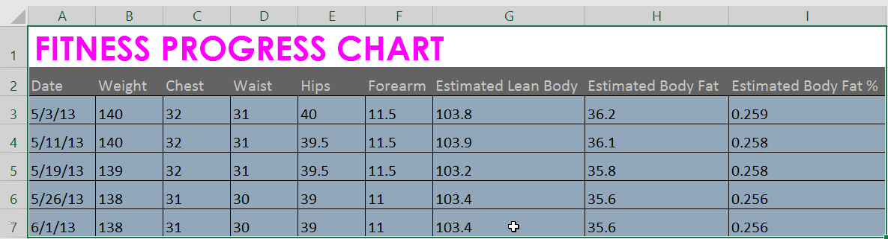

2. Chọn một trong ba lệnh ** căn chỉnh ngang ** trên tab ** Trang chủ **. Trong ví dụ của chúng tôi, chúng tôi sẽ chọn ** Căn giữa **.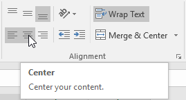

3. Văn bản sẽ ** sắp xếp lại **.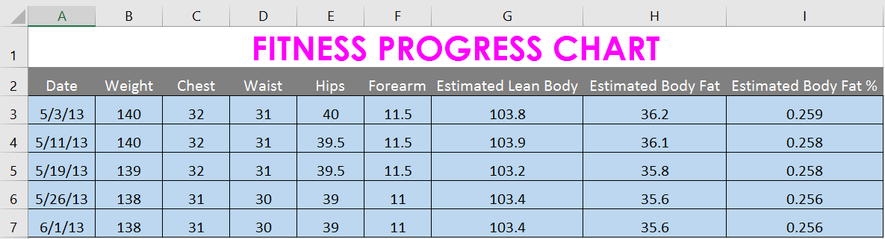

#### Để thay đổi căn chỉnh văn bản theo chiều dọc:

1. Chọn **(các) 
ô ** bạn muốn sửa đổi.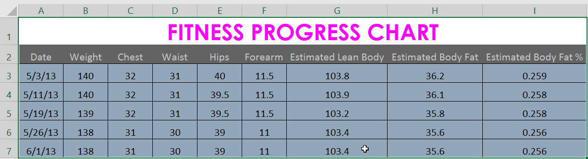

2. Chọn một trong ba lệnh ** căn chỉnh dọc ** trên tab ** Trang chủ **. Trong ví dụ của chúng tôi, chúng tôi sẽ chọn ** Căn chỉnh giữa **.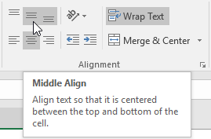

3. Văn bản sẽ ** sắp xếp lại **.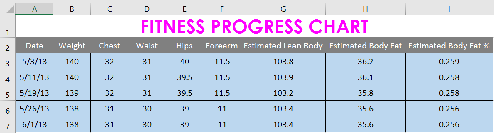

Bạn có thể áp dụng ** cả ** cài đặt căn chỉnh dọc và ngang cho bất kỳ ô nào.

### Họa sĩ định dạng

Nếu bạn muốn sao chép định dạng từ ô này sang ô khác, bạn có thể sử dụng lệnh ** Format Painter ** trên tab ** Home **. Khi bạn bấm vào Format Painter, nó sẽ sao chép tất cả định dạng từ ô đã chọn. Sau đó, bạn có thể ** nhấp và kéo ** qua bất kỳ ô nào mà bạn muốn dán định dạng.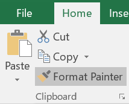

Xem video bên dưới để tìm hiểu hai cách khác nhau để sử dụng Format Painter.

### Thử thách!

1. Mở [sổ làm việc thực hành](practice_files/excel_formattingcells_practice.xlsx) 
của chúng tôi.
2. Nhấp vào tab bảng tính ** Thử thách ** ở phía dưới bên trái của bảng tính.
3. Thay đổi ** kiểu ô ** trong các ô ** A2:H2 ** thành ** Dấu 3 **.
4. Thay đổi ** cỡ chữ ** của hàng 1 thành ** 36 ** và cỡ chữ cho các hàng còn lại thành ** 18 **.
5.**Đậm ** và ** gạch chân ** văn bản ở hàng 2.
6.** Thay đổi phông chữ ** của hàng 1 thành phông chữ bạn chọn.
7.** Thay đổi phông chữ ** của các hàng còn lại thành phông chữ khác mà bạn chọn.
8. Thay đổi ** màu phông chữ ** của hàng 1 thành màu bạn chọn.
9. Chọn tất cả văn bản trong trang tính, sau đó thay đổi ** căn chỉnh ngang ** thành căn giữa và ** căn dọc ** thành căn giữa.
10. Khi bạn hoàn tất, bảng tính của bạn sẽ trông giống như thế này:

/en/excel/hiểu-số-định dạng/nội dung/