# Bài 8: hiểu-định dạng số

#### Bài 8: Tìm hiểu định dạng số

/en/excel/formatting-cells/content/

### Các định dạng số là gì?

Bất cứ khi nào bạn làm việc với bảng tính, bạn nên sử dụng ** định dạng số ** thích hợp cho dữ liệu của mình. Các định dạng số cho bảng tính của bạn biết chính xác loại dữ liệu bạn đang sử dụng, như tỷ lệ phần trăm (%), tiền tệ ($), thời gian, ngày tháng, v.v.

Hãy xem video bên dưới để tìm hiểu thêm về định dạng số trong Excel.

#### Tại sao nên sử dụng định dạng số?

Các định dạng số không chỉ giúp bảng tính của bạn dễ đọc hơn mà còn giúp sử dụng dễ dàng hơn. Khi áp dụng định dạng số, bạn sẽ cho bảng tính biết chính xác ** loại giá trị ** nào được lưu trữ trong một ô. Ví dụ: định dạng ** ngày ** cho bảng tính biết rằng bạn đang nhập ** ngày theo lịch cụ thể **. Điều này cho phép bảng tính hiểu rõ hơn dữ liệu của bạn, điều này có thể giúp đảm bảo rằng dữ liệu của bạn luôn nhất quán và các công thức của bạn được tính toán chính xác.

#### Áp dụng định dạng số

Cũng giống như các loại định dạng khác, như thay đổi màu phông chữ, bạn sẽ áp dụng định dạng số bằng cách chọn ô và chọn tùy chọn định dạng mong muốn. Có hai cách chính để chọn định dạng số:

* Đi tới tab ** Trang chủ **, nhấp vào trình đơn thả xuống **Định dạng số ** trong nhóm ** Số ** và chọn định dạng mong muốn.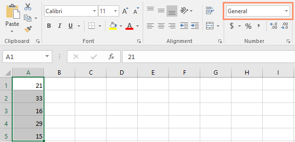

* Nhấp vào một trong các lệnh định dạng số nhanh bên dưới trình đơn thả xuống.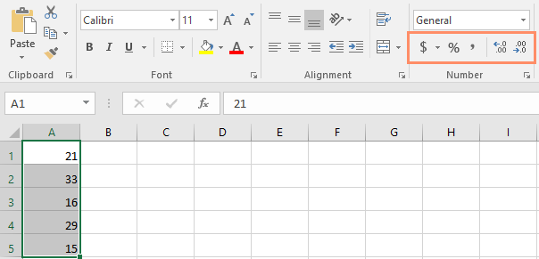

Bạn cũng có thể chọn các ô mong muốn và nhấn ** Ctrl+1 ** trên bàn phím để truy cập các tùy chọn định dạng số bổ sung.

Trong ví dụ này, chúng tôi đã áp dụng định dạng số ** Tiền tệ **, định dạng này thêm các ký hiệu tiền tệ ($) 
và hiển thị hai chữ số thập phân cho bất kỳ giá trị số nào.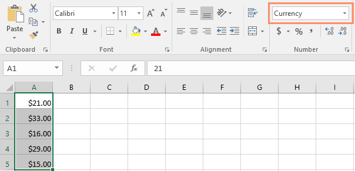

Nếu bạn chọn bất kỳ ô nào có định dạng số, bạn có thể thấy ** giá trị thực ** của ô trong thanh công thức. Bảng tính sẽ sử dụng giá trị này cho các công thức và các phép tính khác.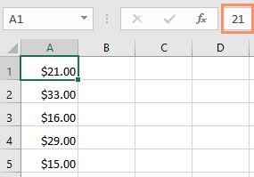

### Sử dụng đúng định dạng số

Định dạng số có nhiều thứ hơn là chọn ô và áp dụng định dạng. Bảng tính thực sự có thể áp dụng định dạng số ** tự động ** dựa trên cách bạn nhập dữ liệu. Điều này có nghĩa là bạn sẽ cần nhập dữ liệu theo cách mà chương trình có thể hiểu được, sau đó đảm bảo rằng các ô đang sử dụng định dạng số thích hợp. Ví dụ: hình ảnh bên dưới cho thấy cách sử dụng chính xác các định dạng số cho ngày, tỷ lệ phần trăm và thời gian: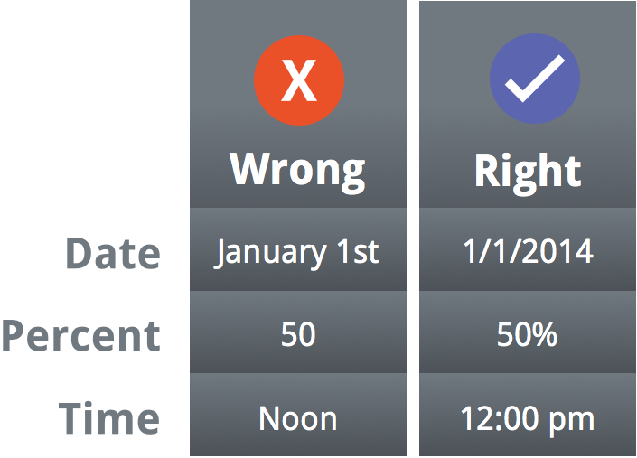

Bây giờ bạn đã biết thêm về cách hoạt động của định dạng số, chúng ta sẽ xem xét một số định dạng số đang hoạt động.

### Định dạng phần trăm

Một trong những định dạng số hữu ích nhất là định dạng ** phần trăm **(%). Nó hiển thị các giá trị dưới dạng phần trăm, như ** 20%** hoặc ** 55%**. Điều này đặc biệt hữu ích khi tính toán những thứ như chi phí thuế bán hàng hoặc tiền boa. Khi bạn nhập dấu phần trăm (%) 
sau một số, định dạng số phần trăm sẽ được áp dụng cho ô đó ** tự động **.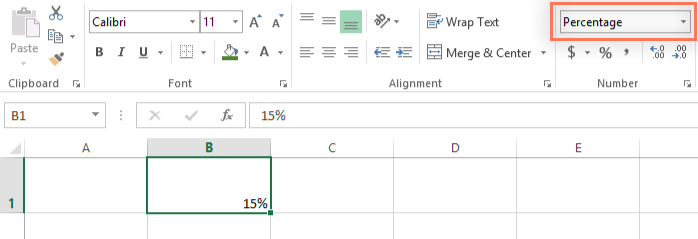

Như bạn có thể nhớ trong lớp toán, tỷ lệ phần trăm cũng có thể được viết dưới dạng ** thập phân **. Vì vậy, 15% tương đương với 0,15, 7,5% là 0,075, 20% là 0,20, 55% là 0,55, v.v. Bạn có thể xem lại [bài học này](../../../percents/converting-percentages-decimals-and-fractions/1/index.html) 
từ [Hướng dẫn toán học](../../../not-offline.html?url=https:/edu.gcfglobal.org/en/topics/math) 
của chúng tôi để tìm hiểu thêm về cách chuyển đổi tỷ lệ phần trăm thành số thập phân.

Có nhiều khi định dạng phần trăm sẽ hữu ích. Ví dụ: trong các hình ảnh bên dưới, hãy để ý cách ** thuế suất bán hàng ** được định dạng khác nhau cho mỗi bảng tính (5, 5% và 0,05)
: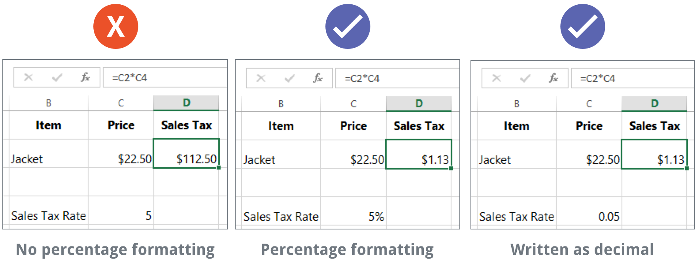

Như bạn có thể thấy, phép tính trong bảng tính bên trái hoạt động không chính xác. Nếu không có định dạng số phần trăm, bảng tính của chúng tôi cho rằng chúng tôi muốn nhân 22,50 USD với 5 chứ không phải 5%. Và trong khi bảng tính bên phải vẫn hoạt động mà không cần định dạng phần trăm thì bảng tính ở giữa lại dễ đọc hơn.

### Định dạng ngày

Bất cứ khi nào bạn làm việc với ** ngày **, bạn sẽ muốn sử dụng định dạng ngày để cho bảng tính biết rằng bạn đang đề cập đến ** ngày theo lịch cụ thể **, chẳng hạn như ngày 15 tháng 7 năm 2014. Định dạng ngày cũng cho phép bạn làm việc với một tập hợp các hàm ngày mạnh mẽ sử dụng thông tin ngày và giờ để tính toán câu trả lời.

Bảng tính không hiểu thông tin giống như cách con người hiểu. Ví dụ: nếu bạn nhập ** Tháng 10 ** vào một ô, bảng tính sẽ không biết bạn đang nhập ngày nên nó sẽ xử lý ngày đó giống như bất kỳ văn bản nào khác. Thay vào đó, khi nhập ngày, bạn sẽ cần sử dụng ** định dạng cụ thể ** mà bảng tính của bạn hiểu được, như ** tháng/ngày/năm **(hoặc ** ngày/tháng/năm ** tùy thuộc vào quốc gia bạn đang ở). Trong ví dụ bên dưới, chúng tôi sẽ nhập ** 10/12/2014 ** cho ngày 12 tháng 10 năm 2014. Sau đó, bảng tính của chúng tôi sẽ tự động áp dụng định dạng số ngày cho ô.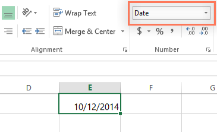

Bây giờ chúng ta đã định dạng ngày chính xác, chúng ta có thể thực hiện những việc khác nhau với dữ liệu này. Ví dụ: chúng ta có thể sử dụng ô điều khiển điền để tiếp tục ngày tháng trong cột, do đó, một ngày khác sẽ xuất hiện trong mỗi ô: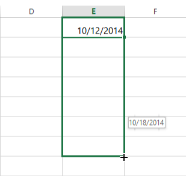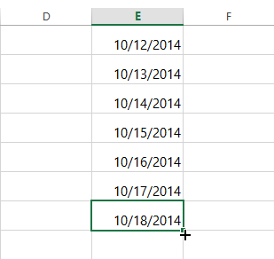

Nếu định dạng ngày không được áp dụng tự động, điều đó có nghĩa là bảng tính không hiểu dữ liệu bạn đã nhập. Trong ví dụ bên dưới, chúng tôi đã nhập ** ngày 15 tháng 3 **. Bảng tính không hiểu rằng chúng tôi đang đề cập đến một ngày nên ô này vẫn đang sử dụng định dạng số ** chung **.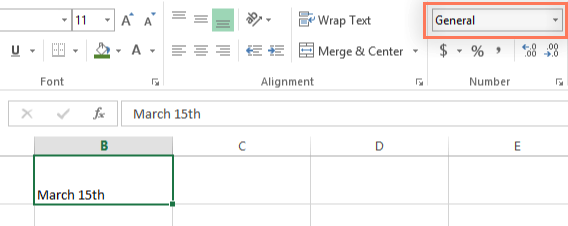

Mặt khác, nếu chúng ta gõ ** 15 tháng 3 **(không có chữ "th"), bảng tính ** sẽ ** nhận ra đó là một ngày. Vì không bao gồm năm nên bảng tính sẽ tự động thêm năm hiện tại để ngày đó có tất cả thông tin cần thiết. Chúng ta cũng có thể nhập ngày theo một số cách khác, chẳng hạn như ** 15/3 **,** 15/3/2014 ** hoặc ** 15 tháng 3 năm 2014 ** và bảng tính sẽ vẫn nhận dạng ngày đó là một ngày.

Hãy thử nhập ngày bên dưới vào bảng tính và xem định dạng ngày có được áp dụng tự động không:

* 12/10

* tháng mười

* ngày 12 tháng 10

* Tháng 10 năm 2016

* 12/10/2016

* Ngày 12 tháng 10 năm 2016

* 2016

* ngày 12 tháng 10

Nếu bạn muốn thêm ngày hiện tại vào một ô, bạn có thể sử dụng phím tắt ** Ctrl+;**, như trong video bên dưới.

#### Các tùy chọn định dạng ngày khác

Để truy cập các tùy chọn định dạng ngày khác, hãy chọn trình đơn thả xuống **Định dạng số ** và chọn **Định dạng số khác **. Đây là các tùy chọn để hiển thị ngày theo cách khác, chẳng hạn như thêm ngày trong tuần hoặc bỏ qua năm.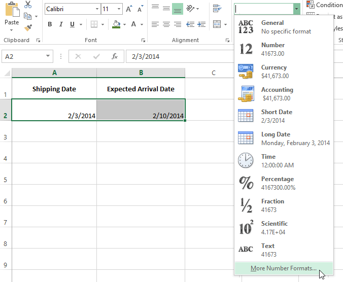

Hộp thoại **Định dạng ô ** sẽ xuất hiện. Từ đây, bạn có thể chọn tùy chọn định dạng ngày mong muốn.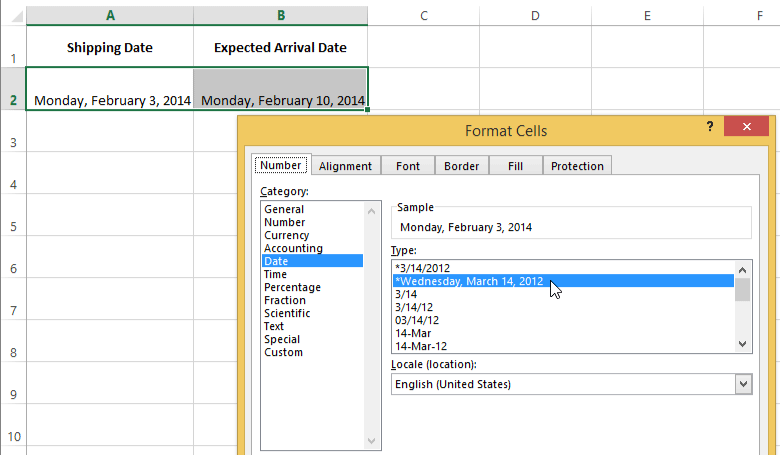

Như bạn có thể thấy trong thanh công thức, định dạng ngày tùy chỉnh không chỉ thay đổi ngày thực tế trong ô của chúng ta mà còn cả cách nó được hiển thị.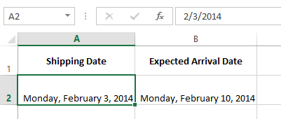

### Mẹo định dạng số

Dưới đây là một số mẹo để có được kết quả tốt nhất với định dạng số:

* **Áp dụng định dạng số cho toàn bộ cột **: Nếu bạn dự định sử dụng một cột cho một loại dữ liệu nhất định, như ngày hoặc tỷ lệ phần trăm, bạn có thể thấy dễ dàng nhất khi chọn toàn bộ cột bằng cách nhấp vào chữ cái cột và áp dụng định dạng số mong muốn. Bằng cách này, mọi dữ liệu bạn thêm vào cột này trong tương lai sẽ có định dạng số chính xác. Lưu ý rằng hàng tiêu đề thường không bị ảnh hưởng bởi định dạng số.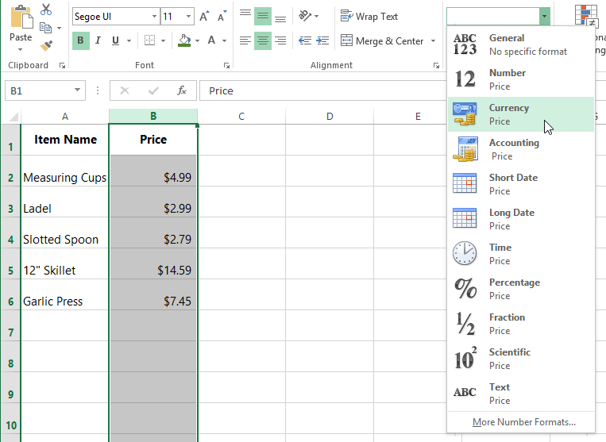

* ** Kiểm tra kỹ các giá trị của bạn sau khi áp dụng định dạng số **: Nếu áp dụng định dạng số cho dữ liệu hiện có, bạn có thể nhận được kết quả không mong muốn. Ví dụ: áp dụng định dạng ** phần trăm **(%) 
cho một ô có giá trị 5 sẽ mang lại cho bạn 500% chứ không phải 5%. Trong trường hợp này, bạn cần nhập lại chính xác các giá trị trong từng ô.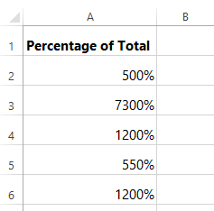

* Nếu bạn tham chiếu một ô có định dạng số trong công thức, bảng tính có thể tự động áp dụng định dạng số tương tự cho ô mới. Ví dụ: nếu bạn sử dụng một giá trị có định dạng tiền tệ trong công thức thì giá trị được tính cũng sẽ sử dụng định dạng số tiền tệ.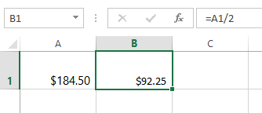

* Nếu bạn muốn dữ liệu của mình xuất hiện ** chính xác như đã nhập,** bạn sẽ cần sử dụng định dạng số ** văn bản **. Định dạng này đặc biệt phù hợp với các số mà bạn không muốn thực hiện phép tính, chẳng hạn như số điện thoại, mã zip hoặc các số bắt đầu bằng 0, như ** 02415 **. Để có kết quả tốt nhất, bạn có thể muốn áp dụng định dạng số văn bản trước khi nhập dữ liệu vào các ô này.

#### Tăng số thập phân và giảm số thập phân

Các lệnh ** Tăng số thập phân ** và ** Giảm số thập phân ** cho phép bạn kiểm soát số lượng vị trí thập phân được hiển thị trong một ô. Các lệnh này không thay đổi giá trị của ô; thay vào đó, chúng hiển thị giá trị ở một số vị trí thập phân đã đặt.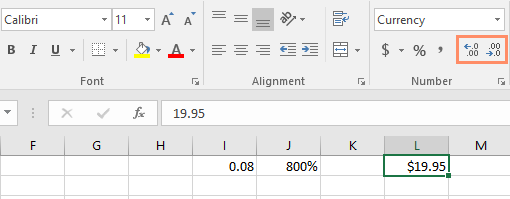

Giảm số thập phân sẽ hiển thị giá trị được làm tròn đến vị trí thập phân đó nhưng giá trị thực tế trong ô vẫn sẽ hiển thị trên thanh công thức.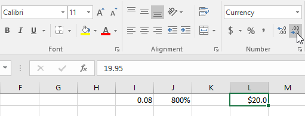

Các lệnh ** Tăng số thập phân ** và ** Giảm số thập phân ** không hoạt động với một số định dạng số, như ** Ngày ** và ** Phân số **.

### Thử thách!

1. Mở [sổ làm việc thực hành](practice_files/excel_numberformats_practice.xlsx) 
của chúng tôi.
2. Trong ô ** D2 **, nhập ngày hôm nay và nhấn ** Enter **.
3. Nhấp vào ô ** D2 ** và xác minh rằng ô đó đang sử dụng định dạng số ** Ngày **. Hãy thử thay đổi sang định dạng ngày khác (ví dụ:** Ngày dài **).
4. Trong ô ** D2 **, sử dụng hộp thoại **Định dạng ô ** để chọn định dạng ngày ** 14-Mar-12 **.
5. Thay đổi thuế suất bán hàng trong ô ** D8 ** thành định dạng ** Phần trăm **.
6. Áp dụng định dạng ** Tiền tệ ** cho tất cả ** cột B **.
7. Trong ô ** D8 **, sử dụng lệnh ** Tăng số thập phân ** hoặc ** Giảm số thập phân ** để thay đổi số vị trí thập phân thành ** một **. Bây giờ nó sẽ hiển thị ** 7,5%**.
8. Khi bạn hoàn tất, bảng tính của bạn sẽ trông như thế này: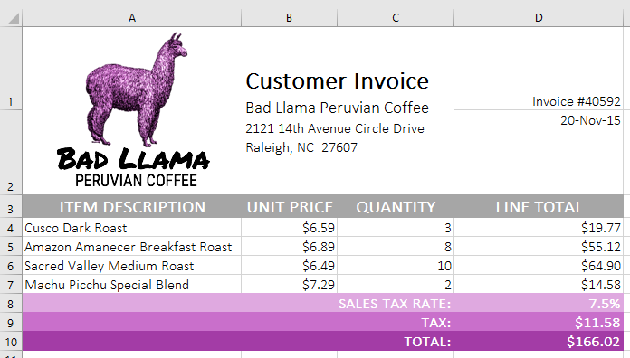

/en/excel/working-with-multiple-worksheets/content/