# Bài 9: Làm việc với nhiều bảng tính

#### Bài 9: Làm việc với nhiều bảng tính

/en/excel/hiểu-số-định dạng/nội dung/

### Giới thiệu

Theo mặc định, mỗi sổ làm việc đều chứa ít nhất một ** bảng tính **. Khi làm việc với lượng lớn dữ liệu, bạn có thể tạo ** nhiều trang tính ** để giúp sắp xếp sổ làm việc của mình và giúp tìm nội dung dễ dàng hơn. Bạn cũng có thể ** nhóm ** các trang tính để nhanh chóng thêm thông tin vào nhiều trang tính cùng lúc.

Xem video bên dưới để tìm hiểu thêm về cách sử dụng nhiều trang tính.

#### Để chèn một bảng tính mới:

1. Xác định vị trí và chọn nút ** Trang tính mới ** gần góc dưới cùng bên phải của cửa sổ Excel.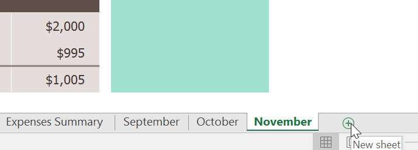

2. Một ** mới ** ** trang tính trống ** sẽ xuất hiện.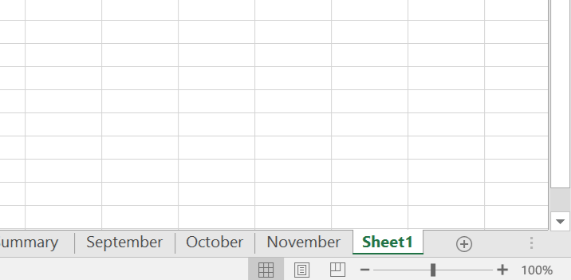

Theo mặc định, bất kỳ sổ làm việc mới nào bạn tạo trong Excel sẽ chứa một trang tính, được gọi là ** Trang tính1 **. Để thay đổi ** số trang tính mặc định **, hãy điều hướng đến ** Backstage view **, nhấp vào ** Tùy chọn **, sau đó chọn số trang tính mong muốn để đưa vào mỗi sổ làm việc mới.

#### Để sao chép một bảng tính:

Nếu bạn cần ** sao chép ** nội dung của trang tính này sang trang tính khác, Excel cho phép bạn ** sao chép ** một trang tính hiện có.

1. Nhấp chuột phải vào trang tính bạn muốn sao chép, sau đó chọn ** Di chuyển hoặc Sao chép ** từ trình đơn trang tính.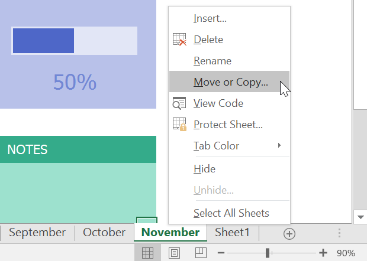

2. Hộp thoại ** Di chuyển hoặc Sao chép ** sẽ xuất hiện. Chọn vị trí trang tính sẽ xuất hiện trong trường ** Trước trang tính:**. Trong ví dụ của chúng tôi, chúng tôi sẽ chọn **(di chuyển đến cuối)** để đặt trang tính ở bên phải trang tính hiện có.
3.**Đánh dấu vào hộp ** bên cạnh ** Tạo bản sao **, sau đó nhấp vào ** OK **.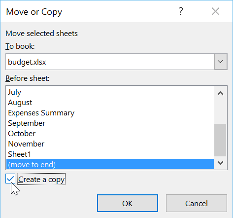

4. Bảng tính sẽ được ** sao chép **. Nó sẽ có cùng tiêu đề với trang tính gốc cũng như ** phiên bản ** ** số **. Trong ví dụ của chúng tôi, chúng tôi đã sao chép trang tính ** Tháng 11 **, vì vậy trang tính mới của chúng tôi có tên là ** Tháng 11 ** **(2)**. Tất cả nội dung từ bảng tính tháng 11 cũng đã được sao chép sang bảng tính mới.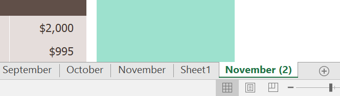

Bạn cũng có thể sao chép một trang tính sang một ** sổ làm việc ** hoàn toàn khác. Bạn có thể chọn bất kỳ sổ làm việc nào hiện đang mở từ trình đơn thả xuống **Đến sổ:**.

#### Để đổi tên một bảng tính:

1. Nhấp chuột phải vào ** trang tính ** bạn muốn đổi tên, sau đó chọn **Đổi tên ** từ trình đơn trang tính.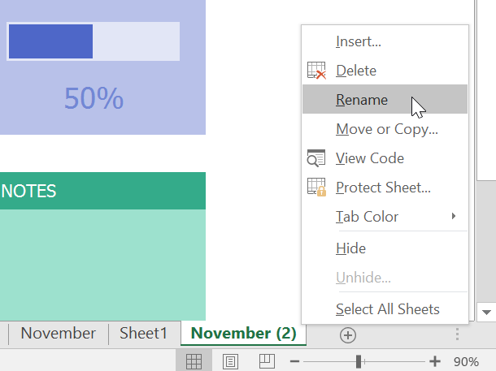

2. Nhập ** tên mong muốn ** cho bảng tính.
3. Nhấp vào bất kỳ đâu bên ngoài worksheet tab hoặc nhấn ** Enter ** trên bàn phím của bạn. Bảng tính sẽ được ** đổi tên **.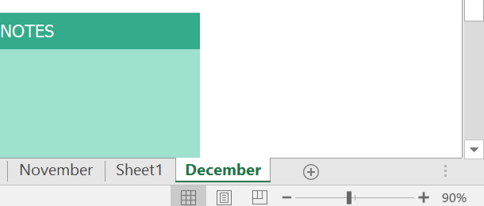

#### Để di chuyển một bảng tính:

1. Nhấp và kéo trang tính bạn muốn di chuyển cho đến khi ** mũi tên nhỏ màu đen ** xuất hiện phía trên vị trí mong muốn.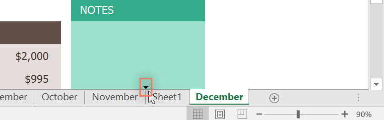

2. Thả chuột. Bảng tính sẽ được di chuyển.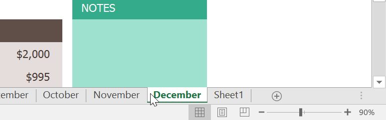

#### Để thay đổi màu worksheet tab:

1. Nhấp chuột phải vào tab bảng tính mong muốn và di chuột qua ** Màu tab **. Trình đơn ** Màu ** sẽ xuất hiện.
2. Chọn ** màu ** mong muốn.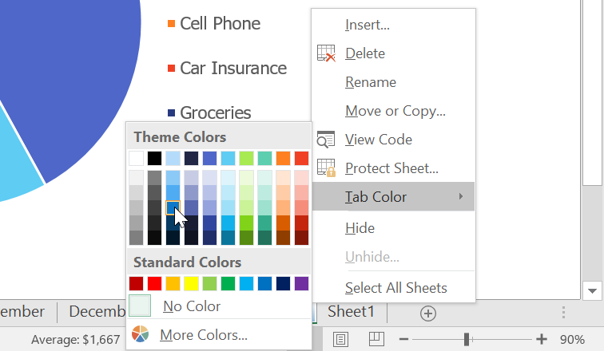

3. Màu tab bảng tính sẽ được ** thay đổi **.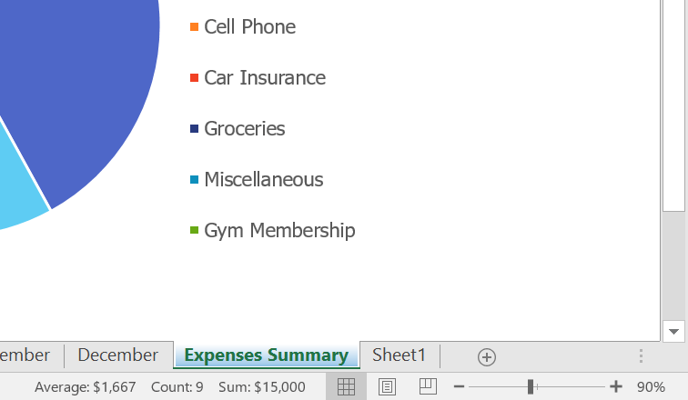

Màu worksheet tab ** ít được chú ý hơn ** đáng kể khi bảng tính được chọn. Chọn một bảng tính khác để xem màu sẽ xuất hiện như thế nào khi bảng tính không được chọn.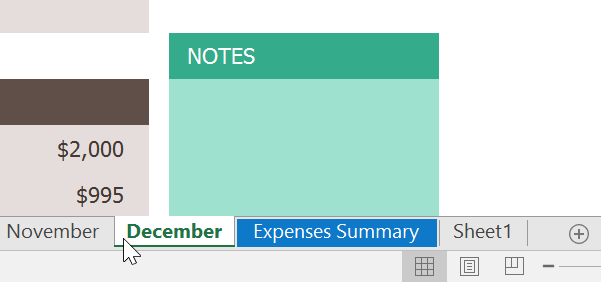

#### Để xóa một bảng tính:

1. Nhấp chuột phải vào ** trang tính ** bạn muốn xóa, sau đó chọn ** Xóa ** từ trình đơn trang tính.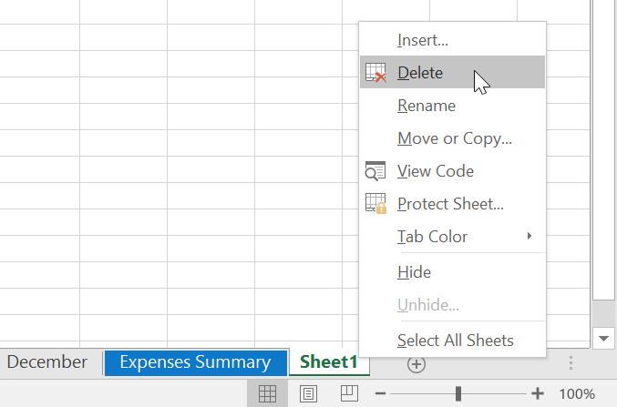

2. Bảng tính sẽ bị ** xóa ** khỏi sổ làm việc của bạn.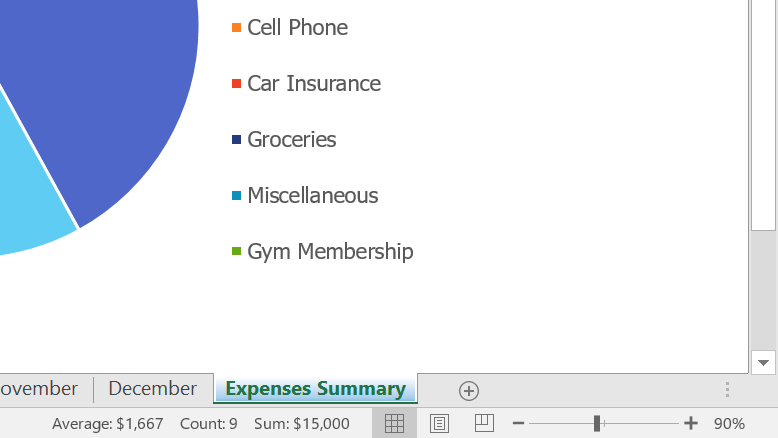

Nếu bạn muốn ngăn chặn việc chỉnh sửa hoặc xóa các bảng tính cụ thể, bạn có thể ** bảo vệ ** ** chúng ** bằng cách nhấp chuột phải vào bảng tính mong muốn và chọn ** Protect Sheet ** từ trình đơn bảng tính.

#### Chuyển đổi giữa các bảng tính

Nếu bạn muốn xem một bảng tính khác, bạn chỉ cần ** nhấp vào tab ** để chuyển sang bảng tính đó. Tuy nhiên, với sổ làm việc lớn hơn, việc này đôi khi có thể trở nên tẻ nhạt vì có thể bạn phải cuộn qua tất cả các tab để tìm tab bạn muốn. Thay vào đó, bạn chỉ cần ** nhấp chuột phải ** vào mũi tên cuộn ở góc dưới bên trái, như hiển thị bên dưới.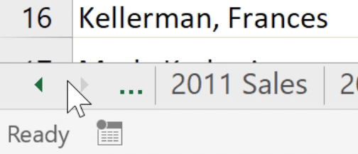

Một hộp thoại sẽ xuất hiện với danh sách tất cả các trang tính trong sổ làm việc của bạn. Sau đó, bạn có thể ** nhấp đúp ** vào trang tính mà bạn muốn chuyển tới.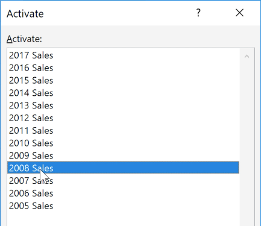

Xem video bên dưới để thấy lối tắt này hoạt động.

### Nhóm và tách nhóm các bảng tính

Bạn có thể làm việc với từng trang tính ** riêng lẻ ** hoặc bạn có thể làm việc với nhiều trang tính cùng một lúc. Một số trang tính có thể được kết hợp thành một ** nhóm **. Mọi thay đổi được thực hiện đối với một trang tính trong một nhóm sẽ được thực hiện đối với ** mọi trang tính ** trong nhóm đó.

#### Để nhóm các bảng tính:

1. Chọn ** trang tính đầu tiên ** bạn muốn đưa vào ** nhóm trang tính **.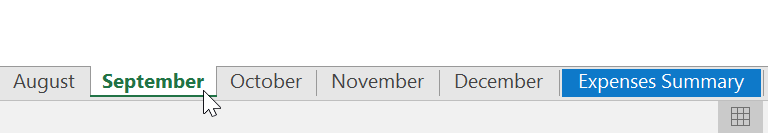

2. Nhấn và giữ phím ** Ctrl ** trên bàn phím của bạn. Chọn ** bảng tính tiếp theo ** bạn muốn có trong nhóm.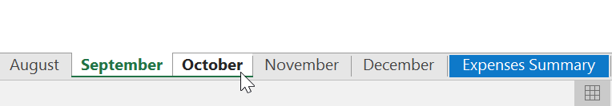

3. Tiếp tục chọn các bảng tính cho đến khi tất cả các bảng tính bạn muốn nhóm được chọn, sau đó nhả phím ** Ctrl **. Các bảng tính hiện được ** nhóm lại **.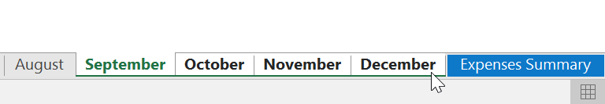

Trong khi các trang tính được nhóm lại, bạn có thể điều hướng đến bất kỳ trang tính nào trong nhóm. Mọi ** thay đổi ** được thực hiện đối với một trang tính sẽ xuất hiện trên ** mọi ** ** trang tính ** trong nhóm. Tuy nhiên, nếu bạn chọn một trang tính không nằm trong nhóm thì tất cả các trang tính của bạn sẽ bị ** không được nhóm **.

#### Để rã nhóm các bảng tính:

1. Nhấp chuột phải vào một bảng tính trong nhóm, sau đó chọn ** Ungroup ** ** Sheets ** từ menu bảng tính.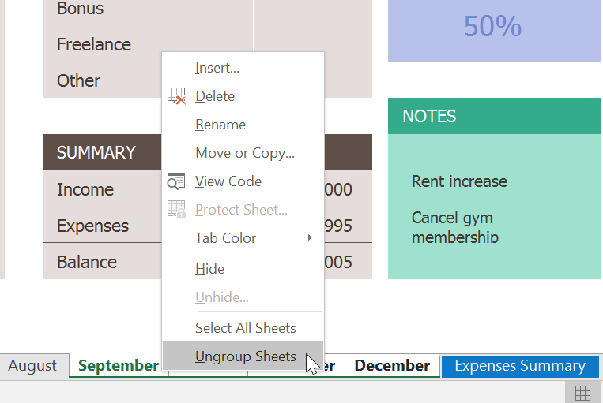

2. Các bảng tính sẽ ** được tách nhóm **. Bạn cũng có thể nhấp vào bất kỳ trang tính nào không có trong nhóm để ** rã nhóm tất cả các trang tính **.

### Thử thách!

1. Mở [sổ làm việc thực hành](practice_files/excel_multiplesheets_practice.xlsx) 
của chúng tôi.
2. Chèn một bảng tính ** mới ** và ** đổi tên ** nó ** Tóm tắt Q1 **.
3. Di chuyển bảng tính ** Tóm tắt chi phí ** sang phía bên phải, sau đó di chuyển bảng tính ** Tóm tắt Q1 ** sao cho nó nằm trong khoảng ** tháng 3 ** đến ** tháng 4 **.
4.** Tạo bản sao ** của bảng tính Tóm tắt chi phí bằng cách nhấp chuột phải vào tab. Đừng chỉ sao chép và dán nội dung của bảng tính vào một bảng tính mới.
5. Thay đổi ** màu ** của tab Tháng Giêng thành ** xanh ** và màu của tab Tháng Hai thành ** đỏ **.
6. Nhóm các trang tính ** Tháng 9 **,** Tháng 10 ** và ** Tháng 11 **.
7. Khi bạn hoàn tất, sổ làm việc của bạn sẽ trông giống như thế này: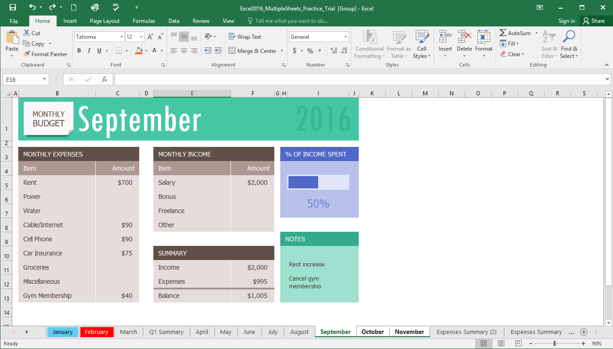

/en/excel/using-find-replace/content/