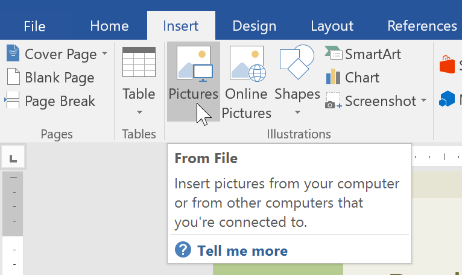
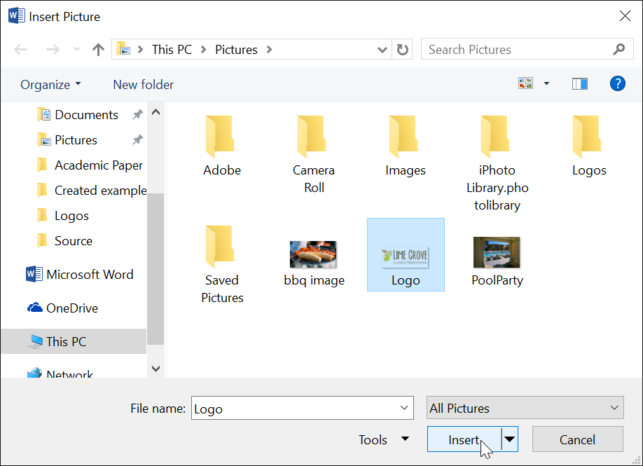
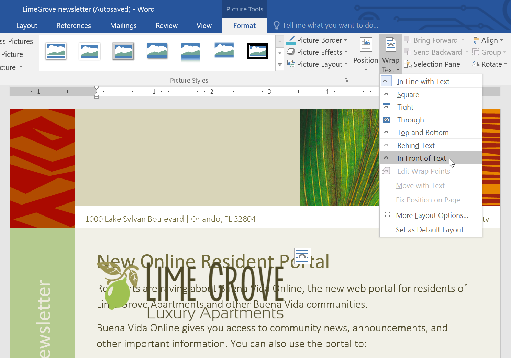
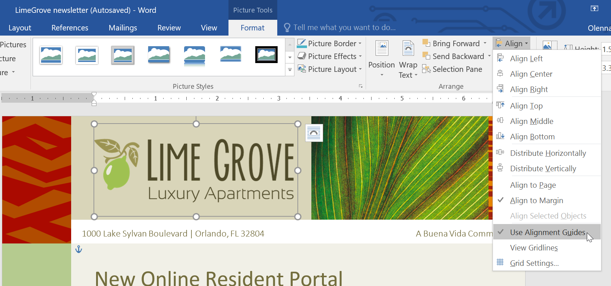
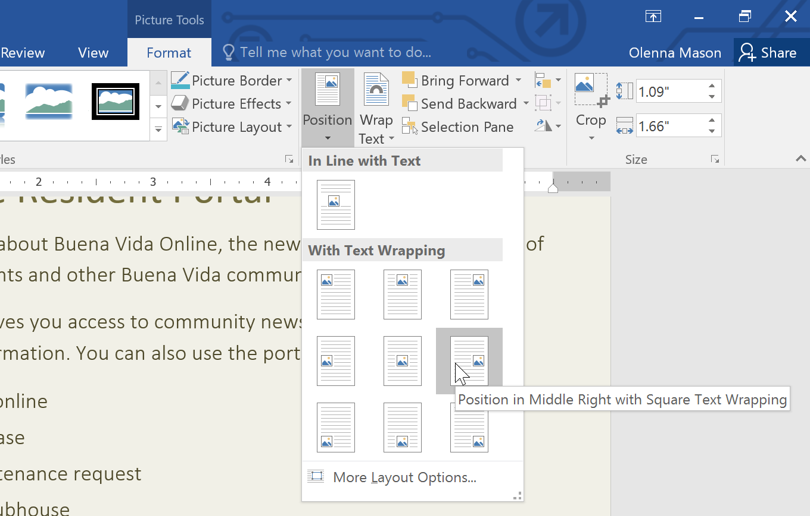
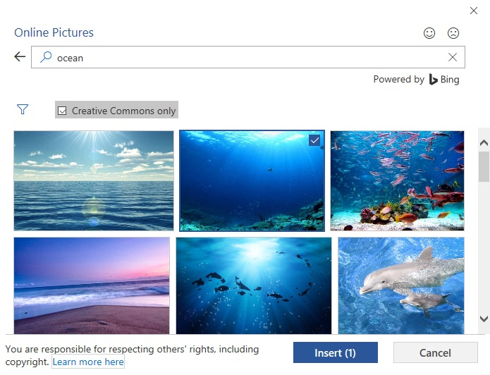
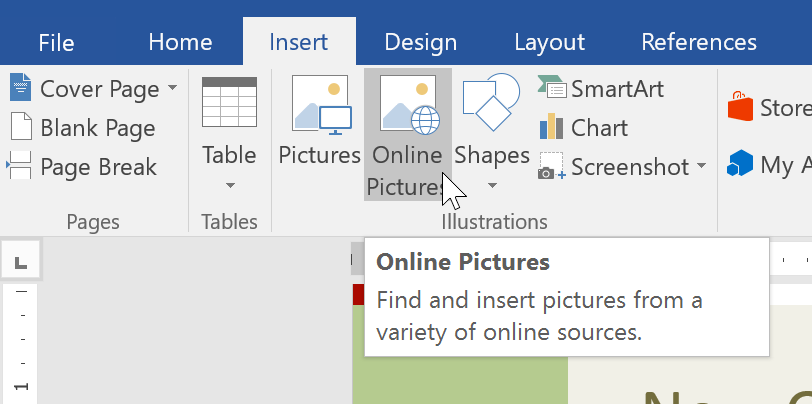
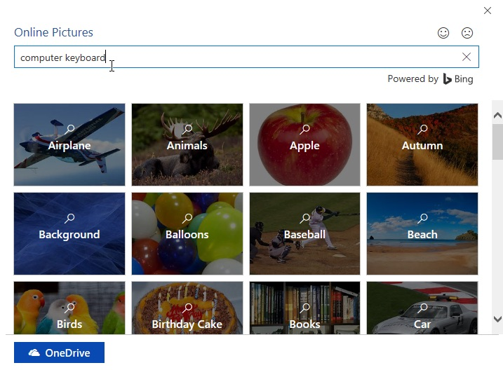
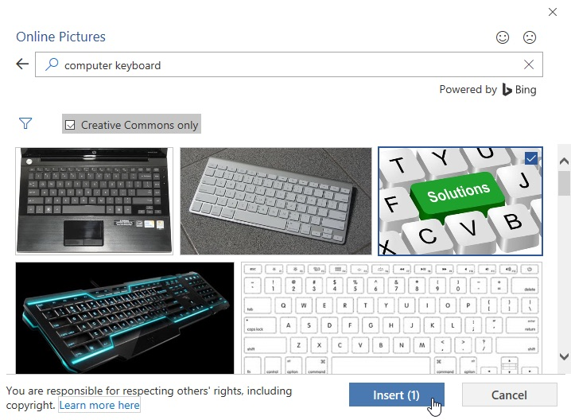

# Bài 18: Pictures-và-gói văn bản

#### Bài 18: Pictures và Text Wrapping

/en/word/số trang/nội dung/

### Giới thiệu

Thêm ** Pictures ** vào tài liệu của bạn có thể là một cách tuyệt vời để ** minh họa ** ** thông tin quan trọng ** và thêm ** điểm nhấn trang trí ** vào văn bản hiện có. Được sử dụng ở mức độ vừa phải, Pictures có thể cải thiện giao diện tổng thể của tài liệu của bạn.

Xem video bên dưới để tìm hiểu thêm về cách thêm Pictures vào tài liệu của bạn.

#### Đến Insert ảnh từ File:

Nếu bạn nghĩ đến một hình ảnh cụ thể, bạn có thể ** Insert một hình ảnh từ File **. Trong ví dụ của chúng tôi, chúng tôi sẽ Insert một ảnh được lưu cục bộ trên máy tính của chúng tôi. Nếu bạn muốn làm việc với ví dụ của chúng tôi, hãy nhấp chuột phải vào hình ảnh bên dưới và Save nó vào máy tính của bạn.

1. Đặt ** điểm chèn ** vào nơi bạn muốn hình ảnh xuất hiện.

   
2. Chọn tab ** Insert ** trên ** Ribbon **, sau đó nhấp vào lệnh ** Pictures **.

   
3. Hộp thoại ** Insert Picture ** sẽ xuất hiện. Điều hướng đến thư mục chứa hình ảnh của bạn, sau đó chọn hình ảnh và nhấp vào ** Insert **.

   
4. Hình ảnh sẽ xuất hiện trong tài liệu.

   

Để thay đổi kích thước hình ảnh, hãy nhấp và kéo một trong các ** bộ điều khiển định cỡ góc **. Hình ảnh sẽ thay đổi kích thước trong khi vẫn giữ nguyên tỷ lệ. Nếu bạn muốn kéo dài theo chiều ngang hoặc chiều dọc, bạn có thể sử dụng ** tay cầm định cỡ bên **.

#### Thay đổi cài đặt Text Wrapping

Khi bạn Insert một ảnh từ File, bạn có thể nhận thấy rằng rất khó để di chuyển ảnh đó chính xác đến nơi bạn muốn. Điều này là do ** Text Wrapping ** cho hình ảnh được đặt thành ** In Line with Text **. Bạn sẽ cần thay đổi cài đặt ** Text Wrapping ** nếu bạn muốn di chuyển hình ảnh một cách tự do hoặc nếu bạn chỉ muốn văn bản bao quanh hình ảnh theo cách tự nhiên hơn.

#### Để bao văn bản xung quanh một hình ảnh:

1. Chọn ** hình ảnh ** bạn muốn bao quanh văn bản. Tab ** Định dạng ** sẽ xuất hiện ở bên phải của Ribbon.

   
2. Trên ** tab Định dạng **, hãy nhấp vào lệnh ** Ngắt dòng ** trong ** Sắp xếp ** Group, sau đó chọn tùy chọn Text Wrapping mong muốn. Trong ví dụ của chúng tôi, chúng tôi sẽ chọn ** Ở phía trước văn bản ** để chúng tôi có thể tự do di chuyển nó mà không ảnh hưởng đến văn bản. Bạn cũng có thể chọn ** Thêm Layout Options ** để tinh chỉnh Layout.
3. Văn bản sẽ bao quanh hình ảnh. Bây giờ bạn có thể ** di chuyển ** hình ảnh nếu muốn. Chỉ cần nhấp và kéo nó đến ** vị trí ** mong muốn. Khi bạn di chuyển nó, ** hướng dẫn căn chỉnh ** sẽ xuất hiện trước Help bạn Align hình ảnh trên trang.

   

Bạn cũng có thể truy cập Text Wrapping Options bằng cách chọn hình ảnh và nhấp vào nút ** Layout Options ** xuất hiện.

Nếu hướng dẫn căn chỉnh không xuất hiện, hãy chọn tab Trang Layout, sau đó nhấp vào lệnh Align. Chọn ** Sử dụng Hướng dẫn Căn chỉnh ** từ trình đơn thả xuống xuất hiện.

#### Sử dụng cài đặt Text Wrapping được xác định trước

Text Wrapping được xác định trước cho phép bạn nhanh chóng di chuyển hình ảnh đến một vị trí cụ thể trên trang. Văn bản sẽ tự động bao quanh đối tượng nên vẫn dễ đọc.

#### Chèn trực tuyến Pictures

Nếu bạn không có ảnh mình muốn trên máy tính, bạn có thể ** tìm ảnh trực tuyến ** để thêm vào tài liệu của mình. Word cung cấp hai Options để tìm kiếm trực tuyến Pictures:

* ** Tìm kiếm Hình ảnh trên Bing **: Bạn có thể sử dụng tùy chọn này để tìm kiếm hình ảnh trên Internet. Theo mặc định, Bing chỉ hiển thị những hình ảnh được cấp phép theo ** Creative Commons **, nghĩa là bạn có thể sử dụng chúng cho các dự án của riêng mình. Tuy nhiên, bạn nên nhấp vào liên kết tới trang web của hình ảnh để xem liệu có bất kỳ hạn chế nào về cách sử dụng nó hay không.

  
* ** OneDrive **: Bạn có thể Insert một hình ảnh được lưu trữ trên OneDrive của bạn. Bạn cũng có thể liên kết ** tài khoản trực tuyến ** khác với Microsoft Account của mình, bao gồm Facebook và Flickr.

  

  #### Đến Insert một ảnh trực tuyến:

1. Đặt ** điểm chèn ** vào nơi bạn muốn hình ảnh xuất hiện.

   
2. Chọn tab ** Insert **, sau đó nhấp vào lệnh ** Trực tuyến Pictures **.

   
3. Hộp thoại Insert Pictures sẽ xuất hiện.
4. Chọn ** Tìm kiếm hình ảnh trên Bing ** hoặc ** OneDrive ** của bạn. Trong ví dụ của chúng tôi, chúng tôi sẽ sử dụng Tìm kiếm hình ảnh Bing.

   
5. Nhấn phím ** Enter **. Kết quả tìm kiếm của bạn sẽ xuất hiện trong hộp.
6. Chọn hình ảnh mong muốn, sau đó nhấp vào ** Insert **.

   
7. Hình ảnh sẽ xuất hiện trong tài liệu.

   

Khi thêm hình ảnh, video hoặc nhạc vào dự án của riêng bạn, điều quan trọng là phải đảm bảo bạn có quyền hợp pháp để sử dụng chúng. Hầu hết những thứ bạn mua hoặc tải xuống trực tuyến đều ** được bảo vệ bởi bản quyền **, nghĩa là bạn có thể không được phép sử dụng chúng. Để biết thêm thông tin, Review [Bài học về Bản quyền và Sử dụng hợp lý](../../../useinformationchính xác/copyright-and-fair-use/1/index.html).

### Thử thách!

1. Open [tài liệu thực hành](practice_files/word_picturestextwrapping_practice.docx) của chúng tôi và cuộn đến ** trang 3 **.
2. Thay đổi ** Text Wrapping ** của hình ảnh con chó thành ** Hình vuông **.
3. Kéo hình ảnh sang bên phải của đoạn văn dưới cùng.
4. Đặt điểm chèn bên cạnh tiêu đề ** Lời nhắc của cộng đồng **.
5. Sử dụng lệnh ** Trực tuyến Pictures ** và nhập từ ** Recycle ** vào tìm kiếm.
6. Insert một ** biểu tượng tái chế **.
7. Nếu cần, hãy sử dụng ** bộ điều khiển định cỡ góc ** để thay đổi kích thước biểu tượng tái chế sao cho mọi thứ đều vừa với trang 3.
8. Thay đổi Text Wrapping thành ** Hình vuông ** và kéo biểu tượng sang bên phải của dấu đầu dòng đầu tiên.
9. Khi bạn hoàn tất, trang 3 sẽ trông giống như thế này:

   

/en/word/formatting-Pictures/content/