# Bài 19: định dạng-Pictures

#### Bài 19: Định dạng Pictures

/en/word/Pictures-and-text-wrapping/content/

### Giới thiệu

Có nhiều cách để ** định dạng ** Pictures trong Word. Ví dụ: bạn có thể thay đổi ** kích thước hoặc hình dạng ** của hình ảnh để phù hợp hơn với tài liệu của mình. Bạn cũng có thể cải thiện ** giao diện ** của nó bằng cách sử dụng các công cụ điều chỉnh hình ảnh của Word.

Xem video bên dưới để tìm hiểu thêm về định dạng Pictures.

#### Để cắt một hình ảnh:

Khi bạn cắt ảnh, một phần của ảnh sẽ bị ** xóa **. Việc cắt xén có thể hữu ích nếu bạn đang làm việc với một hình ảnh quá lớn và bạn chỉ muốn tập trung vào ** một phần ** của hình ảnh đó.

1. Chọn hình ảnh bạn muốn cắt. Tab ** Định dạng ** sẽ xuất hiện.
2. Từ tab Định dạng, nhấp vào lệnh ** Cắt **.

   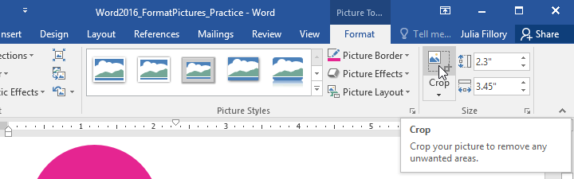
3. ** C **** tay cầm ropping ** sẽ xuất hiện ở các cạnh và góc của hình ảnh. Nhấp và kéo ** bất kỳ **** tay cầm ** nào để cắt hình ảnh. Vì bộ điều khiển cắt xén nằm gần bộ điều khiển thay đổi kích thước nên hãy cẩn thận để không kéo nhầm bộ điều khiển thay đổi kích thước.

   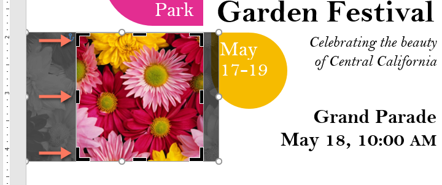
4. Để xác nhận, nhấp lại vào lệnh ** Cắt **. Hình ảnh sẽ được cắt.

   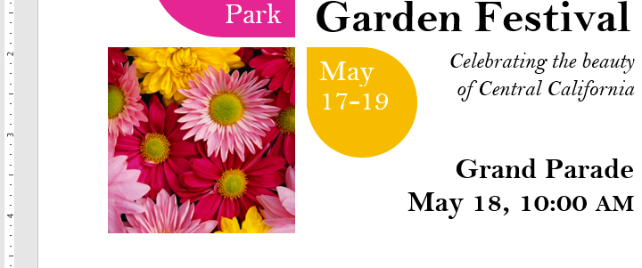

Các tay cầm ở góc rất hữu ích để cắt xén hình ảnh ** theo chiều ngang ** và ** theo chiều dọc ** cùng một lúc.

#### Để cắt hình ảnh thành hình dạng:

1. Chọn hình ảnh bạn muốn cắt, sau đó nhấp vào tab ** Định dạng **.
2. Nhấp vào mũi tên thả xuống ** Cắt **. Di chuột qua ** Cắt thành hình **, sau đó chọn ** hình ** mong muốn từ trình đơn thả xuống.

   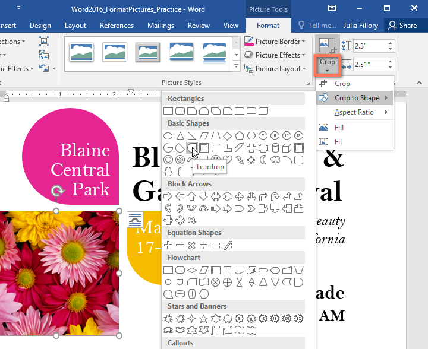
3. Hình ảnh sẽ được cắt theo hình dạng đã chọn.

   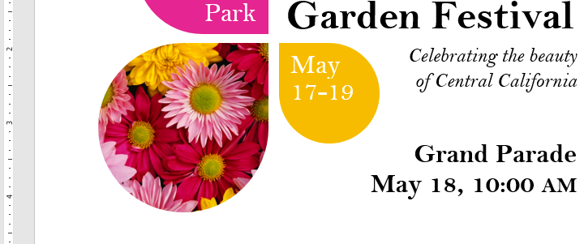

#### Để thêm đường viền vào ảnh:

1. Chọn ảnh bạn muốn thêm đường viền, sau đó nhấp vào tab ** Định dạng **.
2. Nhấp vào lệnh ** Picture Border **. Một menu thả xuống sẽ xuất hiện.
3. Từ đây, bạn có thể chọn ** màu **, ** trọng lượng ** (độ dày) và liệu đường có ** nét đứt ** hay không.

   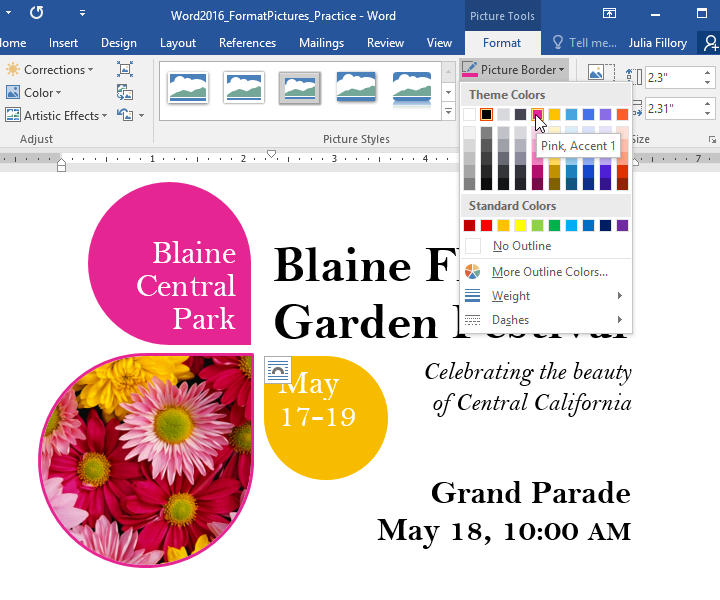
4. Đường viền sẽ xuất hiện xung quanh hình ảnh.

### Thực hiện điều chỉnh hình ảnh

Với ** công cụ điều chỉnh hình ảnh ** của Word, bạn có thể dễ dàng thay đổi các thuộc tính như màu sắc, độ tương phản, độ bão hòa và tông màu. Word cũng cung cấp ** hình ảnh Styles ** tích hợp sẵn, có thể được sử dụng để thêm khung, đổ bóng và các hiệu ứng xác định trước khác.

Khi bạn đã sẵn sàng điều chỉnh một hình ảnh, chỉ cần chọn nó. Sau đó, hãy sử dụng Options bên dưới, có thể tìm thấy trên tab ** Định dạng **.

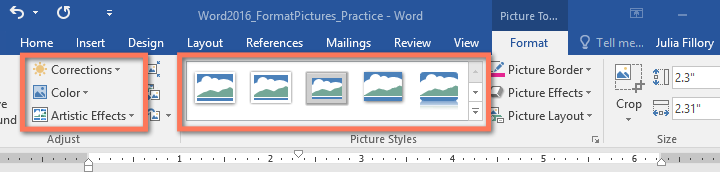

#### Sửa chữa

Từ đây, bạn có thể ** làm sắc nét hoặc làm mềm ** hình ảnh để điều chỉnh mức độ rõ nét hoặc mờ của hình ảnh. Bạn cũng có thể điều chỉnh ** độ sáng và ** ** độ tương phản **, những điều này ảnh hưởng đến độ sáng và cường độ chung của hình ảnh.

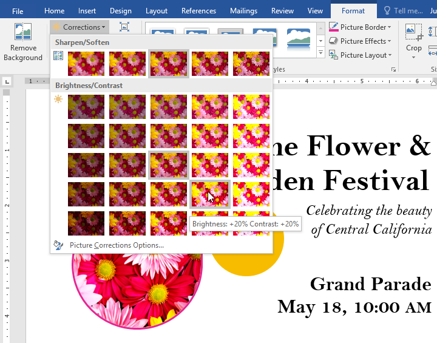

#### Màu sắc

Sử dụng lệnh này, bạn có thể điều chỉnh ** độ bão hòa ** (mức độ rực rỡ của màu sắc), ** tông màu ** (nhiệt độ màu của hình ảnh, từ mát đến ấm) và ** tô màu ** (sắc độ tổng thể của hình ảnh).

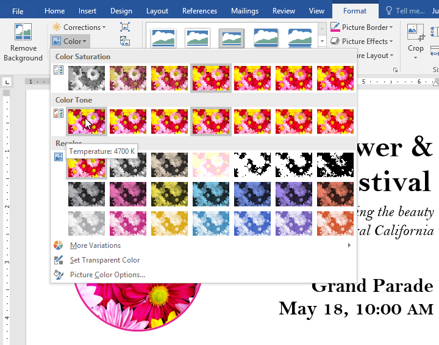

#### Hiệu ứng nghệ thuật

Tại đây, bạn có thể áp dụng ** hiệu ứng đặc biệt ** cho hình ảnh của mình, chẳng hạn như màu phấn, màu nước hoặc các cạnh phát sáng. Vì kết quả rất đậm nên bạn có thể muốn sử dụng những hiệu ứng này một cách tiết kiệm (đặc biệt là trong các tài liệu chuyên nghiệp).

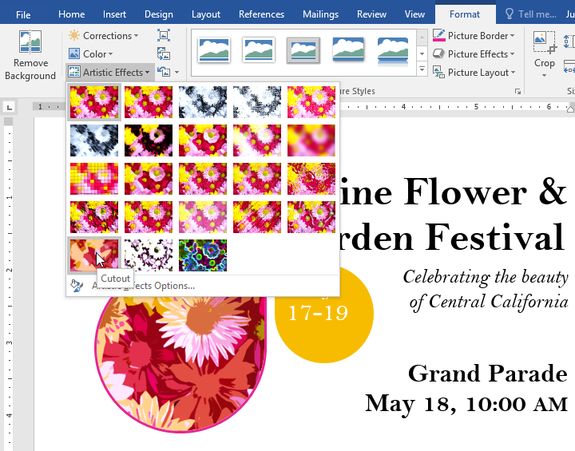

#### Hình ảnh Styles Group

Group này chứa các ** Styles ** được xác định trước khác nhau giúp việc định dạng hình ảnh trở nên dễ dàng hơn. Ảnh Styles được thiết kế để ** đóng khung ** hình ảnh của bạn mà không thay đổi các cài đặt hoặc hiệu ứng cơ bản.

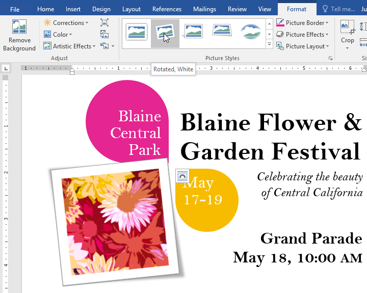

### Đang nén Pictures

Nếu bạn dự định gửi tài liệu có chứa Pictures qua email thì bạn cần theo dõi kích thước ** File của nó **. Hình ảnh lớn, độ phân giải cao có thể khiến tài liệu của bạn trở nên rất lớn, điều này có thể gây khó khăn cho việc đính kèm vào email. Ngoài ra, ** các vùng bị cắt ** của Pictures được lưu trong tài liệu theo mặc định, có thể thêm vào kích thước File.

Rất may, bạn có thể giảm kích thước File tài liệu của mình bằng cách ** nén ** Pictures. Điều này sẽ làm giảm ** độ phân giải ** và ** xóa các vùng đã cắt **.

Việc nén ảnh có thể ảnh hưởng đáng kể đến chất lượng của ảnh (ví dụ: ảnh có thể bị mờ hoặc bị vỡ pixel). Vì lý do này, chúng tôi khuyên bạn nên ** lưu thêm một bản sao tài liệu ** trước khi nén Pictures. Ngoài ra, hãy chuẩn bị sử dụng ** Lệnh hoàn tác ** nếu bạn không hài lòng với kết quả.

#### Để nén ảnh:

1. Chọn ảnh bạn muốn nén, sau đó điều hướng đến tab ** Định dạng **.
2. Nhấp vào lệnh ** Nén Pictures **.

   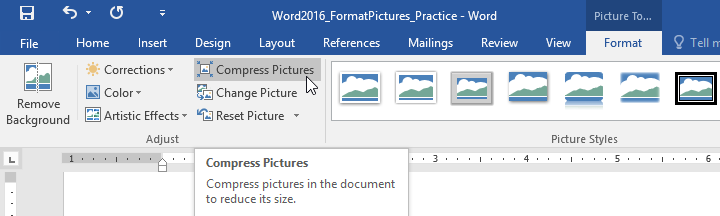
3. Một hộp thoại sẽ xuất hiện. Chọn hộp bên cạnh ** Xóa các vùng đã cắt của Pictures **. Bạn cũng có thể chọn áp dụng cài đặt cho ** chỉ ảnh này ** hay cho tất cả Pictures trong tài liệu.
4. Chọn một ** Đầu ra mục tiêu **. Nếu bạn gửi tài liệu của mình qua email, bạn có thể muốn chọn ** Email **, tạo ra kích thước File nhỏ nhất.
5. Nhấp vào ** OK **.

   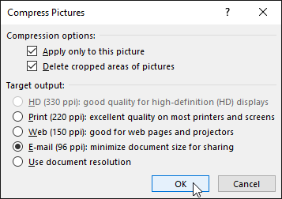

### Thử thách!

1. Open [tài liệu thực hành](practice_files/word_formatpictures_practice.docx) của chúng tôi.
2. Cuộn đến ** trang 2 ** và chọn hình ảnh những chiếc thuyền buồm.
3. Trong tab ** Định dạng **, thay đổi kiểu thành ** Khung đơn giản, Trắng **.
4. Với ảnh vẫn được chọn, hãy sử dụng ** Cắt theo hình ** và cắt thành hình ** Sóng kép ** trong danh mục ** Sao và Biểu ngữ **. ** Gợi ý **: Tên hình dạng sẽ xuất hiện khi bạn di chuột qua chúng.
5. Chọn hình ảnh của ** neo **.
6. Trong tab ** Định dạng **, hãy sử dụng menu thả xuống ** Màu ** để tô màu lại mỏ neo thành ** Vàng, Màu nhấn 2 nhạt **.
7. Khi bạn hoàn tất, trang của bạn sẽ trông như thế này:

   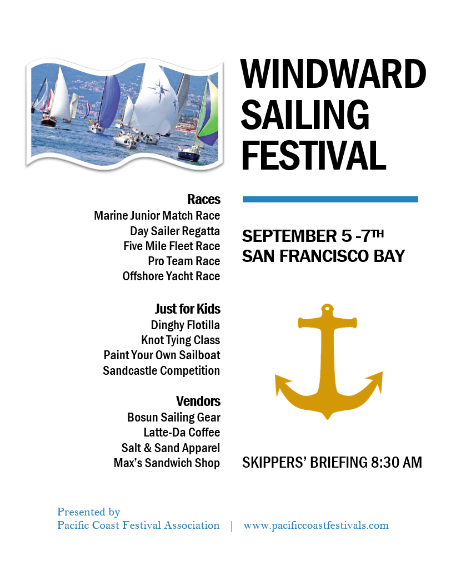

/en/word/Shapes/content/