# Bài 20: Shapes

#### Bài 20: Shapes

/en/word/formatting-Pictures/content/

### Giới thiệu

Bạn có thể thêm ** nhiều loại Shapes ** vào tài liệu của mình, bao gồm mũi tên, chú thích, hình vuông, ngôi sao và sơ đồ Shapes. Bạn muốn đặt tên và địa chỉ của mình ngoài phần còn lại trong sơ yếu lý lịch của bạn? Sử dụng một dòng. Bạn cần tạo sơ đồ hiển thị dòng thời gian hoặc quy trình? Sử dụng sơ đồ Shapes. Mặc dù bạn có thể không cần Shapes trong mọi tài liệu bạn tạo nhưng chúng có thể thêm ** sự hấp dẫn trực quan và sự rõ ràng **.

Xem video bên dưới để tìm hiểu thêm về cách sử dụng Shapes trong Word.

#### Đối với Insert một hình dạng:

1. Chọn tab ** Insert **, sau đó nhấp vào lệnh ** Shapes **. Menu thả xuống Shapes sẽ xuất hiện.
2. Chọn ** hình dạng ** mong muốn.

   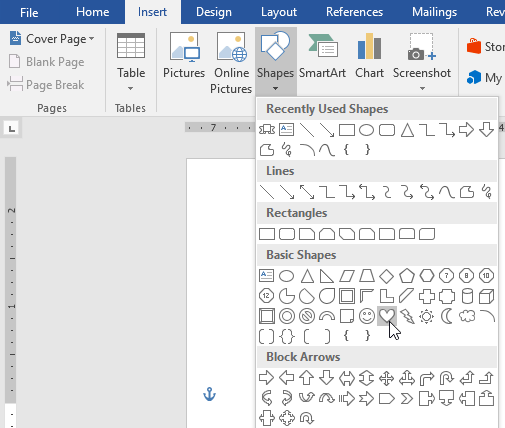
3. Nhấp và kéo vào vị trí mong muốn để thêm hình dạng vào tài liệu của bạn.

   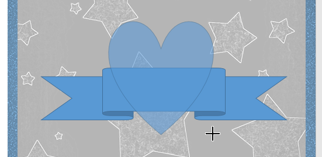

Nếu muốn, bạn có thể nhập văn bản vào một hình dạng. Khi hình dạng xuất hiện trong tài liệu của bạn, bạn có thể bắt đầu nhập. Sau đó, bạn có thể sử dụng ** định dạng Options ** trên tab ** Home ** để thay đổi phông chữ, cỡ chữ hoặc màu sắc của văn bản.

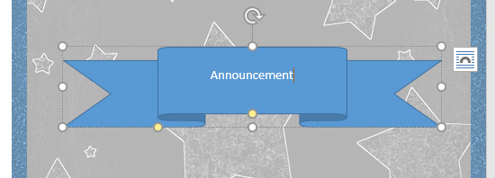

#### Để thay đổi thứ tự của Shapes:

Nếu một hình chồng lên một hình khác, bạn có thể cần thay đổi ** thứ tự ** để hình dạng chính xác xuất hiện ở phía trước. Bạn có thể đưa một hình dạng lên ** phía trước ** hoặc gửi nó ra ** phía sau **. Nếu có nhiều hình ảnh, bạn có thể sử dụng ** Đưa lên trước ** hoặc ** Gửi ra sau ** để điều chỉnh thứ tự. Bạn cũng có thể di chuyển hình dạng ** ở phía trước ** hoặc ** phía sau ** văn bản.

1. Nhấp chuột phải vào ** hình ** bạn muốn di chuyển. Trong ví dụ của chúng tôi, chúng tôi muốn trái tim xuất hiện phía sau Ribbon, vì vậy chúng tôi sẽ nhấp chuột phải vào trái tim.

   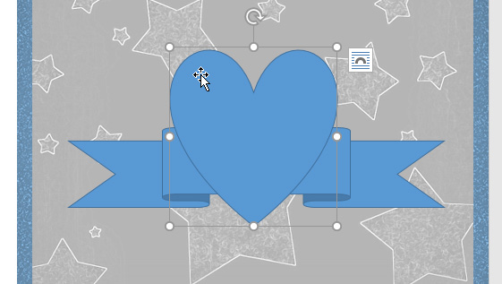
2. Trong menu xuất hiện, hãy di chuột qua ** Đưa ra phía trước ** hoặc ** Gửi ra phía sau **. Một số thứ tự Options sẽ xuất hiện. Chọn tùy chọn đặt hàng mong muốn. Trong ví dụ này, chúng tôi sẽ chọn ** Gửi lại **.

   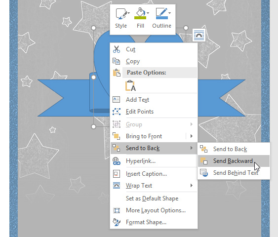
3. Thứ tự của Shapes sẽ thay đổi.

   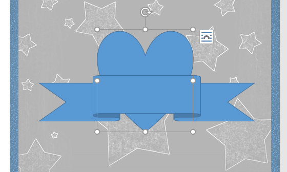

Trong một số trường hợp, tùy chọn sắp xếp bạn chọn sẽ không ảnh hưởng đến thứ tự của Shapes. Nếu điều này xảy ra, hãy thử chọn lại tùy chọn tương tự hoặc thử một tùy chọn khác.

Nếu bạn có nhiều Shapes xếp chồng lên nhau thì có thể khó chọn một hình dạng riêng lẻ. ** Selection Pane ** cho phép bạn chọn một hình dạng và kéo nó đến vị trí New. Để truy cập Selection Pane, hãy nhấp vào ** Selection Pane ** trên tab ** Định dạng **.

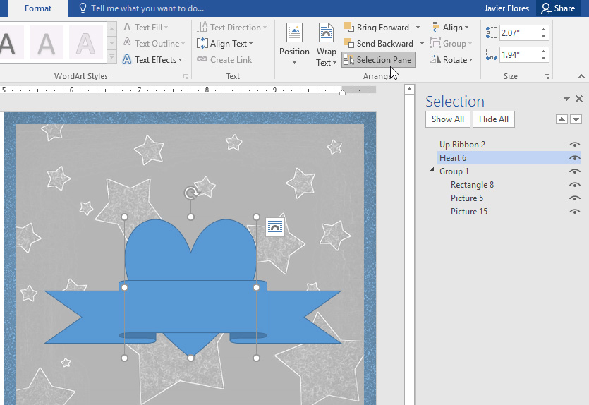

#### Để thay đổi kích thước một hình dạng:

1. Chọn hình dạng bạn muốn thay đổi kích thước. ** Bộ điều khiển định cỡ ** sẽ xuất hiện ở các góc và cạnh của hình.

   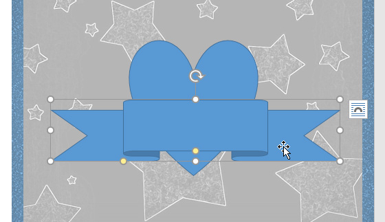
2. Nhấp và kéo ** bộ điều khiển định cỡ ** cho đến khi hình dạng có kích thước mong muốn. Bạn có thể sử dụng bộ điều khiển định cỡ ở góc để thay đổi ** chiều cao ** và ** chiều rộng ** của hình dạng cùng một lúc.

   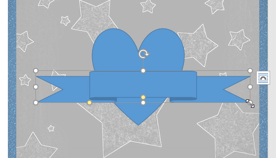
3. Để Rotate hình dạng, hãy nhấp và kéo núm điều khiển xoay.

   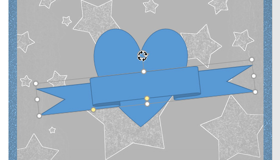

Một số Shapes còn có một hoặc nhiều ** tay cầm màu vàng ** có thể dùng để sửa đổi hình dạng. Ví dụ: với banner Shapes bạn có thể điều chỉnh vị trí của các nếp gấp.

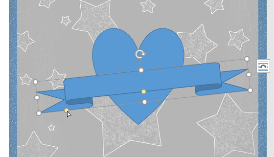

### Đang sửa đổi Shapes

Word cho phép bạn sửa đổi Shapes theo nhiều cách khác nhau để bạn có thể điều chỉnh chúng cho phù hợp với dự án của mình. Bạn có thể ** thay đổi ** hình dạng thành ** hình dạng khác **, ** định dạng kiểu và màu của hình dạng ** và thêm nhiều ** hiệu ứng ** khác nhau.

#### Để thay đổi kiểu dáng hình dạng:

Việc chọn ** kiểu hình dạng ** cho phép bạn áp dụng các màu sắc và hiệu ứng cài sẵn để nhanh chóng thay đổi hình thức của hình dạng.

1. Chọn hình dạng bạn muốn thay đổi.

   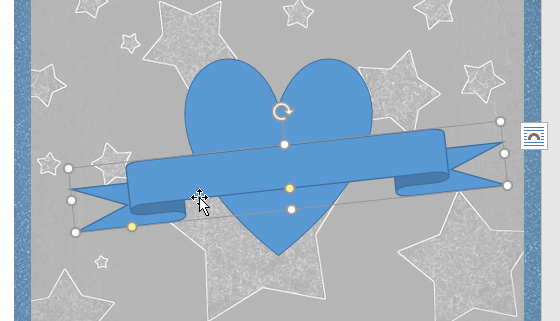
2. Trên tab ** Định dạng **, hãy nhấp vào mũi tên thả xuống ** Thêm ** trong ** Hình dạng Styles ** Group.

   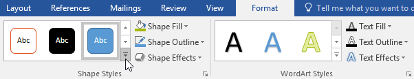
3. Menu thả xuống Styles sẽ xuất hiện. Chọn ** kiểu ** bạn muốn sử dụng.

   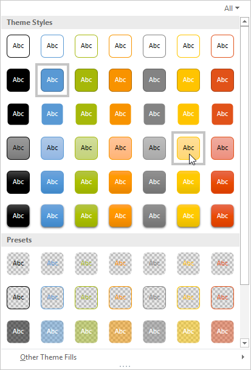
4. Hình dạng sẽ xuất hiện theo kiểu đã chọn.

   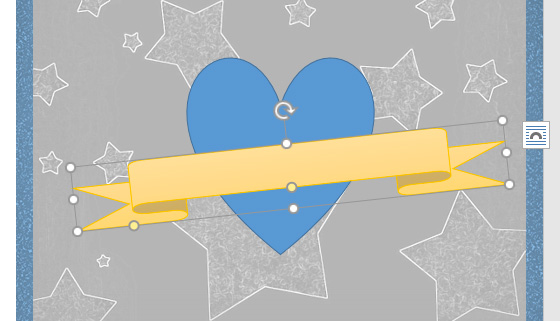

#### Để thay đổi màu tô của hình dạng:

1. Chọn hình dạng bạn muốn thay đổi.

   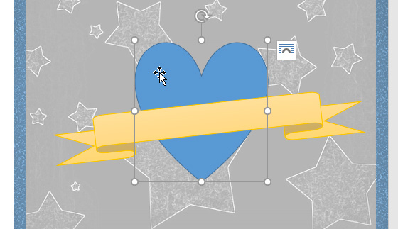
2. Trên tab ** Định dạng **, nhấp vào mũi tên thả xuống ** Shape Fill **. Chọn ** màu ** bạn muốn sử dụng. Để View màu bổ sung Options, hãy chọn ** Màu tô khác **.

   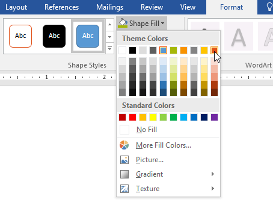
3. Hình dạng sẽ xuất hiện với màu tô đã chọn.

   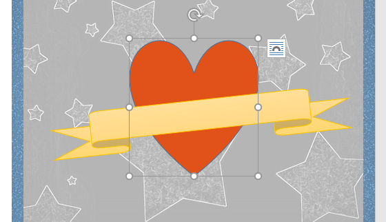

Nếu bạn muốn sử dụng kiểu tô màu khác, hãy chọn ** Gradient ** hoặc ** Hoạ tiết ** từ trình đơn thả xuống. Bạn cũng có thể chọn ** Không điền ** để làm cho nó trong suốt.

#### Để thay đổi đường viền hình dạng:

1. Chọn hình dạng bạn muốn thay đổi.

   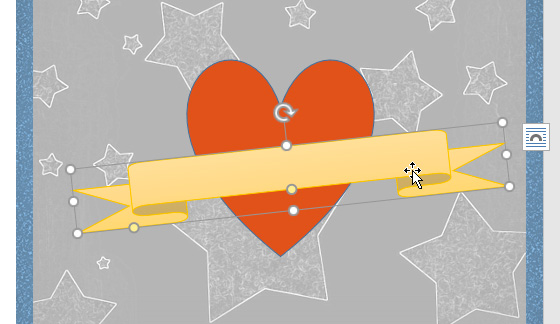
2. Trên tab ** Định dạng **, nhấp vào mũi tên thả xuống ** Hình dạng phác thảo **. Trình đơn ** Phác thảo hình dạng ** sẽ xuất hiện.
3. Chọn ** màu ** bạn muốn sử dụng. Nếu bạn muốn làm cho đường viền trong suốt, hãy chọn ** Không có đường viền **.

   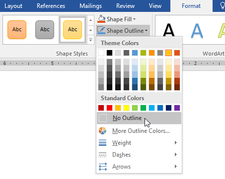
4. Hình dạng sẽ xuất hiện với màu đường viền đã chọn.

   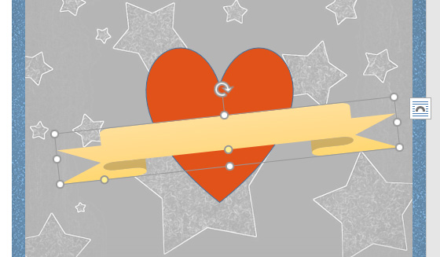

Từ trình đơn thả xuống, bạn có thể thay đổi đường viền ** màu **, ** độ dày ** (độ dày) và liệu đó có phải là đường ** nét đứt ** hay không.

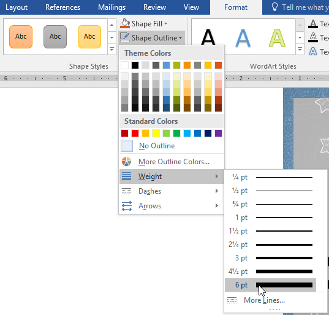

#### Để thêm hiệu ứng hình dạng:

1. Chọn hình dạng bạn muốn thay đổi.

   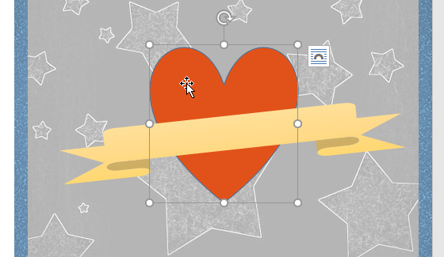
2. Trên tab ** Định dạng **, hãy nhấp vào mũi tên thả xuống ** Hiệu ứng hình dạng **. Trong menu xuất hiện, hãy di chuột qua kiểu hiệu ứng bạn muốn thêm, sau đó chọn hiệu ứng cài sẵn mong muốn.

   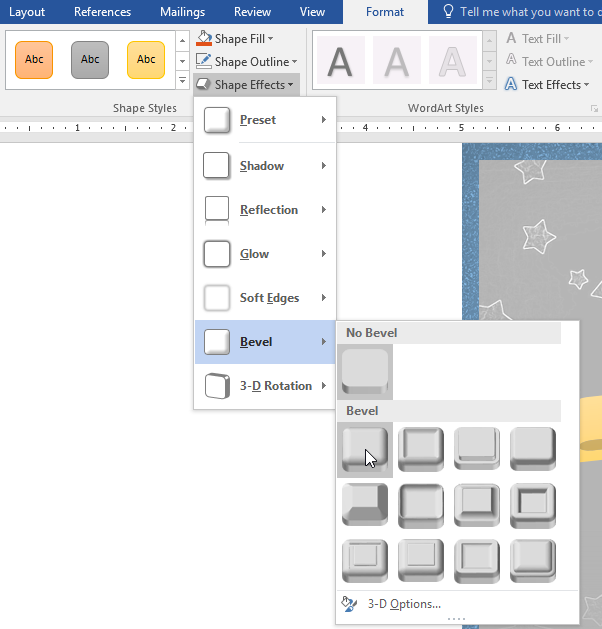
3. Hình dạng sẽ xuất hiện với hiệu ứng đã chọn.

   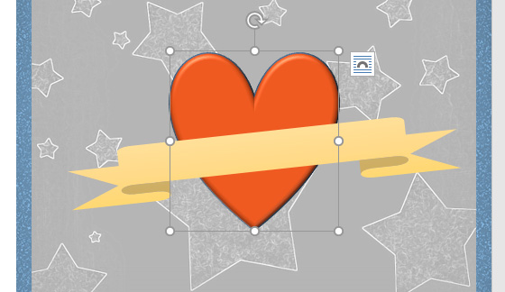

Để điều chỉnh thêm hiệu ứng hình dạng của bạn, hãy chọn ** Options ** ở cuối mỗi menu. Bảng Format Shape sẽ xuất hiện cho phép bạn tùy chỉnh các hiệu ứng.

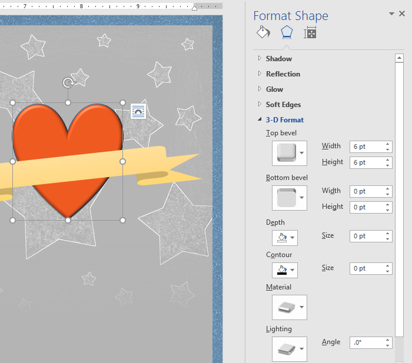

#### Để thay đổi sang hình dạng khác:

1. Chọn hình dạng bạn muốn thay đổi. Tab ** Định dạng ** sẽ xuất hiện.

   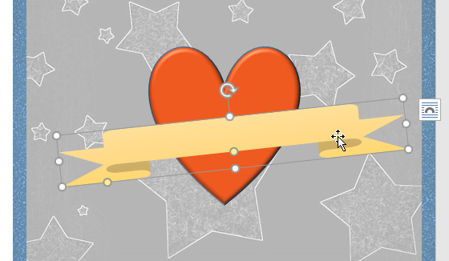
2. Trên tab ** Định dạng **, nhấp vào lệnh ** Chỉnh sửa hình dạng **. Trong menu xuất hiện, hãy di chuột qua ** Thay đổi hình dạng **, sau đó chọn ** hình dạng ** mong muốn.

   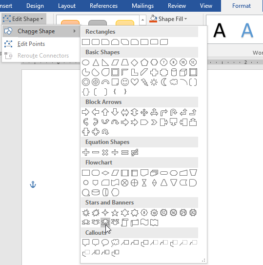
3. Hình dạng New sẽ xuất hiện.

   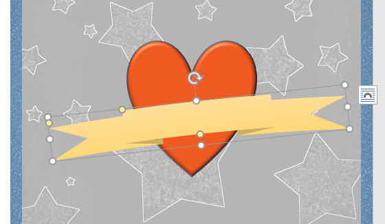

### Thử thách!

1. Open [tài liệu thực hành](practice_files/word_shapes_practice.docx) của chúng tôi.
2. Ở bên phải trang, Insert một ** hình đám mây ** từ ** Cơ bản Shapes ** Group. ** Gợi ý:** Tên hình dạng xuất hiện khi bạn di chuột qua chúng.
3. Thay đổi ** đường viền hình dạng ** thành màu xám.
4. Thay đổi ** màu tô hình ** thành màu trắng.
5. Trong trình đơn thả xuống ** Shape Effects **, thêm ** Circle Bevel **.
6. Trên đám mây, Insert một ** Hình mặt trời ** từ ** Cơ bản Shapes ** Group.
7. Thay đổi ** kiểu hình dạng ** thành kiểu ** Vàng ** mà bạn chọn. ** Gợi ý **: Tên kiểu xuất hiện khi bạn di chuột qua chúng. Đảm bảo tên kiểu có từ ** Vàng ** trong đó.
8. Gửi hình mặt trời ** ngược lại ** để nó ở phía sau hình đám mây.
9. Nếu cần, hãy di chuyển hình dạng đám mây để mặt trời ló ra từ phía sau nó.
10. Khi bạn hoàn tất, hình ảnh của bạn sẽ trông giống như thế này:

    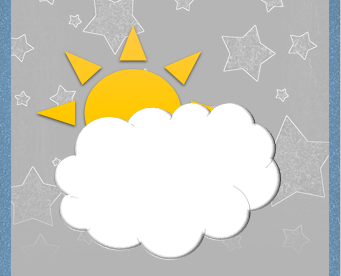

/en/word/text-boxes/content/