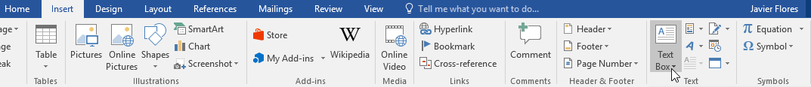
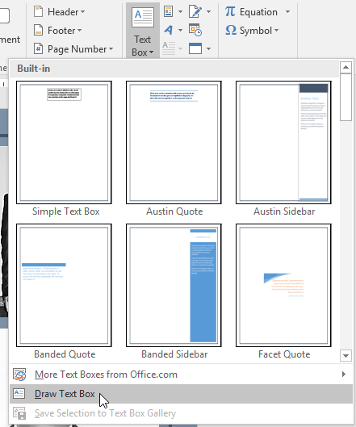
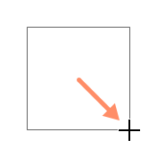
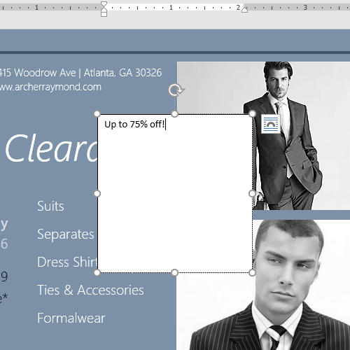
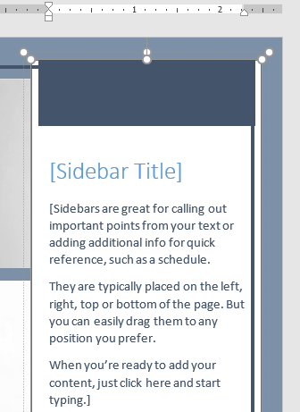
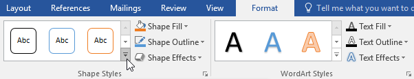
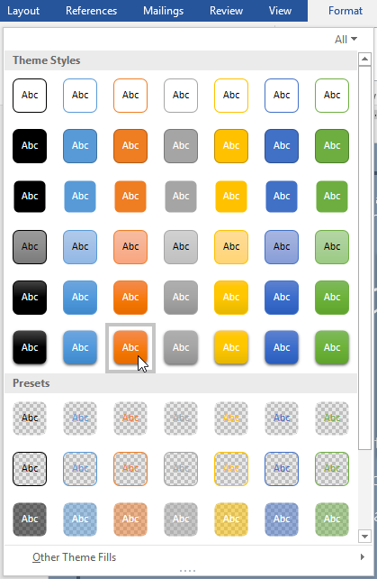
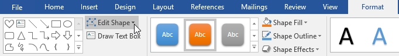
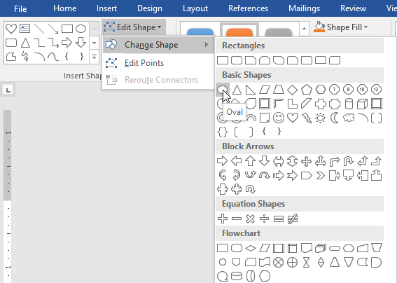

# Bài 21: hộp văn bản

#### Bài học 21: Hộp văn bản

/en/word/Shapes/content/

### Giới thiệu

Hộp văn bản có thể hữu ích trong việc thu hút sự chú ý đến văn bản cụ thể. Chúng cũng có thể hữu ích khi bạn cần di chuyển văn bản trong tài liệu của mình. Word cho phép bạn ** định dạng ** hộp văn bản và văn bản bên trong chúng bằng nhiều Styles và hiệu ứng.

Xem video bên dưới để tìm hiểu thêm về hộp văn bản trong Word.

#### Tới Insert và Text Box:

1. Chọn tab ** Insert **, sau đó nhấp vào lệnh ** Text Box ** trong ** Văn bản ** Group.

   
2. Một menu thả xuống sẽ xuất hiện. Chọn ** Draw Text Box **.

   
3. Nhấp và kéo bất cứ nơi nào trên tài liệu để tạo Text Box.

   
4. Điểm chèn sẽ xuất hiện bên trong Text Box. Bây giờ bạn có thể nhập để tạo văn bản bên trong Text Box.

   
5. Nếu muốn, bạn có thể chọn văn bản rồi thay đổi ** phông chữ **, ** màu ** và ** kích thước ** bằng cách sử dụng các lệnh trên tab ** Định dạng ** và ** Home **. Để tìm hiểu thêm về cách sử dụng các lệnh định dạng này, hãy xem bài học Review [Định dạng văn bản](../../formatting-text/1/index.html) của chúng tôi.

   
6. Nhấp vào bất kỳ đâu bên ngoài Text Box để quay lại tài liệu của bạn.

Bạn cũng có thể chọn một trong các hộp văn bản ** tích hợp ** có màu sắc, phông chữ, vị trí và kích thước được xác định trước. Nếu bạn chọn tùy chọn này, Text Box sẽ tự động xuất hiện nên bạn sẽ không cần phải Draw nó.

#### Để di chuyển Text Box:

1. Nhấp vào ** Text Box ** bạn muốn di chuyển.
2. Di chuột qua một trong các cạnh của Text Box. Chuột sẽ thay đổi thành ** chữ thập có mũi tên **.
3. Nhấp và kéo Text Box đến ** vị trí ** mong muốn.

   

#### Để thay đổi kích thước Text Box:

1. Nhấp vào ** Text Box ** bạn muốn thay đổi kích thước.
2. Nhấp và kéo bất kỳ ** bộ điều khiển định cỡ ** nào ở các góc hoặc cạnh của Text Box cho đến khi đạt được kích thước mong muốn.

   

### Sửa đổi hộp văn bản

Word cung cấp một số Options để thay đổi cách các hộp văn bản xuất hiện trong tài liệu của bạn. Bạn có thể thay đổi ** hình dạng **, ** kiểu ** và ** màu ** của hộp văn bản hoặc thêm các hiệu ứng khác nhau.

#### Để thay đổi kiểu dáng hình dạng:

Việc chọn ** kiểu hình dạng ** cho phép bạn áp dụng các màu và hiệu ứng đặt trước để nhanh chóng thay đổi giao diện của Text Box.

1. Chọn Text Box bạn muốn thay đổi.
2. Trên tab ** Định dạng **, hãy nhấp vào mũi tên thả xuống ** Thêm ** trong ** Hình dạng Styles ** Group.

   
3. Menu thả xuống Styles sẽ xuất hiện. Chọn ** kiểu ** bạn muốn sử dụng.

   
4. Text Box sẽ xuất hiện theo kiểu đã chọn.

   

Nếu muốn có nhiều quyền kiểm soát hơn đối với định dạng Text Box, bạn có thể sử dụng bất kỳ định dạng hình dạng nào Options như ** Shape Fill ** và ** Shape Outline **. Để tìm hiểu thêm, Review bài học [Shapes](../../Shapes/1/index.html) của chúng tôi.

#### Để thay đổi hình dạng Text Box:

Thay đổi hình dạng của Text Box có thể là một tùy chọn hữu ích để tạo giao diện thú vị cho tài liệu của bạn.

1. Chọn Text Box bạn muốn thay đổi. Tab ** Định dạng ** sẽ xuất hiện.
2. Từ tab ** Định dạng **, hãy nhấp vào lệnh ** Chỉnh sửa hình dạng **.

   
3. Di chuột qua ** Thay đổi hình dạng **, sau đó chọn ** hình dạng ** mong muốn từ trình đơn xuất hiện.

   
4. Text Box sẽ xuất hiện dưới dạng hình dạng.

   

### Thử thách!

1. Open [tài liệu thực hành](practice_files/word_textboxes_practice.docx) của chúng tôi.
2. Insert a ** Đơn giản Text Box **.
3. Trong Text Box, hãy nhập ** Nhận thêm 25% giảm giá khi bạn đề cập đến quảng cáo này!**
4. Thay đổi phông chữ thành ** Gadugi, 20 pt, Center Align **.
5. Thay đổi ** hình dạng ** của Text Box thành ** Sóng kép ** từ ** Sao và Biểu ngữ ** Group.
6. Thay đổi kiểu ** Text Box ** bằng cách chọn bất kỳ kiểu nào trong hàng ** Hiệu ứng mãnh liệt **.
7. Kéo Text Box vào khoảng trống bên dưới ** Mua 1, Tặng 1\*** và ** Trang phục công sở **.
8. Khi bạn hoàn tất, tài liệu của bạn sẽ trông giống như thế này:

   

/en/word/aligning-ordering-and-grouping-objects/content/