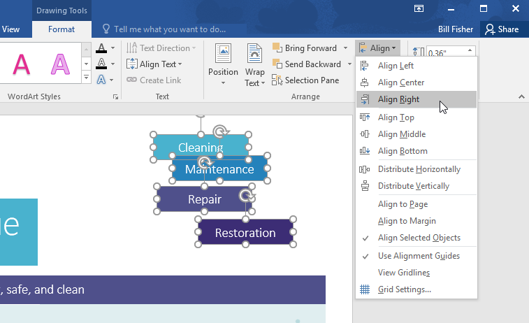
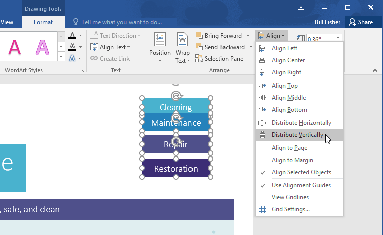
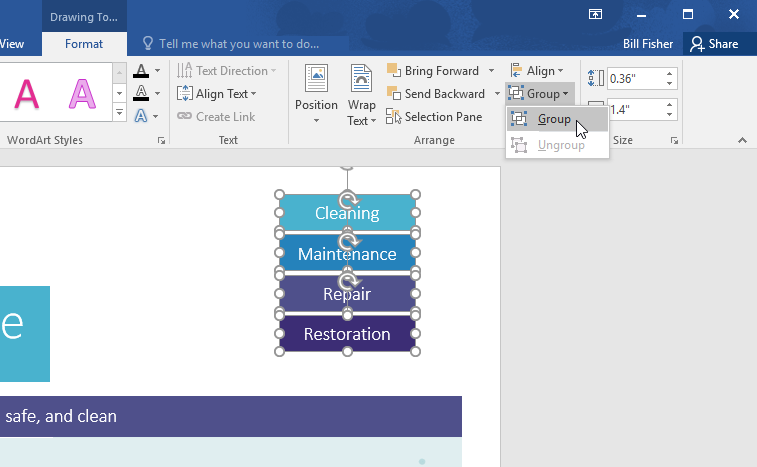
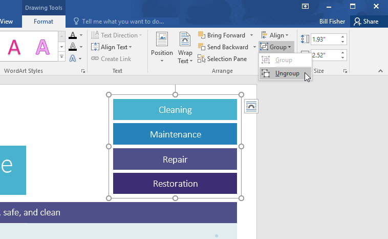
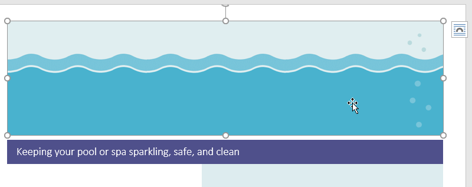
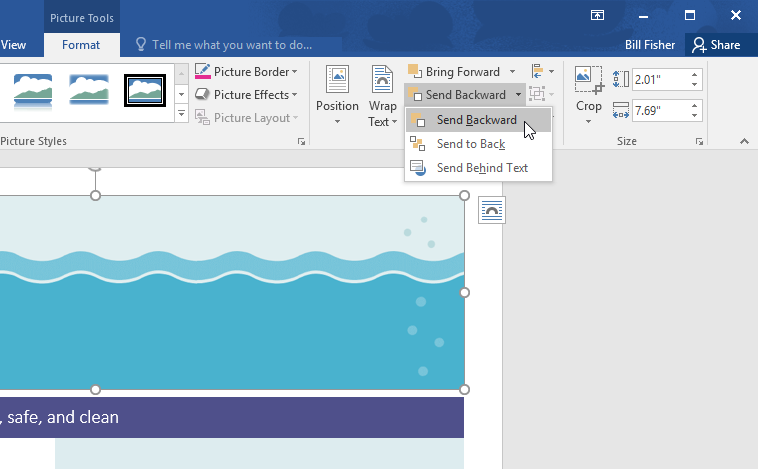
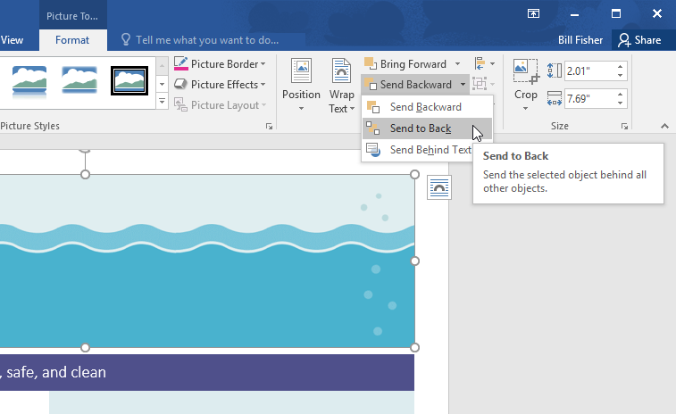
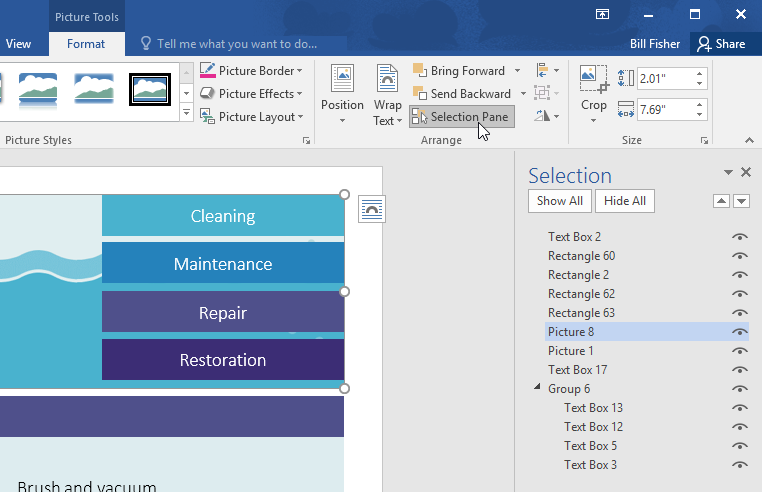
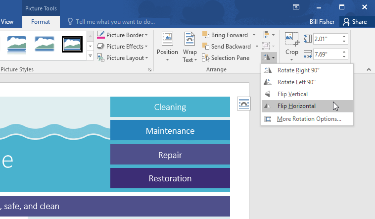

# Bài 22: Sắp xếp-sắp xếp-nhóm-đối tượng

#### Bài 22: Căn chỉnh, sắp xếp, nhóm đối tượng

/en/word/text-boxes/content/

### Giới thiệu

Đôi khi tài liệu của bạn có nhiều ** đối tượng **, chẳng hạn như Pictures, Shapes và hộp văn bản. Bạn có thể sắp xếp các đối tượng theo bất kỳ cách nào bạn muốn bằng cách ** căn chỉnh **, ** nhóm **, ** sắp xếp ** và ** xoay ** chúng theo nhiều cách khác nhau.

Hãy xem video dưới đây để tìm hiểu thêm về cách sắp xếp các đối tượng trong Word.

#### Đến Align hai hoặc nhiều đối tượng:

1. Giữ phím ** Shift ** (hoặc ** Ctrl **) và nhấp vào đối tượng bạn muốn Align. Trong ví dụ của chúng tôi, chúng tôi sẽ chọn bốn Shapes ở bên phải.

   
2. Từ tab ** Định dạng **, hãy nhấp vào lệnh ** Align **, sau đó chọn một trong các ** tùy chọn căn chỉnh **** s **. Trong ví dụ của chúng tôi, chúng tôi sẽ chọn ** Align Right **.

   
3. Các đối tượng sẽ được căn chỉnh dựa trên tùy chọn đã chọn. Trong ví dụ của chúng tôi, Shapes hiện đã được căn chỉnh với nhau.

   

Lưu ý rằng tùy chọn ** Align Đối tượng được chọn ** được chọn theo mặc định, cho phép bạn Align đối tượng mà không cần di chuyển chúng sang phần khác của trang. Tuy nhiên, nếu bạn muốn di chuyển các đối tượng lên đầu hoặc cuối trang, hãy chọn ** Align sang Trang ** hoặc ** Align sang lề ** trước khi chọn tùy chọn căn chỉnh.

#### Để phân bố đều các đối tượng:

Nếu bạn đã sắp xếp các đối tượng của mình thành một hàng hoặc cột, bạn có thể muốn chúng ở ** khoảng cách bằng nhau ** với nhau để trông gọn gàng hơn. Bạn có thể thực hiện việc này bằng cách ** phân bổ các đối tượng ** theo chiều ngang hoặc chiều dọc.

1. Giữ phím ** Shift ** (hoặc ** Ctrl **) và nhấp vào đối tượng bạn muốn phân phối.
2. Trên tab ** Định dạng **, hãy nhấp vào lệnh ** Align **, sau đó chọn ** Phân phối theo chiều ngang ** hoặc ** Phân phối theo chiều dọc **.

   
3. Các vật thể sẽ cách đều nhau.

   

### Nhóm các đối tượng

Đôi khi, bạn có thể muốn ** Group ** nhiều đối tượng thành ** một đối tượng ** để chúng ở cùng nhau. Điều này thường dễ dàng hơn việc chọn chúng riêng lẻ và nó cũng cho phép bạn thay đổi kích thước và di chuyển tất cả các đối tượng cùng một lúc.

#### Đối với đối tượng Group:

1. Giữ phím ** Shift ** (hoặc ** Ctrl **) và nhấp vào đối tượng bạn muốn Group.
2. Nhấp vào lệnh ** Group ** trên tab ** Định dạng **, sau đó chọn ** Group **.

   
3. Các đối tượng được chọn bây giờ sẽ được nhóm lại. Sẽ có một ** hộp duy nhất có tay cầm định cỡ ** xung quanh toàn bộ Group để bạn có thể di chuyển hoặc thay đổi kích thước tất cả các đối tượng cùng một lúc.

   

#### Để rã nhóm các đối tượng:

1. Chọn đối tượng được nhóm. Từ tab ** Định dạng **, hãy nhấp vào lệnh ** Group ** và chọn ** Ungroup **.

   
2. Các đối tượng sẽ được tách nhóm.

   

### Đặt hàng đối tượng

Ngoài việc căn chỉnh các đối tượng, Word còn cung cấp cho bạn khả năng ** sắp xếp các đối tượng ** theo ** thứ tự cụ thể **. Thứ tự rất quan trọng khi hai hoặc nhiều đối tượng ** chồng chéo ** vì nó xác định đối tượng nào ở ** phía trước ** hoặc ** phía sau **.

#### Hiểu mức độ

Các đối tượng được đặt ở các ** cấp độ ** khác nhau theo ** thứ tự ** mà chúng được chèn vào tài liệu. Trong ví dụ bên dưới, nếu chúng ta di chuyển hình ảnh sóng đến đầu tài liệu, nó sẽ che mất một số hộp văn bản. Điều này là do hình ảnh hiện ở mức cao nhất—hoặc cao nhất. Tuy nhiên, chúng ta có thể ** thay đổi cấp độ của nó ** để đặt nó phía sau các đối tượng khác.

#### Để thay đổi cấp độ của một đối tượng:

1. Chọn đối tượng bạn muốn di chuyển. Trong ví dụ của chúng tôi, chúng tôi sẽ chọn hình ảnh của sóng.
2. Từ tab ** Định dạng **, hãy nhấp vào lệnh ** Đưa về phía trước ** hoặc ** Gửi lùi ** để thay đổi thứ tự của đối tượng theo ** một cấp **. Trong ví dụ của chúng tôi, chúng tôi sẽ chọn ** Gửi ngược **.

   
3. Các đối tượng sẽ được sắp xếp lại. Trong ví dụ của chúng tôi, hình ảnh hiện nằm phía sau văn bản ở bên trái nhưng vẫn che Shapes ở bên phải.

   
4. Nếu bạn muốn di chuyển một đối tượng ra phía sau hoặc phía trước một số đối tượng, bạn nên sử dụng ** Đưa về phía trước ** hoặc ** Gửi lùi ** thay vì nhấp vào lệnh sắp xếp khác nhiều lần sẽ nhanh hơn.

   
5. Trong ví dụ của chúng tôi, hình ảnh đã được di chuyển ra phía sau mọi thứ khác trên trang, do đó tất cả văn bản khác và Shapes đều hiển thị.

   

Nếu bạn có nhiều đối tượng được đặt chồng lên nhau, có thể khó chọn được một đối tượng riêng lẻ. ** Selection Pane ** cho phép bạn dễ dàng kéo một đối tượng đến một cấp độ khác. Để View Selection Pane, hãy nhấp vào ** Selection Pane ** trên tab ** Định dạng **.

#### Để Rotate hoặc lật một đối tượng:

Nếu bạn cần xoay một đối tượng để nó hướng về một hướng khác, bạn có thể ** Rotate đối tượng đó ** sang trái hoặc phải hoặc bạn có thể ** lật đối tượng ** theo chiều ngang hoặc chiều dọc.

1. Với đối tượng mong muốn đã được chọn, hãy nhấp vào lệnh ** Rotate ** trên tab ** Định dạng **, sau đó chọn ** tùy chọn xoay ** mong muốn. Trong ví dụ của chúng tôi, chúng tôi sẽ chọn ** Lật ngang **.

   
2. Đối tượng sẽ được xoay. Trong ví dụ của chúng tôi, bây giờ chúng tôi có thể thấy các bong bóng ở bên trái trước đây bị ẩn sau các hộp văn bản.

   

### Thử thách!

1. Open [tài liệu thực hành](practice_files/word_alignordergroup_practice.docx) của chúng tôi.
2. Cuộn đến ** trang 2 ** và chọn hình ảnh sóng ở đầu trang.
3. Sử dụng lệnh ** Rotate ** để lật sóng theo chiều dọc.
4. Sử dụng lệnh ** Gửi về phía sau ** để di chuyển các sóng phía sau Martinique Text Box.
5. Di chuyển ** Martinique ** Text Box sao cho nó ở gần ** đáy ** của hình ảnh sóng.
6. Đảm bảo hình ảnh sóng và Martinique Text Box không còn được chọn. Giữ phím ** Shift **, sau đó chọn các hộp văn bản có chứa ** Dọn dẹp **, ** Bảo trì **, ** Sửa chữa ** và ** Khôi phục **.
7. Nhấp vào lệnh ** Align ** và đảm bảo tùy chọn ** Align Selected Objects ** được chọn. Chọn ** Align Phải ** và ** Phân phối theo chiều dọc **.
8. Với các hộp văn bản vẫn được chọn, ** Group ** chúng.
9. Khi bạn hoàn tất, trang của bạn sẽ trông giống như thế này:

/en/word/tables/content/