# Bài 24: Charts

#### Bài 24: Charts

/en/word/tables/content/

### Giới thiệu

** biểu đồ ** là công cụ bạn có thể sử dụng để ** truyền đạt thông tin bằng đồ họa **. Việc đưa biểu đồ vào tài liệu của bạn có thể Help bạn minh họa dữ liệu số như so sánh và xu hướng để người đọc dễ hiểu hơn.

Xem video bên dưới để tìm hiểu thêm về cách tạo Charts.

#### Các loại Charts

Có một số ** loại ** Charts để bạn lựa chọn. Để sử dụng Charts một cách hiệu quả, bạn cần hiểu điều gì khiến mỗi cái trở nên độc đáo.

Nhấp vào mũi tên trong bản trình chiếu bên dưới để tìm hiểu thêm về các loại Charts trong Word.

* 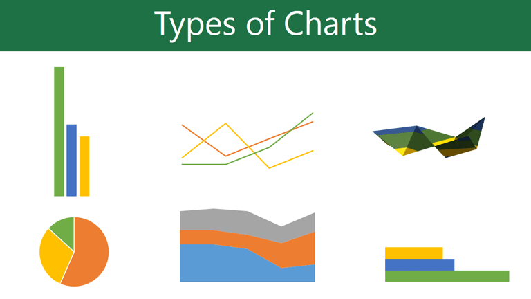

  Word có rất nhiều loại biểu đồ, mỗi loại đều có ưu điểm riêng. Bấm vào mũi tên để xem một số loại Charts khác nhau có sẵn trong Word.
* 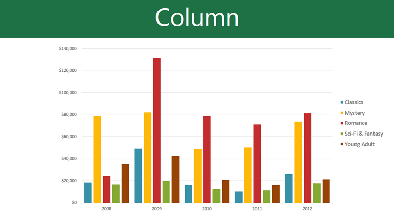

  Cột Charts sử dụng thanh dọc để thể hiện dữ liệu. Chúng có thể làm việc với nhiều loại dữ liệu khác nhau nhưng chúng được sử dụng thường xuyên nhất để so sánh thông tin.
* 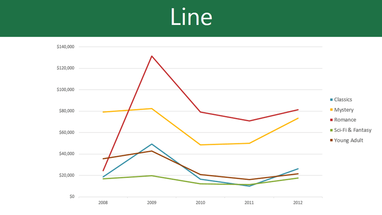

  Dòng Charts là dòng lý tưởng để hiển thị xu hướng. Các điểm dữ liệu được kết nối bằng các đường, giúp dễ dàng xem liệu các giá trị đang tăng hay giảm theo thời gian.
* 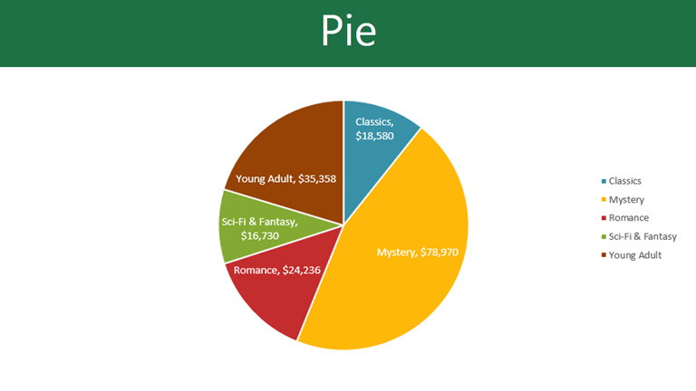

  Pie Charts giúp bạn dễ dàng so sánh tỷ lệ. Mỗi giá trị được hiển thị dưới dạng một phần của chiếc bánh, vì vậy thật dễ dàng để biết giá trị nào chiếm phần trăm của tổng thể.
* 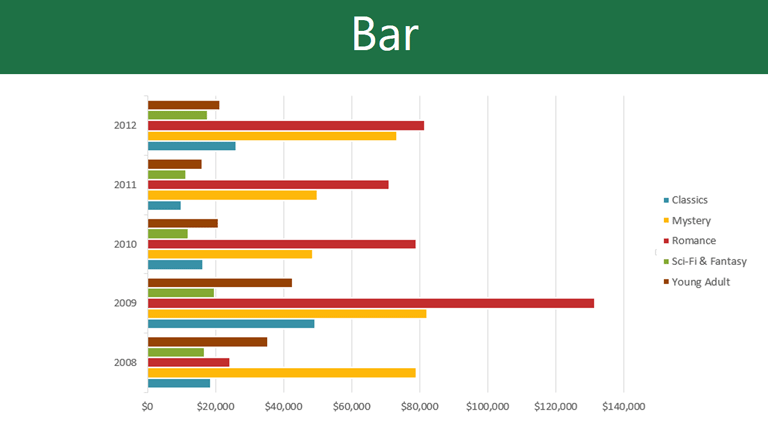

  Thanh Charts hoạt động giống như cột Charts nhưng sử dụng thanh ngang thay vì thanh dọc.
* 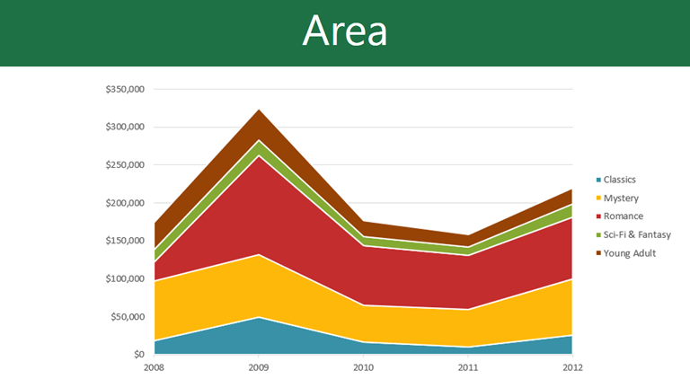

  Vùng Charts tương tự như dòng Charts, ngoại trừ các vùng dưới dòng được điền vào.
* 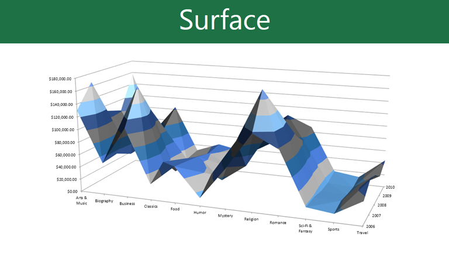

  Bề mặt Charts cho phép bạn hiển thị dữ liệu trên toàn cảnh 3D. Chúng hoạt động tốt nhất với các tập dữ liệu lớn, cho phép bạn xem nhiều thông tin cùng một lúc.
* 

#### Xác định các phần của biểu đồ

Ngoài các loại biểu đồ, bạn sẽ cần hiểu cách ** đọc biểu đồ **. Charts chứa một số phần tử—hoặc các bộ phận—có thể Help bạn diễn giải dữ liệu.

Nhấp vào các nút trong phần tương tác bên dưới để tìm hiểu về các phần khác nhau của biểu đồ.

donedonedonedonedonedoneedit điểm nóngchỉnh sửa điểm nóng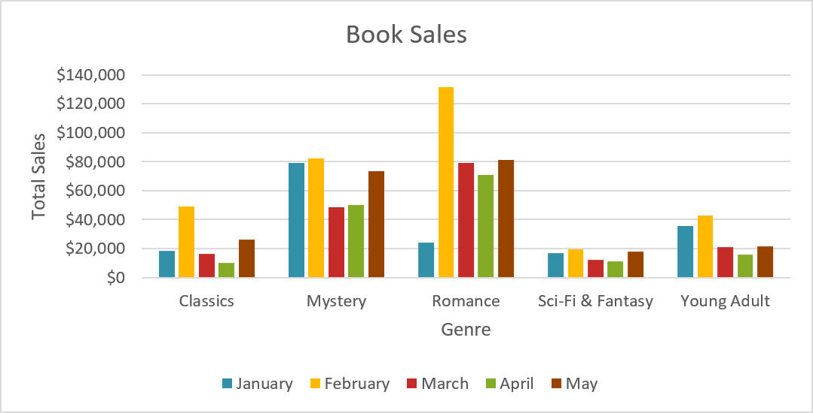

## Chuỗi dữ liệu

** Chuỗi dữ liệu ** bao gồm các điểm dữ liệu có liên quan trong biểu đồ. Trong ví dụ này, như chúng ta có thể thấy trong chú giải, các cột màu vàng biểu thị doanh thu thuần trong tháng Hai.

## Trục ngang

** Trục ngang ** (còn được gọi là ** trục x **) là phần nằm ngang của biểu đồ. Ở đây, trục ngang xác định ** danh mục ** trong biểu đồ. Trong ví dụ này, mỗi thể loại được đặt trong ** Group ** riêng.

## Huyền thoại

** Chú giải ** xác định chuỗi dữ liệu mà mỗi ** màu ** trên biểu đồ đại diện. Trong ví dụ này, chú giải xác định các tháng khác nhau trong biểu đồ.

## Tiêu đề biểu đồ

** tiêu đề ** phải mô tả rõ ràng nội dung biểu đồ đang minh họa.

## Trục dọc

** trục tung ** (còn được gọi là ** trục y **) là phần thẳng đứng của biểu đồ. Ở đây, trục tung đo ** giá trị ** của các cột. Trong ví dụ này, giá trị đo được là tổng doanh thu của từng thể loại.

### Đang chèn Charts

Word sử dụng ** cửa sổ bảng tính ** riêng để nhập và chỉnh sửa dữ liệu biểu đồ, giống như bảng tính trong Excel. Quá trình nhập dữ liệu khá đơn giản nhưng nếu bạn không quen với Excel, bạn có thể muốn tham gia bài học Review [Cell Basics](../../../excel/cell-basics/1/index.html) của chúng tôi.

#### Đến Insert biểu đồ:

1. Đặt ** điểm chèn ** vào nơi bạn muốn biểu đồ xuất hiện.
2. Điều hướng đến tab ** Insert **, sau đó nhấp vào lệnh ** Biểu đồ ** trong ** Minh họa ** Group.

   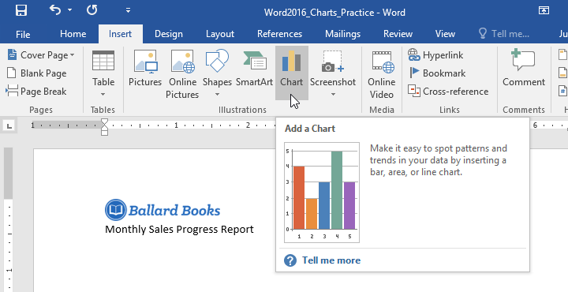
3. Một hộp thoại sẽ xuất hiện. Để View Options của bạn, hãy chọn ** loại biểu đồ ** từ khung bên trái, sau đó duyệt qua ** Charts ** ở bên phải.
4. Chọn ** biểu đồ ** mong muốn, sau đó nhấp vào ** OK **.

   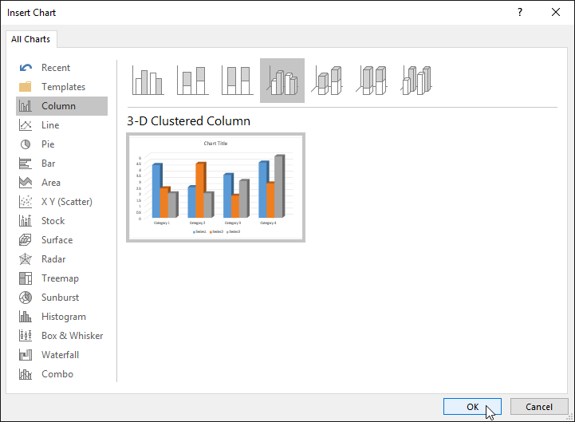
5. Một cửa sổ biểu đồ và bảng tính sẽ xuất hiện. Văn bản trong bảng tính chỉ là ** giữ chỗ ** mà bạn cần thay thế bằng dữ liệu nguồn của riêng mình. Dữ liệu nguồn là những gì Word sẽ sử dụng để tạo biểu đồ.

   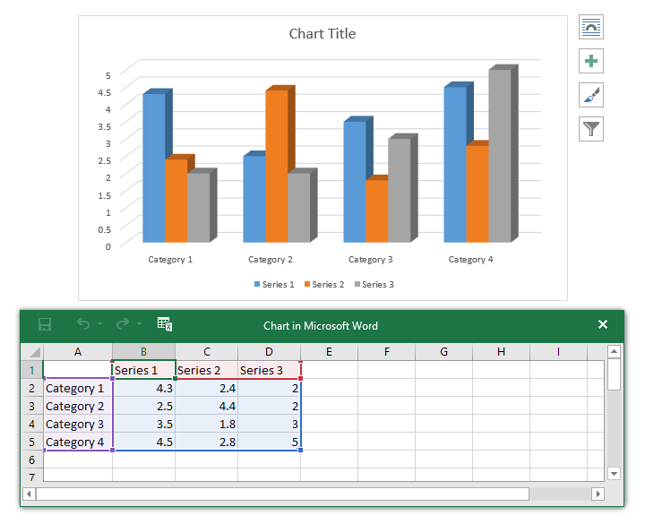
6. Nhập ** dữ liệu nguồn ** của bạn vào bảng tính.

   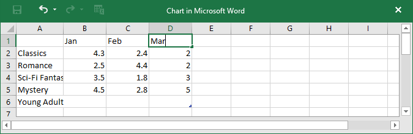
7. Chỉ dữ liệu trong ** hộp màu xanh ** mới xuất hiện trong biểu đồ. Nếu cần, hãy nhấp và kéo ** góc dưới bên phải ** của hộp màu xanh lam để tăng hoặc giảm phạm vi dữ liệu theo cách thủ công.

   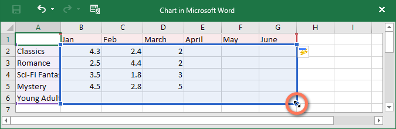
8. Khi bạn hoàn tất, hãy nhấp vào ** X ** để Close cửa sổ bảng tính.

   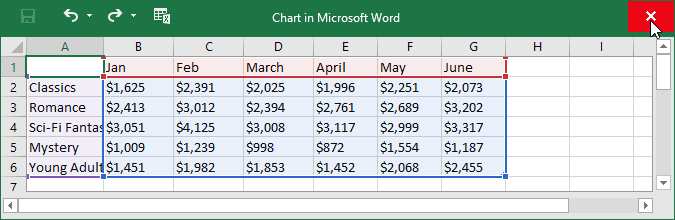
9. Biểu đồ sẽ được hoàn thành.

   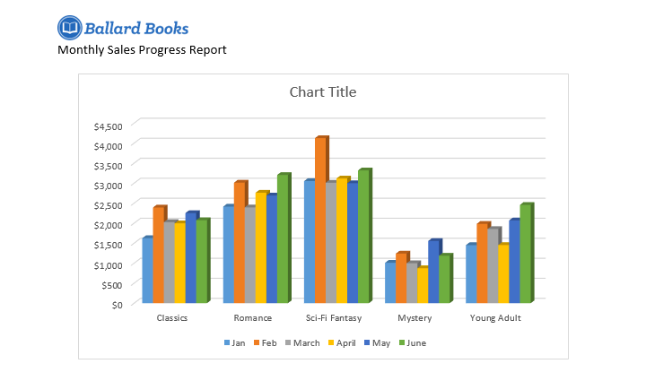

Để chỉnh sửa lại biểu đồ của bạn, chỉ cần chọn biểu đồ đó, sau đó nhấp vào lệnh ** Chỉnh sửa dữ liệu ** trên tab ** Design **. Cửa sổ bảng tính sẽ xuất hiện lại.

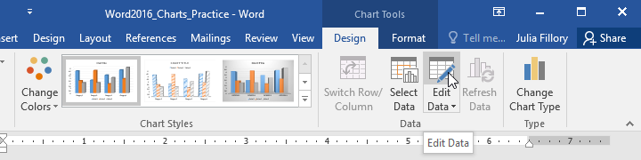

#### Tạo Charts với dữ liệu Excel hiện có

Nếu bạn đã có dữ liệu trong ** hiện có ** ** Excel File ** mà bạn muốn sử dụng trong Word, bạn có thể ** sao chép và dán ** dữ liệu đó thay vì nhập bằng tay. Chỉ cần Open bảng tính trong Excel, sao chép dữ liệu rồi dán làm dữ liệu nguồn trong Word.

Bạn cũng có thể ** nhúng ** biểu đồ Excel hiện có vào tài liệu Word của mình. Điều này hữu ích nếu bạn biết mình sẽ cập nhật Excel File sau; biểu đồ trong Word sẽ tự động cập nhật bất cứ khi nào có thay đổi.

Đọc hướng dẫn của chúng tôi về [Nhúng biểu đồ Excel](../../../word2013/embedding-an-excel-chart/1/index.html) để biết thêm thông tin.

### Sửa đổi Charts bằng công cụ biểu đồ

Có nhiều cách để tùy chỉnh và sắp xếp biểu đồ của bạn trong Word. Ví dụ: bạn có thể nhanh chóng thay đổi ** loại biểu đồ **, ** sắp xếp lại ** dữ liệu và thậm chí thay đổi ** giao diện ** của biểu đồ.

#### Để chuyển đổi dữ liệu hàng và cột:

Đôi khi bạn có thể muốn thay đổi cách ** nhóm dữ liệu biểu đồ ** của mình. Ví dụ: trong biểu đồ bên dưới, dữ liệu được nhóm ** theo thể loại **, với các cột cho ** mỗi tháng **. Thay vào đó, nếu chúng tôi chuyển đổi hàng và cột thì dữ liệu sẽ được nhóm ** theo tháng **. Trong cả hai trường hợp, biểu đồ đều chứa cùng một dữ liệu—nó chỉ được trình bày theo một cách khác.

1. Chọn ** biểu đồ ** bạn muốn sửa đổi. Tab ** Design ** sẽ xuất hiện ở bên phải của Ribbon.

   
2. Từ tab ** Design **, hãy nhấp vào lệnh ** Chỉnh sửa dữ liệu ** trong ** Dữ liệu ** Group.

   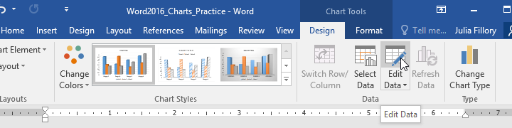
3. Nhấp lại vào ** biểu đồ ** để chọn lại, sau đó nhấp vào lệnh ** Chuyển hàng/cột **.

   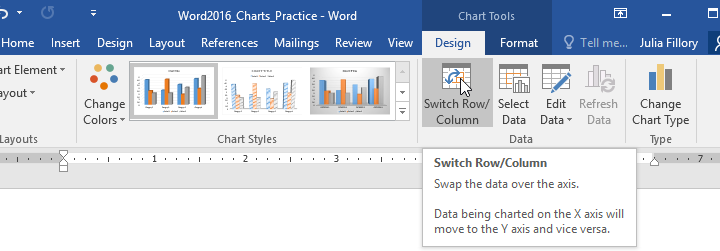
4. Các hàng và cột sẽ được ** chuyển đổi **. Trong ví dụ của chúng tôi, dữ liệu hiện được nhóm theo tháng, với các cột cho từng thể loại.

   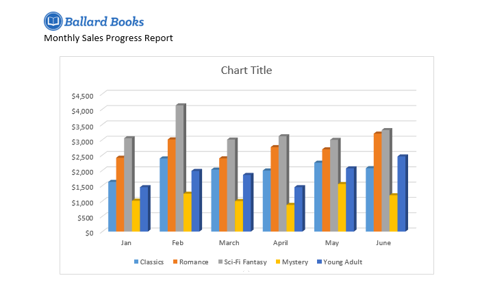

#### Để thay đổi loại biểu đồ:

Nếu bạn nhận thấy ** loại biểu đồ ** đã chọn không phù hợp với dữ liệu của mình, bạn có thể thay đổi loại biểu đồ đó thành một loại biểu đồ khác. Trong ví dụ của chúng tôi, chúng tôi sẽ thay đổi loại biểu đồ từ biểu đồ ** cột ** thành biểu đồ ** đường **.

1. Chọn ** biểu đồ ** bạn muốn thay đổi. Tab ** Design ** sẽ xuất hiện.
2. Từ tab ** Design **, hãy nhấp vào lệnh ** Thay đổi loại biểu đồ **.

   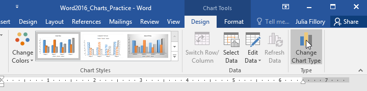
3. Một hộp thoại sẽ xuất hiện. Chọn ** biểu đồ ** mong muốn, sau đó nhấp vào ** OK **.

   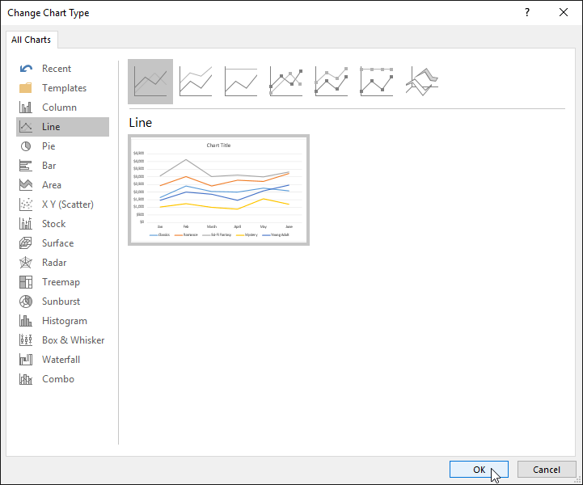
4. Loại biểu đồ New sẽ được áp dụng. Trong ví dụ của chúng tôi, biểu đồ đường giúp bạn dễ dàng xem xu hướng theo thời gian hơn.

   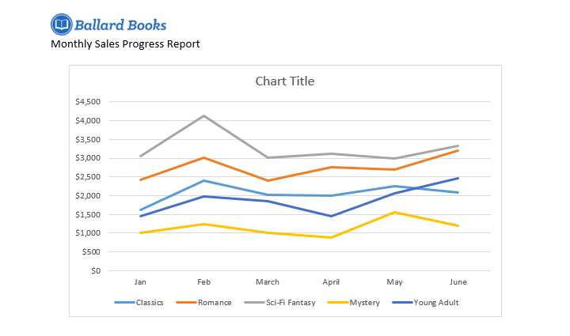

#### Để thay đổi biểu đồ Layout:

Để thay đổi cách sắp xếp biểu đồ của bạn, hãy thử chọn một ** Layout ** khác. Layout có thể ảnh hưởng đến một số thành phần, bao gồm tiêu đề biểu đồ và dữ liệu Labels.

1. Chọn ** biểu đồ ** bạn muốn sửa đổi. Tab ** Design ** sẽ xuất hiện.
2. Từ tab ** Design **, hãy nhấp vào lệnh ** Quick Layout **.

   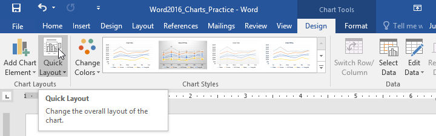
3. Chọn ** Layout ** mong muốn từ menu thả xuống.

   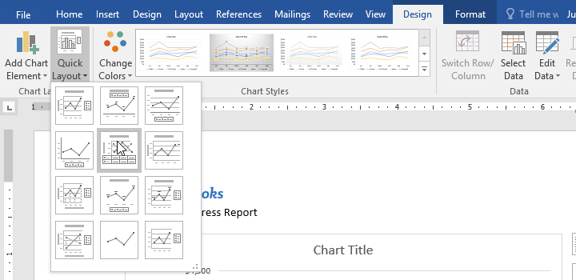
4. Biểu đồ sẽ cập nhật để phản ánh New Layout.

   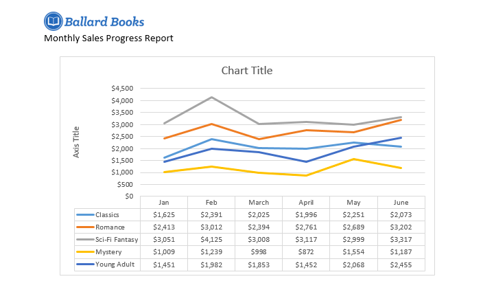

Nếu không thấy biểu đồ Layout có chính xác những gì bạn cần, bạn có thể nhấp vào lệnh ** Thêm thành phần biểu đồ ** trên tab ** Design ** để thêm ** tiêu đề trục **, ** đường lưới ** và các thành phần biểu đồ khác.

Để điền vào phần giữ chỗ (chẳng hạn như ** tiêu đề biểu đồ ** hoặc ** tiêu đề trục **), hãy nhấp vào phần tử đó và nhập văn bản của bạn.

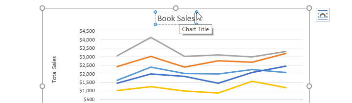

#### Để thay đổi kiểu biểu đồ:

** biểu đồ Styles ** của Word cung cấp cho bạn một cách dễ dàng để thay đổi Design của biểu đồ, bao gồm màu sắc, kiểu dáng và một số thành phần Layout nhất định.

1. Chọn ** biểu đồ ** bạn muốn sửa đổi. Tab ** Design ** sẽ xuất hiện.
2. Từ tab ** Design **, hãy nhấp vào mũi tên thả xuống ** Thêm ** trong ** Biểu đồ Styles ** Group.

   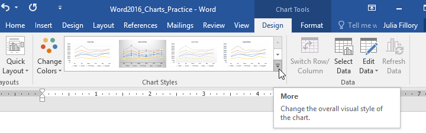
3. Menu thả xuống Styles sẽ xuất hiện. Chọn ** kiểu ** bạn muốn.

   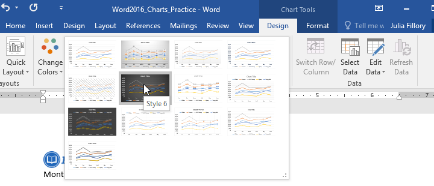
4. Kiểu biểu đồ sẽ được áp dụng.

   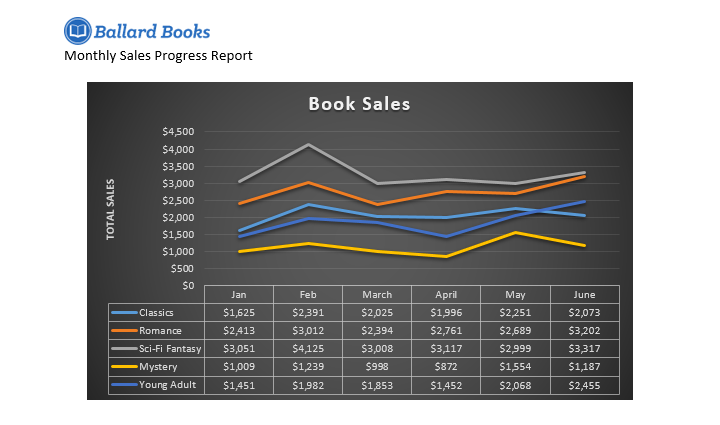

Để tùy chỉnh nhanh hơn nữa, hãy sử dụng các phím tắt định dạng ở bên phải biểu đồ của bạn. Những điều này cho phép bạn điều chỉnh các phần tử ** kiểu biểu đồ **, ** biểu đồ ** **** và thậm chí thêm ** bộ lọc ** vào dữ liệu của bạn.

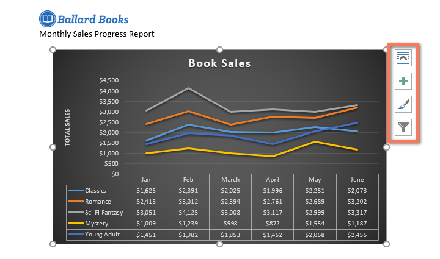

### Thử thách!

1. Open [tài liệu thực hành](practice_files/word_charts_practice.docx) của chúng tôi. Bạn cũng cần tải xuống [sổ bài tập thực hành](../../../../media.gcflearnfree.org/content/5c09515577c050035472857e_12_06_2018/word_charts_practice_data.xlsx của chúng tôi).
2. Insert biểu đồ ** Đường ** vào tài liệu Word thực hành của chúng tôi.
3. Open ** sổ làm việc thực hành ** của chúng tôi trong Excel. Sao chép dữ liệu và dán vào bảng tính của biểu đồ.
4. Thay đổi ** tiêu đề biểu đồ ** thành ** Doanh số hàng tháng **.
5. Thay đổi ** loại biểu đồ ** thành ** Cột xếp chồng **.
6. Sử dụng menu thả xuống ** Quick Layout ** để thay đổi thành ** Layout 3 **.
7. Sử dụng trình đơn thả xuống ** Thêm thành phần biểu đồ ** để thêm ** Tiêu đề trục dọc chính **.
8. Bấm đúp vào tiêu đề trục, sau đó đổi tên thành ** Lợi nhuận bán hàng **.
9. ** Chuyển đổi ** dữ liệu ** Hàng/Cột **.
10. Khi bạn hoàn tất, biểu đồ của bạn sẽ trông giống như thế này:

    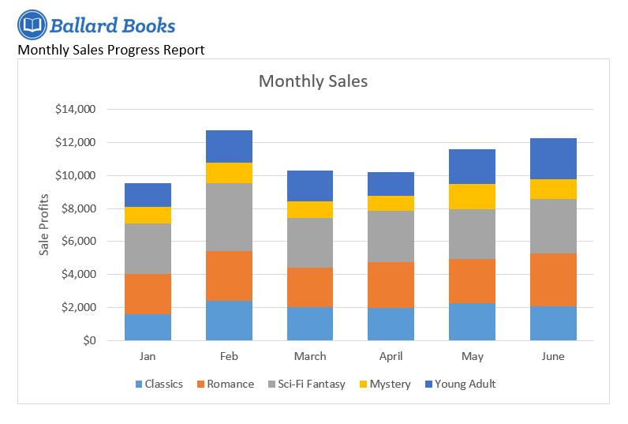

/en/word/kiểm tra-chính tả-và-ngữ pháp/nội dung/