# Bài 26: track-changes-and-Comments

#### Bài 26: Track Changes và Comments

/en/word/kiểm tra-chính tả-và-ngữ pháp/nội dung/

### Giới thiệu

Giả sử ai đó yêu cầu bạn hiệu đính hoặc cộng tác trên một tài liệu. Nếu có bản in, bạn có thể dùng bút đỏ để gạch bỏ các câu, đánh dấu lỗi chính tả và thêm Comments vào lề. Word cho phép bạn thực hiện tất cả những việc này một cách điện tử bằng cách sử dụng các tính năng ** Track Changes ** và ** Comments **.

Xem video bên dưới để tìm hiểu thêm về Track Changes và cách thêm Comments.

#### Hiểu Track Changes

Khi bạn bật ** Track Changes **, mọi thay đổi bạn thực hiện đối với tài liệu sẽ xuất hiện dưới dạng ** đánh dấu ** có màu. Nếu bạn xóa văn bản, nó sẽ không biến mất; thay vào đó, văn bản sẽ bị ** gạch chéo ** ** ra **. Nếu bạn thêm văn bản, nó sẽ được ** gạch chân **. Điều này cho phép bạn xem các chỉnh sửa trước khi thực hiện thay đổi vĩnh viễn.

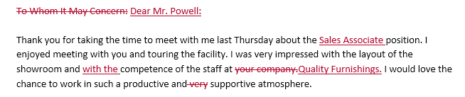

Nếu có nhiều người đánh giá thì mỗi người sẽ được chỉ định một màu đánh dấu khác nhau.

#### Để bật Track Changes:

1. Từ tab ** Review **, hãy nhấp vào lệnh ** Track Changes **.

   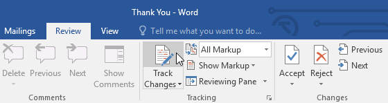
2. Track Changes sẽ được bật. Từ thời điểm này trở đi, mọi thay đổi bạn thực hiện đối với tài liệu sẽ xuất hiện dưới dạng đánh dấu màu.

   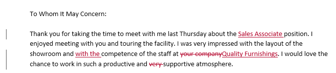

Những thay đổi được theo dõi của bạn có thể trông khác với những thay đổi được thấy ở trên, tùy thuộc vào cài đặt đánh dấu trên máy tính của bạn.

### Xem xét các thay đổi

Những thay đổi được theo dõi thực chất chỉ là những thay đổi được đề xuất. Để trở thành vĩnh viễn, chúng phải được ** chấp nhận **. Mặt khác, tác giả Original có thể không đồng ý với một số thay đổi được theo dõi và chọn ** từ chối ** chúng.

#### Để chấp nhận hoặc từ chối các thay đổi:

1. Chọn thay đổi bạn muốn chấp nhận hoặc từ chối.

   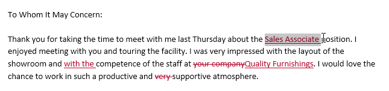
2. Từ tab ** Review **, hãy nhấp vào lệnh ** Chấp nhận ** hoặc ** Từ chối **.

   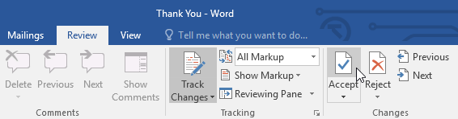
3. Đánh dấu sẽ biến mất và Word sẽ tự động chuyển sang thay đổi tiếp theo. Bạn có thể tiếp tục chấp nhận hoặc từ chối từng thay đổi cho đến khi bạn xem xét tất cả chúng.

   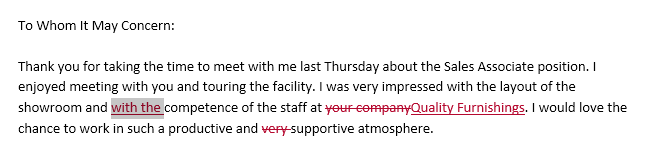
4. Khi bạn hoàn tất, hãy nhấp vào lệnh ** Track Changes ** để ** tắt ** ** tắt ** Track Changes.

   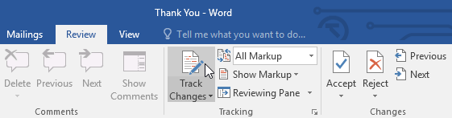

Để chấp nhận tất cả thay đổi cùng một lúc, hãy nhấp vào mũi tên thả xuống ** Chấp nhận **, sau đó chọn ** Chấp nhận ** ** Tất cả **. Nếu bạn không muốn theo dõi các thay đổi của mình nữa, bạn có thể chọn ** Chấp nhận tất cả và ngừng theo dõi **.

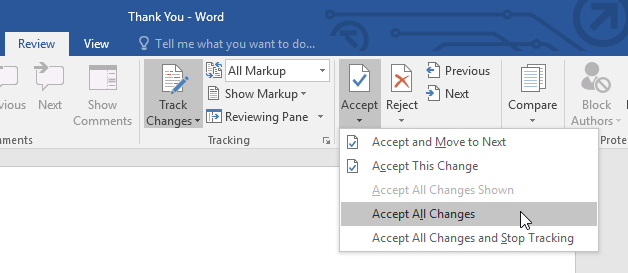

### Track Changes đang xem Options

Nếu bạn có nhiều thay đổi được theo dõi, chúng có thể gây mất tập trung nếu bạn đang cố đọc qua tài liệu. May mắn thay, Word cung cấp một số cách để tùy chỉnh cách hiển thị các thay đổi được theo dõi:

* ** Simple Markup **: Phần này hiển thị phiên bản cuối cùng không có đánh dấu nội tuyến. Điểm đánh dấu màu đỏ sẽ xuất hiện ở lề trái để cho biết nơi thay đổi đã được thực hiện.
* ** All Markup **: Phần này hiển thị phiên bản cuối cùng có đánh dấu nội tuyến.
* ** No Markup **:Phần này hiển thị phiên bản cuối cùng và ẩn tất cả các đánh dấu.
* ** Original **: Phần này hiển thị phiên bản Original và ẩn tất cả các đánh dấu.

#### Để ẩn các thay đổi được theo dõi:

1. Từ tab ** Review **, hãy nhấp vào lệnh ** Hiển thị cho Review ** ở bên phải lệnh Track Changes.

   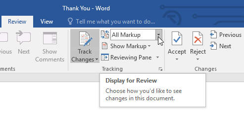
2. Chọn tùy chọn mong muốn từ menu thả xuống. Trong ví dụ của chúng tôi, chúng tôi sẽ chọn ** No Markup ** để xem trước phiên bản cuối cùng của tài liệu trước khi chấp nhận các thay đổi.

   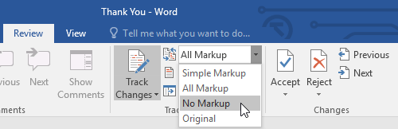

Bạn cũng có thể nhấp vào điểm đánh dấu ở lề trái để chuyển đổi giữa ** Simple Markup ** và ** Tất cả ** ** Đánh dấu **.

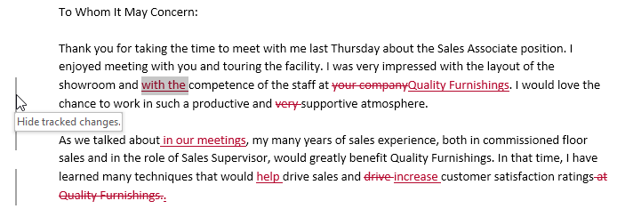

Hãy nhớ rằng việc ẩn Track Changes không giống như ** xem xét các thay đổi **. Bạn vẫn cần phải ** chấp nhận ** hoặc ** từ chối ** các thay đổi trước khi gửi phiên bản cuối cùng của tài liệu của mình.

#### Để hiển thị các bản sửa đổi trong bong bóng:

Hầu hết các bản sửa đổi đều xuất hiện ** nội tuyến **, nghĩa là bản thân văn bản đã được đánh dấu. Bạn cũng có thể chọn hiển thị các bản sửa đổi trong ** bong bóng **, thao tác này sẽ di chuyển hầu hết các bản sửa đổi sang lề phải. Việc xóa các đánh dấu nội tuyến có thể giúp tài liệu dễ đọc hơn và bóng chú thích cũng cung cấp thông tin chi tiết hơn về một số đánh dấu.

1. Từ tab ** Review **, hãy nhấp vào ** Hiển thị đánh dấu ** **> Bóng bay ** **> Hiển thị các bản sửa đổi trong bóng bay **.

   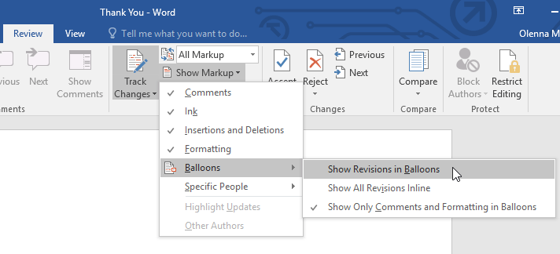
2. Hầu hết các bản sửa đổi sẽ xuất hiện ở lề phải, mặc dù mọi văn bản được thêm vào vẫn sẽ xuất hiện trong dòng.

   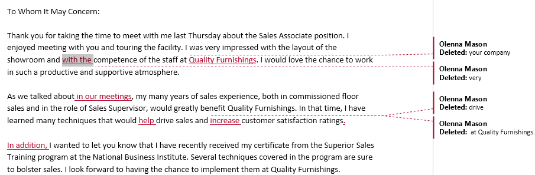

Để quay lại đánh dấu ** nội tuyến **, bạn có thể chọn ** Hiển thị tất cả các bản sửa đổi nội tuyến ** hoặc ** Chỉ hiển thị Comments và Định dạng trong bong bóng **.

### Comments

Đôi khi bạn có thể muốn thêm ** nhận xét ** để cung cấp phản hồi thay vì chỉnh sửa tài liệu. Mặc dù nó thường được sử dụng kết hợp với Track Changes nhưng bạn không nhất thiết phải bật Track Changes để thêm Comments.

#### Để thêm Comments:

1. ** Đánh dấu một số văn bản ** hoặc đặt ** điểm chèn ** nơi bạn muốn bình luận xuất hiện.

   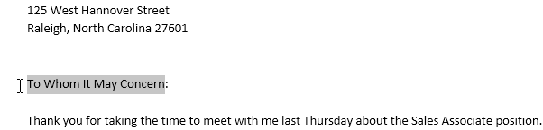
2. Từ tab ** Review **, hãy nhấp vào lệnh ** New Nhận xét **.

   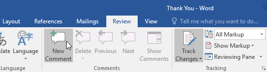
3. Nhập nhận xét của bạn. Khi hoàn tất, bạn có thể Close hộp nhận xét bằng cách nhấn phím ** Esc ** hoặc bằng cách nhấp vào bất kỳ đâu bên ngoài hộp nhận xét.

   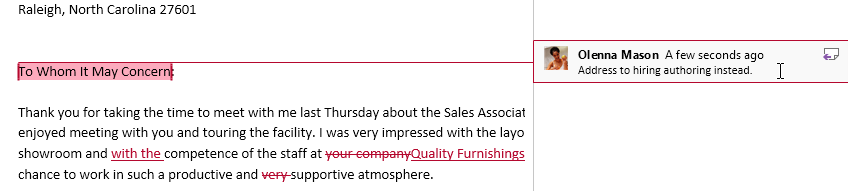

#### Để xóa Comments:

1. Chọn bình luận bạn muốn xóa.

   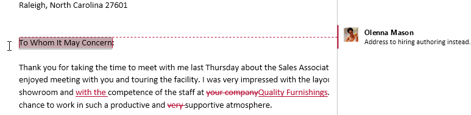
2. Từ tab ** Review **, hãy nhấp vào lệnh ** Xóa **.

   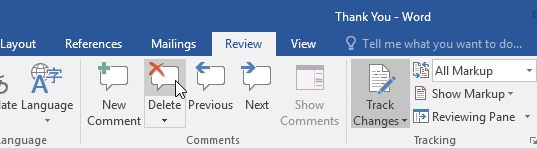
3. Bình luận sẽ bị xóa.

Để xóa tất cả Comments, hãy nhấp vào mũi tên thả xuống ** Xóa ** và chọn ** Xóa tất cả Comments trong Tài liệu **.

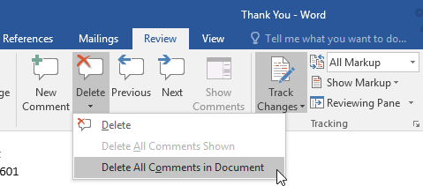

### So sánh tài liệu

Nếu bạn chỉnh sửa tài liệu mà không theo dõi các thay đổi, bạn vẫn có thể sử dụng các tính năng đánh giá như ** Chấp nhận ** và ** Từ chối **. Bạn có thể thực hiện việc này bằng cách ** so sánh ** hai phiên bản của tài liệu. Tất cả những gì bạn cần là tài liệu ** Original ** và tài liệu ** đã sửa đổi ** (các tài liệu này cũng phải có tên File khác nhau).

#### Để so sánh hai tài liệu:

1. Từ tab ** Review **, hãy nhấp vào lệnh ** So sánh **, sau đó chọn ** So sánh ** từ menu thả xuống.

   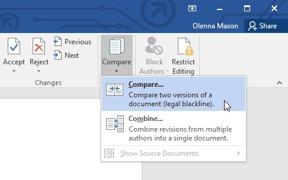
2. Một hộp thoại sẽ xuất hiện. Chọn tài liệu ** Original ** của bạn bằng cách nhấp vào mũi tên thả xuống và chọn tài liệu từ danh sách. Nếu File không có trong danh sách, hãy nhấp vào nút ** Duyệt ** để định vị nó.
3. Chọn ** Tài liệu đã sửa đổi **, sau đó nhấp vào ** OK **.

   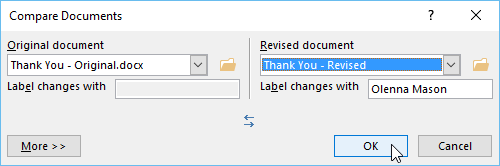
4. Word sẽ so sánh hai tệp để xác định những gì đã được thay đổi và sau đó tạo tài liệu New. Các thay đổi sẽ xuất hiện dưới dạng ** đánh dấu ** có màu, giống như ** Track Changes **. Sau đó, bạn có thể sử dụng các lệnh ** Chấp nhận ** và ** Từ chối ** để hoàn thiện tài liệu.

   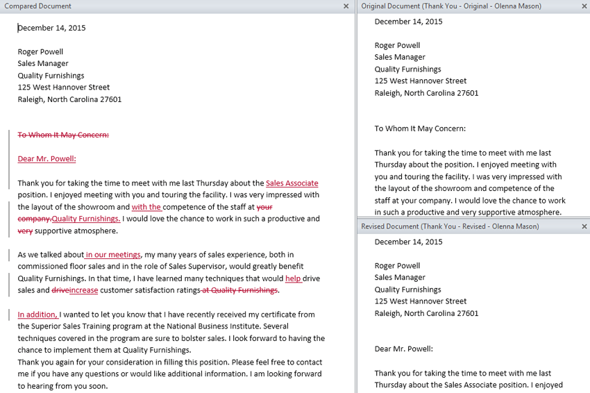

### Thử thách!

1. Open [tài liệu thực hành](practice_files/word_trackchanges_practice.docx) của chúng tôi.
2. Bật ** Track Changes ** và hiển thị ** All Markup **.
3. Trong ** Theo dõi ** Group, chọn ** Hiển thị các bản sửa đổi trong bong bóng **.
4. Trong đoạn đầu tiên, hãy chỉnh sửa câu thứ hai thành ** Rất vui được gặp bạn và tham quan cơ sở **.
5. Trong đoạn thứ hai, thay đổi từ ** kỹ thuật ** thành ** chiến lược **.
6. Thay đổi ** font ** của chữ cái thành ** Cambria, 12 pt **.
7. Trong đoạn thứ ba, hãy chọn các từ ** Cảm ơn ** và Insert một ** nhận xét ** có nội dung ** Đặt nội dung này cùng dòng với Nội thất chất lượng.**
8. Tại thời điểm này, chữ cái của bạn sẽ trông giống như thế này (** Lưu ý **: Màu đánh dấu có thể thay đổi):

   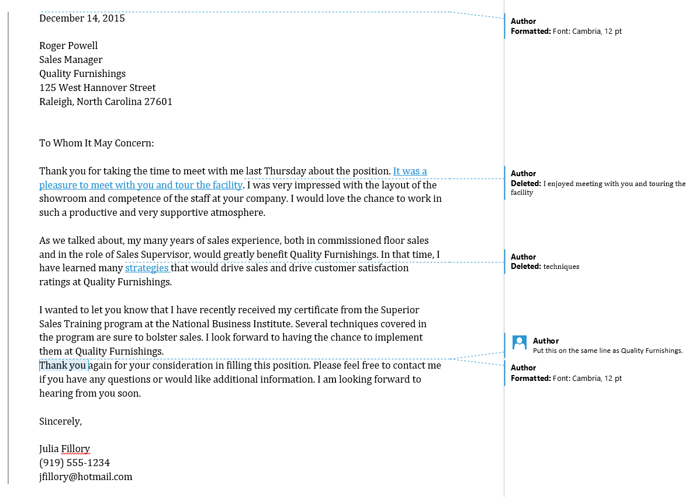
9. Nhấp vào mũi tên thả xuống ** Chấp nhận ** và chọn ** Chấp nhận tất cả thay đổi và ngừng theo dõi **.

/en/word/kiểm tra-và-bảo vệ-tài liệu/nội dung/