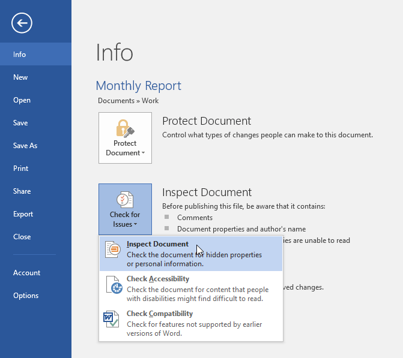
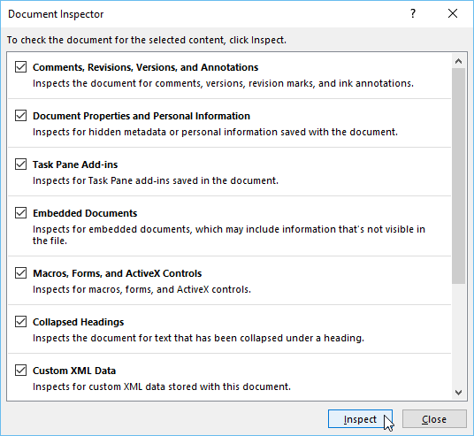
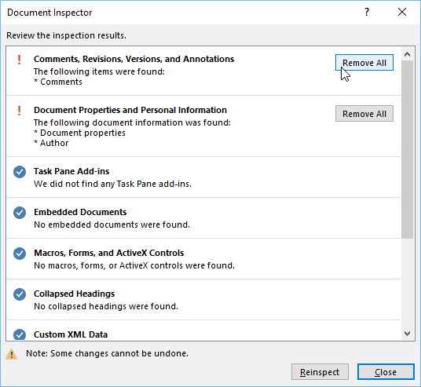
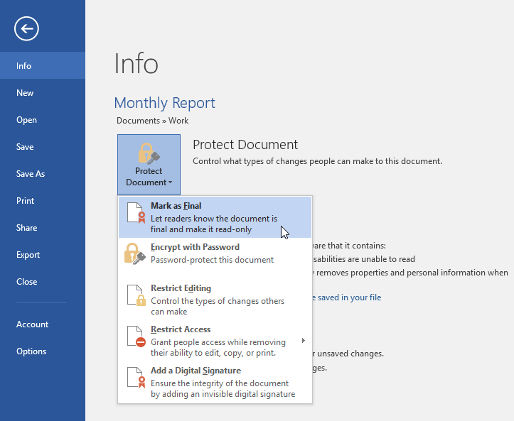
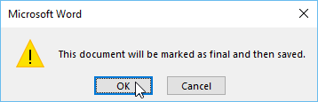
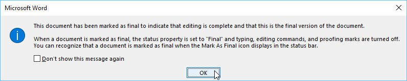
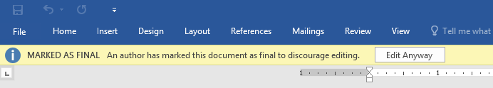
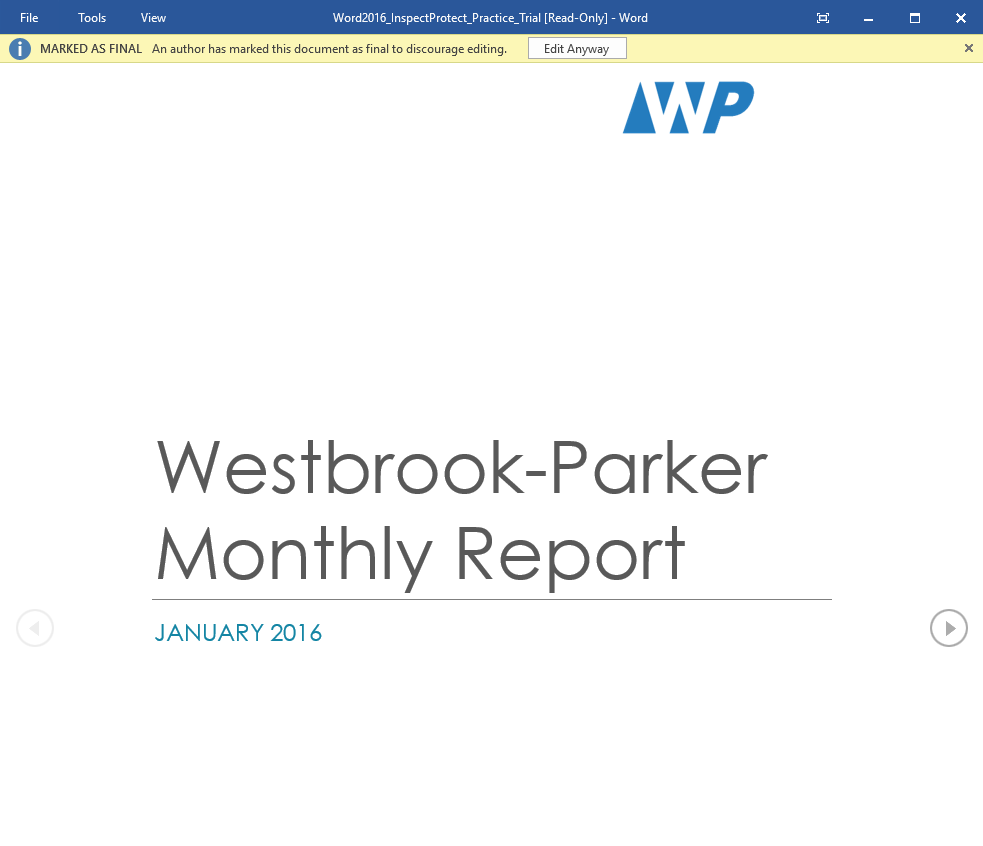

# Bài 27: kiểm tra và bảo vệ tài liệu

#### Bài 27: Kiểm tra và bảo vệ tài liệu

/en/word/track-changes-and-Comments/content/

### Giới thiệu

Trước khi chia sẻ tài liệu, bạn cần đảm bảo rằng tài liệu đó không bao gồm bất kỳ thông tin nào bạn muốn giữ riêng tư. Bạn cũng có thể muốn ngăn cản người khác chỉnh sửa File của mình. May mắn thay, Word bao gồm một số công cụ để Help ** kiểm tra ** và ** bảo vệ ** tài liệu của bạn.

Xem video bên dưới để tìm hiểu thêm về cách hoàn thiện tài liệu của bạn.

### Người kiểm tra tài liệu

Bất cứ khi nào bạn tạo hoặc chỉnh sửa tài liệu, một số ** thông tin cá nhân ** nhất định có thể được tự động thêm vào File, chẳng hạn như thông tin về tác giả của tài liệu. Bạn có thể sử dụng ** Trình kiểm tra tài liệu ** để xóa loại thông tin này trước khi chia sẻ tài liệu với người khác.

Vì một số thay đổi có thể là vĩnh viễn nên bạn nên sử dụng ** Save As ** để tạo bản sao lưu tài liệu của mình trước khi sử dụng Trình kiểm tra Tài liệu.

#### Để sử dụng Trình kiểm tra Tài liệu:

1. Nhấp vào tab ** File ** để đi tới ** Backstage view **.
2. Từ ngăn ** Info **, hãy nhấp vào ** Check for Issues **, sau đó chọn ** Kiểm tra ** ** Tài liệu ** từ menu thả xuống.

   
3. ** Trình kiểm tra tài liệu ** sẽ xuất hiện. Chọn hoặc bỏ chọn các hộp, tùy thuộc vào nội dung bạn muốn Review, sau đó nhấp vào ** Kiểm tra **. Trong ví dụ của chúng tôi, chúng tôi sẽ chọn mọi thứ.

   
4. Kết quả kiểm tra sẽ hiển thị ** dấu chấm than ** cho bất kỳ danh mục nào có khả năng tìm thấy dữ liệu nhạy cảm và cũng sẽ có nút ** Xóa tất cả ** cho từng danh mục này. Nhấp vào ** Xóa tất cả ** để xóa dữ liệu.

   
5. Khi bạn hoàn tất, hãy nhấp vào ** Close **.

### Bảo vệ tài liệu của bạn

Theo mặc định, bất kỳ ai có quyền truy cập vào tài liệu của bạn đều có thể Open, sao chép và chỉnh sửa nội dung của tài liệu đó trừ khi bạn ** bảo vệ ** tài liệu đó. Có một số cách để bảo vệ tài liệu, tùy thuộc vào nhu cầu của bạn.

#### Để bảo vệ tài liệu của bạn:

1. Nhấp vào tab ** File ** để đi tới ** Backstage view **.
2. Từ ngăn ** Info **, hãy nhấp vào lệnh ** Protect Document **.
3. Trong menu thả xuống, hãy chọn tùy chọn phù hợp nhất với nhu cầu của bạn. Trong ví dụ của chúng tôi, chúng tôi sẽ chọn ** Đánh dấu ** ** là Cuối cùng **. Đánh dấu tài liệu của bạn là tài liệu cuối cùng là một cách hay để ngăn cản người khác chỉnh sửa File, trong khi Options khác cung cấp cho bạn nhiều quyền kiểm soát hơn nếu bạn cần.

   
4. Một hộp thoại sẽ xuất hiện nhắc bạn Save. Nhấp vào ** OK **.

   
5. Một hộp thoại khác sẽ xuất hiện. Nhấp vào ** OK **.

   
6. Tài liệu sẽ được ** đánh dấu là cuối cùng **. Bất cứ khi nào người khác Open File, một thanh sẽ xuất hiện ở trên cùng để ngăn cản họ chỉnh sửa tài liệu.

   

Việc đánh dấu tài liệu là cuối cùng sẽ không thực sự ngăn người khác chỉnh sửa tài liệu đó vì họ chỉ có thể chọn ** Vẫn chỉnh sửa **. Nếu bạn muốn ngăn mọi người chỉnh sửa tài liệu, thay vào đó bạn có thể sử dụng tùy chọn ** Hạn chế quyền truy cập **.

### Thử thách!

1. Open [tài liệu thực hành](practice_files/word_inspectprotect_practice.docx) của chúng tôi. Nếu bạn mở tài liệu thực hành của chúng tôi để theo dõi bài học, hãy nhớ tải xuống bản sao mới bằng cách nhấp lại vào liên kết.
2. Sử dụng ** Trình kiểm tra tài liệu ** để kiểm tra và xóa mọi thông tin ẩn.
3. Bảo vệ tài liệu bằng cách ** đánh dấu nó là bản cuối cùng **.
4. Khi bạn hoàn tất, phần đầu trang của bạn sẽ trông giống như thế này:

   

/en/word/SmartArt-graphics/content/