# Bài 28: SmartArt-đồ họa

#### Bài 28: SmartArt Đồ họa

/en/word/kiểm tra-và-bảo vệ-tài liệu/nội dung/

### Giới thiệu

SmartArt cho phép bạn truyền đạt thông tin bằng ** đồ họa ** thay vì chỉ sử dụng văn bản. Có rất nhiều Styles để bạn lựa chọn, bạn có thể sử dụng chúng để minh họa cho nhiều loại ý tưởng khác nhau.

Xem video bên dưới để tìm hiểu thêm về cách làm việc với SmartArt.

#### Đến Insert đồ họa SmartArt:

1. Đặt điểm chèn vào tài liệu nơi bạn muốn đồ họa SmartArt xuất hiện.
2. Từ tab ** Insert **, hãy chọn lệnh ** SmartArt ** trong ** Minh họa ** Group.

   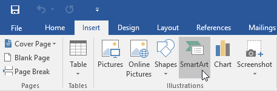
3. Một hộp thoại sẽ xuất hiện. Chọn ** danh mục ** ở bên trái, chọn đồ họa SmartArt mong muốn, sau đó nhấp vào ** OK **.

   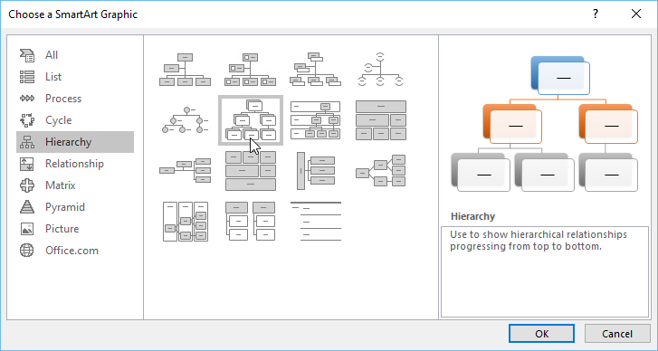
4. Đồ họa SmartArt sẽ xuất hiện trong tài liệu của bạn.

   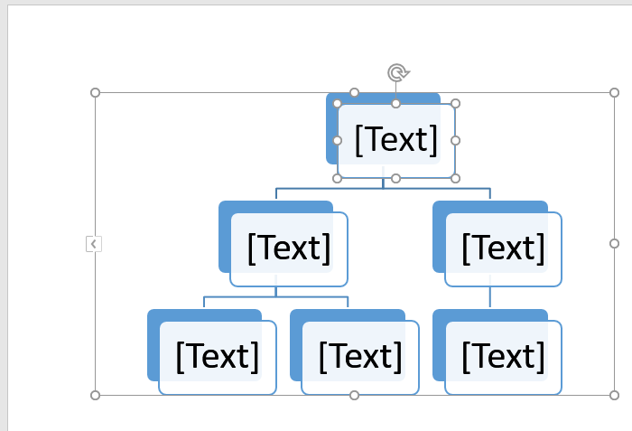

#### Để thêm văn bản vào đồ họa SmartArt:

1. Chọn đồ họa SmartArt. ** khung văn bản ** sẽ xuất hiện ở phía bên trái. Nếu nó không xuất hiện, bạn có thể nhấp vào mũi tên nhỏ ở cạnh trái của đồ họa. Nếu nó không xuất hiện, hãy nhấp vào mũi tên nhỏ ở bên trái SmartArt để bật và tắt nó.

   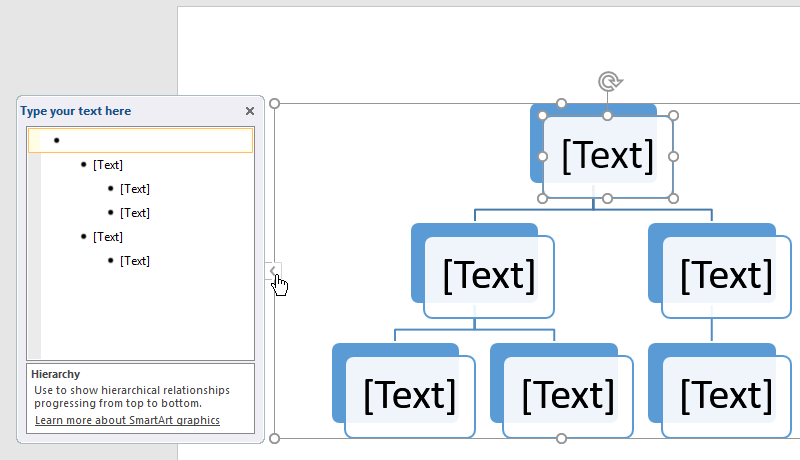
2. Nhập văn bản bên cạnh mỗi dấu đầu dòng trong ngăn văn bản. Văn bản sẽ xuất hiện với hình dạng tương ứng. Nó sẽ được thay đổi kích thước tự động để vừa với bên trong hình dạng.

   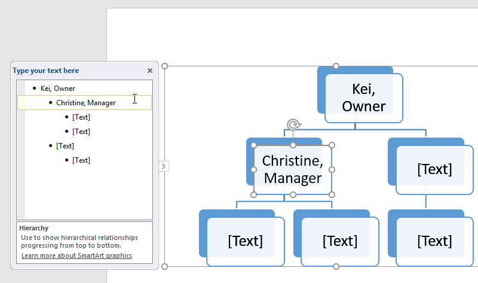

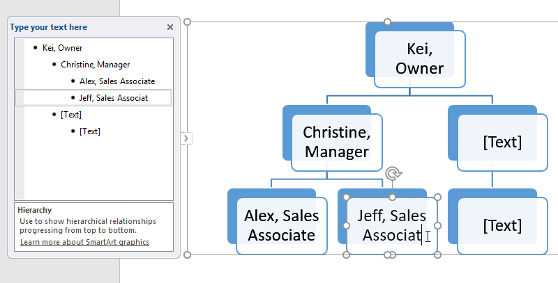

#### Để sắp xếp lại, thêm và xóa Shapes:

Thật dễ dàng để thêm New Shapes, thay đổi thứ tự của chúng và thậm chí xóa Shapes khỏi đồ họa SmartArt của bạn. Bạn có thể thực hiện tất cả những điều này trong ngăn văn bản và việc này rất giống với việc tạo đường viền với ** danh sách đa cấp **. Để biết thêm thông tin về danh sách đa cấp, bạn có thể muốn xem bài học Review [Lists](../../lists/1/index.html) của chúng tôi.

* Để ** hạ cấp một hình **, hãy chọn dấu đầu dòng mong muốn, sau đó nhấn phím ** Tab **. Viên đạn sẽ di chuyển sang bên phải và hình dạng sẽ di chuyển xuống một cấp độ.

  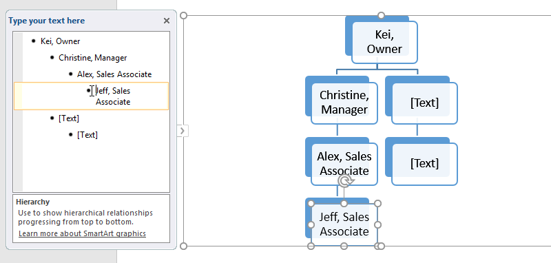
* Để ** thêm một hình dạng **, hãy chọn dấu đầu dòng mong muốn, sau đó nhấn phím ** Backspace ** (hoặc ** Shift+Tab **). Viên đạn sẽ di chuyển sang trái và hình dạng sẽ di chuyển lên một cấp.

  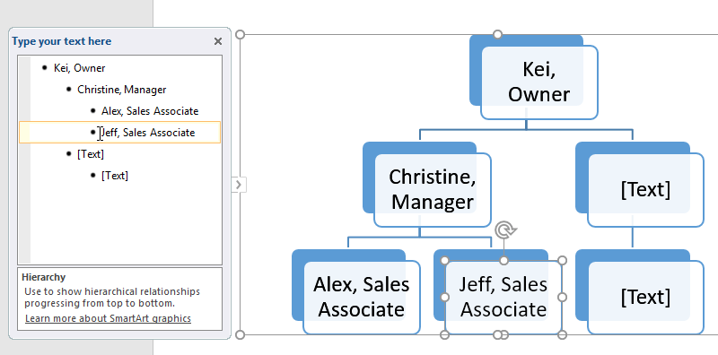
* Để ** thêm hình dạng New **, hãy đặt điểm chèn sau dấu đầu dòng mong muốn, sau đó nhấn ** Enter **. Dấu đầu dòng New sẽ xuất hiện trong ngăn văn bản và hình dạng New sẽ xuất hiện trong đồ họa.

  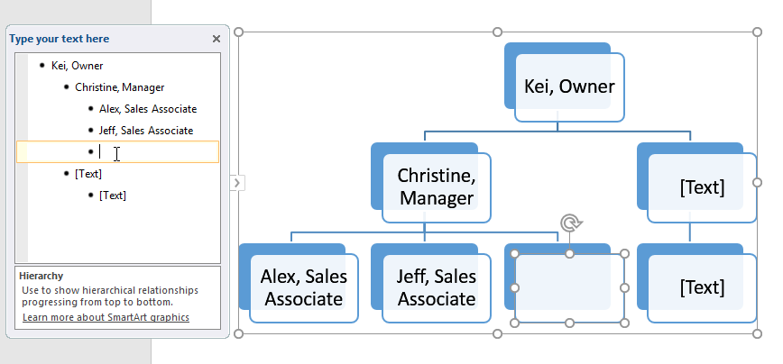
* Để ** xóa ** ** hình dạng **, hãy tiếp tục nhấn ** Backspace ** cho đến khi dấu đầu dòng bị xóa. Hình dạng sau đó sẽ được gỡ bỏ. Trong ví dụ của chúng tôi, chúng tôi sẽ xóa tất cả Shapes không có văn bản.

  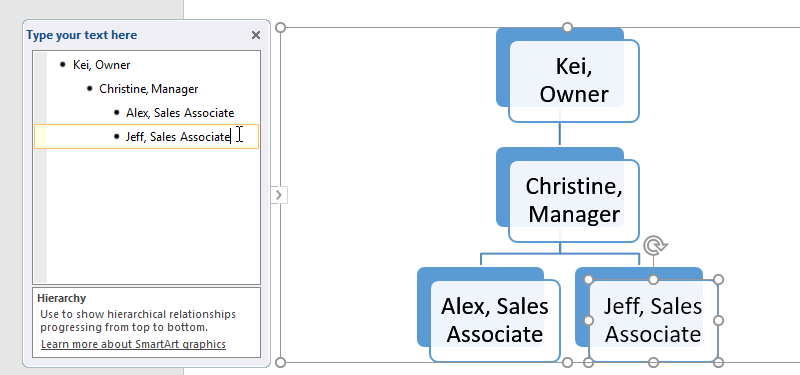

#### Sắp xếp SmartArt từ tab Design

Nếu không muốn sử dụng ngăn văn bản để sắp xếp SmartArt của mình, bạn có thể sử dụng các lệnh trên tab ** Design ** trong ** Tạo đồ họa ** Group. Chỉ cần chọn hình dạng bạn muốn sửa đổi, sau đó chọn lệnh mong muốn.

* ** Thăng hạng ** và ** Giảm hạng **: Sử dụng các lệnh này để di chuyển hình lên hoặc xuống giữa các cấp.

  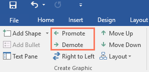
* ** Di chuyển lên ** và ** Di chuyển xuống **: Sử dụng các lệnh này để thay đổi thứ tự của Shapes ở cùng cấp độ.

  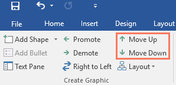
* ** Thêm hình dạng **: Sử dụng lệnh này để thêm hình dạng New vào đồ họa của bạn. Bạn cũng có thể nhấp vào mũi tên thả xuống để có vị trí chính xác hơn Options.

  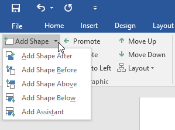

Trong ví dụ của chúng tôi, chúng tôi đã sắp xếp một đồ họa có cấu trúc phân cấp Layout. Không phải tất cả đồ họa SmartArt đều sử dụng loại Layout này, vì vậy hãy nhớ rằng các lệnh này có thể hoạt động khác nhau (hoặc hoàn toàn không hoạt động) tùy thuộc vào Layout của đồ họa của bạn.

### Đang tùy chỉnh SmartArt

Sau khi chèn SmartArt, có một số điều bạn có thể muốn thay đổi về hình thức của nó. Bất cứ khi nào bạn chọn đồ họa SmartArt, các tab ** Design ** và ** Định dạng ** sẽ xuất hiện ở bên phải của Ribbon. Từ đó, thật dễ dàng để chỉnh sửa ** kiểu ** và ** Layout ** của đồ họa SmartArt.

* Có một số ** SmartArt Styles **, cho phép bạn nhanh chóng sửa đổi giao diện của SmartArt của mình. Để thay đổi kiểu, hãy chọn ** kiểu mong muốn ** từ ** SmartArt Styles ** Group.

  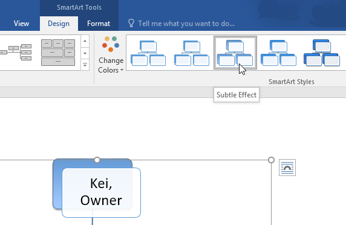
* Bạn có nhiều ** cách phối màu ** khác nhau để sử dụng với SmartArt. Để thay đổi màu, hãy nhấp vào lệnh ** Thay đổi màu ** và chọn tùy chọn mong muốn từ trình đơn thả xuống.

  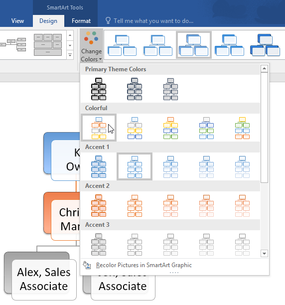

* Bạn cũng có thể tùy chỉnh từng hình dạng một cách độc lập. Chỉ cần chọn bất kỳ hình dạng nào trong đồ họa, sau đó chọn tùy chọn mong muốn từ tab ** Định dạng **.

  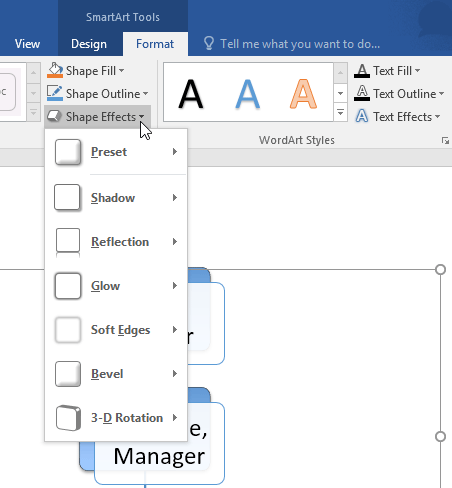

#### Để thay đổi SmartArt Layout:

Nếu không thích cách sắp xếp thông tin của mình trong đồ họa SmartArt, bạn luôn có thể thay đổi ** Layout ** của đồ họa đó để phù hợp hơn với nội dung của bạn.

1. Từ tab ** Design **, hãy nhấp vào mũi tên thả xuống ** Thêm ** trong Bố cục Group.

   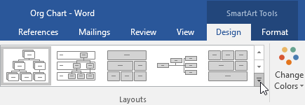
2. Chọn Layout mong muốn hoặc nhấp vào ** Bố cục khác ** để xem thêm Options.

   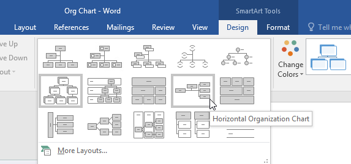
3. Layout đã chọn sẽ xuất hiện.

   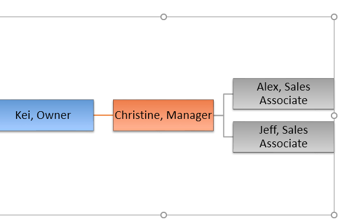

Nếu New Layout quá khác với Original thì một số văn bản của bạn có thể không xuất hiện. Trước khi quyết định New Layout, hãy kiểm tra cẩn thận để đảm bảo không có thông tin quan trọng nào bị mất.

### Thử thách!

1. Open và ** Blank document **.
2. Insert đồ họa ** Chu kỳ cơ bản SmartArt ** từ danh mục ** Chu kỳ **.
3. Insert văn bản sau theo thứ tự theo chiều kim đồng hồ: ** Ngưng tụ **, ** Bốc hơi **, ** Xâm nhập **, ** Lượng mưa **, ** Bộ sưu tập **.
4. ** Xóa ** hình có chứa từ ** Xâm nhập **.
5. Chọn hình dạng có chứa ** Bốc hơi ** và nhấp vào lệnh ** Di chuyển xuống ** ** hai lần ** để di chuyển hình dạng giữa ** Bộ sưu tập ** và ** Ngưng tụ **.
6. Thay đổi ** SmartArt Layout ** thành ** Chu kỳ khối **.
7. Thay đổi ** màu ** của SmartArt thành phạm vi bạn chọn.
8. Thay đổi Kiểu SmartArt thành ** Hiệu ứng mãnh liệt **.
9. Khi bạn hoàn tất, SmartArt của bạn sẽ trông như thế này:

   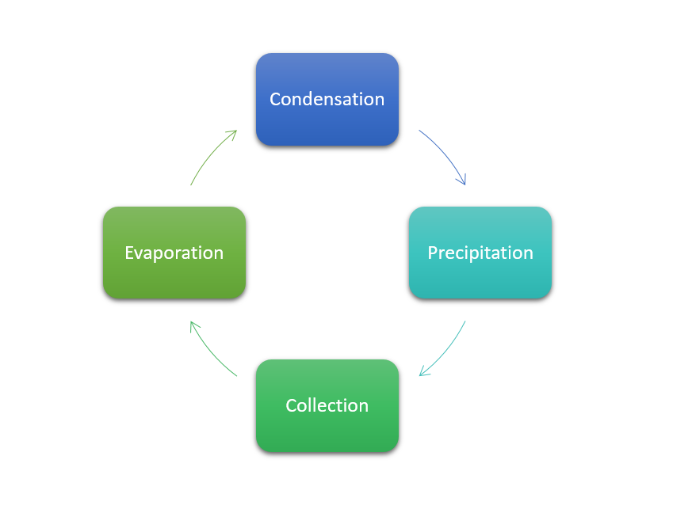

/en/word/áp dụng-và-sửa đổi-Styles/content/