# Bài 29: áp dụng và sửa đổi-Styles

#### Bài 29: Áp dụng và sửa đổi Styles

/en/word/SmartArt-graphics/content/

### Giới thiệu

** kiểu ** là sự kết hợp được xác định trước giữa kiểu phông chữ, màu sắc và kích thước phông chữ có thể áp dụng cho bất kỳ văn bản nào trong tài liệu của bạn. Styles có thể Help tài liệu của bạn có giao diện chuyên nghiệp hơn. Bạn cũng có thể sử dụng Styles để thay đổi nhanh chóng một số nội dung trong tài liệu của mình cùng một lúc.

Xem video bên dưới để tìm hiểu thêm về cách sử dụng Styles trong Word.

#### Để áp dụng một phong cách:

1. Chọn văn bản bạn muốn định dạng hoặc đặt con trỏ ở đầu dòng.

   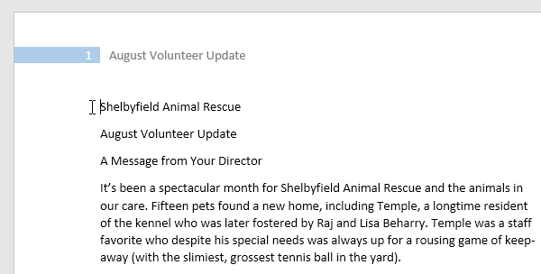
2. Trong ** Styles ** Group trên tab ** Home **, hãy nhấp vào mũi tên thả xuống ** Thêm **.

   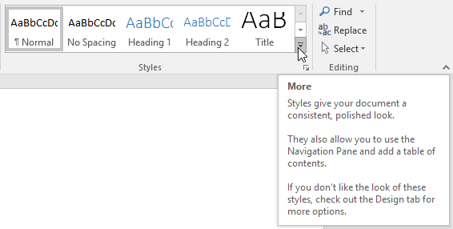
3. Chọn ** kiểu mong muốn ** từ trình đơn thả xuống.

   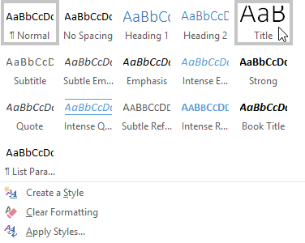
4. Văn bản sẽ xuất hiện theo kiểu đã chọn.

   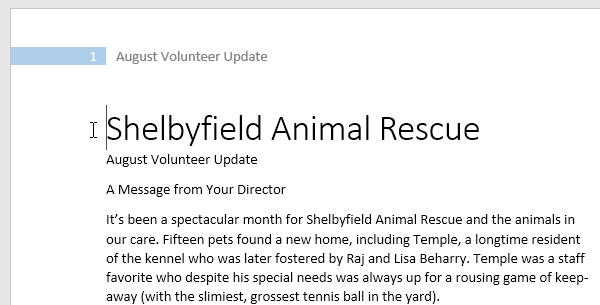

#### Để áp dụng một bộ kiểu:

** Bộ kiểu ** bao gồm sự kết hợp giữa tiêu đề, tiêu đề và đoạn Styles. Bộ kiểu cho phép bạn ** định dạng tất cả các thành phần ** trong tài liệu của mình cùng một lúc thay vì sửa đổi từng thành phần riêng lẻ.

1. Từ tab ** Design **, hãy nhấp vào mũi tên thả xuống ** Thêm ** trong ** Định dạng tài liệu ** Group.

   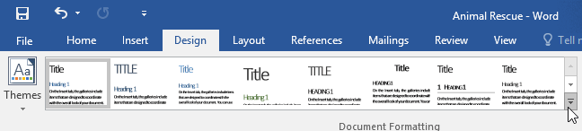
2. Chọn ** bộ kiểu mong muốn ** từ trình đơn thả xuống.

   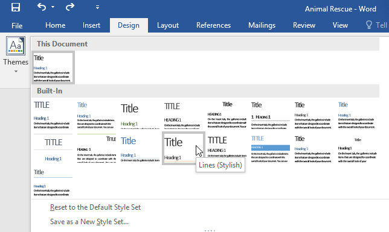
3. Bộ kiểu đã chọn sẽ được áp dụng cho toàn bộ tài liệu của bạn.

   

#### Để sửa đổi một phong cách:

1. Trong ** Styles ** Group trên tab ** Home **, nhấp chuột phải vào ** kiểu ** bạn muốn thay đổi và chọn ** Sửa đổi ** từ menu thả xuống.

   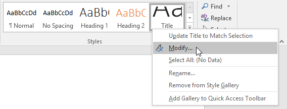
2. Một hộp thoại sẽ xuất hiện. Thực hiện ** định dạng mong muốn ** ** thay đổi **, chẳng hạn như kiểu phông chữ, kích thước và màu sắc. Nếu muốn, bạn cũng có thể thay đổi ** tên ** của kiểu. Nhấp vào ** OK ** để Save những thay đổi của bạn.

   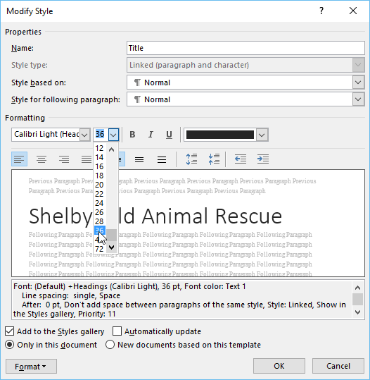
3. Phong cách sẽ được sửa đổi.

   

Khi bạn sửa đổi một kiểu, bạn sẽ thay đổi ** mọi phiên bản ** của kiểu đó trong tài liệu. Trong ví dụ bên dưới, chúng tôi đã sửa đổi kiểu ** Bình thường ** để sử dụng cỡ chữ lớn hơn. Vì cả hai đoạn đều sử dụng Normal style nên chúng đã được cập nhật tự động để sử dụng kích thước New.

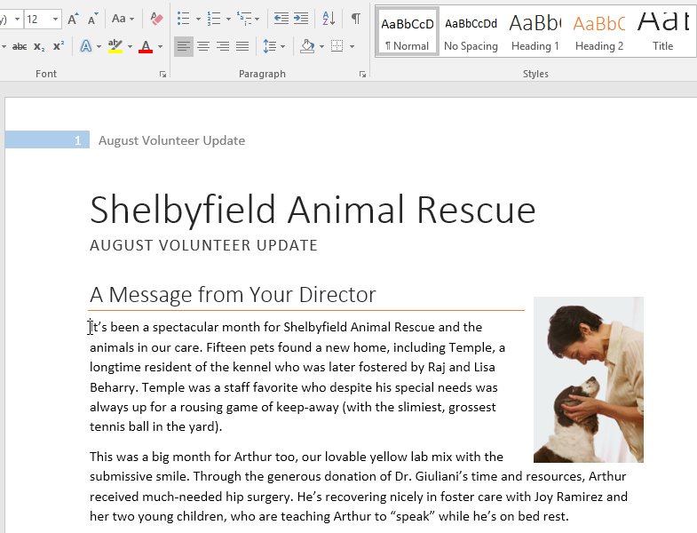

#### Để tạo kiểu New:

1. Nhấp vào ** mũi tên ** ở góc dưới cùng bên phải của ** Styles ** Group.

   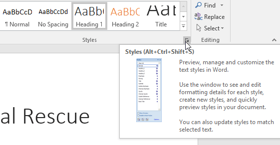
2. Ngăn tác vụ ** Styles ** sẽ xuất hiện. Chọn nút ** New Kiểu ** ở cuối ngăn tác vụ.

   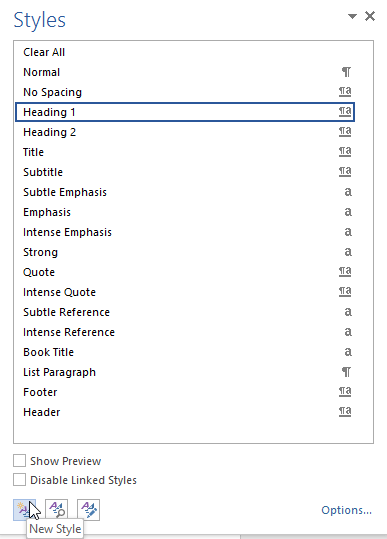
3. Một hộp thoại sẽ xuất hiện. Nhập ** tên ** cho kiểu, chọn ** định dạng văn bản mong muốn **, sau đó nhấp vào ** OK **.

   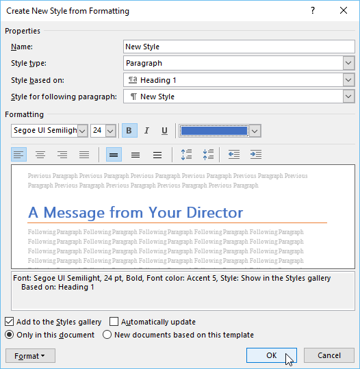
4. Kiểu New sẽ được áp dụng cho văn bản hiện được chọn. Nó cũng sẽ xuất hiện trong ** Styles ** Group.

   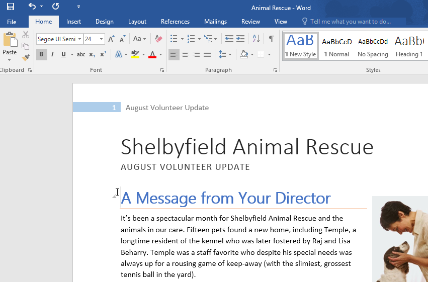

Bạn cũng có thể sử dụng Styles để tạo ** Table of Contents ** cho tài liệu của mình. Để tìm hiểu cách thực hiện, Review bài viết của chúng tôi về [Cách tạo Table of Contents trong Microsoft Word](../../../word-tips/how-to-create-a-table-of-contents-in-word/1/index.html "Cách tạo Table of Contents trong Word").

### Thử thách!

1. Open [tài liệu thực hành](practice_files/word_styles_practice.docx) của chúng tôi. Nếu bạn đã tải xuống tài liệu thực hành của chúng tôi, hãy nhớ tải xuống bản sao mới bằng cách nhấp lại vào liên kết.
2. Trên trang 1, chọn dòng văn bản đầu tiên ** Giải cứu động vật Shelbyfield ** và thay đổi kiểu thành ** Tiêu đề **.
3. Chọn dòng thứ hai có nội dung ** Cập nhật tình nguyện tháng 8 ** và thay đổi kiểu thành ** Heading 1 **.
4. Chọn dòng thứ ba có nội dung ** Thông điệp từ giám đốc của bạn ** và thay đổi kiểu thành ** Heading 2 **.
5. Trong tab ** Design **, hãy thay đổi bộ kiểu ** s ****** thành ** Thông thường **.
6. ** Sửa đổi ** kiểu ** Bình thường ** để phông chữ là ** Cambria ** và cỡ chữ là ** 14 pt **.
7. Khi bạn hoàn tất, trang đầu tiên của tài liệu của bạn sẽ trông như thế này:

   
8. Tùy chọn: Sửa đổi kiểu ** Heading 3 ** theo bất kỳ cách nào bạn muốn. Bạn có thể thay đổi phông chữ, cỡ chữ, màu sắc, v.v. Tiêu đề này xuất hiện xuyên suốt tài liệu, vì vậy hãy thử chọn định dạng bổ sung cho nội dung văn bản.

/en/word/mail-merge/content/