# Bài 30: trộn thư

#### Bài 30: Mail Merge

/en/word/áp dụng-và-sửa đổi-Styles/content/

### Giới thiệu

Mail Merge là một công cụ hữu ích cho phép bạn tạo nhiều chữ cái, Labels, Envelopes, thẻ tên, v.v. bằng cách sử dụng thông tin được lưu trữ trong danh sách, cơ sở dữ liệu hoặc bảng tính. Khi thực hiện ** Mail Merge **, bạn sẽ cần một ** tài liệu Word ** (bạn có thể bắt đầu bằng một tài liệu hiện có hoặc tạo một tài liệu New) và ** danh sách người nhận **, thường là ** sổ làm việc Excel **.

* [Tài liệu thực hành](practice_files/word_mailmerge_practice.docx) (Tài liệu Word)
* [Danh sách người nhận](../../../../media.gcflearnfree.org/content/5c096a1c77c050035472858a_12_06_2018/word_mailmerge_practice.xlsx) (Sổ làm việc Excel)

Xem video bên dưới để tìm hiểu thêm về cách sử dụng tính năng Mail Merge.

#### Để sử dụng Mail Merge:

1. Open một tài liệu Word ** hiện có ** hoặc tạo một tài liệu ** New **.
2. Từ tab ** Mailings **, hãy nhấp vào lệnh ** Bắt đầu Mail Merge ** và chọn ** Trình hướng dẫn từng bước Mail Merge ** từ menu thả xuống.

   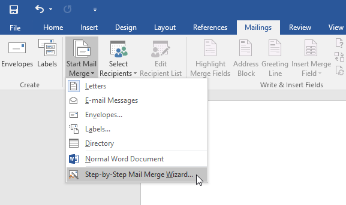

Ngăn Mail Merge sẽ xuất hiện và hướng dẫn bạn qua ** sáu bước chính ** để hoàn tất việc hợp nhất. Ví dụ sau đây minh hoạ cách tạo một lá thư biểu mẫu và hợp nhất lá thư đó với ** danh sách người nhận **.

#### Bước 1:

* Từ ngăn tác vụ Mail Merge ở bên phải cửa sổ Word, hãy chọn ** loại ** tài liệu bạn muốn tạo. Trong ví dụ của chúng tôi, chúng tôi sẽ chọn ** Chữ cái **. Sau đó nhấp vào ** Tiếp theo: Bắt đầu tài liệu ** để chuyển sang Bước 2.

  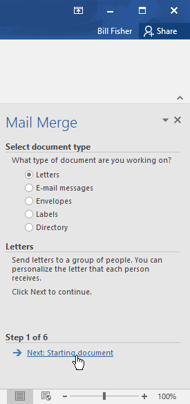

#### Bước 2:

* Chọn ** Sử dụng tài liệu hiện tại **, sau đó nhấp vào ** Tiếp theo: Select Recipients ** để chuyển sang Bước 3.

  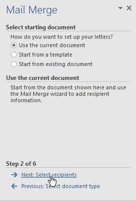

#### Bước 3:

Bây giờ bạn sẽ cần một danh sách địa chỉ để Word có thể tự động đặt từng địa chỉ vào tài liệu. Danh sách này có thể nằm trong File hiện có, chẳng hạn như ** sổ làm việc Excel ** hoặc bạn có thể ** nhập danh sách địa chỉ New ** từ trong Trình hướng dẫn Mail Merge.

1. Chọn ** Sử dụng danh sách hiện có **, sau đó nhấp vào ** Duyệt ** để chọn File.

   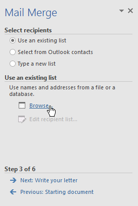
2. Xác định vị trí File của bạn, sau đó nhấp vào ** Open **.

   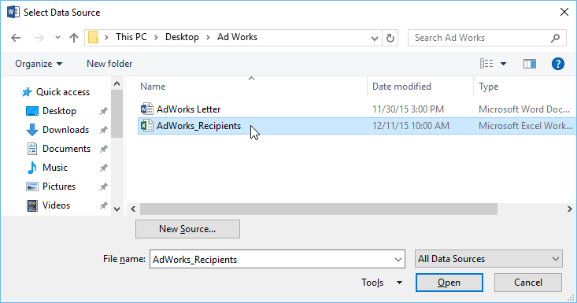
3. Nếu danh sách địa chỉ nằm trong sổ làm việc Excel, hãy chọn ** bảng tính ** có chứa danh sách, sau đó nhấp vào ** OK **.

   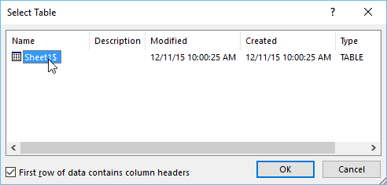
4. Trong hộp thoại ** Mail Merge Người nhận **, bạn có thể ** chọn ** hoặc ** bỏ chọn ** từng hộp để kiểm soát những người nhận nào được đưa vào hợp nhất. Theo mặc định, tất cả người nhận sẽ được chọn. Khi bạn hoàn tất, hãy nhấp vào ** OK **.

   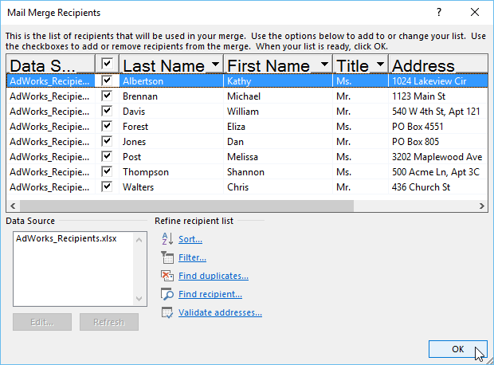
5. Nhấp vào ** Tiếp theo: Viết thư của bạn ** để chuyển sang Bước 4.

   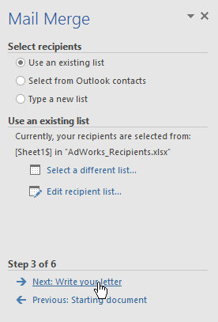

Nếu bạn không có danh sách địa chỉ hiện có, bạn có thể nhấp vào nút ** Nhập danh sách New ** và nhấp vào ** Tạo **, sau đó nhập danh sách địa chỉ của bạn theo cách thủ công.

#### Bước 4:

Bây giờ bạn đã sẵn sàng để viết thư của mình. Khi in ra, về cơ bản mỗi bản sao của bức thư sẽ giống nhau; chỉ ** dữ liệu người nhận ** (chẳng hạn như ** tên ** và ** địa chỉ **) sẽ khác nhau. Bạn sẽ cần thêm ** phần giữ chỗ ** cho dữ liệu người nhận để Mail Merge biết chính xác vị trí cần thêm dữ liệu.

#### Tới Insert dữ liệu người nhận:

1. Đặt điểm chèn vào tài liệu nơi bạn muốn thông tin xuất hiện.

   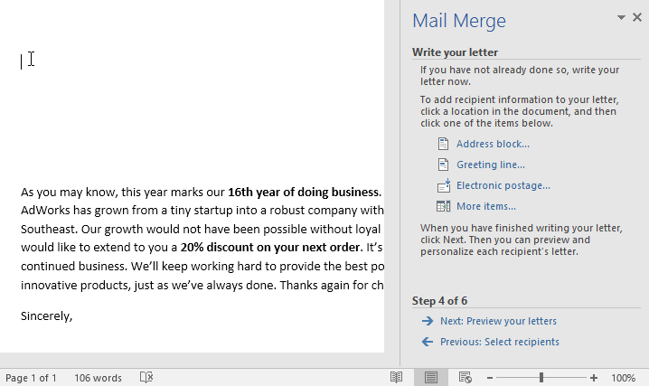
2. Chọn một trong ** giữ chỗ ** Options. Trong ví dụ của chúng tôi, chúng tôi sẽ chọn ** Address Block **.

   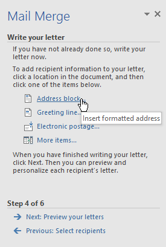
3. Tùy thuộc vào lựa chọn của bạn, một hộp thoại có thể xuất hiện với nhiều tùy chỉnh khác nhau Options. Chọn Options mong muốn, sau đó nhấp vào ** OK **.

   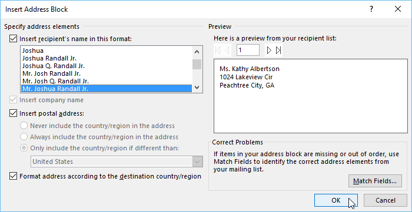
4. Một trình giữ chỗ sẽ xuất hiện trong tài liệu của bạn (ví dụ: **`AddressBlock'**).

   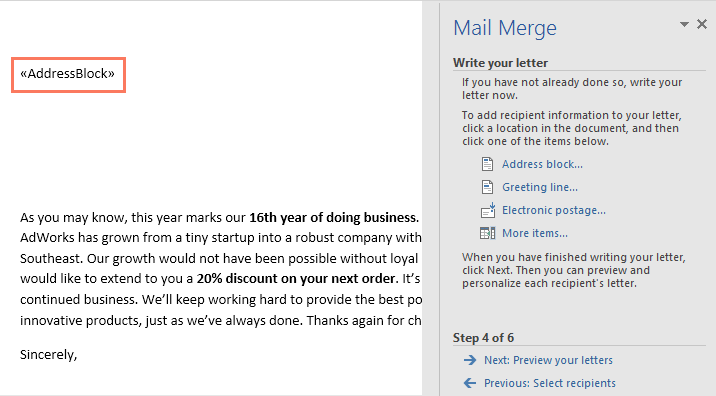
5. Thêm bất kỳ trình giữ chỗ nào khác mà bạn muốn. Trong ví dụ của chúng tôi, chúng tôi sẽ thêm phần giữ chỗ ** Greeting Line ** ngay phía trên nội dung của bức thư.

   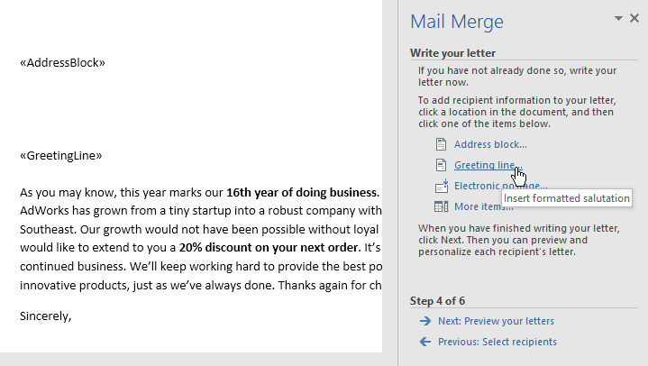
6. Khi bạn hoàn tất, hãy nhấp vào ** Tiếp theo: Xem trước các chữ cái của bạn ** để chuyển sang Bước 5.

   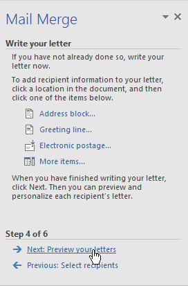

Đối với một số chữ cái, bạn chỉ cần thêm ** Address Block ** và ** Greeting Line **. Tuy nhiên, bạn cũng có thể thêm nhiều phần giữ chỗ khác (chẳng hạn như tên hoặc địa chỉ của người nhận) vào phần nội dung của bức thư để cá nhân hóa nó hơn nữa.

#### Bước 5:

1. Xem trước các chữ cái để đảm bảo thông tin từ danh sách người nhận xuất hiện chính xác trong thư. Bạn có thể sử dụng mũi tên cuộn trái và phải để View từng phiên bản của tài liệu.

   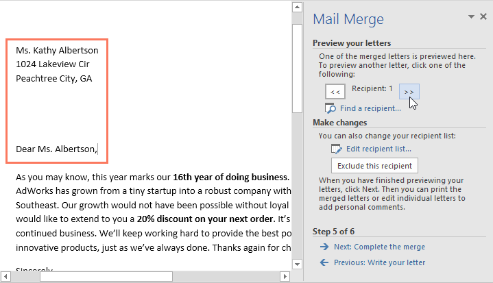
2. Nếu mọi thứ đều chính xác, hãy nhấp vào ** Tiếp theo: Hoàn tất việc hợp nhất ** để chuyển sang Bước 6.

   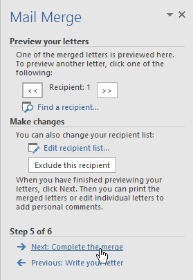

#### Bước 6:

1. Nhấp vào ** Print ** để Print các chữ cái.

   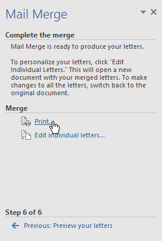
2. Một hộp thoại sẽ xuất hiện. Quyết định xem bạn muốn Print ** Tất cả ** các chữ cái, tài liệu hiện tại (bản ghi) hay chỉ chọn Group, sau đó nhấp vào ** OK **. Trong ví dụ của chúng tôi, chúng tôi sẽ Print tất cả các chữ cái.

   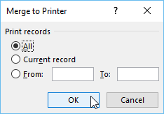
3. Hộp thoại ** Print ** sẽ xuất hiện. Điều chỉnh cài đặt Print nếu cần, sau đó nhấp vào ** OK **. Các chữ cái sẽ được in.

   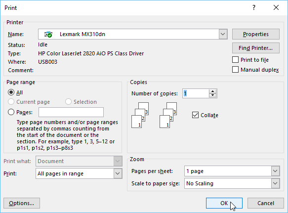

### Thử thách!

1. Open [tài liệu thực hành](practice_files/word_mailmerge_practice.docx) và [danh sách người nhận thực hành](../../../../media.gcflearnfree.org/content/5c096a1c77c050035472858a_12_06_2018/word_mailmerge_practice.xlsx của chúng tôi.
2. Sử dụng Trình hướng dẫn ** Mail Merge ** để hợp nhất thư với danh sách người nhận.
3. Insert và ** Address Block ** ở đầu tài liệu. Chọn định dạng thứ hai: ** Joshua Randall Jr.**
4. Phía trên nội dung của bức thư, Insert a ** Greeting Line **. Định dạng Greeting Line thành ** Mr. Randall,**
5. Kiểm tra các chữ cái của bạn để đảm bảo chúng được định dạng chính xác. Bức thư thứ ba của bạn sẽ trông giống như thế này:

   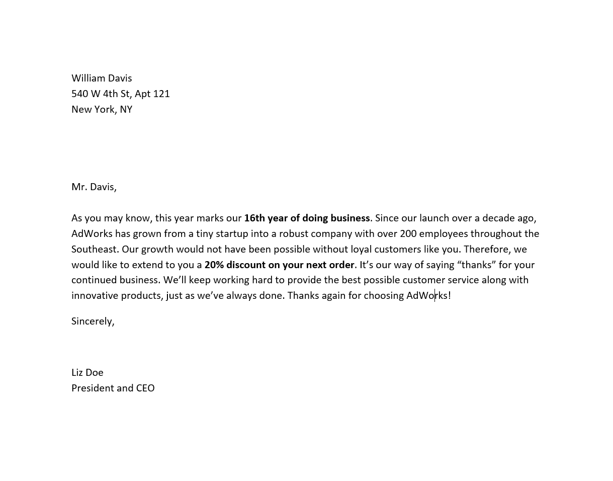
6. ** Hoàn thành ** việc hợp nhất.

/en/word/what-is-office-365/content/