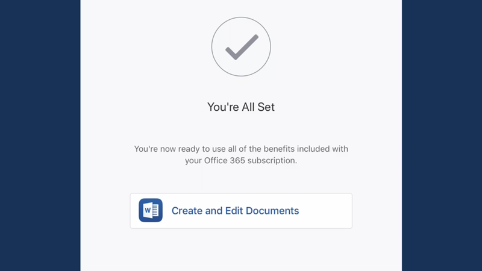
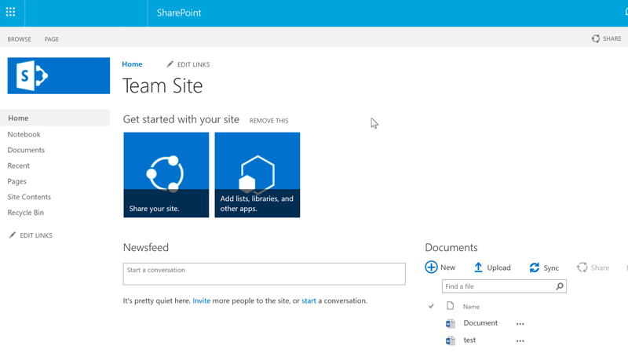

# Bài 31: office-365 là gì

#### Bài 31: Office 365 là gì?

/en/word/mail-merge/content/

### Office 365 là gì?

Office 365 là ** phiên bản dựa trên đăng ký ** của Microsoft Office Suite và bạn có một số Options khi mua Account. Một là ** Office 365 Personal **, cung cấp cho một người dùng quyền truy cập đầy đủ vào mọi ứng dụng Office. Một cái khác là ** Office 365 Home **, được thiết kế cho các gia đình có nhiều người sẽ sử dụng Office.

Xem video bên dưới để biết thêm về những gì Office 365 cung cấp.

#### Tính năng độc quyền

Có rất nhiều điểm tương đồng giữa các chương trình Office 365 và Microsoft Office Suite truyền thống, vì vậy trải nghiệm tổng thể sẽ có cảm giác quen thuộc nếu bạn đã sử dụng Office trước đây.

Tuy nhiên, Office 365 cung cấp một số lợi ích không có trong Microsoft Office Suite. Ví dụ: đăng ký Office 365 cấp cho bạn quyền truy cập vào ** nhiều tính năng hơn **, bao gồm Trình dịch, Trợ lý Sơ yếu lý lịch và Tra cứu thông minh. Bạn cũng có thể cộng tác với những người khác trong Excel thông qua tính năng đồng tác giả, tính năng này cho phép người khác chỉnh sửa sổ làm việc của bạn trong thời gian thực.

** Ứng dụng Office dành cho thiết bị di động ** cũng có nhiều tính năng hơn khi bạn đăng ký. Ví dụ: bạn có thể thực hiện những việc như ngắt trang Insert, sử dụng nhiều màu hơn hoặc tạo PivotTable bằng ứng dụng Excel dành cho thiết bị di động. Tuy nhiên, phiên bản miễn phí của ứng dụng dành cho thiết bị di động chỉ cho phép bạn thực hiện các tác vụ cơ bản, như tạo File và nhập văn bản.

Office 365 cũng bao gồm các lợi ích khác, như có thêm dung lượng lưu trữ File trong OneDrive và hỗ trợ kỹ thuật.

#### SharePoint và cập nhật phần mềm

Một lợi thế khác biệt khi sử dụng Office 365, đặc biệt đối với doanh nghiệp, là quyền truy cập vào ** SharePoint Online **. Đây là dịch vụ có trong một số phiên bản của Office 365 cho phép bạn Share và cộng tác với những người khác, cho dù họ là đồng nghiệp hay khách hàng. Vì tài liệu nằm trên đám mây nên có thể thiết lập quyền bảo mật để cho phép bất kỳ ai trong tổ chức, bất kể vị trí của họ, View tài liệu.

Người đăng ký Office 365 cũng nhận được ** cập nhật phần mềm thường xuyên hơn ** so với những người đã mua Office mà không đăng ký. Điều này có nghĩa là người đăng ký Office 365 có quyền truy cập vào các tính năng, bản cập nhật bảo mật và sửa lỗi mới nhất.

/en/word/New-features-in-office-2019/content/