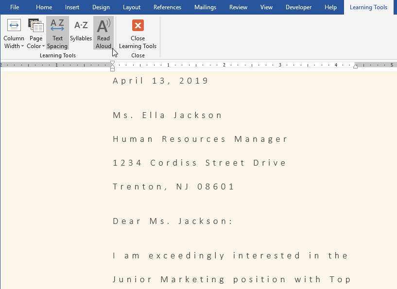
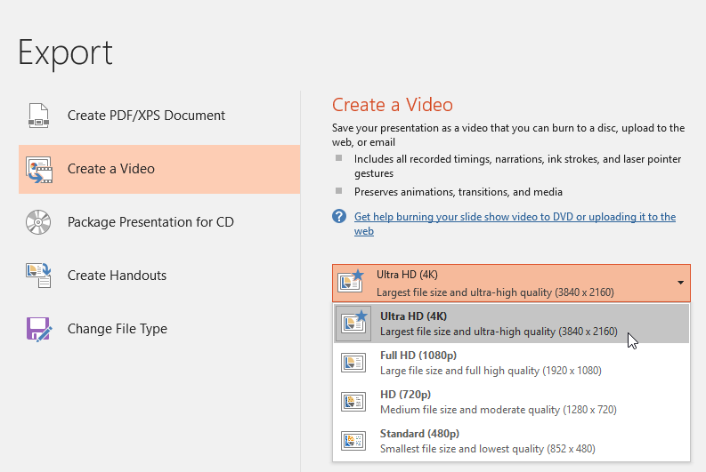
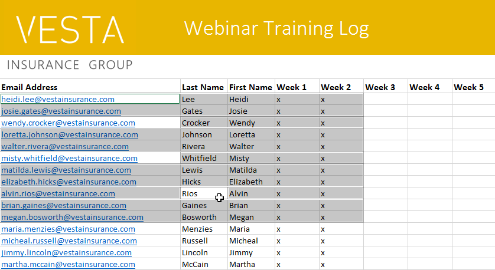

# Bài 32: New-feature-in-office-2019

#### Bài 32: New Tính năng trong Office 2019

/en/word/what-is-office-365/content/

### New tính năng trong Office 2019

Office 2019 được phát hành vào tháng 9 năm 2018. Nếu bạn đã sử dụng Office 2016 hoặc các phiên bản cũ hơn, có thể bạn sẽ thấy Office 2019 quen thuộc. Giao diện tương tự và hầu hết các tính năng vẫn hoạt động như cũ. Tuy nhiên, có một số cải tiến được thiết kế để giúp Office 2019 mạnh mẽ hơn và dễ sử dụng hơn.

Office 2019 chỉ khả dụng cho các máy tính chạy ** Windows 10 ** hoặc một trong ** ba phiên bản macOS mới nhất **.

Xem video bên dưới để tìm hiểu thêm về các cải tiến và tính năng New của Office 2019.

#### Cập nhật trực quan

Office 2019 đi kèm với một số tính năng New giúp tùy chỉnh hình ảnh dự án của bạn. Có một thư viện đồ họa New có tên ** Icons ** mà bạn có thể sử dụng và tùy chỉnh theo cách bạn muốn. Bạn cũng có thể biến bản vẽ của mình thành Shapes tiêu chuẩn bằng cách sử dụng chức năng ** Ink to Shape ** và Insert ** mô hình 3D tương tác ** vào dự án của mình.

#### Từ

Word có một tính năng New được gọi là ** Công cụ học tập **. Tính năng này có thể Help giúp văn bản dễ đọc hơn mà không cần thực hiện các thay đổi vĩnh viễn đối với tài liệu của bạn. Bạn có thể thay đổi khoảng cách văn bản, Page Color hoặc thậm chí yêu cầu Word đọc to văn bản của bạn.

#### PowerPoint

PowerPoint bao gồm chuyển đổi New ** Biến đổi ** cho phép bạn tạo hiệu ứng động cho các đối tượng giữa các trang chiếu trong một khoảng thời gian ngắn. Nếu bạn muốn lưu bản trình bày của mình dưới dạng tệp video thì giờ đây PowerPoint cũng cung cấp cho bạn khả năng Export bản trình bày của bạn ở ** độ phân giải 4K **.

#### Excel

Có một số loại biểu đồ New trong Excel: ** bản đồ Charts ** và ** kênh Charts **. Ngoài ra còn có một tính năng được gọi là ** lựa chọn chính xác **, cho phép bạn bỏ chọn từng ô sau khi đã đánh dấu chúng.

#### Office 2019 so với Office 365

Điều quan trọng cần lưu ý là Office 2019 ** không có nhiều tính năng New như Office 365 **. Nếu quan tâm đến các bản cập nhật linh hoạt hơn, bạn có thể muốn xem xét Office 365 dựa trên đăng ký.

Nhiều thay đổi và cải tiến trong Office 2019 tuy nhỏ nhưng có thể Help để tăng năng suất và khả năng sử dụng dễ dàng của bạn trong một số trường hợp nhất định.

/en/word/office-intelligent-services/content/