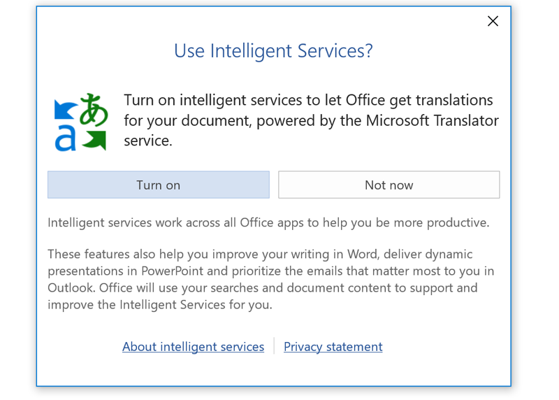
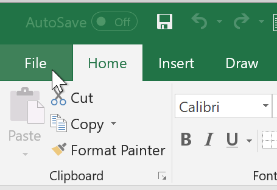
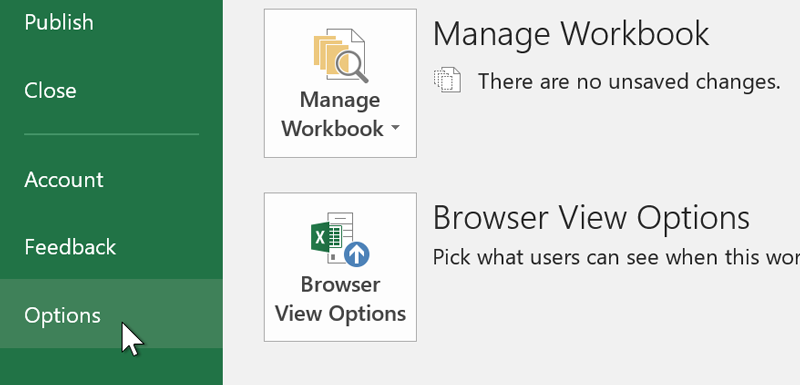
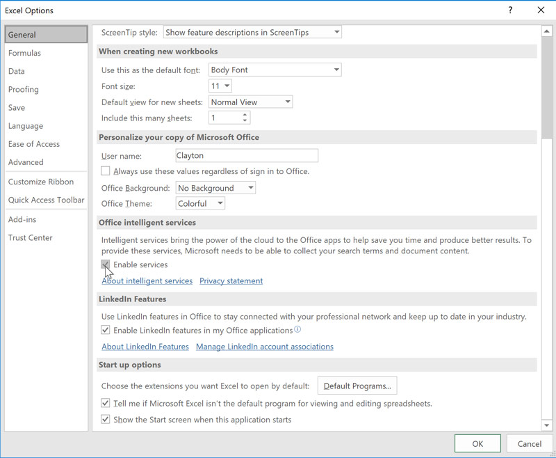
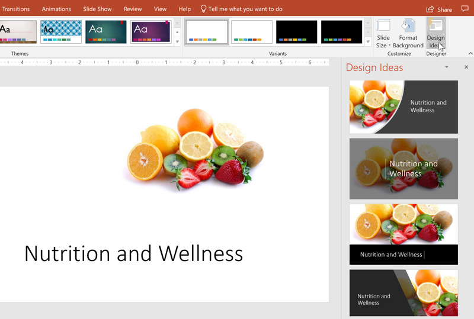
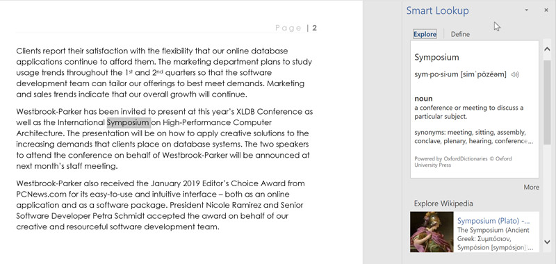

# Bài 33: Dịch vụ văn phòng thông minh

#### Bài 33: Dịch vụ thông minh văn phòng

/en/word/New-features-in-office-2019/content/

### Dịch vụ văn phòng thông minh

Microsoft Office chứa nhiều tính năng hữu ích, bao gồm trình dịch ngôn ngữ và PowerPoint Designer. Tuy nhiên, khi bạn cố gắng sử dụng những tính năng này, lời nhắc có thể yêu cầu bạn kích hoạt Dịch vụ thông minh trước tiên. Mặc dù đây có vẻ là một quyết định dễ dàng nhưng bạn nên cân nhắc những gì bạn đồng ý khi quyết định bật Dịch vụ thông minh.

#### Dịch vụ thông minh là gì?

** Dịch vụ thông minh ** hỗ trợ một số tính năng nâng cao trên đám mây trong toàn bộ Office. Tuy nhiên, để các tính năng này hoạt động, Microsoft phải ** thu thập và phân tích nội dung tài liệu của bạn **. Ngoài ra, nó sẽ thu thập dữ liệu về cách bạn sử dụng Office.

#### Bạn có nên sử dụng Dịch vụ thông minh?

Trước khi quyết định có bật Dịch vụ thông minh hay không, trước tiên bạn nên biết Microsoft sẽ làm gì với dữ liệu mà hãng thu thập. Theo [tuyên bố về quyền riêng tư](../../../not-offline.html?url=https:/privacy.microsoft.com/en-us/privacystatement), nó sử dụng dữ liệu được thu thập cho những việc như phát triển sản phẩm, nghiên cứu và quảng cáo có mục tiêu.

Trước khi kích hoạt Dịch vụ thông minh, hãy tự hỏi liệu bạn có thấy thoải mái khi Microsoft có quyền truy cập vào công việc của bạn không. Nếu lo ngại về việc công ty thu thập dữ liệu của bạn hoặc xem tài liệu bí mật, bạn có thể không muốn sử dụng bất kỳ tính năng dựa trên Dịch vụ thông minh nào.

#### Kích hoạt dịch vụ thông minh

Theo mặc định, Dịch vụ thông minh bị ** tắt ** và bạn có hai cách để kích hoạt dịch vụ này.

Phương pháp nhanh nhất là chọn tính năng dựa trên Dịch vụ thông minh, chẳng hạn như Dịch. Một lời nhắc sẽ xuất hiện yêu cầu bạn bật Dịch vụ thông minh. Chỉ cần nhấp vào ** Bật ** để kích hoạt nó.

Phương pháp khác bao gồm một vài bước nữa.

1. Nhấp vào tab ** File ** trong Word, Excel, PowerPoint hoặc Outlook.

   
2. Nhấp vào ** Options **.

   
3. Nhấp vào hộp kiểm có nhãn ** Bật dịch vụ **, sau đó nhấp vào ** OK **.

   

#### Tính năng nổi bật

** PowerPoint Designer ** có thể phân tích hình ảnh, danh sách và văn bản trong bản trình bày của bạn để tạo các trang trình bày trông chuyên nghiệp và nó sử dụng Dịch vụ thông minh để cung cấp cho bạn các đề xuất được cá nhân hóa hơn.

Để sử dụng, hãy chọn tab ** Design **, sau đó nhấp vào ** Design Ý tưởng ** ở bên phải. Khi bạn thêm các thành phần vào trang trình bày của mình, tính năng này sẽ cập nhật các ý tưởng New. Nó thậm chí còn cung cấp cho bạn các đề xuất nếu bạn có một bản trình bày hoàn toàn trống.

Tuy nhiên, hãy nhớ rằng PowerPoint Designer ** dành riêng cho Office 365 ** người đăng ký.

** Tra cứu thông minh ** cho phép bạn tiến hành tìm kiếm trực tuyến một từ hoặc cụm từ trong Word, Excel hoặc PowerPoint. Để sử dụng nó, hãy bấm chuột phải vào một thuật ngữ, sau đó chọn Tra cứu thông minh. Một cửa sổ sẽ xuất hiện ở bên phải, cung cấp cho bạn kết quả tìm kiếm và định nghĩa phù hợp nhất.

Để sử dụng ** Dịch **, chỉ cần nhấp chuột phải vào một từ hoặc cụm từ, sau đó chọn Dịch. Sau đó, bạn có thể dịch lựa chọn của mình sang hàng chục ngôn ngữ.

Hãy nhớ rằng tính năng này không hoàn hảo, vì vậy đừng ngạc nhiên nếu kết quả không hoàn toàn chính xác.

#### Office 365

Cần lưu ý rằng một số tính năng dựa trên Dịch vụ thông minh, chẳng hạn như PowerPoint Designer, chỉ hoạt động với đăng ký Office 365.
Microsoft cũng có kế hoạch bổ sung thêm nhiều tính năng dựa trên Dịch vụ thông minh hơn vào Office 365 trong tương lai. Các tính năng sắp tới bao gồm **Ý tưởng trong Excel **, gợi ý các cách khác nhau để hiển thị dữ liệu của bạn; và ** Trợ lý sơ yếu lý lịch LinkedIn **, sử dụng toàn bộ cơ sở dữ liệu LinkedIn để Help làm cho sơ yếu lý lịch của bạn nổi bật.

Từ ý tưởng thuyết trình đến Tra cứu thông minh, Dịch vụ thông minh có thể cung cấp một số tính năng hữu ích nếu bạn cảm thấy thoải mái khi Microsoft thu thập dữ liệu của mình.

/en/word/using-the-Draw-tab/content/