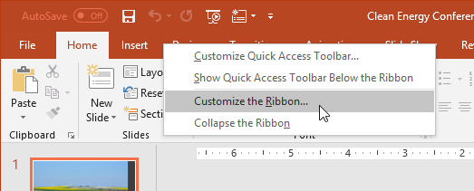
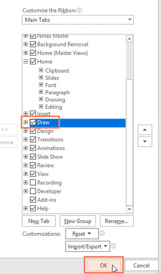
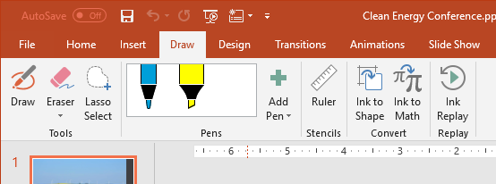
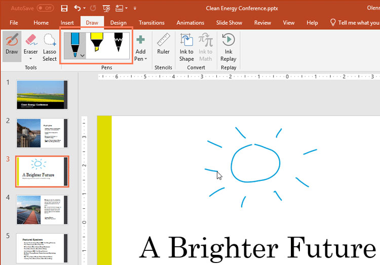
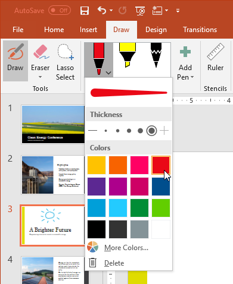
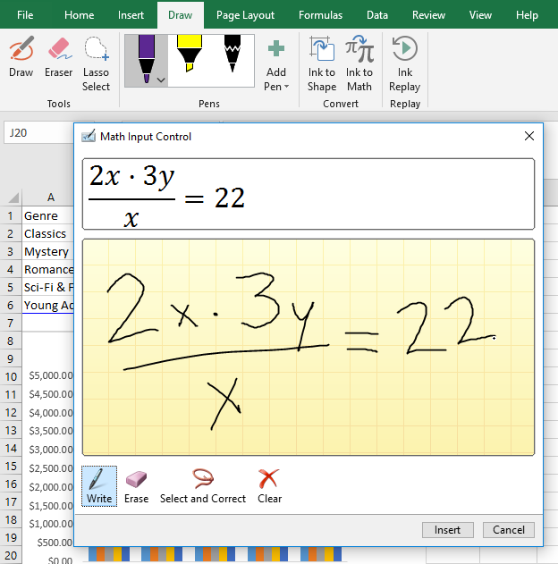
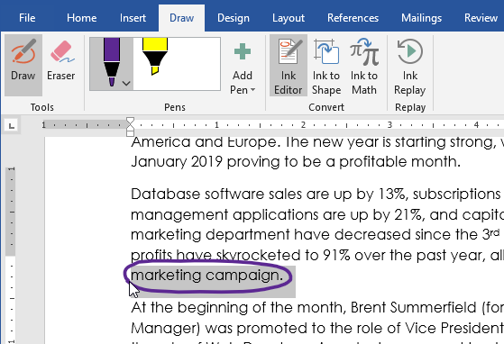

# Bài 34: Sử dụng tab-Draw-

#### Bài 34: Sử dụng Draw tab

/en/word/office-intelligent-services/content/

### Sử dụng Draw tab

Cho dù bạn sử dụng bút kỹ thuật số, màn hình cảm ứng hay chuột, ** tính năng vẽ ** trong Office đều có thể Help bạn thêm ghi chú, tạo Shapes, chỉnh sửa văn bản, v.v. ** Draw tab ** có sẵn trong ** Word **, ** Excel ** và ** PowerPoint **.

Hầu hết các tính năng được đề cập bên dưới đều có trong ** Office 365 ** và ** Office 2019 **, mặc dù một số tính năng trong số đó chỉ có trong Office 365.

Xem video bên dưới để tìm hiểu thêm về cách sử dụng Draw tab.

#### Thêm Draw tab vào Ribbon

Draw tab thường được tìm thấy trên Ribbon. Tuy nhiên, nếu bạn không nhìn thấy nó trên máy của mình thì đây là cách thêm nó.

1. Nhấp chuột phải vào Ribbon và chọn ** Tùy chỉnh Ribbon **.

   
2. Chọn hộp bên cạnh ** Draw **, sau đó nhấp vào ** OK **.

   
3. Draw tab hiện sẽ có sẵn trong Ribbon.

   

#### Draw tab có thể làm gì?

Draw tab cung cấp ba loại họa tiết vẽ: ** bút **, ** bút chì ** và ** tô sáng **, mỗi loại có một giao diện khác nhau. Để chọn một cái, chỉ cần nhấp vào nó và bạn đã sẵn sàng bắt đầu vẽ.

Nếu bạn muốn thay đổi ** màu ** hoặc ** độ dày ** của bút, hãy nhấp vào mũi tên thả xuống bên cạnh bút và chọn tùy chọn của bạn. Khi bạn hoàn tất, hãy nhấp chuột ra khỏi menu để tiếp tục vẽ.

#### Tính năng nâng cao

Khi bạn vẽ Shapes bằng tay, có thể khó Draw chúng một cách hoàn hảo. May mắn thay, công cụ ** Ink to Shape ** có thể Help với điều này. Chỉ cần nhấp vào ** Ink to Shape **, sau đó nhấp vào Draw hình dạng bạn chọn.

Sau đó, tính năng ** Ink to Shape ** sẽ tìm ra loại hình bạn đã vẽ và sửa bất kỳ điểm không hoàn hảo nào để làm cho hình đó trông bóng bẩy hơn.

Ngoài Shapes, bạn có thể viết các phương trình toán học phức tạp bằng công cụ ** Ink to Math **. Khi bạn viết một phương trình, công cụ sẽ đọc những gì bạn đang viết và dịch nó thành một phương trình được định dạng đúng.

Word còn có một tính năng vẽ độc quyền có tên ** Ink Editor **. Bạn có thể khoanh tròn văn bản để chọn, gạch bỏ văn bản để xóa văn bản đó, v.v. Tính năng này ** chỉ khả dụng với Office 365 **, không có trên Office 2019.

Các tính năng vẽ này cung cấp cho bạn nhiều Options hơn để tùy chỉnh các dự án của bạn và giúp sử dụng Office trên máy tính bảng và màn hình cảm ứng dễ dàng hơn.

/en/word/working-with-Icons/content/