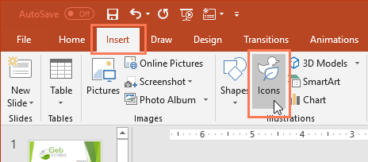
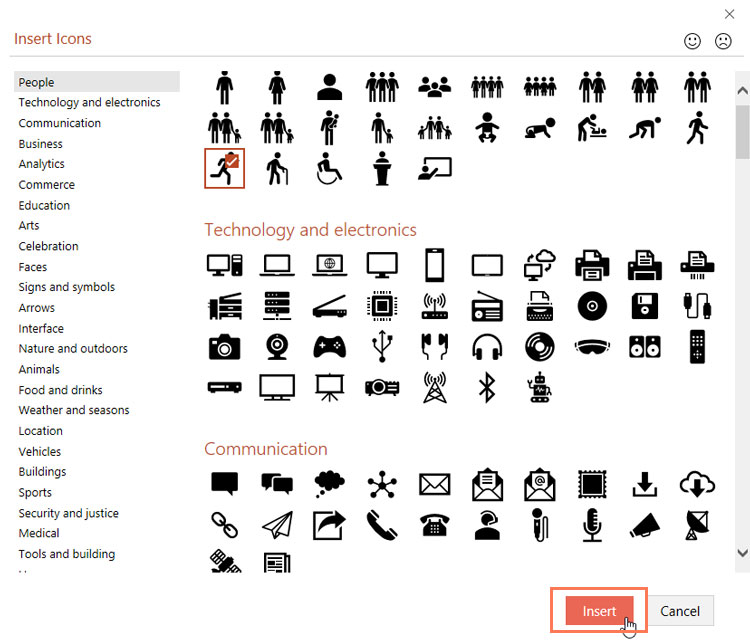
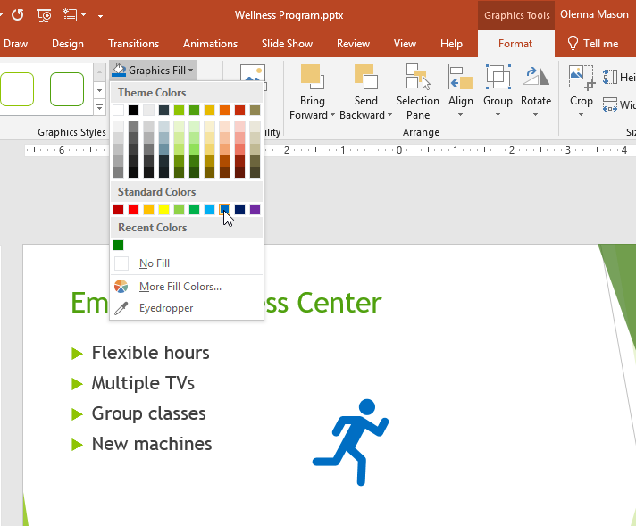
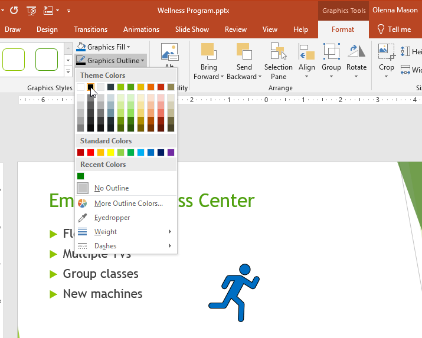
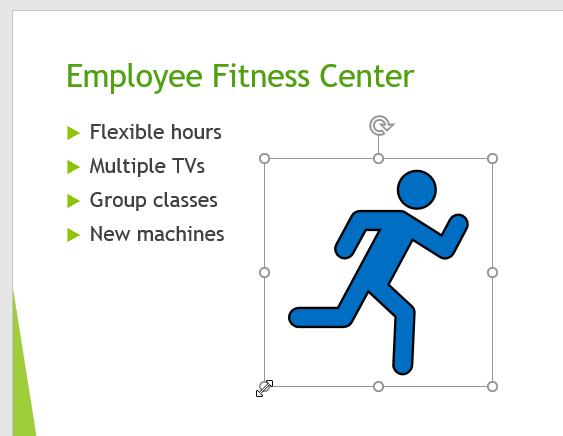
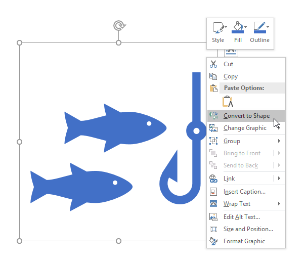
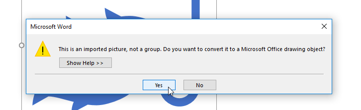
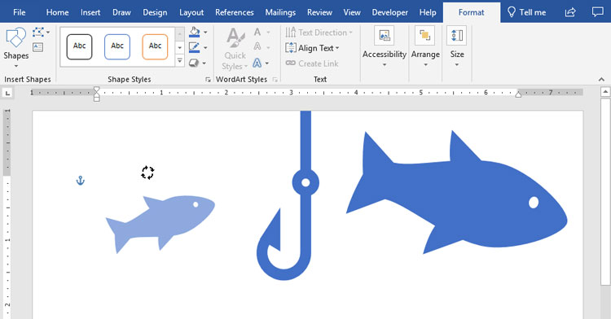

# Bài 35: làm việc với-Icons

#### Bài 35: Làm việc với Icons

/en/word/using-the-Draw-tab/content/

### Làm việc với Icons

Nếu bạn cần đồ họa cho một dự án thì có một tính năng bạn có thể sử dụng có tên là ** Icons **. Icons là một thư viện ** đồ họa hiện đại, chuyên nghiệp ** đi kèm với Office 365 và 2019, đồng thời bạn có thể ** tùy chỉnh ** để phù hợp với nhu cầu của mình. Icons có sẵn trong ** Word **, ** Excel **, ** Outlook ** và ** PowerPoint **.

Xem video bên dưới để tìm hiểu thêm về Icons.

#### Đang chèn Icons

Để Insert một biểu tượng, hãy nhấp vào tab ** Insert ** rồi chọn ** Icons **.

Trình đơn ** Insert Icons ** sẽ xuất hiện. Bạn có thể cuộn qua nhiều chủ đề khác nhau, bao gồm con người, công nghệ, thương mại, nghệ thuật, v.v. Khi bạn tìm thấy biểu tượng mình thích, hãy chọn biểu tượng đó rồi nhấp vào ** Insert **.

#### Đang tùy chỉnh Icons

Sau khi chèn biểu tượng, có một số cách khác nhau để bạn có thể tùy chỉnh biểu tượng đó.

Để thay đổi ** màu ** của một biểu tượng, hãy chọn biểu tượng bạn muốn chỉnh sửa. Tab ** Định dạng ** sẽ xuất hiện. Sau đó nhấp vào ** Graphics Fill ** và chọn màu từ menu thả xuống.

Để thêm ** đường viền ** vào biểu tượng của bạn, hãy nhấp vào ** Hình dạng đường viền ** và chọn màu từ menu thả xuống.

Bạn cũng có thể thay đổi ** kích thước ** của biểu tượng bằng cách giữ một trong các ** bộ điều khiển định cỡ ** và kéo biểu tượng đó. Vì chúng là **[đồ họa vector](../../../beginning-graphic-Design/images/1/index.html)** nên bạn có thể phóng to Icons theo ý muốn mà không bị tạo pixel.

#### Chia một biểu tượng thành nhiều phần

Một số Icons có thể ** được chia thành các phần riêng biệt **, cho phép bạn chỉnh sửa từng phần riêng lẻ để tùy chỉnh thêm.

1. Nhấp chuột phải vào biểu tượng và chọn ** Chuyển đổi thành hình dạng **.

   
2. Nhấp vào ** Có ** trong hộp thoại.

   
3. Nếu biểu tượng của bạn có các phần riêng lẻ thì giờ đây bạn có thể tự chỉnh sửa từng phần, thay đổi kích thước, màu sắc và vị trí của phần đó.

   

Icons cung cấp nhiều khả năng để tùy chỉnh giao diện dự án của bạn. Hãy dùng thử nếu bạn đang tìm kiếm một số hình ảnh đơn giản, bóng bẩy để nâng cao nội dung của mình.

/en/word/word-quiz/content/