# Bài học 10: danh sách

#### Bài học 10: Danh sách

/en/word/line-and-paragraph-spacing/content/

### Giới thiệu

Danh sách có dấu đầu dòng và đánh số có thể được sử dụng trong tài liệu của bạn để phác thảo, sắp xếp và nhấn mạnh văn bản. Trong bài học này, bạn sẽ tìm hiểu cách ** sửa đổi dấu đầu dòng hiện có **, Insert New ** dấu đầu dòng ** và ** danh sách được đánh số **, chọn ** ký hiệu ** làm dấu đầu dòng và định dạng ** danh sách nhiều cấp **.

Hãy xem video bên dưới để tìm hiểu thêm về danh sách trong Word.

#### Để tạo một danh sách có dấu đầu dòng:

1. Chọn văn bản bạn muốn định dạng dưới dạng danh sách.

   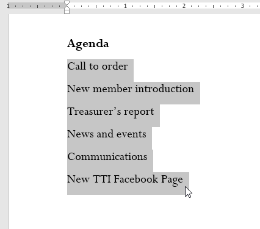
2. Trên tab ** Home **, hãy nhấp vào ** mũi tên thả xuống ** bên cạnh lệnh ** Bullets **. Một menu các kiểu dấu đầu dòng sẽ xuất hiện.

   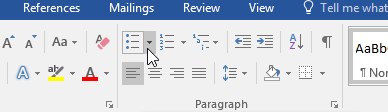
3. Di chuyển chuột qua các kiểu đạn khác nhau. Bản xem trước trực tiếp của kiểu dấu đầu dòng sẽ xuất hiện trong tài liệu. Chọn kiểu dấu đầu dòng bạn muốn sử dụng.

   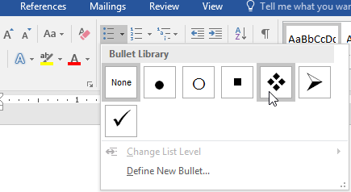
4. Văn bản sẽ được định dạng dưới dạng danh sách có dấu đầu dòng.

   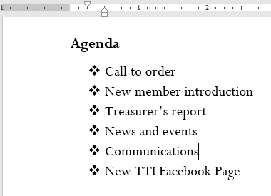

#### Options để làm việc với danh sách

* Để xóa số hoặc dấu đầu dòng khỏi danh sách, hãy chọn danh sách và nhấp vào lệnh ** Có dấu đầu dòng ** hoặc ** Danh sách được đánh số **.
* Khi chỉnh sửa danh sách, bạn có thể nhấn ** Enter ** để bắt đầu dòng New và dòng New sẽ tự động có dấu đầu dòng hoặc số. Khi bạn đã đến cuối danh sách, hãy nhấn ** Enter ** hai lần để trở về định dạng bình thường.
* Bằng cách kéo dấu thụt lề trên Ruler, bạn có thể tùy chỉnh mức thụt lề của danh sách cũng như khoảng cách giữa văn bản và dấu đầu dòng hoặc số.

  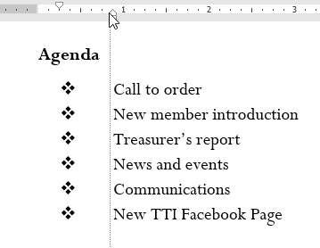

#### Để tạo một danh sách đánh số:

Khi bạn cần sắp xếp văn bản thành một danh sách ** đánh số **, Word sẽ cung cấp một số ** đánh số ** Options. Bạn có thể định dạng danh sách của mình bằng ** số **, ** chữ cái ** hoặc ** chữ số La Mã **.

1. Chọn văn bản bạn muốn định dạng dưới dạng danh sách.

   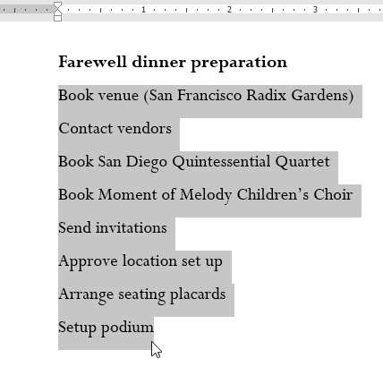
2. Trên tab ** Home **, hãy nhấp vào ** mũi tên thả xuống ** bên cạnh lệnh ** Đánh số **. Một menu các kiểu đánh số sẽ xuất hiện.

   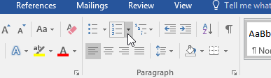
3. Di chuyển chuột qua các kiểu đánh số khác nhau. Bản xem trước trực tiếp của kiểu đánh số sẽ xuất hiện trong tài liệu. Chọn kiểu đánh số bạn muốn sử dụng.

   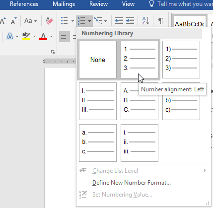
4. Văn bản sẽ định dạng dưới dạng danh sách được đánh số.

   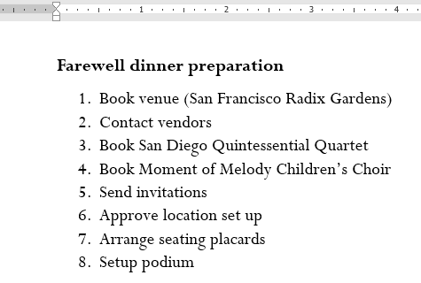

#### Để khởi động lại danh sách được đánh số:

Nếu bạn muốn bắt đầu lại việc đánh số danh sách, Word có tùy chọn ** Khởi động lại ở 1 **. Nó có thể được áp dụng cho danh sách ** số ** và ** chữ cái **.

1. Nhấp chuột phải vào ** mục danh sách ** bạn muốn bắt đầu lại việc đánh số, sau đó chọn ** Khởi động lại lúc 1 ** từ trình đơn xuất hiện.

   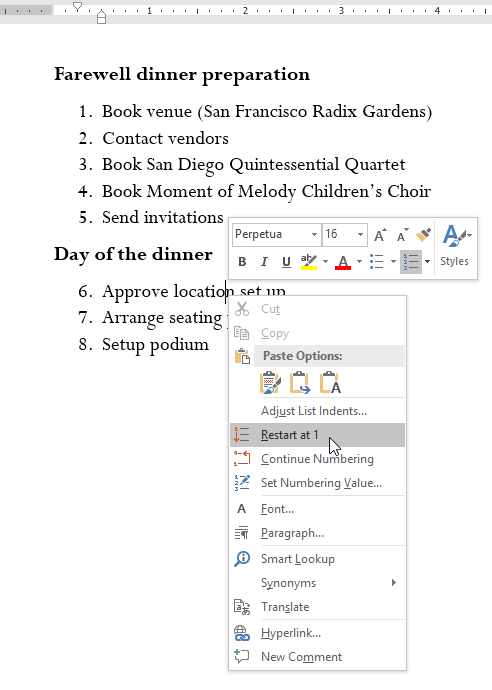
2. Việc đánh số danh sách sẽ khởi động lại.

   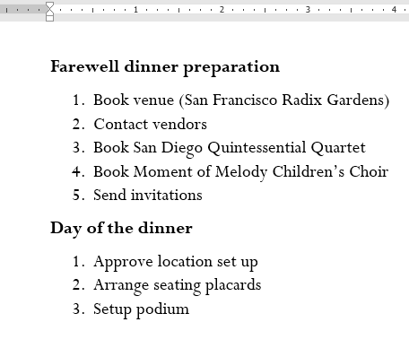

Bạn cũng có thể thiết lập danh sách để tiếp tục đánh số từ danh sách trước đó. Để thực hiện việc này, nhấp chuột phải và chọn ** Tiếp tục đánh số **.

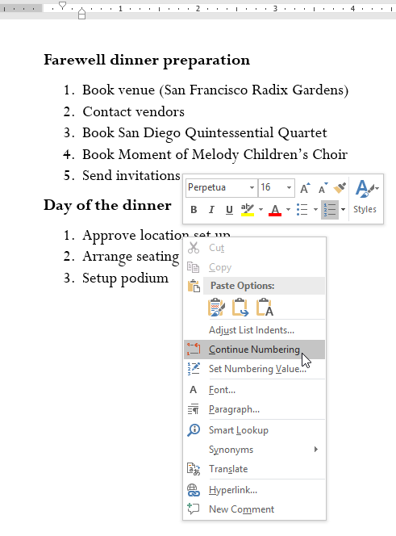

### Tùy chỉnh đạn

Việc tùy chỉnh giao diện của dấu đầu dòng trong danh sách của bạn có thể Help nhấn mạnh các mục danh sách nhất định và cá nhân hóa Design trong danh sách của bạn. Word cho phép bạn định dạng dấu đầu dòng theo nhiều cách khác nhau. Bạn có thể sử dụng ** biểu tượng ** và ** màu sắc ** khác nhau hoặc thậm chí tải lên ** ảnh ** dưới dạng dấu đầu dòng.

#### Để sử dụng một biểu tượng làm dấu đầu dòng:

1. Chọn danh sách hiện có mà bạn muốn định dạng.

   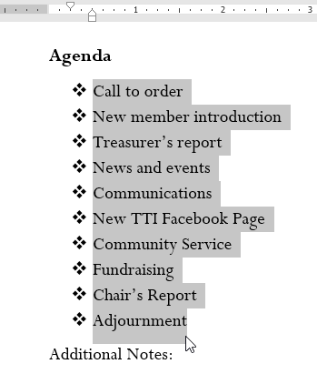
2. Trên tab ** Home **, hãy nhấp vào ** mũi tên thả xuống ** bên cạnh lệnh ** Bullets **. Chọn ** Xác định New Dấu đầu dòng ** từ menu thả xuống.

   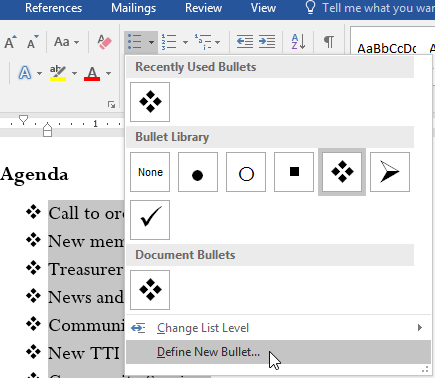
3. Hộp thoại ** Xác định New Dấu đầu dòng ** sẽ xuất hiện. Nhấp vào nút ** Biểu tượng **.

   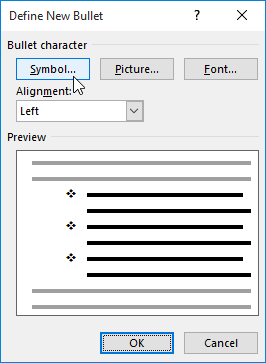
4. Hộp thoại ** Biểu tượng ** sẽ xuất hiện.
5. Nhấp vào hộp thả xuống ** Phông chữ ** và chọn một phông chữ. Phông chữ ** Wingdings ** và ** Symbol ** là những lựa chọn tốt vì chúng có nhiều biểu tượng hữu ích.
6. Chọn biểu tượng mong muốn, sau đó nhấp vào ** OK **.

   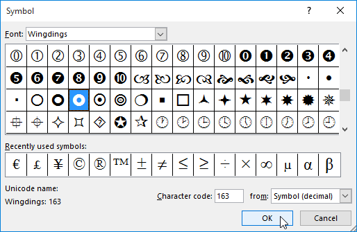
7. Biểu tượng sẽ xuất hiện trong phần Xem trước của hộp thoại Dấu đầu dòng New. Nhấp vào ** OK **.

   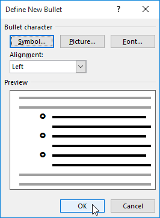
8. Biểu tượng sẽ xuất hiện trong danh sách.

   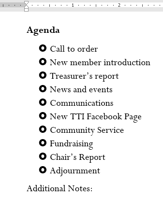

#### Để thay đổi màu đạn:

1. Chọn danh sách hiện có mà bạn muốn định dạng.

   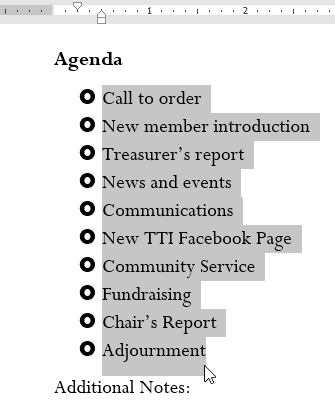
2. Trên tab ** Home **, hãy nhấp vào ** mũi tên thả xuống ** bên cạnh lệnh ** Bullets **. Chọn ** Xác định New Dấu đầu dòng ** từ menu thả xuống.

   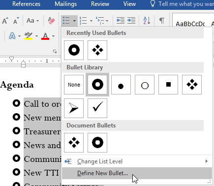
3. Hộp thoại ** Xác định New Dấu đầu dòng ** sẽ xuất hiện. Nhấp vào nút ** Phông chữ **.

   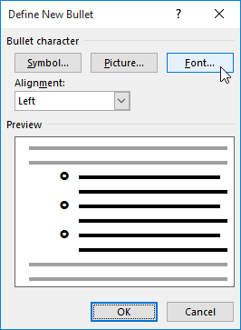
4. Hộp thoại ** Phông chữ ** sẽ xuất hiện. Nhấp vào hộp thả xuống ** Màu phông chữ **. Một menu màu phông chữ sẽ xuất hiện.
5. Chọn màu mong muốn, sau đó nhấp vào ** OK **.

   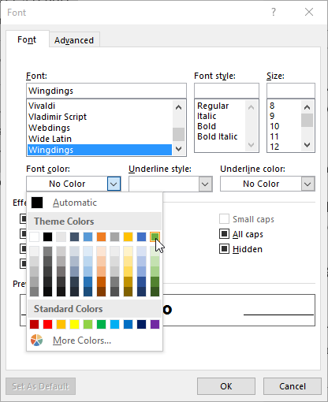
6. Màu dấu đầu dòng sẽ xuất hiện trong phần Xem trước của hộp thoại Xác định New Dấu đầu dòng. Nhấp vào ** OK **.

   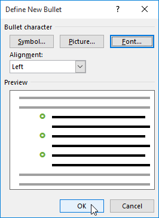
7. Màu đạn sẽ thay đổi trong danh sách.

   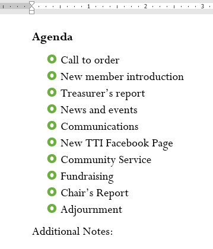

### Danh sách đa cấp

Danh sách nhiều cấp độ cho phép bạn tạo ** phác thảo ** với ** nhiều cấp độ **. Bất kỳ danh sách có dấu đầu dòng hoặc đánh số nào cũng có thể được chuyển thành danh sách đa cấp bằng cách sử dụng phím ** Tab **.

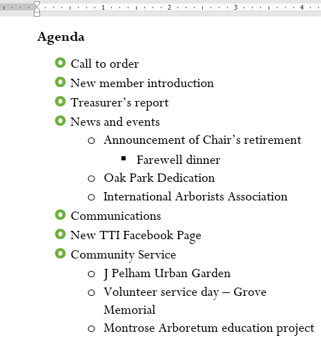

#### Để tạo danh sách đa cấp:

1. Đặt ** điểm chèn ** vào đầu dòng bạn muốn di chuyển.

   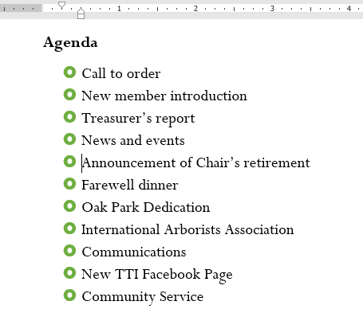
2. Nhấn phím ** Tab ** để tăng mức thụt lề của dòng. Dòng sẽ di chuyển sang bên phải.

   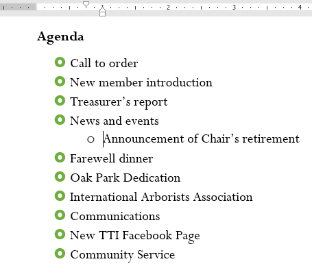

#### Để tăng hoặc giảm mức thụt lề:

Bạn có thể thực hiện các điều chỉnh đối với việc tổ chức danh sách đa cấp bằng cách tăng hoặc giảm mức thụt lề. Có một số cách để thay đổi mức thụt lề.

* Để ** tăng ** mức thụt lề lên ** nhiều hơn một ** cấp, hãy đặt điểm chèn ở đầu dòng, sau đó nhấn phím ** Tab ** cho đến khi đạt đến mức mong muốn.

  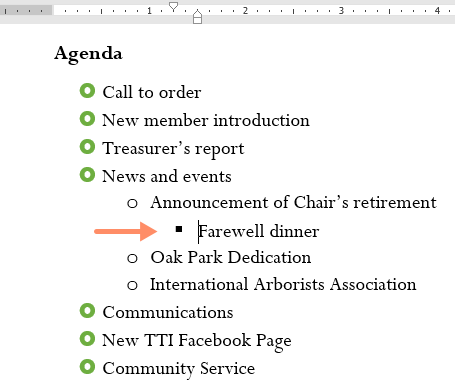
* Để ** giảm ** mức thụt lề, đặt điểm chèn ở đầu dòng, sau đó giữ phím ** Shift ** và nhấn phím ** Tab **.

  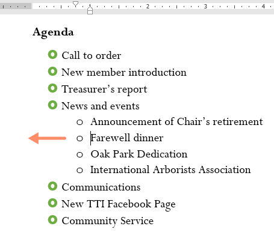
* Bạn cũng có thể tăng hoặc giảm mức độ văn bản bằng cách đặt điểm chèn ở bất kỳ đâu trong dòng và nhấp vào lệnh ** Tăng thụt lề ** hoặc ** Giảm thụt lề **.

  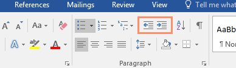

Khi định dạng danh sách đa cấp, Word sẽ sử dụng kiểu dấu đầu dòng mặc định. Để thay đổi kiểu của danh sách nhiều cấp, hãy chọn danh sách, sau đó nhấp vào lệnh ** Danh sách nhiều cấp ** trên tab ** Home **.

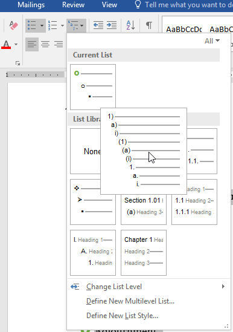

### Thử thách!

1. Open [tài liệu thực hành](practice_files/word_lists_practice.docx) của chúng tôi.
2. Cuộn đến ** trang 3 **.
3. Chọn văn bản trong ** New Thành viên ** bắt đầu bằng ** Carolyn ** và kết thúc bằng ** Đồng thủ quỹ **, rồi định dạng văn bản đó dưới dạng ** danh sách có dấu đầu dòng **.
4. Với văn bản vẫn được chọn, hãy sử dụng hộp thoại ** Xác định New Dấu đầu dòng ** để thay đổi dấu đầu dòng thành ** ngôi sao xanh **. ** Gợi ý **: Bạn có thể tìm thấy ngôi sao trong phông chữ Wingdings.
5. ** Tăng ** mức thụt lề ** lên 1 ** cho các dòng ** Tiếp thị truyền thông xã hội **, ** Gây quỹ ** và **** Đồng thủ quỹ ****.
6. ** Tăng ** mức thụt lề ** lên 2 ** cho dòng ** Chủ yếu ở Châu Âu **.
7. Trong danh sách ** Báo cáo của thủ quỹ **, ** giảm ** mức thụt lề ** 1 ** cho dòng ** Số tiền khả dụng trong tháng này **.
8. Trong danh sách ** Báo cáo liên lạc **, ** bắt đầu đánh số lại ** ở 1.
9. Khi bạn hoàn tất, trang của bạn sẽ trông giống như thế này:

   

/en/word/links/nội dung/