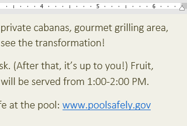
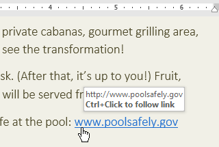
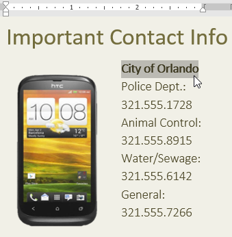
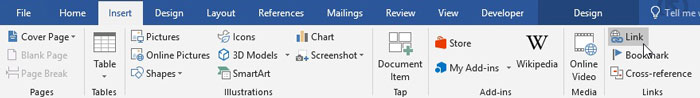
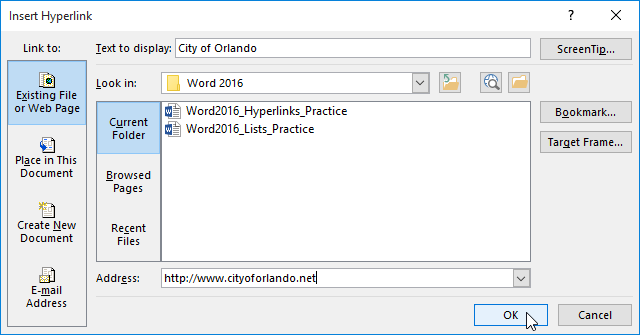
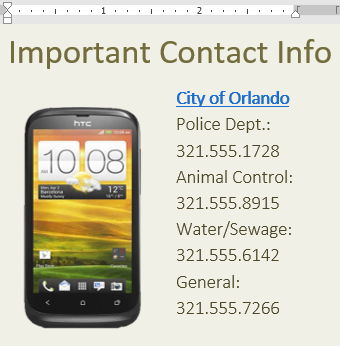
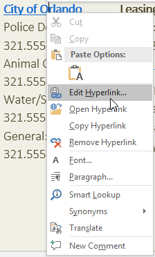
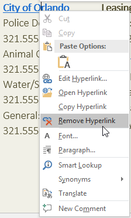
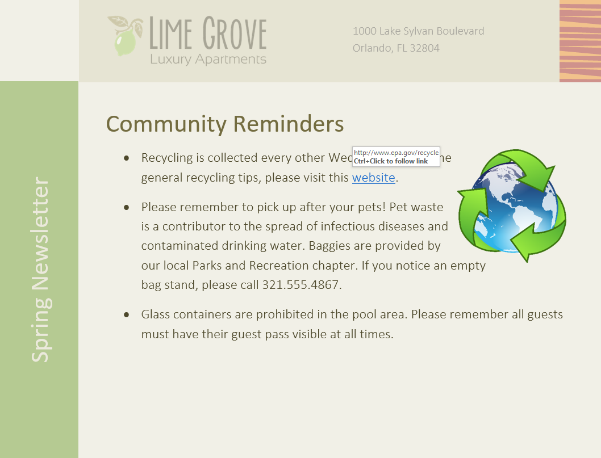

# Bài 11: liên kết

#### Bài học 11: Liên kết

/en/word/lists/content/

### Giới thiệu

Việc thêm ** siêu liên kết **, còn được gọi là ** liên kết **, vào văn bản có thể cung cấp quyền truy cập vào ** trang web ** và ** địa chỉ email ** trực tiếp từ tài liệu của bạn. Có một số cách để Insert siêu liên kết vào tài liệu của bạn. Tùy thuộc vào cách bạn muốn liên kết xuất hiện, bạn có thể sử dụng ** định dạng liên kết tự động ** của Word hoặc ** chuyển đổi ** ** văn bản ** thành liên kết.

Hãy xem video bên dưới để tìm hiểu thêm về siêu liên kết trong Word.

#### Hiểu siêu liên kết trong Word

Siêu liên kết có ** hai phần cơ bản **: địa chỉ (URL) của trang web và ** văn bản hiển thị **. Ví dụ: địa chỉ có thể là **[http://www.popsci.com](../../../not-offline.html?url=https:/www.popsci.com)** và văn bản hiển thị có thể là ** Tạp chí khoa học phổ biến **. Khi tạo siêu liên kết trong Word, bạn sẽ có thể chọn cả địa chỉ và văn bản hiển thị.

Word thường nhận dạng email và địa chỉ web khi bạn nhập và sẽ tự động định dạng chúng dưới dạng siêu liên kết sau khi bạn nhấn ** Enter ** hoặc ** phím cách **. Trong hình ảnh bên dưới, bạn có thể thấy một địa chỉ web được liên kết.

Để theo dõi một siêu liên kết trong Word, hãy giữ phím ** Ctrl ** và nhấp vào ** siêu liên kết **.

#### Để định dạng văn bản bằng siêu liên kết:

1. Chọn văn bản bạn muốn định dạng dưới dạng siêu liên kết.

   
2. Chọn tab ** Insert **, sau đó nhấp vào lệnh ** Link **.

   

   Bạn cũng có thể Open hộp thoại Siêu liên kết Insert bằng cách nhấp chuột phải vào văn bản đã chọn và chọn ** Liên kết...** từ trình đơn xuất hiện.
3. Hộp thoại ** Insert Siêu liên kết ** sẽ xuất hiện. Bằng cách sử dụng Options ở phía bên trái, bạn có thể chọn liên kết tới ** File **, ** trang web **, ** địa chỉ email **, ** tài liệu ** hoặc một ** địa điểm trong tài liệu hiện tại **.
4. Văn bản đã chọn sẽ xuất hiện trong trường ** Văn bản cần hiển thị:** ở trên cùng. Bạn có thể thay đổi văn bản này nếu bạn muốn.
5. Trong trường ** Địa chỉ:**, nhập địa chỉ bạn muốn liên kết đến, sau đó nhấp vào ** OK **.

   
6. Văn bản sau đó sẽ được định dạng dưới dạng siêu liên kết.

   

Sau khi tạo siêu liên kết, bạn nên ** kiểm tra ** nó. Nếu bạn đã liên kết đến một trang web, trình duyệt web của bạn sẽ tự động Open và hiển thị trang web đó. Nếu nó không hoạt động, hãy kiểm tra địa chỉ siêu liên kết xem có lỗi chính tả không.

#### Chỉnh sửa và xóa siêu liên kết

Sau khi chèn siêu liên kết, bạn có thể nhấp chuột phải vào siêu liên kết đó để ** chỉnh sửa **, ** Open **, ** sao chép ** hoặc ** xóa ** siêu liên kết đó.

Để xóa siêu liên kết, nhấp chuột phải vào siêu liên kết và chọn ** Xóa ** ** Siêu liên kết ** từ trình đơn xuất hiện.

### Thử thách!

1. Open [tài liệu thực hành](practice_files/word_hyperlinks_practice.docx) của chúng tôi.
2. Cuộn đến ** trang 4 **.
3. Trong dấu đầu dòng đầu tiên trong Lời nhắc của cộng đồng, hãy định dạng từ ** trang web ** dưới dạng ** siêu liên kết ** tới [http://www.epa.gov/recycle](../../../not-offline.html?url=https:/www.epa.gov/recycle).
4. Kiểm tra ** siêu liên kết ** của bạn để đảm bảo nó hoạt động.
5. Ở dấu đầu dòng thứ hai, ** xóa siêu liên kết ** khỏi các từ ** Công viên và Giải trí **.
6. Khi bạn hoàn tất, trang của bạn sẽ trông giống như thế này:

   

/en/word/page-Layout/content/